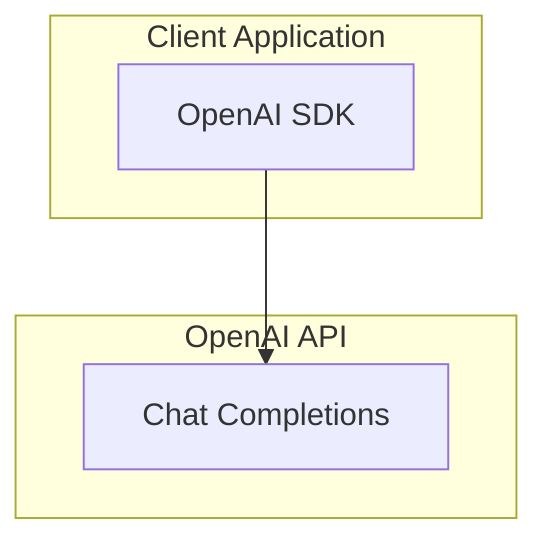

# {タイトル}

## メタデータ

| 項目 | 内容 |
|------|------|
| 発表日 | YYYY-MM-DD |
| ソース | OpenAI News / API Changelog / Research |
| カテゴリ | 新機能 / API 更新 / 研究成果 |
| 公式リンク | https://openai.com/... |

## 概要

{1-2 段落での要約。何が発表されたか、なぜ重要かを簡潔に説明}

## 主な内容

### {セクション 1}

{詳細な説明}

### {セクション 2}

{詳細な説明}

## 技術的な詳細

{API の変更点、パラメータ、使用例など}

### コードサンプル

```python
from openai import OpenAI

client = OpenAI()

response = client.chat.completions.create(
    model="gpt-4o",
    messages=[
        {"role": "user", "content": "Hello!"}
    ]
)
print(response.choices[0].message.content)
```

## アーキテクチャ



## 開発者への影響

{この変更が開発者にどのような影響を与えるか}

- 影響 1
- 影響 2
- 影響 3

## 関連リンク

- [OpenAI 公式ドキュメント](https://platform.openai.com/docs)
- [OpenAI API リファレンス](https://platform.openai.com/docs/api-reference)
- [OpenAI News](https://openai.com/news)

## まとめ

{重要なポイントの要約}
