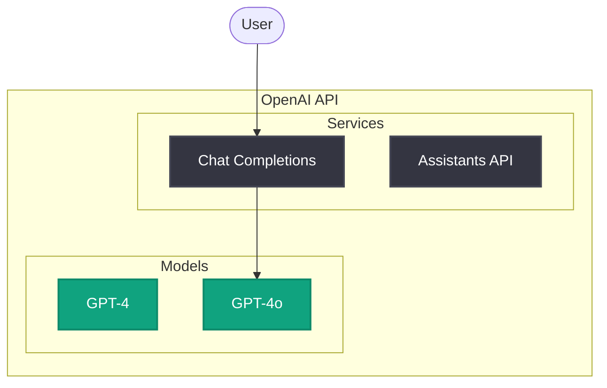

# Project Documentation Guidelines

This file contains guidelines and best practices for creating documentation in this workspace. Claude Code will automatically reference these guidelines when working on documents.

## Document Writing Standards

### Amazon Writing Guidelines

Follow Amazon's documentation standards for all written materials.

#### Japanese Document Guidelines

**Character Spacing Rules:**
1. **Space Between Japanese and Alphanumeric Characters**: Add one space between Japanese text and alphabetic/numeric characters, except when next to punctuation marks.
   - Correct: `AI システム`, `4 時間`, `2024 年`, `API 仕様`
   - Incorrect: `AIシステム`, `4時間`, `2024年`, `API仕様`

2. **Hyphenated Terms**: Add spaces around hyphens when connecting Japanese and English terms
   - Correct: `AI - 人間協働`
   - Incorrect: `AI-人間協働`

3. **Exception - No Space Next to Punctuation**: Do not add spaces when adjacent to Japanese punctuation marks.
   - Correct: `AI、機械学習`
   - Incorrect: `AI 、機械学習`

4. **Exception - No Period in Headings**: Headings should not end with a period.

5. **Bold Labels**: Use colons (:) instead of periods for bold labels followed by explanatory text.

**Parentheses and Punctuation:**
1. **Use Half-Width Parentheses**: Use `()` instead of `（）` with proper spacing.
2. **Use Half-Width Colons and Semicolons**: Use `:` and `;` instead of full-width versions.
3. **Use Period Before Lists**: In Japanese, use a period instead of colon before lists.

## Architecture Diagram Guidelines

### Mermaid (Default)

Use Mermaid for diagrams with OpenAI brand colors.

**Color Palette:**

| Purpose | Fill | Stroke | Use Case |
|---------|------|--------|----------|
| OpenAI Green | `#10A37F` | Primary accent |
| OpenAI Dark | `#343541` | Dark background (ChatGPT) |
| OpenAI Light | `#F7F7F8` | Light background |
| OpenAI Gray | `#ECECF1` | Secondary background |

**Template:**

## Evidence-Based Approach

**推測で結論を出さない。必ず証拠を収集してから判断・提案する。**

### 適用場面

- 問題やバグの調査
- 解決策の提案
- 設定変更の推奨
- ドキュメントへの情報追記

### 行動プロセス

1. **状況の把握**: 現在の状態と期待される状態の差異を確認
2. **証拠の収集**: ログ、エラーメッセージ、ドキュメント、設定情報を収集
3. **仮説の検証**: 推測を立てたら、必ず実際に確認して検証
4. **提案と実行**: 証拠を明示し、根拠を説明して提案

### 禁止事項

| 禁止 | 正しい対応 |
|------|-----------|
| 証拠なしに原因を断定する | 「可能性があります。確認しましょう」と提案 |
| 推測に基づいて変更を適用する | 原因を特定してから修正を提案 |
| 一般論で結論づける | 実際のデータを確認して検証 |
| 確認せずに推奨する | 現在の状態を確認してから提案 |
| ドキュメントを読まずに記述する | 公式ドキュメントで事実を確認してから記述 |

# currentDate
Today's date is 2026-03-07.
