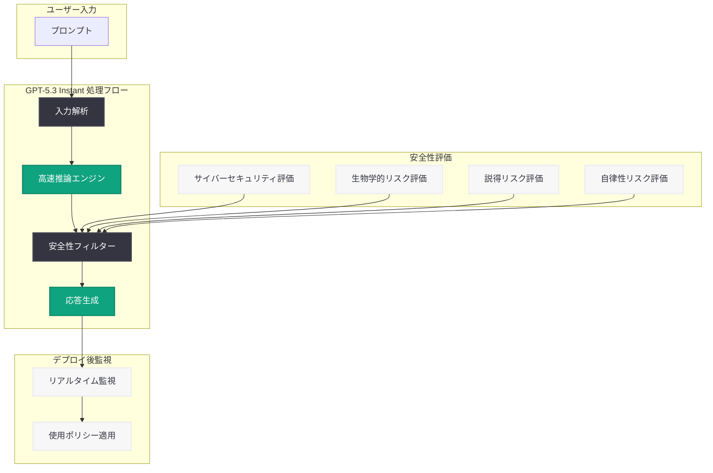

# GPT-5.3 Instant System Card: 安全性評価と軽量高速モデルの技術詳細

## メタデータ

| 項目 | 内容 |
|------|------|
| 発表日 | 2026-03-03 |
| ソース | OpenAI News/Blog |
| カテゴリ | Publication |
| 公式リンク | [openai.com](https://openai.com/index/gpt-5-3-instant-system-card) |

## 概要

OpenAI は 2026 年 3 月 3 日、GPT-5.3 Instant モデルの System Card を公開した。System Card は、モデルの安全性評価、能力、制限事項を包括的にまとめた技術文書であり、AI システムの透明性確保を目的として公開されるものである。GPT-5.3 Instant は、OpenAI の GPT-5 シリーズにおける軽量・高速モデルであり、低レイテンシと高いコスト効率を実現しながら、幅広いタスクに対応する汎用モデルとして位置付けられている。

本 System Card では、GPT-5.3 Instant モデルの安全性に関する多面的な評価結果が詳述されている。高速応答を実現するモデルアーキテクチャにおいても、安全性基準を維持していることを示すことで、研究コミュニティ、開発者、政策立案者への透明性ある情報提供を目的としている。

## 主な内容

### GPT-5.3 Instant モデルの位置付け

GPT-5.3 Instant は、OpenAI の GPT-5 モデルファミリーにおいて、速度とコスト効率を重視した軽量バリアントである。上位モデルである GPT-5 系列の能力を維持しつつ、以下の特徴を備えている。

- **低レイテンシ:** 応答生成までの時間を大幅に短縮し、リアルタイムアプリケーションに適したパフォーマンスを実現
- **コスト効率:** API 利用コストを抑えつつ、高品質な出力を提供
- **幅広いタスク対応:** テキスト生成、要約、翻訳、コード生成など多様なタスクに対応
- **スケーラビリティ:** 大規模なリクエスト処理に適した設計

### 安全性評価の枠組み

System Card では、OpenAI の Preparedness Framework に基づく体系的な安全性評価が実施されている。評価は以下の主要カテゴリに分類される。

1. **サイバーセキュリティリスク:** モデルがサイバー攻撃の支援に悪用される可能性の評価
2. **生物学的リスク:** 生物兵器に関連する危険な知識の生成可能性の評価
3. **説得・操作リスク:** 大規模な世論操作やソーシャルエンジニアリングへの悪用可能性
4. **自律性リスク:** モデルが人間の監督を逃れて自律的に行動する可能性の評価
5. **幻覚 (Hallucination):** 事実と異なる情報を生成するリスクの評価

### モデルの制限事項

GPT-5.3 Instant モデルには、以下の既知の制限事項がある。

- **推論能力のトレードオフ:** 高速応答を実現するために、複雑な多段階推論においては上位モデルと比較して精度が低下する場合がある
- **コンテキスト長の制約:** 軽量モデルとしての設計上、長大なコンテキストを扱うタスクでは制限が生じる可能性がある
- **知識のカットオフ:** トレーニングデータの期限以降の情報については正確な回答が保証されない
- **専門領域の深度:** 高度に専門的な領域 (法律、医療など) では、上位モデルに比べて回答の深度が限定される場合がある

### 安全対策と緩和措置

OpenAI は GPT-5.3 Instant モデルに対して、多層的な安全対策を実施している。

- **RLHF (Reinforcement Learning from Human Feedback):** 人間のフィードバックに基づく強化学習による安全性の向上
- **レッドチーミング:** 外部の専門家チームによる敵対的テストの実施
- **自動化された安全性テスト:** 大規模な自動テストスイートによる継続的な安全性検証
- **モニタリングシステム:** デプロイ後のモデル挙動の継続的な監視
- **使用ポリシーの適用:** API 利用規約に基づく不正利用の検出と防止

## 技術的な詳細

### GPT-5.3 Instant の API 利用方法

GPT-5.3 Instant モデルは、OpenAI API を通じて利用可能である。以下は API の利用例である。

```python
from openai import OpenAI

client = OpenAI()

# GPT-5.3 Instant モデルの呼び出し
response = client.chat.completions.create(
    model="gpt-5.3-instant",
    messages=[
        {
            "role": "user",
            "content": "量子コンピューティングの基本原理を簡潔に説明してください。"
        }
    ],
    max_completion_tokens=4096
)

print(response.choices[0].message.content)
```

### ストリーミング応答の活用

GPT-5.3 Instant は低レイテンシを特徴とするため、ストリーミング応答との組み合わせにより、ユーザー体験をさらに向上させることができる。

```python
# ストリーミング応答の例
stream = client.chat.completions.create(
    model="gpt-5.3-instant",
    messages=[
        {
            "role": "user",
            "content": "Python でクイックソートを実装してください。"
        }
    ],
    stream=True,
    max_completion_tokens=4096
)

for chunk in stream:
    if chunk.choices[0].delta.content is not None:
        print(chunk.choices[0].delta.content, end="")
```

### 安全性評価のスコア

System Card で報告されている安全性評価では、各リスクカテゴリに対して「低」「中」「高」「クリティカル」の 4 段階で評価が行われる。GPT-5.3 Instant モデルは、軽量モデルであっても主要なリスクカテゴリにおいてデプロイ基準を満たしていることが報告されている。

## アーキテクチャ



## 開発者への影響

### リアルタイムアプリケーションへの活用

GPT-5.3 Instant の低レイテンシ特性により、開発者は以下の領域でより応答性の高い AI アプリケーションを構築できる。

- **チャットボット・カスタマーサポート:** 即座の応答が求められるリアルタイム対話システム
- **コード補完・IDE 統合:** 開発者の作業フローを中断しない高速なコード提案
- **コンテンツ生成パイプライン:** 大量のテキスト処理を効率的に実行するバッチ処理

### コスト最適化

GPT-5.3 Instant は、上位モデルと比較して API コストが低く設定されているため、大規模なアプリケーションにおいてコスト最適化に貢献する。開発者はタスクの複雑さに応じてモデルを使い分けることが推奨される。

- **単純なタスク:** GPT-5.3 Instant で高速かつ低コストに処理
- **複雑な推論タスク:** 上位モデル (GPT-5.4 Thinking など) に委譲

### 安全性への配慮

System Card の公開は、軽量モデルにおいても安全性が確保されていることを示す重要な文書である。開発者は以下の点に留意すべきである。

- **リスク認識:** モデルの能力と制限を正しく理解した上でのアプリケーション設計
- **適切な利用:** 使用ポリシーに準拠したアプリケーション開発
- **ユーザーへの説明責任:** AI を組み込んだサービスにおける透明性の確保

## 関連リンク

- [GPT-5.3 Instant System Card](https://openai.com/index/gpt-5-3-instant-system-card)
- [OpenAI Preparedness Framework](https://openai.com/preparedness)
- [OpenAI API ドキュメント](https://platform.openai.com/docs)
- [OpenAI 使用ポリシー](https://openai.com/policies/usage-policies)

## まとめ

OpenAI が公開した GPT-5.3 Instant System Card は、軽量・高速モデルに関する安全性評価と技術詳細を包括的にまとめた文書である。GPT-5.3 Instant は、低レイテンシとコスト効率を重視しつつ、サイバーセキュリティ、生物学的リスク、説得リスク、自律性リスクなど多面的な安全性評価基準を満たしていることが示されている。開発者にとっては、リアルタイムアプリケーションやコスト最適化を追求する際の有力な選択肢となるとともに、モデルの制限事項を理解した上での適切な利用が求められる。軽量モデルにおいても安全性の透明性を確保する OpenAI の取り組みは、AI 業界全体の安全基準の向上に寄与するものである。
