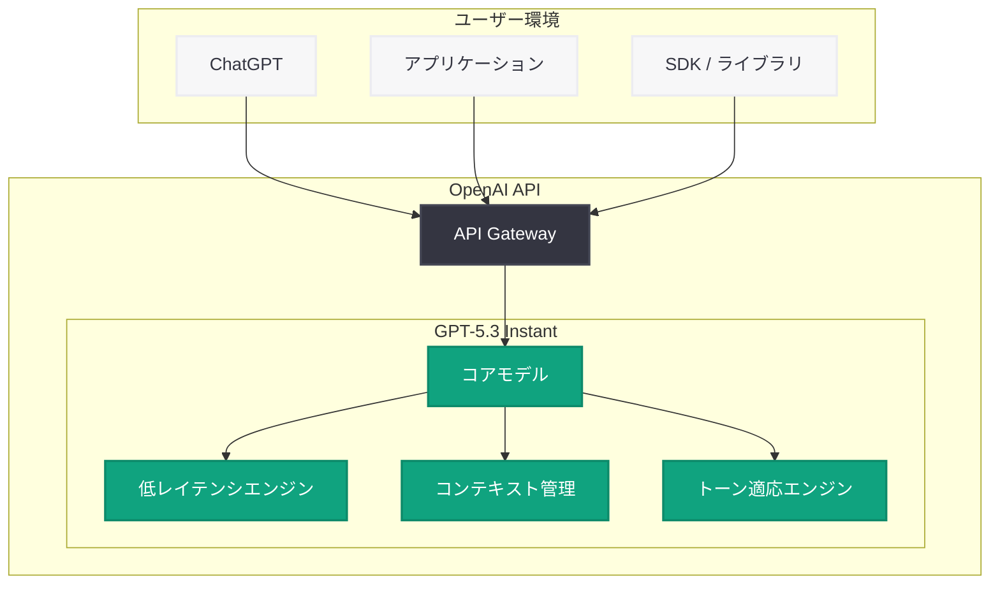

# GPT-5.3 Instant: よりスムーズで実用的な日常会話を実現する新モデル

## メタデータ

| 項目 | 内容 |
|------|------|
| 発表日 | 2026-03-03 |
| ソース | OpenAI News/Blog |
| カテゴリ | Product |
| 公式リンク | [openai.com](https://openai.com/index/gpt-5-3-instant) |

## 概要

OpenAI は 2026 年 3 月 3 日、新モデル「GPT-5.3 Instant」を発表した。GPT-5.3 Instant は、日常的な会話をよりスムーズかつ実用的にすることを目的として設計されたモデルであり、応答性の向上と自然なインタラクションの改善を主な特徴としている。

従来の GPT-5 シリーズが高度な推論能力やプロフェッショナル用途に重点を置いていたのに対し、GPT-5.3 Instant は日常的なユーザー体験の質を高めることに焦点を当てている。会話のテンポ、応答の的確さ、そしてやり取りの自然さにおいて最適化が施されており、ユーザーが日々の作業で AI をより快適に活用できるよう設計されている。

## 主な内容

### 応答性の大幅な向上

GPT-5.3 Instant の最大の特徴は、応答速度の大幅な改善である。「Instant」の名前が示すとおり、ユーザーの入力に対してほぼ即座に応答を開始する設計となっている。

- **低レイテンシ応答:** 従来モデルと比較して応答開始までの時間が大幅に短縮
- **ストリーミング最適化:** トークン生成速度の向上により、長文の応答でもスムーズな表示を実現
- **会話のテンポ改善:** 人間同士の会話に近い自然なテンポでのやり取りが可能

### より自然なインタラクション

GPT-5.3 Instant は、会話の自然さにおいて重要な改善を実現している。

- **文脈理解の深化:** 会話の流れや暗黙の意図をより正確に把握し、的確な応答を生成
- **トーンの適応:** ユーザーの会話スタイルやトーンに合わせた柔軟な応答の調整
- **冗長性の削減:** 必要な情報を簡潔かつ的確に伝える応答の最適化
- **自然な言い回し:** 機械的な表現を減らし、より人間らしい表現での応答

### 日常利用に最適化された実用性

GPT-5.3 Instant は、日常的なタスクでの実用性を高めるために設計されている。

- **質問応答の精度向上:** 一般的な質問に対するより正確で有用な回答
- **タスク支援:** メールの作成、スケジュール調整、情報整理など日常タスクの効率的なサポート
- **マルチターン会話の改善:** 長い会話の中でも文脈を正確に維持し、一貫性のある対話を実現
- **指示の理解力向上:** 曖昧な指示や複雑な要求に対しても意図を正確に汲み取る能力の強化

## 技術的な詳細

### API の利用

GPT-5.3 Instant は OpenAI API を通じて利用可能と想定される。以下は基本的な API 呼び出しの例である。

```python
from openai import OpenAI

client = OpenAI()

# GPT-5.3 Instant による基本的な会話
response = client.chat.completions.create(
    model="gpt-5.3-instant",
    messages=[
        {"role": "system", "content": "You are a helpful assistant."},
        {"role": "user", "content": "今日の予定を整理するのを手伝ってください。"}
    ],
    max_tokens=2048
)

print(response.choices[0].message.content)
```

### ストリーミング応答の活用例

GPT-5.3 Instant の低レイテンシ特性を活かすには、ストリーミング応答の利用が効果的である。

```python
from openai import OpenAI

client = OpenAI()

# ストリーミングによるリアルタイム応答
stream = client.chat.completions.create(
    model="gpt-5.3-instant",
    messages=[
        {"role": "user", "content": "来週のチームミーティングのアジェンダを作成してください。"}
    ],
    stream=True
)

for chunk in stream:
    if chunk.choices[0].delta.content is not None:
        print(chunk.choices[0].delta.content, end="")
```

> **注:** 上記のコード例は一般的な利用パターンの想定であり、実際のモデル名やパラメータの詳細は公式ドキュメントを参照してください。

## アーキテクチャ



## 開発者への影響

### ユーザー体験の向上

GPT-5.3 Instant の応答性と自然さの改善は、AI を組み込んだアプリケーションのユーザー体験を大きく向上させる可能性がある。

- **チャットボットの品質向上:** カスタマーサポートや社内アシスタントなどのチャットボットにおいて、より自然で快適な対話体験を提供
- **リアルタイムアプリケーション:** 低レイテンシ特性を活かした、音声アシスタントやライブ翻訳などのリアルタイム性が求められるアプリケーションへの適用
- **エンゲージメントの改善:** 自然な会話体験によるユーザー満足度の向上とリテンション率の改善

### コスト効率の最適化

「Instant」モデルは、日常的なタスクに特化した設計により、コスト効率の面でも利点がある可能性がある。

- **用途に応じたモデル選択:** 高度な推論が必要なタスクには GPT-5.4 を、日常会話には GPT-5.3 Instant を使い分けることで、コストの最適化が可能
- **トークン効率の改善:** 簡潔な応答生成により、不要なトークン消費を削減
- **スケーラビリティ:** 高速な応答処理により、同時接続数の多いサービスでも安定した運用が期待される

### 移行時の考慮事項

- 既存の GPT-5 シリーズからの切り替えにおいて、モデル名の変更対応が必要
- 応答スタイルの違いにより、プロンプトの調整が求められる場合がある
- 高度な推論や専門的なタスクでは、上位モデルとの使い分けを検討すべき
- レイテンシ要件やコスト要件に応じた最適なモデル選定が推奨される

## 関連リンク

- [GPT-5.3 Instant 公式発表ページ](https://openai.com/index/gpt-5-3-instant)
- [OpenAI API ドキュメント](https://platform.openai.com/docs)
- [OpenAI モデル一覧](https://platform.openai.com/docs/models)
- [OpenAI Pricing](https://openai.com/pricing)

## まとめ

GPT-5.3 Instant は、OpenAI が日常的な会話体験の向上に焦点を当てて開発した新モデルである。応答性の大幅な改善、自然なインタラクションの実現、そして日常タスクへの最適化という 3 つの柱により、AI との対話をよりスムーズで実用的なものへと進化させている。高度な推論能力を追求する GPT-5.4 のようなフロンティアモデルとは異なるアプローチで、ユーザーが毎日の作業で AI をストレスなく活用できる環境を提供することを目指している。開発者にとっては、用途に応じたモデルの使い分けにより、ユーザー体験の向上とコスト最適化を同時に実現できる選択肢が増えたことになる。今後、ChatGPT や API を通じた実際の利用が広がる中で、GPT-5.3 Instant が日常的な AI 活用のスタンダードとなるか注目される。
