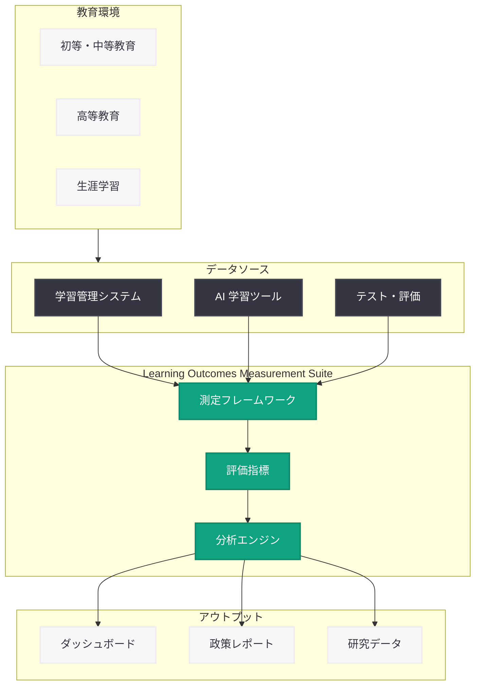

# AI と学習成果の理解

## メタデータ

| 項目 | 内容 |
|------|------|
| 発表日 | 2026-03-04 |
| ソース | OpenAI News/Blog |
| カテゴリ | Global Affairs |
| 公式リンク | [openai.com/index/understanding-ai-and-learning-outcomes](https://openai.com/index/understanding-ai-and-learning-outcomes) |

## 概要

OpenAI は 2026 年 3 月 4 日、AI が学生の学習成果に与える影響を体系的に評価するための新たなフレームワーク「Learning Outcomes Measurement Suite」(学習成果測定スイート) を発表した。本スイートは、多様な教育環境において AI の効果を経時的に評価することを目的としており、教育分野における AI 活用のエビデンスベースの推進に向けた重要な一歩となる。

教育現場での AI 導入が加速する中、AI が実際に学習成果の向上に寄与しているのか、あるいは特定の環境でのみ効果を発揮しているのかを客観的に把握する必要性が高まっている。OpenAI はこの課題に応えるため、標準化された測定手法と評価ツールを提供し、教育機関や研究者が AI の教育効果を定量的に検証できる基盤を構築した。

## 主な内容

### Learning Outcomes Measurement Suite の概要

Learning Outcomes Measurement Suite (LOMS) は、AI が学習成果に与える影響を多角的かつ縦断的に評価するための包括的な測定フレームワークである。従来の断片的な評価手法とは異なり、多様な教育環境にまたがる統一的な測定基準を提供することで、AI の教育効果に関する比較可能なエビデンスの蓄積を可能にする。

主な特徴は以下の通り。

- **多様な教育環境への対応:** 初等教育から高等教育まで、また都市部から地方部まで、様々な教育環境における AI の効果を測定可能
- **経時的な評価:** 一時点でのスナップショットではなく、時間の経過に伴う学習成果の変化を追跡する縦断的な評価設計
- **標準化された指標:** 教育機関間で比較可能な統一的な測定指標の提供

### 測定対象と評価領域

LOMS は、AI が学習に与える影響を以下の複数の観点から評価する。

- **知識習得:** AI 支援型学習による知識の定着度と理解の深さの評価
- **スキル発達:** 批判的思考、問題解決能力、創造性など、AI 活用を通じて発達するスキルの測定
- **学習エンゲージメント:** AI ツールの利用が学習者のモチベーションや学習への参加度に与える影響の分析
- **学習の公平性:** 異なる社会経済的背景や学習特性を持つ学生間で、AI の恩恵が公平に分配されているかの評価

### 多様な教育環境での適用

OpenAI は、AI の効果が教育環境によって大きく異なる可能性を認識しており、LOMS はその多様性を考慮した設計となっている。

- **地域的多様性:** 先進国と発展途上国、都市部と農村部など、異なる地域環境での測定に対応
- **教育段階の違い:** 初等教育、中等教育、高等教育、生涯学習など、各段階に適した評価基準を提供
- **学習者の多様性:** 学習障害のある学生、多言語環境の学生、ギフテッド教育の対象者など、多様な学習者への AI の効果を評価

### エビデンスに基づく教育政策への貢献

LOMS で収集されたデータは、教育政策の策定にも活用されることが期待される。

- **政策立案者向けレポート:** 測定結果を教育政策の意思決定に活用可能な形式で提供
- **ベストプラクティスの共有:** 効果の高い AI 活用事例を体系的に特定し、他の教育機関と共有するための仕組み
- **リスクの早期発見:** AI 導入が学習成果に悪影響を与えているケースの早期検出と対応策の提示

## 技術的な詳細

### 測定フレームワークの技術基盤

LOMS は、教育測定学 (Educational Measurement) と学習分析学 (Learning Analytics) の知見を組み合わせた技術基盤の上に構築されていると考えられる。

- **データ収集インフラ:** 教育機関の既存システム (LMS: Learning Management System) と連携し、学習者の行動データや成績データを収集する仕組み
- **匿名化・プライバシー保護:** 学習者の個人情報を適切に保護しつつ、分析に必要なデータを収集するための匿名化技術
- **統計的分析手法:** 準実験デザインや縦断的分析手法を用いて、AI 導入の因果効果を推定するためのアプローチ

### データ分析と可視化

測定結果の分析と共有には、以下の技術的要素が含まれると想定される。

- **ダッシュボード:** 教育機関の管理者や教員が測定結果をリアルタイムで確認できるインターフェース
- **比較分析ツール:** 教育環境間での効果の比較や、時間軸での変化の追跡を支援するツール
- **API 連携:** 外部の研究者や教育テクノロジー開発者がデータにアクセスし、独自の分析を行うための API の提供

### 評価指標の設計

学習成果の測定には、以下のような多層的な評価指標が採用されていると考えられる。

- **定量的指標:** テストスコア、課題の完了率、学習時間、学習進捗速度などの数値データ
- **定性的指標:** 学習者の自己評価、教員のフィードバック、学習成果物の質的分析
- **行動指標:** AI ツールとのインタラクションパターン、学習行動の変化、協調学習への影響

## アーキテクチャ

## 開発者への影響

### EdTech 開発への影響

LOMS の導入は、教育テクノロジー (EdTech) 分野の開発者にとって以下の影響をもたらす。

- **標準化された測定 API:** LOMS が提供する測定基準や API を活用することで、自社の教育アプリケーションに学習効果の測定機能を組み込むことが可能になる
- **データ駆動型の開発:** 学習成果に関する客観的なデータに基づいて、AI 教育ツールの改善と最適化を行うサイクルの構築が促進される
- **相互運用性の向上:** 統一的な測定フレームワークの存在により、異なるツール間での効果比較や連携が容易になる

### データプライバシーとコンプライアンス

教育データを扱う上で、開発者は以下の法的・倫理的要件に対応する必要がある。

- **FERPA 準拠:** 米国の教育記録に関するプライバシー法への対応
- **GDPR 対応:** 欧州の学習者データを扱う場合の一般データ保護規則への準拠
- **COPPA 準拠:** 13 歳未満の児童データの保護に関する法律への対応
- **データ最小化:** 測定に必要最低限のデータのみを収集する設計原則の遵守

### 研究者向けの機会

LOMS の公開により、教育研究者にとっても新たな研究機会が生まれる。

- 大規模な縦断的データセットへのアクセスによる、AI の教育効果に関する実証研究の促進
- 異なる教育環境間での比較研究のための標準化されたフレームワークの活用
- AI 教育ツールの設計改善に向けた、エビデンスに基づく知見の蓄積

## 関連リンク

- [OpenAI 公式発表](https://openai.com/index/understanding-ai-and-learning-outcomes)
- [OpenAI for Education](https://openai.com/education)
- [OpenAI API ドキュメント](https://platform.openai.com/docs)
- [ChatGPT](https://chat.openai.com)

## まとめ

OpenAI が発表した Learning Outcomes Measurement Suite は、AI が教育に与える影響を科学的かつ体系的に評価するための重要なフレームワークである。多様な教育環境における AI の効果を経時的に測定することで、エビデンスに基づく教育政策の策定と AI ツールの改善が可能になる。教育における AI 活用が急速に拡大する現在、その効果を客観的に検証し、すべての学習者に公平な恩恵をもたらすための仕組みが不可欠である。LOMS は、AI の教育効果に関する議論を推測ベースからデータ駆動型へと転換させる可能性を持ち、教育テクノロジー分野の開発者、研究者、政策立案者にとって価値ある基盤となるだろう。
