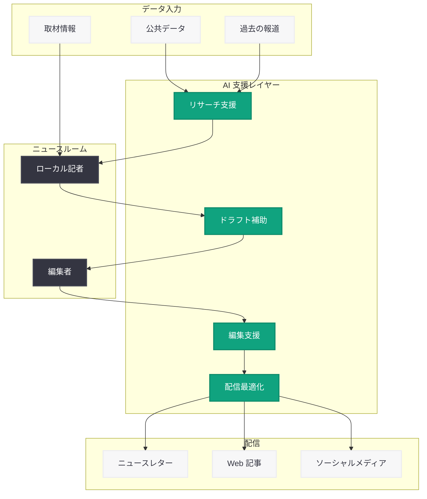

# Axios が AI を活用して高インパクトなローカルジャーナリズムを実現する方法

## メタデータ

| 項目 | 内容 |
|------|------|
| 発表日 | 2026-03-04 |
| ソース | OpenAI News/Blog |
| カテゴリ | ChatGPT |
| 公式リンク | [openai.com/index/axios-allison-murphy](https://openai.com/index/axios-allison-murphy) |

## 概要

米国のデジタルメディア企業 Axios の COO (最高執行責任者) である Allison Murphy 氏が、同社における AI 活用の取り組みについて語った。Axios は AI を活用してローカルジャーナリストを支援し、ニュースルームのワークフローを効率化することで、高品質なローカルジャーナリズムをスケーラブルに提供している。

ローカルニュースは近年、メディア業界全体の経営難や人員削減の影響を大きく受けてきた分野である。Axios はこの課題に対し、AI 技術を戦略的に導入することで、限られたリソースでもインパクトのある地域報道を継続的に提供する仕組みを構築している。

## 主な内容

### Axios のローカルジャーナリズム戦略

Axios は「Smart Brevity」(賢い簡潔さ) というコンセプトで知られるメディア企業であり、全米各地のローカルニュース配信に力を入れている。AI の導入により、各地域の記者がより本質的な取材活動に集中できる環境を整備し、ジャーナリズムの質を維持しながら配信規模を拡大している。

### AI によるローカル記者の支援

Allison Murphy COO によると、Axios では AI を記者の「代替」ではなく「支援ツール」として位置付けている。主な活用領域は以下の通り。

- **取材準備の効率化:** AI が地域の公共データや過去の報道を分析し、記者が取材に臨む前の調査作業を支援
- **記事作成ワークフローの最適化:** ドラフト作成や事実確認プロセスにおいて、AI が補助的な役割を担う
- **データ分析の自動化:** 地域の統計データやトレンドの分析を AI が支援し、記者がデータに基づいた報道を行いやすくする
- **配信の最適化:** 各地域の読者に対して、最適なタイミングと形式でニュースを届けるための AI 活用

### ニュースルームワークフローの効率化

Axios は AI をニュースルーム全体のワークフローに組み込むことで、運営効率を向上させている。具体的には以下のような領域で AI が活用されている。

- **編集プロセスの支援:** 記事の校正、要約生成、見出しの最適化など、編集作業の一部を AI が担当
- **コンテンツのパーソナライゼーション:** 地域ごとの読者ニーズに合わせたコンテンツ配信の最適化
- **反復的な業務の自動化:** ニュースレター配信やソーシャルメディア投稿の準備など、定型作業の効率化

### スケーラブルなローカルジャーナリズム

AI 導入の最大の成果は、ローカルジャーナリズムのスケーラビリティ向上である。従来、各地域に十分な数の記者を配置することはコスト面で難しかったが、AI による業務効率化により、少人数のチームでも高品質な報道を維持できるようになった。

## 技術的な詳細

### ChatGPT の活用

Axios は OpenAI の ChatGPT を中心とした AI ツールを導入している。ニュースルームにおける具体的な活用パターンとして、以下が想定される。

- **ChatGPT:** 記者の取材準備、リサーチ補助、記事ドラフトのレビューに活用
- **テキスト分析:** 大量の公共文書やプレスリリースからの情報抽出
- **要約生成:** 長文の議事録やレポートの要点を自動抽出

### ワークフロー統合の構成例

## 開発者への影響

Axios の事例は、メディア業界における AI 活用の実践的なモデルを示している。開発者やメディア関連の技術者が注目すべきポイントは以下の通り。

- **人間中心の AI 設計:** AI を記者の代替ではなく支援ツールとして設計するアプローチは、メディア以外の業界にも応用可能なベストプラクティスである
- **ワークフロー統合:** AI を単独のツールとしてではなく、既存の業務フローに深く統合することで、導入効果を最大化できる
- **スケーラビリティの実現:** AI による業務効率化は、人的リソースの制約がある領域で特に大きな効果を発揮する
- **品質管理の維持:** AI を導入する際にも、ジャーナリズムの品質基準や編集ポリシーを維持するためのガバナンス設計が重要である
- **ローカライゼーション:** 地域ごとの読者ニーズに AI を活用して対応する手法は、パーソナライゼーション全般に応用可能である

## 関連リンク

- [OpenAI ChatGPT](https://chat.openai.com/)
- [OpenAI API ドキュメント](https://platform.openai.com/docs)
- [Axios 公式サイト](https://www.axios.com/)
- [Axios Local](https://www.axios.com/local)

## まとめ

Axios は AI を戦略的に活用することで、ローカルジャーナリズムが直面するリソース不足の課題に対する実践的な解決策を示した。COO の Allison Murphy 氏が語るように、AI は記者を代替するものではなく、取材・編集・配信の各段階で記者を支援し、より高品質なジャーナリズムをスケーラブルに提供するための手段である。この事例は、メディア業界だけでなく、限られた人的リソースで高品質なサービスを提供する必要がある全ての組織にとって、AI 活用の参考モデルとなるだろう。
