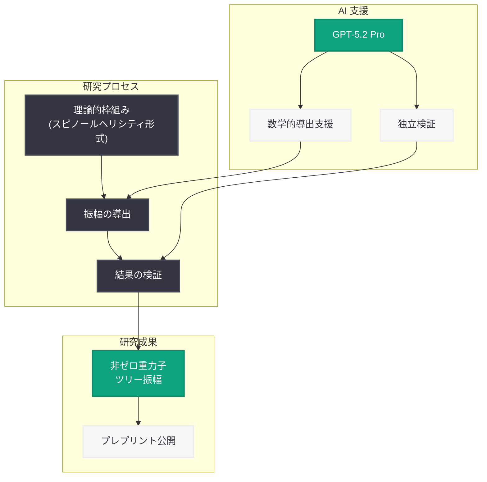

# Single-Minus 振幅の重力子への拡張 -- GPT-5.2 Pro による量子重力研究の新展開

## メタデータ

| 項目 | 内容 |
|------|------|
| 発表日 | 2026-03-04 |
| ソース | OpenAI News/Blog |
| カテゴリ | Research |
| 公式リンク | [openai.com](https://openai.com/index/extending-single-minus-amplitudes-to-gravitons) |

## 概要

OpenAI は 2026 年 3 月 4 日、量子重力における散乱振幅 (scattering amplitude) の研究に関する新たなプレプリントの公開を発表した。本研究では、single-minus 振幅 (単一マイナスヘリシティ振幅) をグルーオンなどのゲージ粒子から重力子 (graviton) へ拡張することに成功している。特筆すべきは、GPT-5.2 Pro が非ゼロの重力子ツリー振幅 (tree amplitude) の導出と検証において重要な役割を果たしたことである。

この成果は、AI が理論物理学の最前線において数学的導出や計算検証のツールとして実用的に機能し得ることを示す画期的な事例であり、AI と物理学研究の協働における新たなマイルストーンとなる。

## 主な内容

### Single-Minus 振幅とは

散乱振幅は、素粒子物理学において粒子の衝突・散乱過程の確率を計算するための基本的な量である。Single-minus 振幅とは、散乱に関与する粒子のうち 1 つだけが負のヘリシティ (helicity) を持ち、残りが正のヘリシティを持つ特殊な配置における振幅を指す。

ゲージ理論 (Yang-Mills 理論) においては、single-minus 振幅の性質は比較的よく理解されている。しかし、重力理論における対応する振幅への拡張は、重力相互作用の複雑さから技術的に困難な課題であった。

### 重力子ツリー振幅への拡張

本研究の核心的な成果は、single-minus 振幅の枠組みを重力子に拡張し、非ゼロの重力子ツリー振幅を導出したことである。ツリー振幅はループ補正を含まない最低次の振幅であり、量子重力の構造を理解する上で基礎的な役割を果たす。

- **非ゼロ振幅の発見:** 従来、特定のヘリシティ配置における重力子振幅はゼロになると考えられていた場合もあったが、本研究では非ゼロの結果が得られた
- **解析的な式の導出:** 数値計算だけでなく、解析的 (closed-form) な振幅の式が導出された
- **整合性の検証:** 導出された振幅が既知の物理的制約 (ソフト極限、共線極限など) と整合することが確認された

### GPT-5.2 Pro の役割

本研究において、GPT-5.2 Pro は以下の点で研究プロセスに貢献した。

- **数学的導出の支援:** 複雑なスピノールヘリシティ形式 (spinor-helicity formalism) における計算を支援し、中間ステップの導出を加速
- **結果の検証:** 導出された振幅の正当性を独立に検証し、計算ミスの発見や整合性チェックに活用
- **探索的計算:** 異なるアプローチや計算手法の探索において、候補となる式や変形を提案

これは、大規模言語モデルが単なるコーディング支援を超え、理論物理学の高度な数学的推論に直接関与した注目すべき事例である。

## 技術的な詳細

### 散乱振幅の基礎

散乱振幅の計算には、スピノールヘリシティ形式と呼ばれる数学的枠組みが広く用いられる。この形式では、質量ゼロの粒子の運動量をスピノール (2 成分の複素ベクトル) で表現し、振幅の構造を簡潔に記述できる。

- **MHV 振幅 (Maximally Helicity Violating):** 2 つの負ヘリシティ粒子と残りが正ヘリシティという配置で、Parke-Taylor 公式として知られる極めて簡潔な結果を持つ
- **Single-minus 振幅:** 1 つの負ヘリシティ粒子のみを含む配置で、ツリーレベルではゲージ理論においてゼロになることが知られている (ただし重力理論では状況が異なる)

### 重力振幅の特殊性

重力子の散乱振幅は、ゲージ粒子の場合と比べて以下の点で計算が格段に困難である。

- **結合定数の次元:** 重力結合定数は質量の逆数の次元を持つため、振幅の運動量依存性がより複雑になる
- **BCJ 双対性:** Bern-Carrasco-Johansson (BCJ) 双対性やダブルコピー構造を利用することで、ゲージ理論の振幅から重力振幅を構成できる場合がある
- **再帰関係式:** BCFW 再帰関係式 (Britto-Cachazo-Feng-Witten recursion) が適用可能な場合とそうでない場合があり、single-minus 配置では特別な注意が必要となる

### AI による理論物理学計算への貢献

GPT-5.2 Pro が本研究で果たした役割は、AI を理論物理学の計算ツールとして活用する先駆的な試みの一つである。

- **シンボリック計算の支援:** 従来は Mathematica や FORM などの計算代数システムが主に使用されていたが、LLM が補完的なツールとして機能
- **物理的直観の提供:** 計算結果の物理的解釈や、次に試すべきアプローチの提案において AI が有用であった可能性がある
- **検証の多重化:** 人間の計算と AI の計算を独立に行うことで、結果の信頼性を向上

## アーキテクチャ

## 開発者への影響

### AI を活用した科学研究の可能性

本研究は、AI 開発者や研究者に対して以下の重要な示唆を提供する。

- **科学計算への LLM 活用:** GPT-5.2 Pro のような大規模言語モデルが、数式処理や理論的導出において実用的なツールとなり得ることが実証された
- **人間-AI 協働モデル:** 研究者が仮説を立て、AI が計算を支援し、双方が検証を行うという協働パターンが有効であることが示された
- **新たなアプリケーション領域:** 理論物理学のような高度に抽象的な分野においても AI が貢献できるという事例は、他の基礎科学分野への応用可能性を示唆する

### 今後の展望

- AI による科学研究支援ツールの需要が高まると予想される
- 数学的推論能力を持つ AI モデルの開発がさらに加速する可能性がある
- プレプリントの検証や査読プロセスにおいても AI 活用が進む可能性がある

## 関連リンク

- [OpenAI 公式発表](https://openai.com/index/extending-single-minus-amplitudes-to-gravitons)
- [OpenAI Research](https://openai.com/research)
- [GPT-5.2 Pro モデル情報](https://openai.com/index/introducing-gpt-5-4)

## まとめ

本研究は、single-minus 振幅を重力子に拡張し、非ゼロの重力子ツリー振幅を導出するという理論物理学における重要な成果を報告している。特に注目すべきは、GPT-5.2 Pro が数学的導出の支援と検証において実質的な役割を果たした点である。これは、AI が理論物理学の最前線において研究パートナーとして機能し得ることを示す先駆的な事例であり、AI と基礎科学研究の融合における新たな可能性を切り開くものである。量子重力という物理学の最も挑戦的な分野において AI が貢献したという事実は、今後の科学研究における AI 活用のあり方に大きな影響を与えると考えられる。
