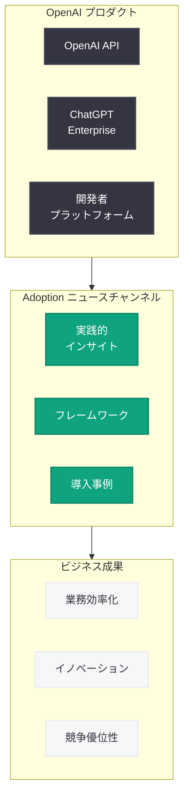

# OpenAI Adoption ニュースチャンネルの紹介

## メタデータ

| 項目 | 内容 |
|------|------|
| 発表日 | 2026-03-05 |
| ソース | OpenAI News/Blog |
| カテゴリ | AI Adoption |
| 公式リンク | [openai.com/index/introducing-the-adoption-news-channel](https://openai.com/index/introducing-the-adoption-news-channel) |

## 概要

OpenAI は 2026 年 3 月 5 日、AI の導入と活用に関する実践的な知見を集約する新たな情報チャンネル「Adoption ニュースチャンネル」の開設を発表した。このチャンネルは、AI の技術的進歩をビジネス上の優位性に転換するための実践的なインサイトとフレームワークを提供することを目的としている。

本チャンネルの開設は、AI 技術の急速な進化に伴い、多くの企業が「AI をどのように導入すればよいか」という課題に直面している現状を受けたものである。技術的な可能性と実際のビジネス成果の間にあるギャップを埋めるための専門的な情報源として位置づけられている。

## 主な内容

### Adoption ニュースチャンネルの目的

OpenAI が新設した Adoption ニュースチャンネルは、AI 導入に関する実践的な情報を一元的に提供する専門チャンネルである。主な目的は以下の通りである。

- **AI 進歩のビジネス活用:** AI の最新技術をビジネス現場で活用するための具体的な手法やベストプラクティスの共有
- **実践的なフレームワークの提供:** 企業が AI 導入を計画し実行するための体系的なフレームワークの紹介
- **成功事例の共有:** AI を効果的に活用している企業の事例やユースケースの紹介
- **導入障壁の解消:** AI 導入における技術的・組織的な障壁を克服するための知見の提供

### チャンネルが提供するコンテンツ

Adoption ニュースチャンネルでは、以下のような多角的なコンテンツが提供される。

#### 実践的なインサイト

AI 導入の現場で得られた具体的な学びや知見を共有する。理論だけでなく、実際の導入プロセスで直面する課題とその解決策に焦点を当てる。

- 業界別の AI 活用パターンとベストプラクティス
- AI 導入プロジェクトの計画と実行に関するガイダンス
- ROI 測定と効果検証の手法
- 組織変革マネジメントの知見

#### フレームワークとモデル

企業の AI 成熟度に応じた戦略的フレームワークを提供する。これにより、企業は自社の現在地を把握し、次のステップを明確にすることが可能になる。

- AI 成熟度評価モデル
- 段階的導入ロードマップ
- 価値創出フレームワーク
- リスク管理と倫理的 AI 導入のガイドライン

### AI 導入エコシステムにおける位置づけ

Adoption ニュースチャンネルは、OpenAI が推進する AI 導入支援エコシステムの重要な要素として機能する。OpenAI API や ChatGPT Enterprise といった技術プロダクトと、企業の実際のビジネスニーズを結びつける「橋渡し」の役割を担う。



## 技術的な詳細

### AI 導入を支える技術基盤

Adoption ニュースチャンネルで共有されるフレームワークの技術的基盤として、OpenAI の主要なプロダクトとサービスが活用される。

- **OpenAI API:** GPT-5.4 をはじめとする最新モデルを活用したアプリケーション構築の基盤
- **ChatGPT Enterprise:** 企業向けの安全な AI アシスタント環境
- **Assistants API:** カスタム AI エージェントの構築を可能にする API
- **カスタムモデル:** 企業固有のユースケースに最適化されたモデルの活用

### AI 導入の技術的アプローチ

企業が AI を段階的に導入する際の典型的な技術的アプローチは以下の通りである。

```python
from openai import OpenAI

client = OpenAI()

# AI 導入初期段階: 業務支援チャットボットの構築
# Adoption チャンネルで共有される基本的な活用パターン
response = client.chat.completions.create(
    model="gpt-5.4",
    messages=[
        {
            "role": "system",
            "content": (
                "You are a business adoption advisor. Help organizations "
                "understand how to effectively integrate AI into their "
                "workflows and measure business impact."
            )
        },
        {
            "role": "user",
            "content": (
                "What are the key steps to evaluate AI readiness "
                "for our customer support department?"
            )
        }
    ],
    max_tokens=2048
)
```

```python
from openai import OpenAI

client = OpenAI()

# 高度な活用段階: AI 導入効果の分析と最適化
# ビジネスメトリクスに基づく AI 活用の評価
def analyze_adoption_metrics(metrics_data: dict) -> dict:
    response = client.chat.completions.create(
        model="gpt-5.4",
        messages=[
            {
                "role": "system",
                "content": (
                    "You are an AI adoption analyst. Evaluate the provided "
                    "business metrics to assess AI integration effectiveness "
                    "and recommend optimization strategies."
                )
            },
            {
                "role": "user",
                "content": (
                    f"Analyze the following AI adoption metrics "
                    f"and provide recommendations: {metrics_data}"
                )
            }
        ],
        temperature=0.3,
        response_format={"type": "json_object"}
    )
    return response.choices[0].message.content
```

## 開発者への影響

Adoption ニュースチャンネルの開設は、開発者にとって以下の観点で重要な意味を持つ。

- **ビジネスコンテキストの理解:** 技術的な実装だけでなく、AI がビジネスにどのような価値をもたらすかを理解することで、より効果的なソリューション設計が可能になる。開発者は技術とビジネスの両面を理解したプロフェッショナルとしての役割が求められる
- **導入パターンの学習:** チャンネルで共有される実践的なフレームワークや事例を通じて、AI 統合のベストプラクティスを学ぶことができる。これにより、プロジェクトの成功確率を高め、開発効率を向上させることが期待される
- **ユースケースの拡大:** 様々な業界や業務領域での AI 活用事例を知ることで、開発者は自身のプロジェクトに応用可能な新たなアイデアを得ることができる
- **ROI 重視の開発:** ビジネス価値の最大化を意識した開発アプローチが重要になる。技術的な完成度だけでなく、導入後の効果測定や継続的な改善を見据えた設計が求められる
- **エコシステムへの参画:** Adoption チャンネルを通じて、OpenAI のパートナーエコシステムや開発者コミュニティとの接点が広がり、協業やナレッジ共有の機会が増加する

## 関連リンク

- [Introducing the Adoption news channel (原文)](https://openai.com/index/introducing-the-adoption-news-channel)
- [OpenAI API ドキュメント](https://platform.openai.com/docs)
- [OpenAI for Business](https://openai.com/business)
- [ChatGPT Enterprise](https://openai.com/chatgpt/enterprise)
- [The five AI value models driving business reinvention](https://openai.com/index/the-five-ai-value-models-driving-business-reinvention)

## まとめ

OpenAI が新設した Adoption ニュースチャンネルは、AI の技術的進歩をビジネス上の具体的な成果に変換するための重要な情報基盤である。実践的なインサイト、体系的なフレームワーク、導入事例の共有を通じて、企業が AI 導入の各段階で直面する課題を解決し、持続可能なビジネス優位性を構築するための支援を提供する。開発者にとっては、技術とビジネスの両面を理解し、ROI を意識した AI ソリューションを設計・構築するための貴重な知識源となるだろう。AI 導入を検討する組織は、このチャンネルを定期的にチェックし、最新のベストプラクティスやフレームワークを自社の AI 戦略に取り入れることが推奨される。
