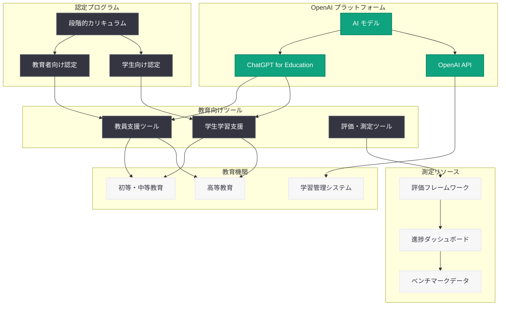

# AI の教育活用が機会拡大につながることを確実にする

## メタデータ

| 項目 | 内容 |
|------|------|
| 発表日 | 2026-03-05 |
| ソース | OpenAI News/Blog |
| カテゴリ | Global Affairs |
| 公式リンク | [openai.com/index/ai-education-opportunity](https://openai.com/index/ai-education-opportunity) |

## 概要

OpenAI は 2026 年 3 月 5 日、教育分野における AI 活用の機会均等を推進するための新たな取り組みを発表した。本発表では、学校や大学が AI 能力格差を解消し、すべての学習者に機会を拡大するための新しいツール、認定プログラム、および測定リソースが紹介されている。

教育における AI の導入が急速に進む中、テクノロジーへのアクセスやリテラシーの格差が、既存の教育機会の不平等をさらに拡大するリスクが指摘されている。OpenAI はこの課題に正面から取り組み、AI が教育における機会の「均等化装置」(equalizer) として機能するための具体的な施策を打ち出した。

## 主な内容

### 教育向け新ツールの提供

OpenAI は、教育機関が AI を効果的に導入・活用するための新しいツールを発表した。これらのツールは、教員と学生の双方が AI を教育プロセスに統合し、学習成果を向上させることを目的としている。

主な特徴は以下の通り。

- **教育機関向け AI ツール:** 教員がカリキュラムに AI を組み込むための支援ツールの提供
- **学生向け学習支援:** AI を活用した個別最適化学習 (パーソナライズドラーニング) の実現
- **アクセシビリティの向上:** 多様な学習者が AI ツールを利用できるようにするための機能強化

### AI 認定プログラム

OpenAI は、教育者や学生を対象とした AI 認定プログラム (Certification) を導入した。この認定制度は、AI リテラシーの標準化と、教育現場における AI 活用スキルの体系的な習得を支援するものである。

認定プログラムの主な要素は以下の通り。

- **教育者向け認定:** 教員が AI ツールを効果的に授業に取り入れるための知識とスキルを証明
- **学生向け認定:** AI の基礎概念から実践的な活用方法までを学び、認定を取得可能
- **段階的なカリキュラム:** 初級から上級までの段階的な学習パスにより、幅広いレベルの学習者に対応

### AI 能力格差の測定リソース

教育機関が AI 導入の効果を定量的に評価し、能力格差 (capability gap) の解消に向けた進捗を追跡するための測定リソースが提供される。

- **評価フレームワーク:** 学校や大学が AI 活用の成熟度を自己評価するための指標
- **データ収集ツール:** 学生の AI リテラシーレベルや学習成果を測定するためのツール
- **ベンチマーク:** 他の教育機関との比較が可能なベンチマークデータの提供

### 教育機会の均等化

OpenAI は、AI が特権的な環境にある学習者だけでなく、すべての学習者に恩恵をもたらすべきであるという理念を強調している。特に以下の観点から、機会の均等化に取り組んでいる。

- **デジタルデバイドの解消:** リソースが限られた学校にも AI ツールを提供するための施策
- **多言語対応:** 英語以外の言語を使用する学習者にも AI の恩恵が届くようにする取り組み
- **包括的な設計:** 障害のある学習者や多様なバックグラウンドを持つ学生への配慮

## 技術的な詳細

### 教育向け AI ツールの技術基盤

OpenAI の教育向けツールは、同社の AI モデルとプラットフォーム技術を基盤として構築されていると考えられる。教育分野での活用においては、以下の技術的要素が重要な役割を果たす。

- **ChatGPT for Education:** 教育機関向けにカスタマイズされた ChatGPT の提供。安全性フィルターの強化や、教育コンテンツに特化した設定が可能
- **API アクセス:** 教育機関の既存システム (LMS: Learning Management System) と統合するための API の提供
- **データプライバシー:** 学生データの保護に関する厳格なプライバシー基準の遵守 (FERPA、COPPA 等への対応)

### 認定プログラムの技術的側面

認定プログラムでは、AI の基礎概念から実践的な活用方法までを体系的に学ぶことができる。技術的なカリキュラムには以下のような要素が含まれると想定される。

- AI と機械学習の基礎概念
- プロンプトエンジニアリングの基本と応用
- AI ツールの倫理的な活用方法
- 教育現場での AI 活用事例と実践

### 測定・評価の技術基盤

能力格差の測定リソースは、定量的なデータ収集と分析に基づいている。以下の技術的アプローチが採用されていると考えられる。

- **標準化された評価指標:** AI リテラシーを多角的に測定するための標準化されたメトリクス
- **ダッシュボード:** 教育機関の管理者が AI 導入の進捗を可視化するためのインターフェース
- **縦断的データ分析:** 時間経過に伴う学習成果の変化を追跡するための分析機能

## アーキテクチャ

## 開発者への影響

### 教育テクノロジー開発への示唆

OpenAI の教育向け取り組みは、EdTech (教育テクノロジー) 分野の開発者にとって重要な示唆を含んでいる。

- **LMS 統合:** OpenAI API を活用して、既存の学習管理システム (Canvas、Moodle、Google Classroom 等) と AI 機能を統合するアプリケーション開発の機会が広がる
- **パーソナライズドラーニング:** 学習者個人の進度や理解度に応じた適応的な学習体験を構築するための技術基盤が提供される
- **評価ツール開発:** AI リテラシーや学習成果を測定するための評価ツールの開発需要が高まると予想される

### プライバシーとセキュリティ

教育分野での AI 活用においては、学生データのプライバシー保護が最重要課題の一つである。開発者は以下の点に留意する必要がある。

- **FERPA 準拠:** 米国の教育記録に関するプライバシー法への対応が必須
- **COPPA 準拠:** 13 歳未満の子供のデータ保護に関する法律への対応
- **データ最小化:** 必要最低限のデータのみを収集・処理する設計原則の遵守
- **保護者の同意:** 未成年の学習者に関するデータ処理における適切な同意取得プロセスの実装

### AI 認定の活用

認定プログラムの導入により、開発者コミュニティにも以下の影響が想定される。

- 認定カリキュラムに準拠した学習コンテンツやツールの開発需要
- 認定試験や評価のためのプラットフォーム構築の機会
- 認定取得者向けの高度なツールやリソースの提供

## 関連リンク

- [OpenAI 公式発表](https://openai.com/index/ai-education-opportunity)
- [OpenAI for Education](https://openai.com/education)
- [OpenAI API ドキュメント](https://platform.openai.com/docs)
- [ChatGPT](https://chat.openai.com)

## まとめ

OpenAI が発表した教育分野における AI 活用推進の取り組みは、AI がもたらす恩恵をすべての学習者に均等に届けるための包括的な施策である。新しいツール、認定プログラム、測定リソースの 3 つの柱を通じて、教育機関が AI 能力格差を解消し、学習機会を拡大するための具体的な支援が提供される。教育における AI 活用は急速に進展しているが、その恩恵が一部の学習者に偏ることなく、すべての人に機会をもたらすことが不可欠である。本発表は、OpenAI が技術開発だけでなく、社会的公正の観点からも AI の普及に責任を持つ姿勢を示すものであり、教育テクノロジー分野全体にとって重要な方向性を示すものである。
