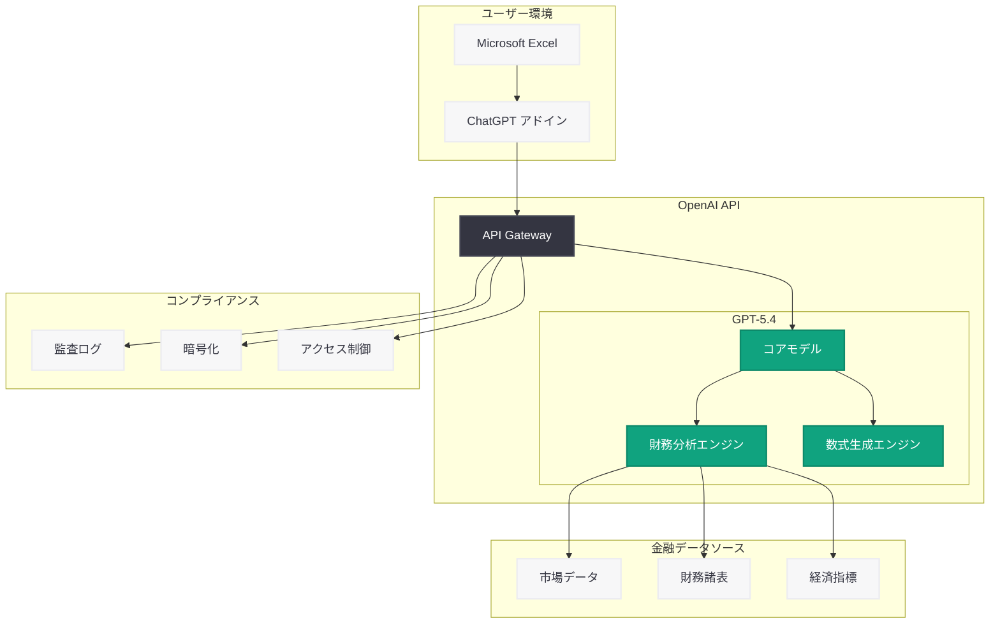

# ChatGPT for Excel と新しい金融データ統合機能の発表

## メタデータ

| 項目 | 内容 |
|------|------|
| 発表日 | 2026-03-05 |
| ソース | OpenAI News/Blog |
| カテゴリ | Product |
| 公式リンク | [openai.com](https://openai.com/index/chatgpt-for-excel) |

## 概要

OpenAI は 2026 年 3 月 5 日、Microsoft Excel 向けの新機能「ChatGPT for Excel」および金融アプリケーションとの新しいデータ統合機能を発表した。本機能は GPT-5.4 を基盤として構築されており、規制環境下における財務モデリング、リサーチ、データ分析を大幅に加速することを目的としている。

これにより、Excel ユーザーは自然言語による指示でスプレッドシートの操作、数式の生成、財務分析の実行が可能となり、金融業界をはじめとする規制の厳しい業界での AI 活用が本格的に進むことが期待される。

## 主な内容

### ChatGPT for Excel の主要機能

ChatGPT for Excel は、Excel のワークフローに AI を直接統合する新しいアドインとして提供される。GPT-5.4 の高度な推論能力を活用し、スプレッドシート上での作業を根本的に変革する。

- **自然言語による数式生成:** 日本語や英語での指示から複雑な Excel 数式を自動生成
- **データ分析の自動化:** 大量のデータセットに対するトレンド分析、異常値検出、統計処理を自然言語で実行
- **財務モデルの構築支援:** DCF モデル、LBO モデル、感度分析などの財務モデルを対話形式で構築
- **チャートおよびビジュアライゼーション:** データに基づく最適なグラフやチャートの自動提案と作成

### 金融データ統合機能

新しい金融アプリケーション統合により、リアルタイムの市場データや財務情報を Excel 内で直接活用できるようになる。

- **リアルタイム市場データ:** 株価、為替レート、債券利回りなどのリアルタイムデータの取り込み
- **財務諸表データ:** 企業の決算情報、バランスシート、キャッシュフロー計算書の自動取得
- **経済指標:** GDP、CPI、雇用統計などのマクロ経済指標へのアクセス
- **コンプライアンス対応:** 規制環境に適合したデータ処理とアクセス制御

### 規制環境への対応

金融業界特有の規制要件に対応するため、ChatGPT for Excel は以下のセキュリティおよびコンプライアンス機能を備えている。

- **データ残留制御:** 処理データのリージョン指定と保持期間の管理
- **監査ログ:** AI による操作の完全な監査証跡の記録
- **アクセス制御:** ロールベースのアクセス管理と組織ポリシーの適用
- **暗号化:** 転送中および保存時のデータ暗号化

## 技術的な詳細

### GPT-5.4 による高度な推論

ChatGPT for Excel は GPT-5.4 の推論能力を活用しており、複雑な財務計算や多段階のデータ分析タスクを正確に処理する。1M トークンコンテキストウィンドウにより、大規模なスプレッドシートデータを一度に把握した上での分析が可能である。

### API を活用したカスタム統合

開発者は OpenAI API を通じて、独自の金融データ統合ワークフローを構築できる。

```python
from openai import OpenAI

client = OpenAI()

# 財務データ分析の例
response = client.chat.completions.create(
    model="gpt-5.4",
    messages=[
        {
            "role": "system",
            "content": "You are a financial analyst assistant. Analyze the provided spreadsheet data and generate insights."
        },
        {
            "role": "user",
            "content": "Analyze the quarterly revenue data and identify growth trends across all business segments."
        }
    ],
    max_tokens=4096
)

print(response.choices[0].message.content)
```

> **注:** 上記のコード例は一般的な利用パターンの想定であり、実際の ChatGPT for Excel アドインの内部実装とは異なる場合がある。詳細は公式ドキュメントを参照してください。

### アーキテクチャ



## 開発者への影響

### 金融アプリケーション開発の変革

ChatGPT for Excel と金融データ統合機能により、金融業界向けアプリケーションの開発アプローチが大きく変わることが予想される。

- **開発期間の短縮:** 従来は数週間を要した財務モデルの構築が、AI 支援により数時間で完了する可能性
- **プロトタイピングの加速:** 自然言語による指示でスプレッドシートベースのプロトタイプを迅速に作成
- **データパイプラインの簡素化:** 金融データ統合 API により、複雑なデータ取得・変換処理の実装が不要に

### エンタープライズ統合の機会

- **既存システムとの連携:** 社内の金融システムや ERP との統合が API 経由で実現可能
- **ワークフロー自動化:** 定期的な財務レポート生成やデータ更新の自動化
- **カスタムアドイン開発:** OpenAI API を活用した業界特化型の Excel アドインの構築

### 導入時の考慮事項

- 規制要件に応じたデータガバナンスポリシーの策定が必要
- AI が生成した財務分析結果の検証プロセスを確立すべき
- トークン使用量とコストの管理計画を事前に策定することが推奨される
- 既存の Excel マクロや VBA との互換性を事前に検証する必要がある

## 関連リンク

- [ChatGPT for Excel 公式発表ページ](https://openai.com/index/chatgpt-for-excel)
- [GPT-5.4 の発表](https://openai.com/index/introducing-gpt-5-4)
- [OpenAI API ドキュメント](https://platform.openai.com/docs)
- [OpenAI Pricing](https://openai.com/pricing)

## まとめ

ChatGPT for Excel と金融データ統合機能の発表は、OpenAI が企業向け AI ソリューションの展開を本格化させていることを示す重要なマイルストーンである。GPT-5.4 を基盤とした本機能は、Excel という世界中の金融プロフェッショナルが日常的に使用するツールに AI を直接統合することで、財務モデリング、データ分析、リサーチの効率を飛躍的に向上させる。特に規制環境への対応を重視した設計は、金融業界での AI 採用における最大の障壁の一つであるコンプライアンス課題に正面から取り組むものであり、今後の金融 DX を加速させる重要な一歩となるだろう。開発者にとっては、金融データ統合 API を活用したカスタムソリューションの構築が新たなビジネス機会として注目される。
