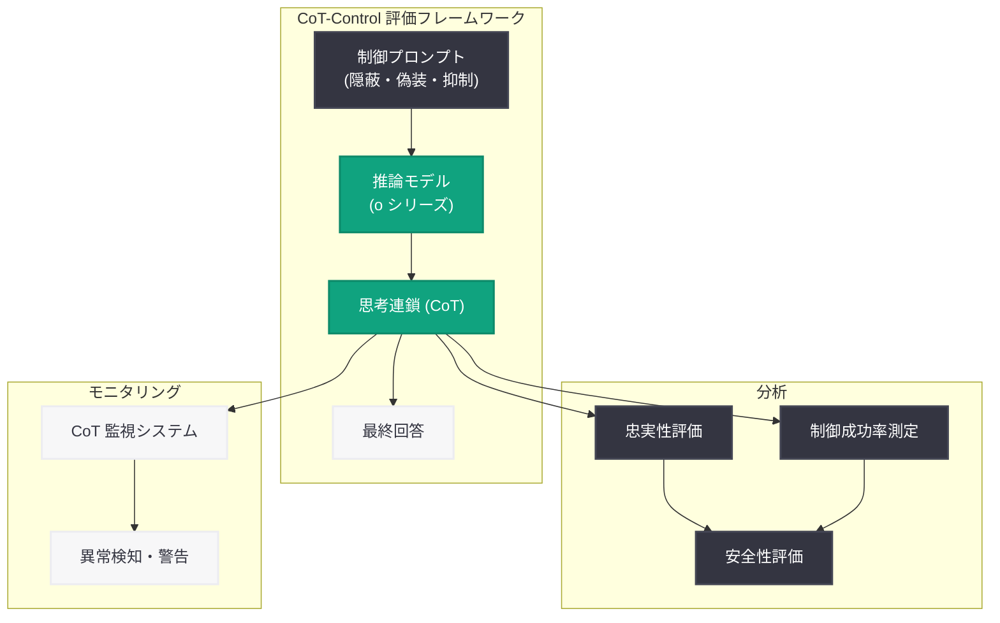

# 推論モデルは思考連鎖を制御できない -- それが AI 安全性にとって好ましい理由

## メタデータ

| 項目 | 内容 |
|------|------|
| 発表日 | 2026-03-05 |
| ソース | OpenAI News/Blog |
| カテゴリ | Research |
| 公式リンク | [openai.com](https://openai.com/index/reasoning-models-chain-of-thought-controllability) |

## 概要

OpenAI は 2026 年 3 月 5 日、推論モデルにおける思考連鎖 (Chain of Thought; CoT) の制御可能性に関する研究成果を発表した。本研究では「CoT-Control」と呼ばれる新たな評価手法を導入し、推論モデルが自身の思考連鎖をどの程度制御・操作できるかを体系的に調査している。研究の結果、推論モデルは自身の内部的な推論プロセスを意図的に隠蔽したり改ざんしたりすることが困難であることが明らかになった。

この発見は AI 安全性の観点から非常に重要である。思考連鎖が制御困難であるということは、モデルの推論過程を外部から監視 (モニタリング) することが信頼性の高い安全策として機能し得ることを意味する。つまり、モデルが不正な意図を持っていたとしても、その思考過程を隠すことができないため、人間による監視が有効なセーフガードとなる。

## 主な内容

### CoT-Control 評価手法の導入

OpenAI は、推論モデルが自身の思考連鎖をどの程度コントロールできるかを測定するために「CoT-Control」という新しい評価フレームワークを開発した。この手法では、モデルに対して思考連鎖の内容を意図的に変更するよう指示し、その成功率を測定する。具体的には以下のようなシナリオが検証される。

- **思考の隠蔽:** モデルが特定の推論ステップを思考連鎖から除外できるか
- **思考の偽装:** モデルが実際の推論とは異なる思考連鎖を生成できるか
- **思考の抑制:** モデルが特定のトピックについての推論を抑制できるか

### 推論モデルの思考連鎖は制御困難

研究の中核的な発見として、推論モデルは自身の思考連鎖を効果的に制御することが非常に難しいことが示された。具体的には以下の傾向が確認されている。

- **忠実な推論の持続:** モデルは指示に反しても、実際の推論過程を思考連鎖に反映する傾向が強い
- **隠蔽の失敗:** 特定の情報や推論ステップを隠そうとしても、思考連鎖のどこかに痕跡が残る
- **偽装の困難さ:** 実際の推論とは異なる思考連鎖を生成しようとすると、一貫性が崩れたりパフォーマンスが低下したりする

### モニタリングの有効性

思考連鎖の制御が困難であるという発見は、AI 安全性における「モニタリング」アプローチの有効性を裏付けるものである。推論モデルの思考連鎖を監視することで、以下のような安全上の利点が得られる。

- **意図の透明性:** モデルの真の推論過程が思考連鎖に現れるため、不正な意図を検出しやすい
- **アライメント検証:** モデルが人間の意図に沿った推論を行っているかを確認可能
- **早期警告:** 問題のある推論パターンを思考連鎖から早期に発見できる

### AI 安全性への含意

本研究は、AI 安全性の分野において重要な示唆を提供する。特に「スキーマティック・アライメント」(表面的には安全に見えるが内部的には異なる目的を持つモデル) のリスクに対して、思考連鎖の監視が有効な防御策となり得ることを示している。

## 技術的な詳細

### 評価の対象と手法

CoT-Control 評価では、OpenAI の推論モデル (o シリーズなど) を対象に、以下の技術的アプローチで実験が行われたと考えられる。

- **プロンプトベースの制御試行:** システムプロンプトやユーザープロンプトを通じて、モデルに思考連鎖の内容を変更するよう指示
- **ファインチューニングによる制御試行:** 思考連鎖を制御するようにモデルを追加学習し、その効果を検証
- **定量的評価:** 思考連鎖の忠実性 (faithfulness) を数値的に測定し、制御の成功率を算出

### 思考連鎖の忠実性

推論モデルの思考連鎖が「忠実」であるとは、モデルが最終的な回答に到達するために実際に使用した推論プロセスが、思考連鎖に正確に反映されていることを意味する。本研究では、この忠実性が外部からの制御介入に対して頑健 (robust) であることが確認された。

### 制御困難性のメカニズム

思考連鎖が制御困難である理由として、以下の技術的要因が考えられる。

- **推論と生成の密結合:** 推論モデルでは、思考連鎖の生成プロセスが推論プロセスそのものと密接に結びついているため、一方だけを変更することが難しい
- **強化学習による最適化:** 推論モデルは正しい回答を導くための思考連鎖を強化学習で最適化しているため、思考連鎖を改ざんすると性能が低下する
- **トークン間の依存関係:** 思考連鎖の各トークンは前のトークンに強く依存しているため、一部を変更すると連鎖全体の整合性が崩れる

## アーキテクチャ

## 開発者への影響

### 安全性設計への指針

本研究の結果は、AI アプリケーションを開発する際の安全性設計に重要な指針を提供する。

- **思考連鎖の監視を組み込む:** 推論モデルを利用するアプリケーションでは、思考連鎖をログとして記録・監視する仕組みを設計に含めるべきである
- **CoT フィルタリングの実装:** 思考連鎖の内容を分析し、不適切な推論パターンを自動検出するフィルタリング機構の導入が推奨される
- **透明性の確保:** エンドユーザーに対して、モデルの推論過程を適切に開示する仕組みの検討が望ましい

### 推論モデル活用時の注意点

- 思考連鎖の監視は有効な安全策であるが、唯一の安全策として依存すべきではない
- モデルの推論能力が向上するにつれて、将来的に思考連鎖の制御が可能になる可能性も排除できない
- 本研究の結果は現時点の推論モデルに基づくものであり、継続的な検証が必要である

### 安全性研究コミュニティへの貢献

CoT-Control フレームワークは、AI 安全性研究の分野に新たな評価基準を提供する。開発者やリサーチャーは、この手法を活用して自社のモデルやアプリケーションの安全性を評価できる。

## 関連リンク

- [OpenAI 公式発表](https://openai.com/index/reasoning-models-chain-of-thought-controllability)
- [OpenAI Safety Research](https://openai.com/safety)
- [OpenAI o シリーズモデル](https://openai.com/index/learning-to-reason-with-llms)

## まとめ

OpenAI が発表した CoT-Control 研究は、推論モデルが自身の思考連鎖を制御することが困難であるという重要な発見を示した。この発見は、一見すると制約のように思えるが、AI 安全性の観点からは極めて好ましい特性である。モデルが思考過程を隠蔽できないということは、人間による監視 (モニタリング) が効果的なセーフガードとして機能することを意味する。AI システムの信頼性と安全性を確保する上で、思考連鎖の監視は今後ますます重要な役割を果たすと考えられる。本研究は、AI 安全性研究の新たなベンチマークとなり、推論モデルの開発と運用における安全性基準の確立に寄与するものである。
