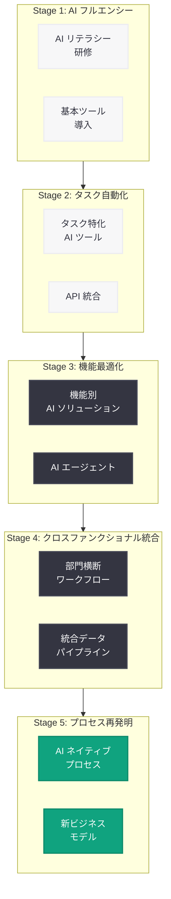

# ビジネス変革を推進する 5 つの AI バリューモデル

## メタデータ

| 項目 | 内容 |
|------|------|
| 発表日 | 2026-03-05 |
| ソース | OpenAI News/Blog |
| カテゴリ | AI Adoption |
| 公式リンク | [openai.com/index/the-five-ai-value-models-driving-business-reinvention](https://openai.com/index/the-five-ai-value-models-driving-business-reinvention) |

## 概要

OpenAI は 2026 年 3 月 5 日、企業が AI を活用してビジネスを変革するための 5 つのバリューモデルを提示した記事を公開した。この記事では、ビジネスリーダーが AI 導入を段階的に進めるための戦略的フレームワークとして、ワークフォースの AI リテラシー向上からプロセスの根本的な再設計に至るまでのロードマップを示している。

本記事は、AI 導入を検討する企業に対して、単なるツール導入にとどまらず、持続可能なビジネス優位性 (Durable Business Advantage) を構築するための体系的なアプローチを提供するものである。5 つのバリューモデルを適切に順序立てて実行することが、AI 投資の価値最大化に不可欠であると強調されている。

## 主な内容

### 5 つの AI バリューモデル

OpenAI が提示する 5 つのバリューモデルは、企業の AI 成熟度に応じた段階的なアプローチを定義している。各モデルは独立して機能するものではなく、順序立てて導入することで累積的な効果を発揮する。

#### 1. ワークフォース AI フルエンシー (Workforce AI Fluency)

最初の段階では、組織全体の AI リテラシーを向上させることに焦点を当てる。全従業員が AI ツールを効果的に活用できる基盤を構築する。

- 組織全体での AI リテラシーの底上げ
- 日常業務における AI ツールの基本的な活用スキルの習得
- AI に対する理解と信頼の醸成
- 部門横断的な AI 活用の文化形成

#### 2. タスクの自動化と効率化

個々のタスクレベルで AI を活用し、業務効率を向上させる段階である。定型的な作業を AI に委任することで、従業員がより付加価値の高い業務に集中できる環境を整備する。

- 反復的なタスクの AI による自動化
- ドキュメント作成、データ入力、レポート生成などの効率化
- 個人の生産性向上を通じた組織全体のパフォーマンス改善

#### 3. 機能レベルの最適化

特定のビジネス機能 (マーケティング、カスタマーサポート、財務分析など) を AI で最適化する段階である。部門単位での AI 統合により、機能全体のパフォーマンスを向上させる。

- 部門固有のワークフローへの AI 統合
- カスタマーサポートにおける AI エージェントの導入
- マーケティング分析やコンテンツ生成の自動化
- 財務予測やリスク分析の精度向上

#### 4. クロスファンクショナルな統合

複数のビジネス機能を横断して AI を統合し、組織全体のワークフローを最適化する段階である。サイロ化された AI 活用を打破し、部門間の連携を強化する。

- 部門横断的なデータフローの AI による最適化
- エンドツーエンドのビジネスプロセスの統合
- 組織全体での AI 駆動型の意思決定支援

#### 5. プロセスの再発明 (Process Reinvention)

最終段階では、既存のビジネスプロセスを AI を前提としてゼロから再設計する。従来のプロセスを AI で「改善」するのではなく、AI ネイティブなプロセスとして「再発明」することで、根本的なビジネス変革を実現する。

- AI ファーストの視点でのビジネスプロセス再設計
- 従来不可能だった新しいビジネスモデルの創出
- 持続的な競争優位性の確立
- 業界全体の変革をリードするイノベーション

### 段階的導入の重要性

OpenAI は、これら 5 つのモデルを順序立てて導入することの重要性を強調している。AI フルエンシーという基盤がなければタスクの自動化は効果的に機能せず、機能レベルの最適化なしにクロスファンクショナルな統合は実現しない。各段階での成功と学びが次の段階への土台となる。

### 持続可能なビジネス優位性

記事では、AI 導入の最終目標として「Durable Business Advantage」(持続可能なビジネス優位性) の構築を掲げている。一時的なコスト削減や効率化にとどまらず、AI を組織の DNA に組み込むことで、競合他社が容易に模倣できない構造的な優位性を生み出すことが重要であると述べている。

## 技術的な詳細

### AI 導入の技術的フレームワーク

5 つのバリューモデルを実現するための技術的基盤として、以下の要素が考えられる。

- **LLM 活用基盤:** OpenAI API (GPT-5.4 など) を活用した組織全体の AI プラットフォームの構築
- **エージェントワークフロー:** 複数の AI エージェントが連携して業務プロセスを自動化するアーキテクチャ
- **データ統合:** 部門横断的なデータパイプラインの構築と AI モデルへのフィード
- **評価と改善:** AI の出力品質を継続的にモニタリングし、改善するフィードバックループ

### 段階別の技術的アプローチ



### API 活用の段階的拡大

各段階における OpenAI API の活用パターンは以下の通りである。

```python
from openai import OpenAI

client = OpenAI()

# Stage 1-2: 基本的な Chat Completions API の活用
# 従業員の日常業務における AI アシスタント
response = client.chat.completions.create(
    model="gpt-5.4",
    messages=[
        {
            "role": "system",
            "content": (
                "You are a helpful business assistant. "
                "Help employees with their daily tasks efficiently."
            )
        },
        {
            "role": "user",
            "content": "Summarize the key points from this meeting transcript..."
        }
    ],
    max_tokens=2048
)
```

```python
from openai import OpenAI

client = OpenAI()

# Stage 3-5: エージェントワークフローによる高度な業務自動化
# 部門横断的な分析と意思決定支援
def cross_functional_analysis(department_data: dict) -> dict:
    # 各部門のデータを統合して分析
    response = client.chat.completions.create(
        model="gpt-5.4",
        messages=[
            {
                "role": "system",
                "content": (
                    "You are a strategic business analyst. Analyze cross-functional "
                    "data to identify optimization opportunities and provide "
                    "actionable recommendations."
                )
            },
            {
                "role": "user",
                "content": f"Analyze the following department data: {department_data}"
            }
        ],
        temperature=0.3,
        response_format={"type": "json_object"}
    )
    return response.choices[0].message.content
```

## 開発者への影響

OpenAI が提示する 5 つのバリューモデルは、開発者にとって以下の観点で重要な示唆を与える。

- **段階的な AI 統合設計:** アプリケーション開発において、AI 機能を段階的に拡張できるアーキテクチャ設計が求められる。初期段階では単純な API 呼び出しから始め、徐々にエージェントワークフローや複雑な統合へと進化させる設計が重要である
- **エージェントアーキテクチャの重要性:** Stage 3 以降では、複数の AI エージェントが連携するシステム設計が不可欠となる。開発者は、エージェント間の通信プロトコル、タスクの分割と統合、エラーハンドリングなどの設計パターンを習得する必要がある
- **データパイプラインの構築:** クロスファンクショナルな統合を実現するためには、部門間のデータサイロを打破し、統合的なデータパイプラインを構築するスキルが求められる
- **AI ネイティブなプロセス設計:** 最終段階のプロセス再発明では、既存のシステムに AI を「追加」するのではなく、AI を前提とした新しいシステムアーキテクチャを設計する能力が重要になる
- **評価とモニタリング:** 各段階での AI 活用の成果を定量的に評価し、継続的に改善するための仕組みを構築するスキルが必要である

## 関連リンク

- [The five AI value models driving business reinvention (原文)](https://openai.com/index/the-five-ai-value-models-driving-business-reinvention)
- [OpenAI API ドキュメント](https://platform.openai.com/docs)
- [OpenAI for Business](https://openai.com/business)
- [OpenAI ChatGPT Enterprise](https://openai.com/chatgpt/enterprise)

## まとめ

OpenAI が発表した 5 つの AI バリューモデルは、企業が AI を戦略的に導入し、持続可能なビジネス優位性を構築するための包括的なフレームワークである。ワークフォース AI フルエンシーを出発点とし、タスク自動化、機能最適化、クロスファンクショナル統合を経て、最終的にプロセスの再発明に至るこの段階的アプローチは、AI 導入を「ツールの導入」ではなく「ビジネスの変革」として捉える視点を提供している。開発者にとっては、各段階に対応した技術的なアーキテクチャ設計能力が求められ、特にエージェントワークフローの構築やデータ統合のスキルが今後ますます重要になるだろう。AI 導入を検討する組織は、このフレームワークを参考に、自社の現在地を把握し、次のステップを計画的に進めることが推奨される。
