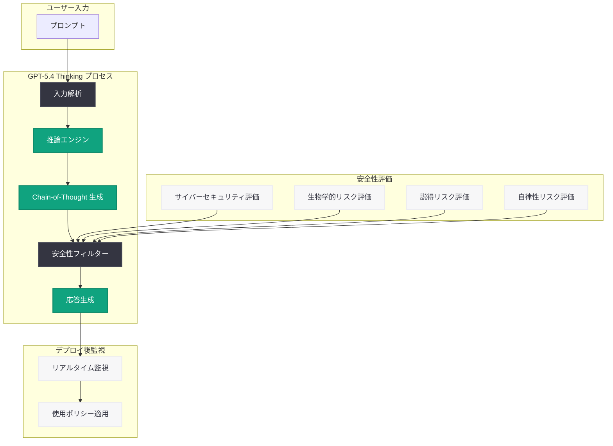

# GPT-5.4 Thinking System Card: 安全性評価と技術詳細の公開

## メタデータ

| 項目 | 内容 |
|------|------|
| 発表日 | 2026-03-05 |
| ソース | OpenAI News/Blog |
| カテゴリ | Publication |
| 公式リンク | [openai.com](https://openai.com/index/gpt-5-4-thinking-system-card) |

## 概要

OpenAI は 2026 年 3 月 5 日、GPT-5.4 Thinking モデルの System Card を公開した。System Card は、モデルの安全性評価、能力、制限事項に関する包括的な技術文書であり、AI システムの透明性確保を目的として公開されるものである。GPT-5.4 Thinking は、OpenAI の推論 (reasoning) モデルファミリーの最新版であり、従来の GPT-5 シリーズに高度な思考・推論プロセスを統合したモデルである。

本 System Card では、GPT-5.4 Thinking モデルの安全性に関する多面的な評価結果が詳述されている。モデルの能力向上に伴うリスクの増大に対して、OpenAI がどのような安全対策を講じているかを明示することで、研究コミュニティや開発者、政策立案者への情報提供を目的としている。

## 主な内容

### 推論能力の強化

GPT-5.4 Thinking モデルは、複雑な問題に対して段階的な思考プロセス (Chain-of-Thought) を内部的に実行する推論特化型モデルである。従来の GPT-5 シリーズと比較して、以下の領域で顕著な能力向上が報告されている。

- **数学的推論:** 高度な数学問題において、段階的な論理展開による正確な解答導出
- **科学的分析:** 複雑な科学的問題の分析と仮説検証
- **コーディング:** アルゴリズム設計やデバッグにおける論理的な問題解決
- **マルチステップタスク:** 複数の手順を要するタスクの計画立案と実行

### 安全性評価の枠組み

System Card では、OpenAI の Preparedness Framework に基づく体系的な安全性評価が実施されている。評価は以下の主要カテゴリに分類される。

1. **サイバーセキュリティリスク:** モデルがサイバー攻撃の支援に悪用される可能性の評価
2. **生物学的リスク:** 生物兵器に関連する知識の生成可能性の評価
3. **説得・操作リスク:** 大規模な世論操作やソーシャルエンジニアリングへの悪用可能性
4. **自律性リスク:** モデルが人間の監督を逃れて自律的に行動する可能性の評価
5. **幻覚 (Hallucination):** 事実と異なる情報を生成するリスクの評価

### モデルの制限事項

GPT-5.4 Thinking モデルには、以下の既知の制限事項がある。

- **推論時間のトレードオフ:** 思考プロセスの実行により、応答時間が通常のモデルよりも長くなる場合がある
- **過度な推論:** 単純な質問に対しても不必要に複雑な推論を行う傾向がある
- **思考の透明性:** 内部の思考プロセスは要約された形でのみ表示され、完全な推論過程は開示されない
- **知識のカットオフ:** トレーニングデータの期限以降の情報については正確な回答が保証されない

### 安全対策と緩和措置

OpenAI は GPT-5.4 Thinking モデルに対して、多層的な安全対策を実施している。

- **RLHF (Reinforcement Learning from Human Feedback):** 人間のフィードバックに基づく強化学習による安全性の向上
- **レッドチーミング:** 外部の専門家チームによる敵対的テストの実施
- **モニタリングシステム:** デプロイ後のモデル挙動の継続的な監視
- **使用ポリシーの適用:** API 利用規約に基づく不正利用の検出と防止

## 技術的な詳細

### Thinking モデルの利用方法

GPT-5.4 Thinking モデルは、OpenAI API を通じて利用可能である。以下は API の利用例である。

```python
from openai import OpenAI

client = OpenAI()

# GPT-5.4 Thinking モデルの呼び出し
response = client.chat.completions.create(
    model="gpt-5.4-thinking",
    messages=[
        {
            "role": "user",
            "content": "素数の無限性を証明してください。"
        }
    ],
    # 推論トークンの上限設定
    max_completion_tokens=16000
)

print(response.choices[0].message.content)
```

### 推論トークンの制御

Thinking モデルでは、内部の推論プロセスに使用されるトークン (推論トークン) と、最終的な応答に使用されるトークンが区別される。開発者は推論の深さを制御するためのパラメータを設定できる。

```python
# 推論の深さを制御する例
response = client.chat.completions.create(
    model="gpt-5.4-thinking",
    messages=[
        {
            "role": "user",
            "content": "この関数のバグを特定してください: ..."
        }
    ],
    reasoning_effort="high",  # low, medium, high から選択
    max_completion_tokens=32000
)

# 推論トークンの使用量を確認
usage = response.usage
print(f"推論トークン: {usage.completion_tokens_details.reasoning_tokens}")
print(f"出力トークン: {usage.completion_tokens}")
```

### 安全性評価のスコア

System Card で報告されている安全性評価では、各リスクカテゴリに対して「低」「中」「高」「クリティカル」の 4 段階で評価が行われる。GPT-5.4 Thinking モデルは、主要なリスクカテゴリにおいてデプロイ基準を満たしていることが報告されている。

## アーキテクチャ



## 開発者への影響

### 高度な推論タスクへの活用

GPT-5.4 Thinking モデルの公開により、開発者は以下の領域でより高精度な AI アプリケーションを構築できる。

- **複雑な分析タスク:** 法律文書の解析、財務分析、科学論文のレビューなど、多段階の推論を要するタスク
- **コード生成と品質向上:** アルゴリズムの最適化、セキュリティレビュー、アーキテクチャ設計の支援
- **教育・研究支援:** 段階的な説明生成による学習支援や研究仮説の検証

### 安全性への配慮

System Card の公開は、開発者が AI の安全性リスクを理解し、適切な対策を講じるための重要な参考資料となる。

- **リスク認識:** モデルの能力と制限を正しく理解した上でのアプリケーション設計
- **適切な利用:** 使用ポリシーに準拠したアプリケーション開発
- **ユーザーへの説明責任:** AI を組み込んだサービスにおける透明性の確保

### コストと応答時間の考慮

Thinking モデルは推論トークンを消費するため、通常のモデルと比較して API コストが高くなる可能性がある。開発者は `reasoning_effort` パラメータを適切に設定し、タスクの複雑さに応じた推論レベルを選択することが推奨される。

## 関連リンク

- [GPT-5.4 Thinking System Card](https://openai.com/index/gpt-5-4-thinking-system-card)
- [OpenAI Preparedness Framework](https://openai.com/preparedness)
- [OpenAI API ドキュメント](https://platform.openai.com/docs)
- [OpenAI 使用ポリシー](https://openai.com/policies/usage-policies)

## まとめ

OpenAI が公開した GPT-5.4 Thinking System Card は、最新の推論特化型モデルに関する安全性評価と技術詳細を包括的にまとめた文書である。サイバーセキュリティ、生物学的リスク、説得リスク、自律性リスクなど多面的な安全性評価の結果が開示されており、AI の透明性と安全性に対する OpenAI の取り組みを示している。開発者にとっては、高度な推論能力を活用したアプリケーション構築の指針となるとともに、モデルの制限事項やリスクを理解した上での責任ある利用が求められる。Thinking モデルの進化は AI の推論能力の大きな前進であり、今後のさらなる安全性研究と能力向上に注目したい。
