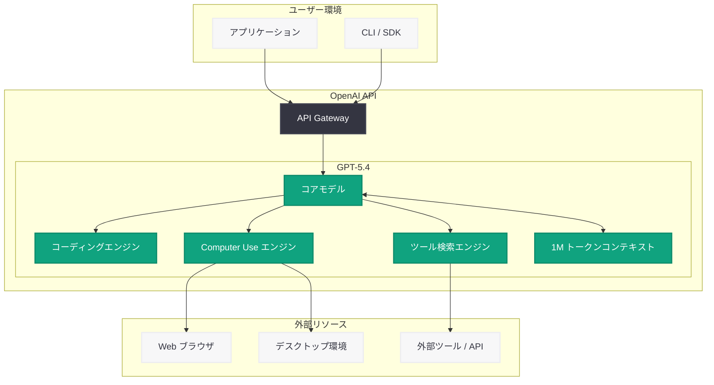

# GPT-5.4 の発表: OpenAI 史上最も高性能かつ効率的なフロンティアモデル

## メタデータ

| 項目 | 内容 |
|------|------|
| 発表日 | 2026-03-05 |
| ソース | OpenAI News/Blog |
| カテゴリ | Product |
| 公式リンク | [openai.com](https://openai.com/index/introducing-gpt-5-4) |

## 概要

OpenAI は 2026 年 3 月 5 日、最新のフロンティアモデル「GPT-5.4」を発表した。GPT-5.4 は、プロフェッショナルワーク向けに設計された OpenAI 史上最も高性能かつ効率的なモデルであり、コーディング、コンピュータ操作、ツール検索、そして 1M トークンのコンテキストウィンドウといった最先端の機能を備えている。

GPT-5.4 は、従来の GPT-5 シリーズから大幅な性能向上を実現し、特にプロフェッショナルな業務環境での利用を想定した最適化が施されている。コーディング能力の飛躍的向上、コンピュータ操作 (Computer Use) への対応、高度なツール検索機能、そして 100 万トークンという大規模なコンテキストウィンドウにより、複雑なタスクの処理能力が格段に強化されている。

## 主な内容

### 最先端のコーディング能力

GPT-5.4 は、コーディングベンチマークにおいて最先端の性能を達成している。複雑なコードの生成、デバッグ、リファクタリング、コードレビューなど、ソフトウェア開発のあらゆる局面で高い精度を発揮する。

- **マルチ言語対応:** Python、JavaScript、TypeScript、Rust、Go、Java、C++ など主要なプログラミング言語に対応
- **コンテキスト理解の向上:** 大規模コードベース全体を把握した上での的確なコード生成
- **テスト生成:** 既存コードに対するユニットテストや統合テストの自動生成能力の向上

### Computer Use (コンピュータ操作)

GPT-5.4 は、コンピュータの GUI を直接操作する「Computer Use」機能を搭載している。これにより、ブラウザ操作、アプリケーション操作、ファイル管理など、従来はテキストベースの指示では困難だったタスクを AI が直接実行できるようになる。

- **ブラウザ操作:** Web ページの閲覧、フォーム入力、ボタンクリックなどの自動化
- **デスクトップ操作:** アプリケーションの起動、メニュー操作、データ入力の自動化
- **ワークフロー自動化:** 複数のアプリケーションを横断する業務プロセスの自動化

### ツール検索 (Tool Search)

GPT-5.4 には高度なツール検索機能が組み込まれており、タスクに最適なツールや API を自動的に選択・実行する能力を持つ。これにより、複雑なマルチステップタスクの遂行が大幅に効率化される。

- **自動ツール選択:** タスクの内容に応じて最適なツールを自動で判断
- **API 連携:** 外部サービスの API を適切に呼び出し、結果を統合
- **チェーン実行:** 複数のツールを連鎖的に実行し、複合的なタスクを完遂

### 1M トークンコンテキストウィンドウ

GPT-5.4 は 100 万トークンのコンテキストウィンドウを提供する。これにより、大規模なドキュメント、コードベース全体、長時間の会話履歴を一度に処理することが可能になった。

- **大規模コードベースの分析:** リポジトリ全体をコンテキストに含めた包括的なコード分析
- **長文ドキュメントの処理:** 書籍や論文全体を一度に読み込んでの要約・分析
- **長期的な会話の継続:** 長時間にわたるセッションでも文脈を失わない対話

## 技術的な詳細

### API の利用

GPT-5.4 は OpenAI API を通じて利用可能である。以下は基本的な API 呼び出しの例である。

```python
from openai import OpenAI

client = OpenAI()

# 基本的な Chat Completions API の呼び出し
response = client.chat.completions.create(
    model="gpt-5.4",
    messages=[
        {"role": "system", "content": "You are a helpful assistant."},
        {"role": "user", "content": "Explain the architecture of a microservices system."}
    ],
    max_tokens=4096
)

print(response.choices[0].message.content)
```

### 大規模コンテキストの活用例

```python
from openai import OpenAI

client = OpenAI()

# 大規模なコードベースを含むコンテキストでのコードレビュー
with open("large_codebase.txt", "r") as f:
    codebase_content = f.read()

response = client.chat.completions.create(
    model="gpt-5.4",
    messages=[
        {
            "role": "system",
            "content": "You are an expert code reviewer. Analyze the entire codebase and identify potential issues."
        },
        {
            "role": "user",
            "content": f"Please review this codebase:\n\n{codebase_content}"
        }
    ],
    max_tokens=8192
)

print(response.choices[0].message.content)
```

### Computer Use の利用例

```python
from openai import OpenAI

client = OpenAI()

# Computer Use 機能を活用したタスク実行
response = client.chat.completions.create(
    model="gpt-5.4",
    messages=[
        {
            "role": "user",
            "content": "Search for the latest Python release notes on python.org and summarize the key changes."
        }
    ],
    tools=[{"type": "computer_use"}],
    max_tokens=4096
)

print(response.choices[0].message.content)
```

> **注:** 上記のコード例は一般的な利用パターンの想定であり、実際のパラメータやツール指定の詳細は公式ドキュメントを参照してください。

## アーキテクチャ



## 開発者への影響

### 開発生産性の飛躍的向上

GPT-5.4 の高度なコーディング能力と 1M トークンコンテキストにより、開発者の生産性が大幅に向上することが期待される。

- **コードベース全体の理解:** 大規模プロジェクトでも全体を把握した上での的確な支援が可能
- **開発サイクルの短縮:** コード生成、テスト作成、デバッグの一連のプロセスを AI が加速
- **品質向上:** コンテキストを踏まえた高精度なコードレビューにより、バグの早期発見が促進

### 業務自動化の新しい可能性

Computer Use 機能とツール検索の組み合わせにより、従来は手作業で行っていた業務プロセスの自動化が可能になる。

- **RPA の高度化:** GUI 操作を含む複雑な業務フローの AI による自動化
- **マルチツール連携:** 複数のサービスやツールを横断するワークフローの構築
- **エンドツーエンドの自動化:** 情報収集から報告書作成までの一連の業務を自動化

### 移行時の考慮事項

- GPT-5 シリーズからの移行において、プロンプトの最適化が必要になる場合がある
- 1M トークンコンテキストの活用にはトークン使用量の管理が重要
- Computer Use 機能はセキュリティポリシーとの整合性を確認した上で導入すべき
- 料金体系の変更に伴うコスト影響の事前評価が推奨される

## 関連リンク

- [GPT-5.4 公式発表ページ](https://openai.com/index/introducing-gpt-5-4)
- [OpenAI API ドキュメント](https://platform.openai.com/docs)
- [OpenAI モデル一覧](https://platform.openai.com/docs/models)
- [OpenAI Pricing](https://openai.com/pricing)

## まとめ

GPT-5.4 は、OpenAI が発表した最新かつ最も高性能なフロンティアモデルであり、プロフェッショナルワークに特化した設計が最大の特徴である。最先端のコーディング能力、Computer Use によるコンピュータ操作、高度なツール検索機能、そして 100 万トークンのコンテキストウィンドウという 4 つの主要機能により、開発者の生産性向上と業務自動化の新たな可能性を切り開く。特に大規模コードベースの分析やマルチステップの複雑なタスク処理において、従来のモデルを大きく上回る性能を発揮することが期待される。今後、開発者コミュニティでの実践的な活用事例やベンチマーク結果の蓄積により、GPT-5.4 の真の実力がさらに明らかになるだろう。
