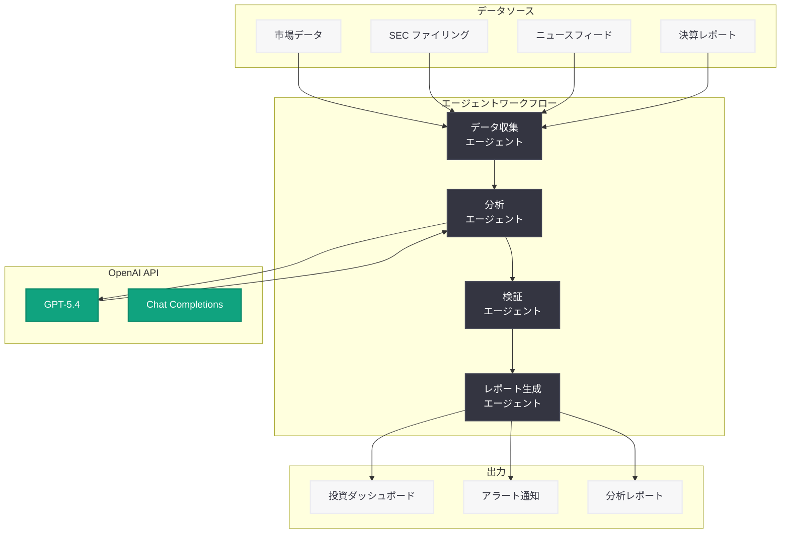

# Balyasny Asset Management が AI リサーチエンジンを構築した方法

## メタデータ

| 項目 | 内容 |
|------|------|
| 発表日 | 2026-03-06 |
| ソース | OpenAI News/Blog |
| カテゴリ | API |
| 公式リンク | [openai.com/index/balyasny-asset-management](https://openai.com/index/balyasny-asset-management) |

## 概要

Balyasny Asset Management (BAM) は、OpenAI の GPT-5.4 を活用し、投資分析を大規模に変革する AI リサーチシステムを構築した。このシステムは、厳格なモデル評価プロセスとエージェントワークフローを組み合わせることで、投資リサーチの効率と精度を飛躍的に向上させている。

BAM はマルチストラテジーヘッジファンドとして知られており、グローバルな投資判断を支援するために AI 技術を戦略的に導入した。本事例は、金融業界における大規模言語モデル (LLM) の実用的な活用方法を示す先進的な取り組みである。

## 主な内容

### AI リサーチエンジンの概要

BAM が構築した AI リサーチエンジンは、投資アナリストやポートフォリオマネージャーの業務を支援するために設計されている。従来は手動で行っていた大量の企業レポート、決算資料、マクロ経済データの分析を、AI エージェントが自動的に処理し、投資判断に必要なインサイトを抽出する仕組みとなっている。

主な機能は以下の通り。

- 企業の決算発表や SEC ファイリングの自動要約と分析
- マクロ経済指標の変動に関するリアルタイムアラート生成
- 競合他社の比較分析レポートの自動作成
- 投資仮説の検証を支援するデータ駆動型リサーチ

### GPT-5.4 の活用

BAM は OpenAI の GPT-5.4 を中核モデルとして採用している。GPT-5.4 の高度な推論能力と長文コンテキスト処理能力により、複雑な金融文書の分析精度が大幅に向上した。特に以下の点で GPT-5.4 の能力が活かされている。

- **長文コンテキスト処理:** 数百ページに及ぶ年次報告書や目論見書を一度に処理し、重要な情報を抽出
- **高度な推論:** 財務データ間の複雑な関連性を分析し、投資リスクや機会を特定
- **構造化出力:** 分析結果を一貫したフォーマットで出力し、アナリストのワークフローに統合

### エージェントワークフロー

BAM のシステムは、複数の AI エージェントが連携するワークフロー構成を採用している。各エージェントは特定のタスクに特化しており、データ収集、分析、レポート生成といった一連のプロセスを自律的に実行する。

エージェントの役割分担は以下の通り。

- **データ収集エージェント:** 複数のデータソースから最新の市場データ、ニュース、企業情報を収集
- **分析エージェント:** 収集されたデータを GPT-5.4 で分析し、投資に関するインサイトを生成
- **検証エージェント:** 分析結果の整合性と正確性を検証し、ハルシネーションを防止
- **レポート生成エージェント:** 最終的な分析結果を投資チーム向けのレポートとして整形

### 厳格なモデル評価

BAM は AI モデルの導入にあたり、金融業界特有の厳格な評価基準を設けている。モデルの精度、一貫性、バイアスの有無を定量的に測定し、投資判断に利用可能な品質水準を確保している。

評価プロセスには以下の要素が含まれる。

- 過去の投資事例を用いたバックテストによる精度検証
- 専門アナリストによるブラインドレビュー (AI 出力と人間の分析結果の比較)
- エッジケースや市場急変時における出力の安定性テスト
- 継続的なモニタリングとモデルパフォーマンスの追跡

## 技術的な詳細

### システム構成

BAM の AI リサーチエンジンは、OpenAI API を中心に構築されており、以下の技術要素で構成されている。

- **モデル:** OpenAI GPT-5.4 (Chat Completions API / Assistants API)
- **エージェントフレームワーク:** カスタムエージェントワークフロー (複数エージェントの協調動作)
- **データパイプライン:** リアルタイムデータ取得と前処理の自動化
- **評価基盤:** 独自のモデル評価フレームワークによる継続的品質管理

### API 活用パターン

```python
from openai import OpenAI

client = OpenAI()

# 投資リサーチ分析の例
response = client.chat.completions.create(
    model="gpt-5.4",
    messages=[
        {
            "role": "system",
            "content": (
                "You are a senior investment analyst. Analyze the provided "
                "financial data and generate actionable investment insights. "
                "Be precise, cite specific data points, and flag any risks."
            )
        },
        {
            "role": "user",
            "content": "Analyze the following quarterly earnings report..."
        }
    ],
    temperature=0.2,  # 低い temperature で一貫性のある分析を生成
    response_format={"type": "json_object"}  # 構造化された出力
)
```

### エージェントワークフローの実装例

```python
from openai import OpenAI

client = OpenAI()

# エージェントワークフロー: データ収集 → 分析 → 検証 → レポート生成
def run_research_pipeline(query: str) -> dict:
    # Step 1: データ収集エージェント
    collected_data = collect_agent(query)

    # Step 2: 分析エージェント
    analysis = analysis_agent(collected_data)

    # Step 3: 検証エージェント
    validated = validation_agent(analysis)

    # Step 4: レポート生成エージェント
    report = report_agent(validated)

    return report
```

## アーキテクチャ



## 開発者への影響

BAM の事例は、金融業界で GPT-5.4 とエージェントワークフローを活用する際の実践的な指針を提供している。開発者が注目すべきポイントは以下の通り。

- **エージェント設計パターン:** 単一の大規模プロンプトではなく、タスクごとに特化したエージェントを連携させるアプローチが、複雑な分析タスクにおいて有効であることが示された
- **モデル評価の重要性:** 特にミッションクリティカルな金融分野では、厳格な評価プロセスの構築が AI 導入の成功に不可欠である
- **構造化出力の活用:** `response_format` パラメータを活用した構造化出力により、後続のシステムとの統合が容易になる
- **temperature 設定:** 金融分析のような正確性が求められるタスクでは、低い temperature 値を設定することで一貫性のある出力を得られる
- **検証レイヤーの導入:** AI の出力を検証するエージェントを設けることで、ハルシネーションのリスクを低減できる

## 関連リンク

- [OpenAI API ドキュメント](https://platform.openai.com/docs)
- [OpenAI Chat Completions API](https://platform.openai.com/docs/guides/text-generation)
- [OpenAI Assistants API](https://platform.openai.com/docs/assistants/overview)
- [Balyasny Asset Management 公式サイト](https://www.bamfunds.com/)

## まとめ

Balyasny Asset Management は、OpenAI の GPT-5.4 を核とした AI リサーチエンジンを構築し、投資分析のワークフローを大規模に変革した。エージェントワークフローによるタスクの分割と連携、厳格なモデル評価プロセス、そして構造化された出力フォーマットの活用が、金融業界における LLM 活用の成功要因として浮き彫りになった。この事例は、ミッションクリティカルな領域で AI を導入する際のベストプラクティスとして、他の金融機関や開発者にとっても参考になるだろう。
