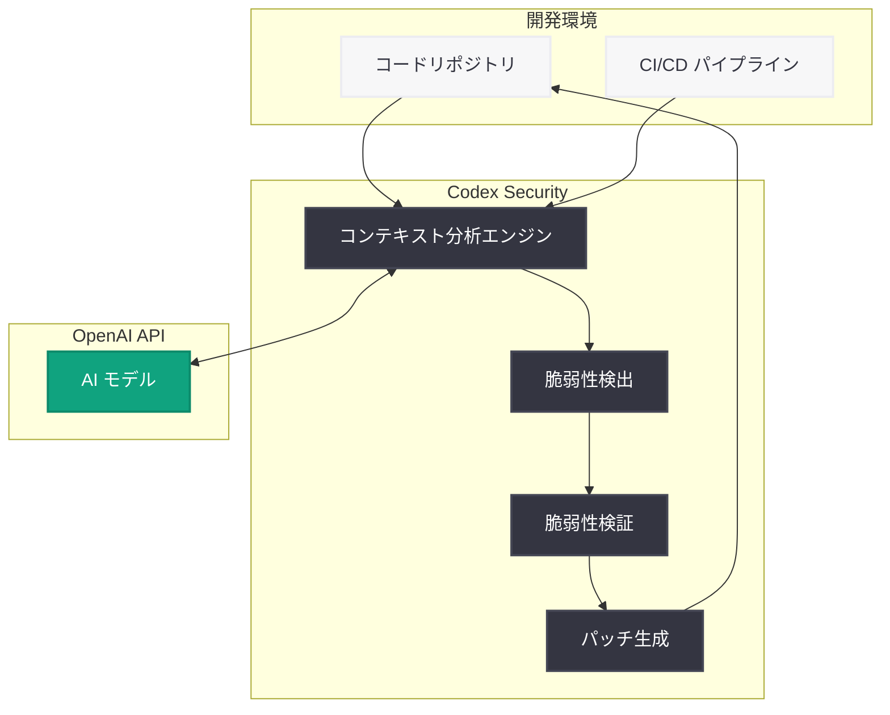

# Codex Security: リサーチプレビューとして公開

## メタデータ

| 項目 | 内容 |
|------|------|
| 発表日 | 2026-03-06 |
| ソース | OpenAI News/Blog |
| カテゴリ | Product |
| 公式リンク | [openai.com](https://openai.com/index/codex-security-now-in-research-preview) |

## 概要

OpenAI は 2026 年 3 月 6 日、AI を活用したアプリケーションセキュリティエージェント「Codex Security」をリサーチプレビューとして公開した。Codex Security は、プロジェクトのコンテキストを分析し、複雑な脆弱性を検出・検証・パッチ適用する能力を持つセキュリティ特化型の AI エージェントである。

従来の静的解析ツール (SAST) や動的解析ツール (DAST) と比較して、Codex Security はプロジェクト全体のコンテキストを深く理解することで、より高い精度での脆弱性検出を実現し、誤検知 (false positive) を大幅に削減する。単なる脆弱性の指摘にとどまらず、修正パッチの自動生成までを一貫して行う点が大きな特徴である。

## 主な内容

### コンテキスト認識型の脆弱性検出

Codex Security の最大の強みは、プロジェクト全体のコンテキストを理解した上でセキュリティ分析を行うことである。従来のツールではパターンマッチングに依存していたため、コードの意図や依存関係を十分に考慮できなかった。Codex Security は以下のアプローチで脆弱性を分析する。

- **プロジェクト構造の理解:** リポジトリ全体のコード構造、依存関係、設定ファイルを分析
- **データフロー追跡:** 入力から出力までのデータの流れを追跡し、潜在的な攻撃経路を特定
- **コンテキストベースの判断:** コードの使用目的や実行環境を考慮した脆弱性の深刻度評価

### 検出・検証・パッチの一貫したワークフロー

Codex Security は、セキュリティ対応のライフサイクル全体をカバーする 3 段階のワークフローを提供する。

1. **検出 (Detect):** AI がコードベース全体をスキャンし、SQL インジェクション、XSS、認証バイパスなどの脆弱性パターンを検出
2. **検証 (Validate):** 検出された脆弱性が実際に悪用可能かどうかをコンテキストに基づいて検証し、誤検知を排除
3. **パッチ (Patch):** 検証済みの脆弱性に対して、プロジェクトのコーディングスタイルや規約に準拠した修正パッチを自動生成

### 高い信頼性と低いノイズ

従来のセキュリティスキャンツールで課題となっていた大量の誤検知を、AI によるコンテキスト理解で大幅に削減する。これにより、開発チームは本当に対処が必要な脆弱性に集中できるようになる。

## 技術的な詳細

### 対応する脆弱性カテゴリ

Codex Security は、OWASP Top 10 をはじめとする主要な脆弱性カテゴリに対応していると考えられる。

- **インジェクション攻撃:** SQL インジェクション、コマンドインジェクション、LDAP インジェクション
- **認証・認可の不備:** 認証バイパス、権限昇格、セッション管理の脆弱性
- **クロスサイトスクリプティング (XSS):** Reflected XSS、Stored XSS、DOM-based XSS
- **安全でないデシリアライゼーション:** オブジェクトインジェクション、リモートコード実行
- **依存関係の脆弱性:** サードパーティライブラリの既知の脆弱性

### 利用イメージ

Codex Security は、既存の開発ワークフローに統合して利用することが想定されている。以下は一般的な利用パターンの例である。

```bash
# リポジトリ全体のセキュリティスキャン
codex-security scan --project ./my-app

# 特定のファイルやディレクトリを対象にスキャン
codex-security scan --path ./src/auth

# 検出された脆弱性に対するパッチの自動生成
codex-security patch --vuln-id VULN-2026-001
```

> **注:** 上記のコマンド例はリサーチプレビュー段階の想定であり、実際の CLI インターフェースは公式ドキュメントを参照してください。

## アーキテクチャ



## 開発者への影響

### セキュリティ対応の効率化

Codex Security の導入により、開発者はセキュリティレビューにかかる時間を大幅に削減できる可能性がある。特に以下の点で効率化が期待される。

- **誤検知対応の削減:** コンテキスト認識による高精度な検出で、誤検知の確認作業が減少
- **パッチ作成の自動化:** 修正コードの自動生成により、脆弱性対応のリードタイムを短縮
- **継続的なセキュリティ監視:** CI/CD パイプラインへの統合により、コード変更のたびにセキュリティチェックを自動実行

### セキュリティの民主化

専門のセキュリティエンジニアが不在の開発チームでも、AI エージェントの支援により高品質なセキュリティ対応が可能になる。これにより、セキュリティ対策の格差が縮小することが期待される。

### 注意点

- リサーチプレビュー段階であるため、本番環境での利用には慎重な評価が必要
- AI による自動パッチは必ず人間のレビューを経てから適用すべき
- 全ての脆弱性を検出できるわけではないため、他のセキュリティ対策との併用が推奨される

## 関連リンク

- [Codex Security 公式ページ](https://openai.com/index/codex-security-now-in-research-preview)
- [OpenAI Codex](https://openai.com/codex)
- [OWASP Top 10](https://owasp.org/www-project-top-ten/)

## まとめ

OpenAI が発表した Codex Security は、AI を活用してアプリケーションセキュリティの課題に取り組む新しいアプローチである。プロジェクト全体のコンテキストを理解した上で脆弱性を検出・検証・修正する一貫したワークフローにより、従来のツールと比較して高い精度と低いノイズを実現する。現在はリサーチプレビュー段階であるが、開発ワークフローへのセキュリティ統合を大きく前進させる可能性を持つ製品として注目される。今後の正式リリースに向けた機能拡充や対応範囲の拡大に期待したい。
