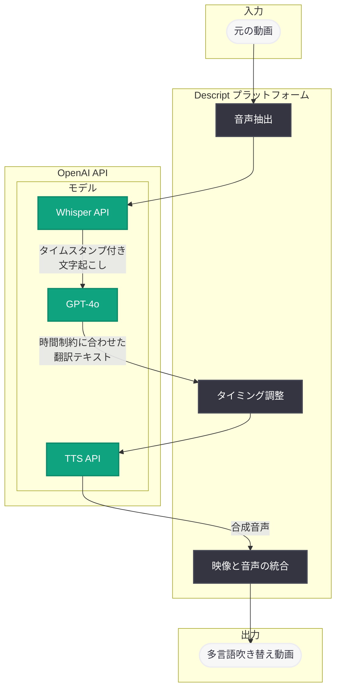

# Descript が OpenAI モデルを活用して多言語動画吹き替えを大規模に実現

## メタデータ

| 項目 | 内容 |
|------|------|
| 発表日 | 2026-03-06 |
| ソース | OpenAI News/Blog |
| カテゴリ | API |
| 公式リンク | [openai.com/index/descript](https://openai.com/index/descript) |

## 概要

動画編集プラットフォーム Descript が、OpenAI のモデルを活用して多言語動画吹き替え機能を大規模に展開している事例が公開された。Descript は翻訳の意味的な正確性とタイミングの最適化を両立させることで、吹き替え音声が各言語で自然に聞こえるソリューションを構築している。

この取り組みは、従来の動画吹き替えワークフローにおける高コスト・長期間という課題を、AI 技術で根本的に解決するアプローチである。OpenAI の言語モデルと音声モデルを組み合わせることで、コンテンツクリエイターが手軽に多言語対応の動画を制作できる環境を提供している。

## 主な内容

### Descript の多言語吹き替えアプローチ

Descript は動画編集ツールとして広く利用されているプラットフォームであり、テキストベースの動画編集という独自のアプローチで知られている。今回の多言語吹き替え機能では、OpenAI の API を活用して以下のパイプラインを構築している。

1. **音声認識と文字起こし**: 元の動画から音声をテキストに変換
2. **翻訳と最適化**: テキストをターゲット言語に翻訳し、発話タイミングに合わせて調整
3. **音声合成**: 翻訳されたテキストから自然な音声を生成

### 翻訳とタイミングの最適化

多言語吹き替えにおける最大の技術的課題は、翻訳されたテキストが元の発話と同じタイミングに収まるようにすることである。言語によって同じ意味を表現するために必要な音節数や発話時間が大きく異なるため、単純な翻訳では映像と音声のずれが発生する。

Descript は OpenAI のモデルを利用して、翻訳時に意味の正確性を保ちながらも、元の発話セグメントの時間枠に収まるよう文章の長さや表現を調整している。これにより、リップシンクや映像との同期が自然に保たれる。

### スケーラビリティの実現

OpenAI の API を基盤とすることで、Descript は以下のスケーラビリティを実現している。

- **多言語対応**: 複数の言語への同時吹き替えが可能
- **バッチ処理**: 大量の動画コンテンツを効率的に処理
- **一貫した品質**: モデルベースのアプローチにより、品質のばらつきを抑制

## 技術的な詳細

### 想定されるアーキテクチャと API 活用

Descript の多言語吹き替えパイプラインでは、OpenAI の複数の API エンドポイントを組み合わせて利用していると考えられる。

**翻訳と最適化 (Chat Completions API)**

翻訳とタイミング最適化には、GPT-4o などのモデルを使用して、コンテキストを考慮した翻訳と文長の調整を行う。

```python
from openai import OpenAI

client = OpenAI()

# 翻訳とタイミング最適化の例
response = client.chat.completions.create(
    model="gpt-4o",
    messages=[
        {
            "role": "system",
            "content": (
                "You are a professional video dubbing translator. "
                "Translate the following speech segment to the target language. "
                "The translation MUST fit within the specified duration. "
                "Optimize for natural speech while preserving meaning."
            )
        },
        {
            "role": "user",
            "content": (
                "Source language: English\n"
                "Target language: Japanese\n"
                "Original text: 'Welcome to our product demo. "
                "Today we'll show you three amazing features.'\n"
                "Duration constraint: 4.2 seconds\n"
                "Please provide a natural translation that fits "
                "within the time constraint."
            )
        }
    ]
)

translated_text = response.choices[0].message.content
print(translated_text)
```

**音声合成 (Text-to-Speech API)**

翻訳されたテキストから自然な音声を生成するために、OpenAI の TTS API を使用する。

```python
from openai import OpenAI

client = OpenAI()

# 翻訳済みテキストから音声を生成
response = client.audio.speech.create(
    model="tts-1-hd",
    voice="alloy",
    input="製品デモへようこそ。本日は 3 つの素晴らしい機能をご紹介します。",
    response_format="mp3",
    speed=1.0
)

response.stream_to_file("dubbed_segment_ja.mp3")
```

**音声認識 (Whisper API)**

元の動画からの文字起こしには Whisper API を使用する。

```python
from openai import OpenAI

client = OpenAI()

# 元の動画音声から文字起こし (タイムスタンプ付き)
with open("original_audio.mp3", "rb") as audio_file:
    transcript = client.audio.transcriptions.create(
        model="whisper-1",
        file=audio_file,
        response_format="verbose_json",
        timestamp_granularities=["segment"]
    )

for segment in transcript.segments:
    print(f"[{segment['start']:.1f}s - {segment['end']:.1f}s] {segment['text']}")
```

## アーキテクチャ



## 開発者への影響

### API 活用のベストプラクティス

Descript の事例は、OpenAI の複数の API を組み合わせて高度なワークフローを構築する優れた参考事例である。開発者が同様のシステムを構築する際に考慮すべき点は以下の通り。

- **パイプライン設計**: Whisper (音声認識) から GPT-4o (翻訳・最適化) 、TTS (音声合成) への一連のパイプラインを効率的に設計することが重要
- **タイミング制約の管理**: 動画吹き替えでは発話タイミングが重要であり、プロンプトエンジニアリングで文長制約を適切に指示する必要がある
- **バッチ処理の最適化**: 大量のセグメントを処理する場合、API の Rate Limit を考慮した非同期処理の実装が推奨される
- **品質管理**: 自動吹き替えの品質を担保するため、翻訳結果の検証ステップを組み込むことが望ましい

### 活用が期待される分野

- 教育コンテンツの多言語展開
- 企業の製品紹介動画のローカライゼーション
- YouTube やポッドキャストの多言語配信
- E ラーニングプラットフォームのグローバル展開

## 関連リンク

- [OpenAI 公式記事: How Descript enables multilingual video dubbing at scale](https://openai.com/index/descript)
- [OpenAI Text-to-Speech API ドキュメント](https://platform.openai.com/docs/guides/text-to-speech)
- [OpenAI Whisper API ドキュメント](https://platform.openai.com/docs/guides/speech-to-text)
- [OpenAI Chat Completions API ドキュメント](https://platform.openai.com/docs/guides/text-generation)
- [Descript 公式サイト](https://www.descript.com/)

## まとめ

Descript の多言語動画吹き替え機能は、OpenAI の Whisper、GPT-4o、TTS という 3 つの API を組み合わせることで、従来は高コストで時間のかかっていた動画ローカライゼーションを自動化・効率化した先進的な事例である。特に、翻訳の意味的正確性と発話タイミングの制約を同時に最適化するアプローチは、動画コンテンツのグローバル展開において大きな可能性を示している。

開発者にとっては、複数の OpenAI API を連携させたパイプライン構築の実践的な参考となり、同様のワークフローを自社プロダクトに応用する際の設計指針となるだろう。
