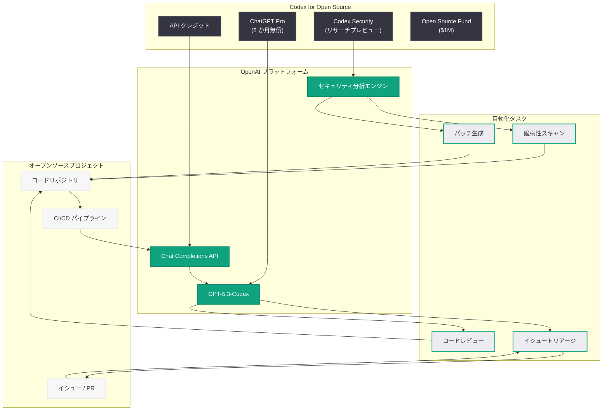

# Codex for Open Source: オープンソースメンテナー向け支援プログラムを発表

## メタデータ

| 項目 | 内容 |
|------|------|
| 発表日 | 2026-03-07 |
| ソース | OpenAI News/Blog |
| カテゴリ | Product |
| 公式リンク | [openai.com](https://openai.com/index/codex-for-open-source/) |

## 概要

OpenAI は 2026 年 3 月 7 日、オープンソースプロジェクトのコアメンテナーを支援する新プログラム「Codex for Open Source」を発表した。本プログラムは、100 万ドル規模の Codex Open Source Fund を基盤として、主要なオープンソースプロジェクトのメンテナーに対し、ChatGPT Pro の無償提供、API クレジット、および Codex Security へのアクセスを提供する。

オープンソースソフトウェアは現代のテクノロジーエコシステムの基盤であるにもかかわらず、メンテナーの多くは限られたリソースの中でプルリクエストの管理、イシュー対応、セキュリティ対策に追われている。本プログラムは、AI ツールによってメンテナーの負担を軽減し、オープンソースエコシステム全体の持続可能性を向上させることを目指している。

## 主な内容

### プログラムの提供内容

Codex for Open Source プログラムでは、対象となるメンテナーに以下の 4 つの主要な支援が提供される。

1. **ChatGPT Pro の 6 か月間無償提供:** Codex ツールを含む ChatGPT Pro プランへのフルアクセス。コード生成、コードレビュー、ドキュメント作成など、日常的な開発作業を AI で効率化できる
2. **API クレジットの無償提供:** CI/CD パイプライン、プルリクエストの自動レビュー、イシューのトリアージなど、自動化ワークフローに活用可能な API クレジット
3. **Codex Security へのアクセス (リサーチプレビュー):** AI を活用した高精度なコードセキュリティスキャン機能。従来の SAST/DAST ツールと比較して誤検知を大幅に削減
4. **Codex Open Source Fund (100 万ドル) との連携:** プログラムは既存の 100 万ドル規模のオープンソース支援基金を拡張する形で展開

### 対象プロジェクトの要件

本プログラムは、以下の条件を満たすオープンソースプロジェクトのメンテナーが対象となる。

- **公開リポジトリ:** アクティブに開発が行われている公開のオープンソースプロジェクト
- **実質的な利用実績:** 意味のある利用実績とエコシステムへの影響力を持つプロジェクト
- **多様な規模:** 大規模プロジェクトに限らず、多様な規模や影響力のプロジェクトが歓迎される

申請は [Codex Open Source Fund 申請フォーム](https://openai.com/form/codex-open-source-fund/) から行える。

### メンテナーへの具体的なメリット

本プログラムは、オープンソースメンテナーが日常的に直面する以下の課題の解決を支援する。

- **プルリクエスト管理:** Codex による自動コードレビューで、大量のプルリクエストを効率的に処理
- **イシュー対応:** AI によるイシューのトリアージと分類で、優先度の高い問題に集中
- **セキュリティ対策:** Codex Security による脆弱性の自動検出とパッチ提案で、セキュリティ負担を軽減
- **バーンアウトの防止:** ルーティン作業の自動化により、メンテナーの負担を軽減しプロジェクトの持続可能性を向上

## 技術的な詳細

### 関連テクノロジー

本プログラムは以下の技術基盤を活用している。

- **GPT-5.3-Codex モデル:** インタラクティブなマルチエージェントワークフローに対応したコード特化モデル
- **Codex Security:** 高い信頼性でのセキュリティスキャンを実現するリサーチプレビュー機能。従来の SAST/DAST と比較して誤検知を大幅に削減
- **Codex API:** CI/CD パイプラインやワークフロー自動化に統合可能な API

### コードサンプル

以下は、Codex API を活用してプルリクエストの自動レビューを行うワークフローの例である。

```python
from openai import OpenAI

client = OpenAI()

# プルリクエストの差分を Codex でレビュー
def review_pull_request(diff_content: str, project_context: str) -> str:
    """プルリクエストの差分を AI でレビューし、フィードバックを生成する"""
    response = client.chat.completions.create(
        model="gpt-5.3-codex",
        messages=[
            {
                "role": "system",
                "content": (
                    "あなたはオープンソースプロジェクトのコードレビューアーです。"
                    "コードの品質、セキュリティ、パフォーマンスの観点から "
                    "建設的なフィードバックを提供してください。"
                ),
            },
            {
                "role": "user",
                "content": f"## プロジェクトコンテキスト\n{project_context}\n\n"
                f"## プルリクエストの差分\n```diff\n{diff_content}\n```\n\n"
                "このプルリクエストをレビューしてください。",
            },
        ],
    )
    return response.choices[0].message.content


# イシューのトリアージを自動化
def triage_issue(issue_title: str, issue_body: str, labels: list[str]) -> dict:
    """イシューを分析し、優先度とカテゴリを自動分類する"""
    response = client.chat.completions.create(
        model="gpt-5.3-codex",
        messages=[
            {
                "role": "system",
                "content": (
                    "あなたはオープンソースプロジェクトのイシュートリアージ担当です。"
                    "イシューの内容を分析し、優先度とカテゴリを判定してください。"
                    "JSON 形式で回答してください。"
                ),
            },
            {
                "role": "user",
                "content": f"タイトル: {issue_title}\n\n"
                f"本文: {issue_body}\n\n"
                f"既存ラベル: {', '.join(labels)}",
            },
        ],
        response_format={"type": "json_object"},
    )
    import json

    return json.loads(response.choices[0].message.content)
```

以下は、GitHub Actions で Codex を活用した CI/CD 統合の例である。

```yaml
# .github/workflows/codex-review.yml
name: Codex PR Review

on:
  pull_request:
    types: [opened, synchronize]

jobs:
  codex-review:
    runs-on: ubuntu-latest
    steps:
      - uses: actions/checkout@v4
        with:
          fetch-depth: 0

      - name: Get PR diff
        id: diff
        run: |
          git diff origin/main...HEAD > pr_diff.txt

      - name: Run Codex Review
        env:
          OPENAI_API_KEY: ${{ secrets.OPENAI_API_KEY }}
        run: |
          python scripts/codex_review.py \
            --diff pr_diff.txt \
            --output review_comments.json

      - name: Post Review Comments
        uses: actions/github-script@v7
        with:
          script: |
            const comments = require('./review_comments.json');
            for (const comment of comments) {
              await github.rest.pulls.createReviewComment({
                owner: context.repo.owner,
                repo: context.repo.repo,
                pull_number: context.issue.number,
                body: comment.body,
                path: comment.path,
                line: comment.line,
              });
            }
```

> **注:** 上記のコード例は API の利用イメージを示すものであり、実際のモデル名やパラメータは公式ドキュメントを参照してください。

## アーキテクチャ



## 開発者への影響

### オープンソースメンテナーの負担軽減

本プログラムにより、オープンソースメンテナーは AI ツールを活用して日常的な管理作業を効率化できる。特に以下の点で大きな影響が期待される。

- **コードレビューの効率化:** Codex による自動レビューで、プルリクエストの初回レビュー時間を短縮し、メンテナーは高レベルの設計判断に集中できる
- **セキュリティ対応の強化:** Codex Security により、専門のセキュリティチームを持たないプロジェクトでも高精度な脆弱性検出が可能に
- **プロジェクトの持続可能性向上:** ルーティン作業の自動化により、メンテナーのバーンアウトリスクを低減

### エコシステムへの波及効果

vLLM や Next.js などの主要プロジェクトが恩恵を受けることで、それらに依存する下流のプロジェクトやアプリケーション全体のセキュリティと品質が向上する可能性がある。

### 懸念事項

- **選定基準への懸念:** 一部では、大規模プロジェクトが優先される可能性が指摘されている。OpenAI は多様な規模のプロジェクトを歓迎するとしているが、実際の選定プロセスの透明性が求められる
- **ベンダーロックインのリスク:** OpenAI のツールへの依存度が高まることで、将来的な移行コストが発生する可能性がある
- **リサーチプレビューの制約:** Codex Security はリサーチプレビュー段階であり、本番環境での利用には十分な評価が必要

## 関連リンク

- [Codex for Open Source 公式ページ](https://openai.com/index/codex-for-open-source/)
- [Codex Open Source Fund 申請フォーム](https://openai.com/form/codex-open-source-fund/)
- [Codex Security リサーチプレビュー](https://openai.com/index/codex-security-now-in-research-preview)
- [OpenAI Codex](https://openai.com/codex)
- [OpenAI API リファレンス](https://platform.openai.com/docs/api-reference)

## まとめ

OpenAI が発表した「Codex for Open Source」は、オープンソースエコシステムの持続可能性を AI で支援する包括的なプログラムである。ChatGPT Pro の無償提供、API クレジット、Codex Security へのアクセスという 3 つの柱により、メンテナーはコードレビュー、イシュー管理、セキュリティ対応を効率化できる。100 万ドルの Codex Open Source Fund を基盤とした本プログラムは、vLLM や Next.js をはじめとする主要プロジェクトへの支援を通じて、オープンソースエコシステム全体の品質とセキュリティの向上に貢献することが期待される。申請は [公式フォーム](https://openai.com/form/codex-open-source-fund/) から受け付けている。
