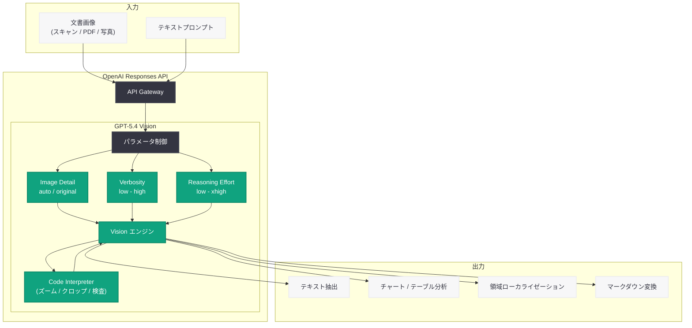

# GPT-5.4 Vision and Document Understanding Cookbook: マルチモーダル文書理解の実践ガイド

## メタデータ

| 項目 | 内容 |
|------|------|
| 発表日 | 2026-03-07 |
| ソース | OpenAI Cookbook (GitHub) |
| カテゴリ | Developer Guide |
| 公式リンク | [openai-cookbook (GitHub)](https://github.com/openai/openai-cookbook/blob/main/examples/multimodal/document_and_multimodal_understanding_tips.ipynb) |
| PR | [#2496](https://github.com/openai/openai-cookbook/pull/2496) |

## 概要

OpenAI は 2026 年 3 月 7 日、GPT-5.4 のマルチモーダル機能を活用した文書理解に関する包括的な Cookbook ガイド「Getting the Most out of GPT-5.4 for Vision and Document Understanding」を公開した。このガイドは、開発者が GPT-5.4 の Vision 機能を最大限に活用するための実践的なテクニックとパラメータ設定を解説している。

GPT-5.4 は実世界のマルチモーダルワークロードにおける大きな前進であり、従来は OCR、レイアウト検出、カスタムパーサーを組み合わせて処理していた文書を、単一のモデルパスで解釈できるようになった。この Cookbook では、画像詳細度、出力冗長性、推論努力量、ツール使用という 4 つの主要パラメータの最適な設定方法を詳しく解説している。

## 主な内容

### 画像詳細度 (Image Detail)

`input_image.detail` パラメータにより、モデルが画像をどの程度の解像度で処理するかを制御できる。

- **`"auto"`:** 大半のページに適したデフォルト設定。モデルが自動的に最適な解像度を選択する
- **`"original"`:** テキストが非常に小さい場合、手書き文書、低品質スキャンなど、細かな視覚的信号の保持が必要な場合に使用する

### 出力冗長性 (Verbosity)

`text={"verbosity": ...}` パラメータにより、テキスト出力の圧縮度と忠実度を制御する。

- 冗長性を高く設定することで、レイアウトを維持した忠実な転写が可能になる
- パラフレーズ (言い換え) を最小限に抑え、原文に近い出力を得たい場合に有効
- 文書の正確なマークダウン変換など、リテラルな転写が求められるユースケースに最適

### 推論努力量 (Reasoning Effort)

`reasoning={"effort": ...}` パラメータにより、マルチステップの視覚的推論に割り当てる計算リソースを制御する。

- **`low`:** 単純な文書 QA など、基本的なタスク向け
- **`medium`:** 標準的な文書処理タスク向け
- **`high`:** チャート、テーブル、フォームの QA など、複雑な視覚的推論が必要なタスク向け
- **`xhigh`:** 最も複雑なマルチステップ推論タスク向け

### ツール使用 (Tool Use)

`tools=[...]` パラメータにより、モデルが回答前に Code Interpreter を使用して画像のズーム、クロップ、検査を行うことを許可できる。

- **Code Interpreter 有効化:** マルチパスの視覚的検査が必要なシナリオ (ズーム / クロップ / 回転) に最適
- **ツール省略:** 単一パスで十分な回答が得られる場合は、ツールを省略してレイテンシを削減

## 技術的な詳細

### Responses API の使用

GPT-5.4 Vision は Responses API (`client.responses.create(...)`) を通じて利用する。以下は基本的な文書理解の API 呼び出し例である。

### コードサンプル

```python
from openai import OpenAI

client = OpenAI()

# 基本的な文書理解: 請求書から合計金額を抽出
response = client.responses.create(
    model="gpt-5.4",
    input=[
        {
            "role": "user",
            "content": [
                {"type": "input_text", "text": "Extract the total amount due."},
                {
                    "type": "input_image",
                    "image_url": "data:image/png;base64,...",
                    "detail": "auto",
                },
            ],
        }
    ],
)

print(response.output_text)
```

### 高冗長性による忠実な転写の例

```python
from openai import OpenAI

client = OpenAI()

# 手書き文書の忠実な転写
response = client.responses.create(
    model="gpt-5.4",
    input=[
        {
            "role": "user",
            "content": [
                {"type": "input_text", "text": "Transcribe this handwritten document."},
                {
                    "type": "input_image",
                    "image_url": "data:image/png;base64,...",
                    "detail": "original",
                },
            ],
        }
    ],
    text={"verbosity": "high"},
)

print(response.output_text)
```

### 高推論努力量によるチャート分析の例

```python
from openai import OpenAI

client = OpenAI()

# チャートの詳細分析
response = client.responses.create(
    model="gpt-5.4",
    input=[
        {
            "role": "user",
            "content": [
                {"type": "input_text", "text": "Analyze the trends shown in this chart."},
                {
                    "type": "input_image",
                    "image_url": "data:image/png;base64,...",
                    "detail": "auto",
                },
            ],
        }
    ],
    reasoning={"effort": "high"},
)

print(response.output_text)
```

### タスク別推奨設定ガイド

| タスク | 推奨設定 | 理由 |
|--------|----------|------|
| 一般的な文書 QA | `detail="auto"` | 最も低摩擦なデフォルト設定 |
| 高密度スキャン、手書き | `detail="original"` | 微細な視覚信号を保持 |
| リテラルな転写 | `text={"verbosity": "high"}` | レイアウト維持、パラフレーズ抑制 |
| 領域ローカライゼーション | 0..999 グリッドで [x_min, y_min, x_max, y_max] を指示 | デバッグと後続処理が容易 |
| チャート / テーブル / フォーム QA | `reasoning={"effort": "high"}` または `"xhigh"` | マルチステップの視覚的推論を改善 |
| マルチパス視覚検査 | Code Interpreter を追加 | ズーム / クロップ / 回転シナリオに最適 |

## アーキテクチャ



## 開発者への影響

### 文書処理パイプラインの大幅な簡素化

GPT-5.4 Vision により、従来の OCR + レイアウト検出 + カスタムパーサーという複雑なパイプラインを、単一の API 呼び出しに置き換えることが可能になった。

- **インフラの簡素化:** 複数のモデルやサービスの統合が不要になり、運用コストが削減される
- **精度の向上:** エンドツーエンドのマルチモーダル理解により、パイプライン間のエラー伝播が解消される
- **開発速度の向上:** パラメータ調整のみで多様なユースケースに対応でき、カスタムモデルの学習が不要になる

### 新しいユースケースの実現

- **手書きフォームのデジタル化:** `detail="original"` と高冗長性の組み合わせで、手書き文字の正確な転写が可能
- **エンジニアリング図面の解析:** 推論努力量を `high` 以上に設定することで、複雑な技術図面の理解が向上
- **チャート重視レポートの自動分析:** マルチステップの視覚的推論により、グラフやテーブルからのデータ抽出が高精度化

### 移行時の考慮事項

- Responses API (`client.responses.create`) を使用するため、従来の Chat Completions API からの移行が必要な場合がある
- `detail`、`verbosity`、`reasoning effort` の 3 つのパラメータの適切な組み合わせを、ユースケースごとにテストすることが推奨される
- Code Interpreter の使用はレイテンシとコストが増加するため、必要な場合にのみ有効化すべきである

## 関連リンク

- [GPT-5.4 Vision Cookbook (GitHub)](https://github.com/openai/openai-cookbook/blob/main/examples/multimodal/document_and_multimodal_understanding_tips.ipynb)
- [Cookbook PR #2496](https://github.com/openai/openai-cookbook/pull/2496)
- [OpenAI Cookbook リポジトリ](https://github.com/openai/openai-cookbook)
- [OpenAI API ドキュメント](https://platform.openai.com/docs)
- [GPT-5.4 公式発表ページ](https://openai.com/index/introducing-gpt-5-4)

## まとめ

OpenAI が公開した GPT-5.4 Vision and Document Understanding Cookbook は、マルチモーダル文書理解における実践的なベストプラクティスを体系的にまとめた開発者向けガイドである。画像詳細度 (`detail`)、出力冗長性 (`verbosity`)、推論努力量 (`reasoning effort`)、ツール使用 (`tools`) という 4 つの主要パラメータを適切に組み合わせることで、一般的な文書 QA から手書きフォームの転写、チャート分析まで、幅広いユースケースに対応できる。従来 OCR やレイアウト検出などの複数のコンポーネントを組み合わせる必要があった文書処理を、単一のモデルパスで実現できるようになった点は、開発者にとって大きなメリットである。タスク別推奨設定ガイドを参考に、各ユースケースに最適なパラメータ設定を見つけることが推奨される。
