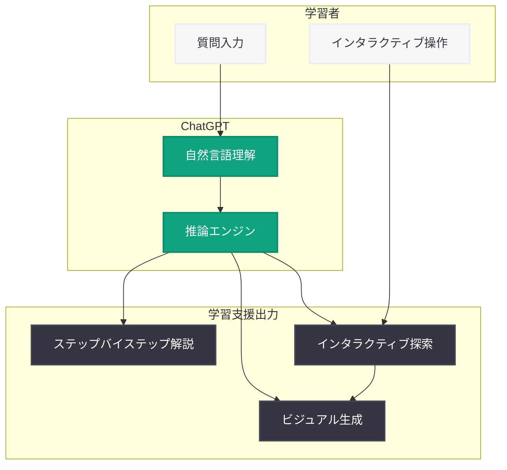

# ChatGPT に数学・科学のインタラクティブ学習機能が追加

## メタデータ

| 項目 | 内容 |
|------|------|
| 発表日 | 2026-03-10 |
| ソース | OpenAI News/Blog |
| カテゴリ | Product |
| 公式リンク | [openai.com/index/new-ways-to-learn-math-and-science-in-chatgpt](https://openai.com/index/new-ways-to-learn-math-and-science-in-chatgpt) |

## 概要

OpenAI は 2026 年 3 月 10 日、ChatGPT に数学と科学のインタラクティブなビジュアル説明機能を追加したことを発表した。この新機能により、学生は数式、変数、科学的概念をリアルタイムで視覚的に探索できるようになり、従来のテキストベースの回答を超えた直感的な学習体験が提供される。

本アップデートは、OpenAI の教育分野への継続的な取り組みの一環である。2026 年 3 月 4 日の AI 学習成果測定フレームワークの発表、3 月 5 日の AI 教育機会に関する記事に続くもので、OpenAI が教育における AI 活用を重要な戦略領域として位置づけていることを示している。

## 主な内容

### インタラクティブなビジュアル説明

ChatGPT の新機能では、数学や科学の質問に対して、静的なテキスト回答ではなくインタラクティブなビジュアル要素を含む説明が生成される。

- **リアルタイムの視覚化:** 数式やグラフをリアルタイムで描画し、変数の変化に応じた動的な表示が可能
- **操作可能なインターフェース:** 学習者が変数やパラメータを調整しながら、結果の変化を即座に確認できる
- **段階的な理解の促進:** 複雑な概念を視覚的に分解し、段階的に理解を深められる構成

### 数学学習支援

数学分野では、以下の学習支援機能が提供される。

- **公式の可視化:** 数学的な公式を視覚的に表現し、各要素の関係性を明確に示す
- **ステップバイステップの解説:** 問題の解法を段階的に表示し、各ステップの根拠を視覚的に説明
- **変数の探索:** 変数の値を変更した際の影響をリアルタイムで確認できるインタラクティブな環境

### 科学学習支援

科学分野においても、概念の理解を深めるための機能が充実している。

- **科学的概念の可視化:** 物理法則、化学反応、生物学的プロセスなどをビジュアルで表現
- **インタラクティブな探索:** パラメータを変更しながら科学的現象のシミュレーションを体験
- **概念間の関連付け:** 関連する科学的概念を視覚的にマッピングし、体系的な理解を支援

### 教育への影響

この機能追加は、AI を活用した教育のあり方に大きな影響を与える可能性がある。

- **個別最適化学習:** 学習者が自分のペースで変数を操作し、理解度に応じた探索が可能
- **アクセシビリティの向上:** 視覚的な説明により、テキストだけでは理解が難しい概念へのアクセスが改善
- **教員の授業支援:** 教員が授業中にリアルタイムでビジュアル教材として活用できる可能性

## 技術的な詳細

### ビジュアル生成の技術基盤

インタラクティブなビジュアル説明機能は、以下の技術要素を組み合わせて実現されていると考えられる。

- **動的レンダリング:** 数式やグラフをリアルタイムで描画するレンダリングエンジン
- **自然言語理解:** 学習者の質問から数学的・科学的な意図を正確に抽出する言語処理
- **コード生成:** ビジュアル表現のためのコード (グラフ描画、シミュレーションなど) を自動生成する機能

### ChatGPT との統合

本機能は ChatGPT の対話インターフェースにシームレスに統合されており、学習者は通常の会話形式で質問するだけでビジュアル説明を受け取ることができる。特別なコマンドや設定は不要であり、ChatGPT が質問の内容に応じて自動的にビジュアル要素を生成する。

## アーキテクチャ

## 開発者への影響

### 教育アプリケーション開発への示唆

ChatGPT のインタラクティブ学習機能は、教育分野のアプリケーション開発者に以下の影響を与える。

- **API 連携の可能性:** 今後 OpenAI API を通じてビジュアル生成機能が提供される場合、EdTech アプリケーションに高品質な学習コンテンツを組み込むことが可能になる
- **UX 設計の参考:** インタラクティブな学習体験のデザインパターンとして、開発者が自社製品の UX 改善に活用できる
- **コンテンツ生成の自動化:** AI による動的な教育コンテンツ生成は、教材制作のコストと時間を大幅に削減する可能性がある

### 競合環境への影響

- **EdTech 市場の変化:** ChatGPT が教育ツールとしての機能を強化することで、既存の教育アプリケーション (Khan Academy、Wolfram Alpha など) との競争が激化する可能性がある
- **差別化の必要性:** 教育分野の開発者は、AI ネイティブな学習体験との差別化戦略を検討する必要がある

## 関連リンク

- [OpenAI 公式発表](https://openai.com/index/new-ways-to-learn-math-and-science-in-chatgpt)
- [AI と学習成果の理解 (2026-03-04)](https://openai.com/index/understanding-ai-and-learning-outcomes)
- [AI 教育機会 (2026-03-05)](https://openai.com/index/ai-education-opportunity)
- [OpenAI for Education](https://openai.com/education)
- [ChatGPT](https://chat.openai.com)

## まとめ

ChatGPT に追加された数学・科学のインタラクティブ学習機能は、AI を活用した教育体験を大きく前進させるアップデートである。数式の可視化、ステップバイステップの解説、インタラクティブな探索という 3 つの柱により、学習者は従来のテキストベースの回答では得られなかった直感的な理解を深めることが可能になる。OpenAI が 2026 年 3 月に相次いで教育関連の発表を行っていることからも、教育分野が同社の重要な注力領域であることは明らかである。今後、API を通じた開発者向けの機能提供や、さらなる教科への拡張が期待される。
