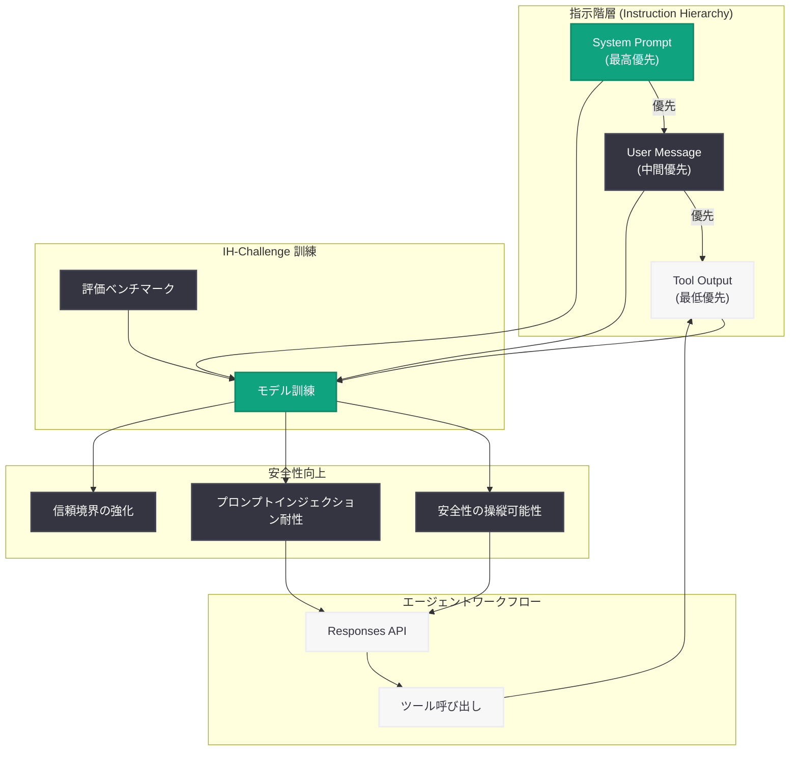

# フロンティア LLM における指示階層の改善

## メタデータ

| 項目 | 内容 |
|------|------|
| 発表日 | 2026-03-10 |
| ソース | OpenAI Research |
| カテゴリ | Research |
| 公式リンク | [openai.com](https://openai.com/index/instruction-hierarchy-challenge) |

## 概要

OpenAI は 2026 年 3 月 10 日、フロンティア LLM (最先端の大規模言語モデル) における指示階層 (Instruction Hierarchy) の改善に関する研究成果「IH-Challenge」を発表した。本研究では、モデルが信頼された指示を優先するよう訓練するためのベンチマークと手法を導入し、指示階層の正確な理解、安全性の操縦可能性 (Safety Steerability)、およびプロンプトインジェクション攻撃への耐性を向上させている。

この研究は、エージェント AI の安全性向上に直接貢献する重要な成果である。Responses API やツール使用が普及する中、外部からの入力が増加するエージェントワークフローにおいて、指示の優先順位を正しく処理することは安全性設計の基盤となる。

## 主な内容

### IH-Challenge の概要

IH-Challenge は、LLM が指示階層を正しく理解し遵守できるかを評価・訓練するためのベンチマークおよび手法である。従来の LLM は、すべての入力テキストを同等に扱う傾向があり、悪意ある指示が含まれたツール出力やユーザーメッセージによって、システムプロンプトで設定された制約が上書きされるリスクがあった。IH-Challenge は、この問題を体系的に評価し、モデルの訓練を通じて改善することを目指している。

### 指示階層の仕組み

指示階層とは、LLM が受け取る複数の指示源に対して適切な優先順位を付ける仕組みである。本研究で定義される指示階層は以下の通りである。

1. **システムプロンプト (最高優先):** アプリケーション開発者が設定する信頼された指示。モデルの動作範囲や制約を定義する
2. **ユーザーメッセージ (中間優先):** エンドユーザーからの入力。システムプロンプトの制約内で処理される
3. **ツール出力 (最低優先):** API 呼び出しや外部データソースからの応答。最も信頼度が低く、他の指示を上書きしてはならない

この階層構造により、下位の指示源に含まれる悪意ある内容がモデルの動作を不正に変更することを防止する。

### 安全性の操縦可能性の向上

IH-Challenge による訓練を受けたモデルは、安全性の操縦可能性が大幅に向上する。これは、開発者がシステムプロンプトを通じてモデルの安全性設定を柔軟かつ確実にコントロールできることを意味する。

- **信頼境界の明確化:** システムプロンプトによる制約が、ユーザー入力やツール出力によって無効化されにくくなる
- **カスタム安全ポリシーの遵守:** 開発者が設定した独自の安全ポリシーをモデルが一貫して遵守する
- **動的な制約管理:** アプリケーションの要件に応じて安全性設定を変更した場合、モデルが適切に追従する

### プロンプトインジェクション攻撃への耐性

プロンプトインジェクションとは、ユーザー入力やツール出力に悪意ある指示を埋め込むことで、モデルの動作を不正に操作する攻撃手法である。IH-Challenge は、この攻撃への耐性を以下の方法で強化する。

- **間接的プロンプトインジェクションの検出:** ツール出力や外部データに含まれる不正な指示を識別し、優先度の低い指示として適切に処理する
- **指示の出所の識別:** モデルが各指示の出所 (システム、ユーザー、ツール) を正確に認識し、優先順位に基づいて処理する
- **攻撃パターンへの頑健性:** 様々なプロンプトインジェクション手法に対して、一貫した防御能力を発揮する

## 技術的な詳細

### IH-Challenge ベンチマークの構成

IH-Challenge ベンチマークは、指示階層の遵守能力を多角的に評価するための評価セットで構成されると考えられる。主な評価観点は以下の通りである。

- **指示の競合解決:** システムプロンプトとユーザーメッセージが矛盾する場合に、モデルがシステムプロンプトを優先するかを検証
- **間接インジェクション耐性:** ツール出力に埋め込まれた不正な指示に対するモデルの応答を評価
- **安全性の維持:** 外部からの指示によってモデルの安全性ガードレールが解除されないかを検証

### エージェントワークフローにおける適用

エージェント AI のワークフローでは、モデルが複数のツールを呼び出し、外部データを処理する。この過程で指示階層が正しく機能することは極めて重要である。

```
[System Prompt] 開発者が定義した制約・安全ポリシー
       ↓ (最高優先)
[User Message] ユーザーからのリクエスト
       ↓ (中間優先)
[Tool Output]  Web 検索結果、API 応答、ファイル内容
       ↓ (最低優先)
[Model Response] 階層に基づいた適切な応答
```

Responses API を利用するエージェントでは、ツール出力が動的に変化するため、指示階層の遵守がセキュリティの要となる。

## アーキテクチャ



## 開発者への影響

### エージェント開発における安全性設計

本研究の成果は、エージェント AI アプリケーションの安全性設計に直接的な影響を与える。

- **システムプロンプトの重要性の再確認:** 指示階層において最高優先度を持つシステムプロンプトの設計が、アプリケーション全体の安全性を左右する
- **ツール出力の信頼度管理:** 外部 API やデータソースからの出力を処理する際、その内容がモデルの動作を不正に変更しないよう、指示階層に基づいた処理が保証される
- **防御的プロンプト設計の推進:** プロンプトインジェクション攻撃を想定した防御的なプロンプト設計がより効果的になる

### Responses API 利用時の考慮事項

- Responses API を使用するエージェントでは、ツール出力が頻繁にモデルのコンテキストに追加されるため、指示階層の改善による恩恵が大きい
- マルチステップのエージェントワークフローにおいて、各ステップで指示階層が維持されることで、攻撃面 (attack surface) の縮小が期待できる

### 安全性テストへの活用

- IH-Challenge のアプローチを参考に、自社アプリケーションにおける指示階層の遵守をテストする仕組みの構築が推奨される
- レッドチーミングの一環として、プロンプトインジェクション攻撃に対するモデルの耐性を定期的に検証すべきである

## 関連リンク

- [OpenAI 公式発表](https://openai.com/index/instruction-hierarchy-challenge)
- [OpenAI Safety Research](https://openai.com/safety)
- [OpenAI Responses API ドキュメント](https://platform.openai.com/docs/api-reference)
- [OpenAI News](https://openai.com/news)

## まとめ

OpenAI が発表した IH-Challenge は、フロンティア LLM における指示階層の改善を目指す重要な研究成果である。システムプロンプト、ユーザーメッセージ、ツール出力という三層の指示源に対して適切な優先順位を付けることで、モデルの安全性の操縦可能性とプロンプトインジェクション攻撃への耐性が向上する。特にエージェント AI が普及する現在、外部入力が増加するワークフローにおいて指示階層を正しく処理する能力は、安全なアプリケーション構築の基盤となる。開発者は、本研究の成果を踏まえ、システムプロンプトの設計やツール出力の取り扱いに関する安全性設計を見直すことが推奨される。
