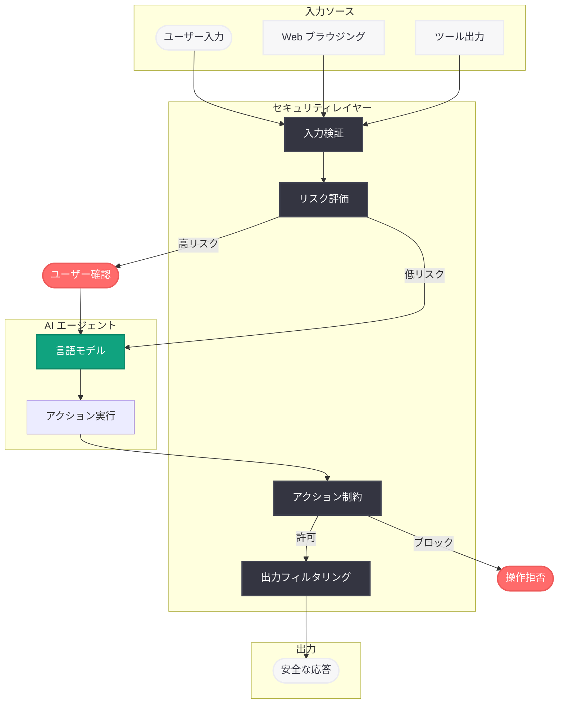

# AI エージェントのプロンプトインジェクション耐性設計

## メタデータ

| 項目 | 内容 |
|------|------|
| 発表日 | 2026-03-11 |
| ソース | OpenAI Blog |
| カテゴリ | Security |
| 公式リンク | [openai.com](https://openai.com/index/designing-agents-to-resist-prompt-injection) |

## 概要

OpenAI は 2026 年 3 月 11 日、AI エージェントをプロンプトインジェクション攻撃から防御するための設計手法に関する技術記事を公開した。この記事では、ChatGPT がプロンプトインジェクションやソーシャルエンジニアリングに対してどのように防御しているか、リスクのあるアクションをどのように制約しているか、そしてエージェントワークフローにおける機密データの保護方法について詳述されている。

AI エージェントが Responses API、ツール使用、Computer Use などを通じて外部環境と直接やり取りする機会が増加する中、セキュリティ設計の重要性はこれまで以上に高まっている。本記事は、開発者がセキュアなエージェントシステムを構築するための指針を提供するものである。

## 主な内容

### プロンプトインジェクション対策

プロンプトインジェクションとは、悪意のある指示を入力に埋め込むことで、AI エージェントの動作を意図しない方向に誘導する攻撃手法である。OpenAI は以下の多層的な防御アプローチを採用している。

- **入力検証の強化:** エージェントが受け取る全ての入力 (ユーザーメッセージ、Web ページのコンテンツ、ツールの出力など) に対して、悪意のある指示が含まれていないかを検証する仕組みを実装
- **権限の分離:** システムプロンプト (開発者の指示) とユーザー入力を明確に分離し、外部からの入力がシステムレベルの権限を取得できないよう設計
- **コンテキスト境界の明確化:** エージェントが参照するデータソースごとに信頼レベルを設定し、信頼度の低いソースからの指示に対しては制約を適用

### ソーシャルエンジニアリング対策

ソーシャルエンジニアリングは、人間の心理的な弱点を利用して AI エージェントを操作しようとする攻撃手法である。ChatGPT では以下の対策が実装されている。

- **意図の検証:** ユーザーの要求が通常のパターンから逸脱している場合、エージェントが追加の確認を求めるよう設計
- **段階的な権限昇格の防止:** 小さな許可を積み重ねて最終的に大きな権限を取得する攻撃パターンを検出し、ブロック
- **操作の透明性:** エージェントが実行するアクションをユーザーに明示し、暗黙的な操作を防止

### 機密データの保護

エージェントワークフローにおいて、機密データが意図せず漏洩するリスクに対して、以下の保護機構が導入されている。

- **データフロー制御:** エージェントが取得した機密情報 (API キー、個人情報など) が外部サービスに送信されないよう制御
- **最小権限の原則:** エージェントがタスクの遂行に必要な最小限のデータのみにアクセスできるよう設計
- **出力フィルタリング:** エージェントの応答に機密情報が含まれていないかを確認するフィルタリング機構を実装

## 技術的な詳細

### エージェントセキュリティの多層防御モデル

OpenAI のエージェントセキュリティは、以下の 4 つのレイヤーで構成される多層防御モデルに基づいている。

1. **入力検証レイヤー:** 全ての入力ソースに対するサニタイズと悪意のあるパターンの検出
2. **リスク評価レイヤー:** 要求されたアクションのリスクレベルを動的に評価し、高リスクなアクションにはユーザー確認を要求
3. **アクション制約レイヤー:** エージェントが実行可能なアクションの範囲を事前に定義し、許可されていない操作をブロック
4. **出力フィルタリングレイヤー:** エージェントの応答から機密情報を除去し、安全な出力のみを返却

### ツール呼び出し時のセキュリティ

エージェントが外部ツールを呼び出す際のセキュリティ設計として、以下の仕組みが考慮されている。

- **ツール呼び出しの承認フロー:** 高リスクなツール操作 (ファイル削除、メール送信など) に対しては、ユーザーの明示的な承認を要求
- **サンドボックス実行:** ツールの実行環境を隔離し、エージェントのコアシステムへの影響を防止
- **監査ログ:** 全てのツール呼び出しとその結果を記録し、事後分析を可能にする

## アーキテクチャ

## 開発者への影響

### エージェント開発におけるセキュリティ意識の向上

OpenAI の Responses API やツール使用機能を活用してエージェントを構築する開発者は、プロンプトインジェクションに対する防御を設計段階から組み込む必要がある。

- **システムプロンプトの堅牢化:** 開発者はシステムプロンプトにおいて、エージェントの動作範囲を明確に定義し、外部入力による上書きを防ぐ設計が求められる
- **ツール呼び出しの権限設計:** エージェントに付与するツールの権限を最小限にし、破壊的な操作には承認フローを組み込むことが推奨される
- **テストと監査の強化:** プロンプトインジェクションに対する自動テストをパイプラインに組み込み、定期的なセキュリティ監査を実施すべきである

### API 利用者への推奨事項

- Responses API を使用する際は、信頼できない入力と信頼できる指示を明確に分離する
- エージェントが外部データを取得する際は、取得したコンテンツに含まれる可能性のある悪意ある指示に対する防御を実装する
- 機密データを扱うエージェントでは、データの流れを追跡し、意図しない外部送信を防止する仕組みを導入する

## 関連リンク

- [Designing AI agents to resist prompt injection](https://openai.com/index/designing-agents-to-resist-prompt-injection)
- [OpenAI Responses API ドキュメント](https://platform.openai.com/docs/api-reference/responses)
- [OpenAI Agent SDK](https://github.com/openai/openai-agents-python)
- [OpenAI セキュリティガイド](https://platform.openai.com/docs/guides/safety-best-practices)

## まとめ

OpenAI が公開した本記事は、AI エージェントのセキュリティ設計における包括的な指針を提供するものである。プロンプトインジェクション、ソーシャルエンジニアリング、機密データ漏洩という 3 つの主要な脅威に対して、入力検証、リスク評価、アクション制約、出力フィルタリングの多層防御モデルで対処するアプローチが示されている。AI エージェントの活用が急速に拡大する中、セキュリティを設計段階から組み込む「セキュリティ・バイ・デザイン」の考え方は、全てのエージェント開発者にとって不可欠な要素となる。本記事の知見を活用し、安全で信頼性の高いエージェントシステムの構築に取り組むことが推奨される。
