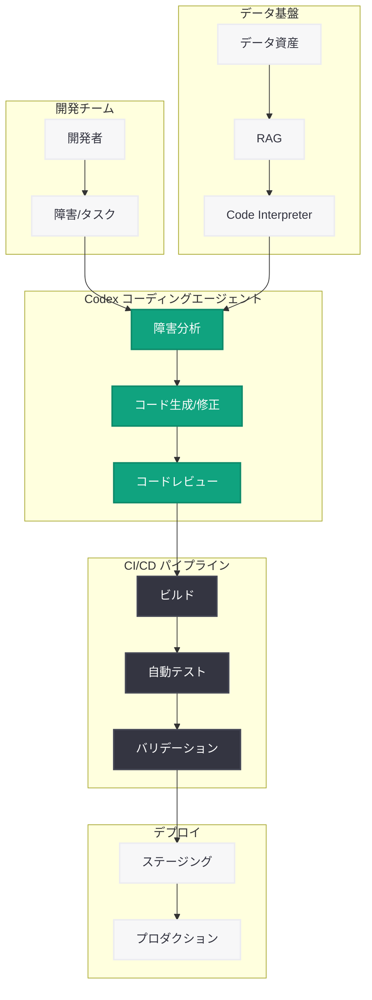

# Rakuten が Codex で問題修復速度を 2 倍に向上

## メタデータ

| 項目 | 内容 |
|------|------|
| 発表日 | 2026-03-11 |
| ソース | OpenAI News/Blog |
| カテゴリ | API |
| 公式リンク | [openai.com/index/rakuten](https://openai.com/index/rakuten) |

## 概要

Rakuten Group は、OpenAI のコーディングエージェントである Codex を導入し、ソフトウェア開発の速度と安全性を大幅に向上させた。MTTR (平均修復時間) を 50% 削減し、CI/CD レビューの自動化やフルスタックビルドの迅速な提供を実現している。

Rakuten は世界中に 18 億以上の会員を持ち、EC、フィンテック、デジタルコンテンツ、通信など 70 以上のオンラインサービスを運営する巨大エコシステムである。57,000 以上の日本の加盟店のオンライン販売を支援する B2B 企業でもあり、その規模に見合った高速かつ安全なソフトウェア開発体制が求められている。今回の Codex 導入は、こうした要件に対する実践的な解決策として注目される。

## 主な内容

### Codex によるソフトウェア開発の変革

Rakuten の AI ビジネス担当 General Manager である Yusuke Kaji 氏は「データ資産こそが最も重要な企業資産」と述べ、OpenAI のモデルを活用してデータの価値を増幅させている。Codex の導入により、開発チームは以下の成果を達成した。

- **MTTR 50% 削減:** 障害発生時の平均修復時間を半減させ、サービスの可用性を向上
- **CI/CD レビューの自動化:** コードレビューやパイプラインの検証プロセスを Codex が支援し、人的負荷を軽減
- **フルスタックビルドの迅速化:** 従来数ヶ月を要していたフルスタックの構築を数週間で完了
- **開発の安全性向上:** 自動化されたコード検証により、バグやセキュリティリスクの早期発見を実現

### データ活用基盤との連携

Rakuten は Codex だけでなく、Code Interpreter と RAG (Retrieval-Augmented Generation) を組み合わせて、複雑な非構造化データの理解と価値抽出を行っている。70 以上のサービスから生成される膨大なデータ資産を AI で分析し、開発プロセスの最適化に活かしている。

### 大規模エコシステムでの実証

18 億以上の会員基盤と 57,000 以上の加盟店を抱える Rakuten のエコシステムは、高いスケーラビリティと信頼性が求められる環境である。Codex はこうした大規模環境においても実用的な成果を上げており、エンタープライズレベルでの AI コーディングエージェント活用の成功事例となっている。

## 技術的な詳細

### Codex の活用方法

Codex は OpenAI が提供するコーディングエージェントであり、Rakuten では以下の領域で活用されている。

- **障害対応の高速化:** Codex がコードベースを分析し、障害の原因特定と修正案の提示を自動化。MTTR を 50% 削減
- **CI/CD パイプラインの自動レビュー:** プルリクエストやビルドパイプラインの検証を Codex が自動的に実行し、品質を担保
- **フルスタック開発の加速:** フロントエンドからバックエンドまで、Codex がコード生成と実装を支援

### データ分析基盤

```python
from openai import OpenAI

client = OpenAI()

# Rakuten のデータ分析パターン: Code Interpreter + RAG の活用例
response = client.chat.completions.create(
    model="gpt-4o",
    messages=[
        {
            "role": "system",
            "content": (
                "You are a data analysis assistant for an e-commerce platform. "
                "Analyze the provided unstructured data and extract actionable "
                "insights for merchant optimization."
            )
        },
        {
            "role": "user",
            "content": "Analyze the following merchant sales data..."
        }
    ],
    temperature=0.3,
)
```

## アーキテクチャ



## 開発者への影響

Rakuten の事例は、大規模エンタープライズにおける AI コーディングエージェントの実践的な導入指針を示している。開発者が注目すべきポイントは以下の通り。

- **MTTR の劇的な改善:** Codex による障害分析と修正提案の自動化は、運用チームの負荷を大幅に軽減する。MTTR 50% 削減という成果は、SRE やインフラチームにとって重要な指標となる
- **CI/CD への統合:** Codex をパイプラインに組み込むことで、コードレビューの品質と速度を両立できる。大規模チームほどこの自動化の恩恵は大きい
- **フルスタック開発の加速:** フロントエンドからバックエンドまでを Codex が支援することで、少人数のチームでも短期間でのプロダクト構築が可能になる
- **RAG との組み合わせ:** 社内データ資産と RAG を組み合わせることで、Codex がドメイン固有の知識を活用した精度の高いコード生成を行える
- **エンタープライズ規模での実証:** 18 億会員規模のプラットフォームでの成功事例は、大規模導入を検討する企業にとって信頼性の高い参考事例となる

## 関連リンク

- [Rakuten と OpenAI の事例記事](https://openai.com/index/rakuten)
- [OpenAI Codex](https://openai.com/codex)
- [OpenAI API ドキュメント](https://platform.openai.com/docs)
- [OpenAI Chat Completions API](https://platform.openai.com/docs/guides/text-generation)

## まとめ

Rakuten Group は、OpenAI の Codex を活用してソフトウェア開発プロセスを大幅に効率化した。MTTR 50% 削減、CI/CD レビューの自動化、フルスタックビルドの迅速化という具体的な成果は、AI コーディングエージェントがエンタープライズ環境で実用的な価値を提供できることを実証している。さらに、Code Interpreter と RAG を組み合わせたデータ活用基盤との連携により、70 以上のサービスを支える巨大エコシステムにおいても AI 駆動の開発体制を確立した。この事例は、大規模な開発組織が Codex を導入する際の実践的なモデルケースとなるだろう。
