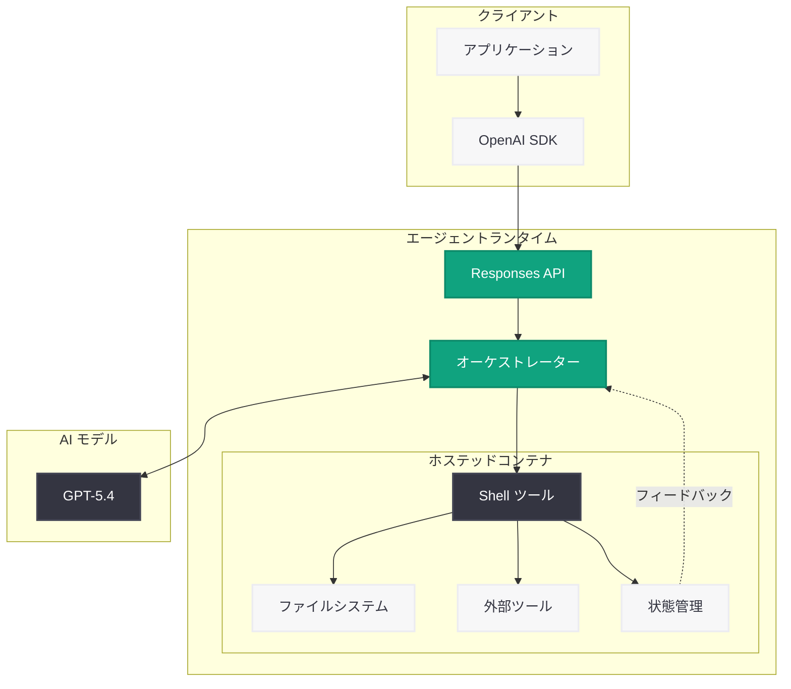

# モデルからエージェントへ: Responses API にコンピュータ環境を装備する

## メタデータ

| 項目 | 内容 |
|------|------|
| 発表日 | 2026-03-11 |
| ソース | OpenAI Engineering Blog |
| カテゴリ | Engineering |
| 公式リンク | [openai.com](https://openai.com/index/equip-responses-api-computer-environment) |

## 概要

OpenAI のエンジニアリングチームは、Responses API、Shell ツール、およびホステッドコンテナを活用して、セキュアでスケーラブルなエージェントランタイムを構築した方法を解説する技術記事を公開した。この記事は、AI がテキスト生成にとどまらず、実際のコンピュータ環境で作業を実行する「エージェント」へと進化する過程を技術的に詳述している。

Responses API は Chat Completions API の後継として位置づけられ、ツール使用やマルチステップの対話を統合的に管理する新しい API である。Shell ツールとホステッドコンテナを組み合わせることで、エージェントがファイル操作、外部ツール呼び出し、状態管理を安全に行える基盤が実現されている。この技術は OpenAI の Codex (コーディングエージェント) の基盤技術と密接に関連している。

## 主な内容

### Responses API の概要

Responses API は、OpenAI が提供するエージェント開発向けの新しい API である。従来の Chat Completions API がリクエスト/レスポンスの単純な往復に基づいていたのに対し、Responses API はマルチステップのツール呼び出しと対話の管理を API レベルでサポートする。

- **ツール統合:** エージェントが利用可能なツールを API レベルで定義し、モデルが適切なタイミングでツールを呼び出す
- **マルチステップ対話:** 複数のステップにわたるタスク実行を 1 つの API セッション内で管理
- **状態管理:** エージェントの実行状態を API 側で追跡し、中断と再開をサポート

### エージェントランタイムの構築

OpenAI はモデル単体ではなく、モデルを中心とした「エージェントランタイム」という実行環境全体を設計した。このランタイムは、モデルの推論能力とコンピュータ環境を橋渡しし、AI がタスクを自律的に遂行できる基盤を提供する。

- **オーケストレーション:** Responses API がモデルの出力を解釈し、適切なツール呼び出しやアクションを実行
- **ループ実行:** モデルの出力 → ツール実行 → 結果のフィードバック → 次の推論というサイクルを自動的に管理
- **エラーハンドリング:** ツール実行の失敗やタイムアウトに対する適切なリカバリ機構

### Shell ツール

Shell ツールは、エージェントがシェルコマンドを実行するためのインターフェースである。これにより、ファイルの読み書き、プログラムの実行、システム情報の取得など、コンピュータ上のあらゆる操作が AI エージェントから利用可能になる。

- **コマンド実行:** bash や sh などのシェルを通じた任意のコマンド実行
- **出力キャプチャ:** コマンドの標準出力と標準エラー出力の取得
- **タイムアウト制御:** 長時間実行コマンドに対する適切なタイムアウト管理

### ホステッドコンテナ

ホステッドコンテナは、エージェントの実行環境をセキュアなサンドボックスとして提供する。各エージェントセッションに専用のコンテナが割り当てられ、ファイルシステム、ネットワーク、プロセスが隔離される。

- **セキュリティ:** コンテナの分離によりホストシステムへの影響を防止
- **スケーラビリティ:** コンテナの動的な起動と停止による効率的なリソース管理
- **再現性:** 一貫した実行環境の提供によるエージェント動作の再現性確保
- **永続性:** セッション内でのファイルや状態の永続化

## 技術的な詳細

### Responses API を使用したエージェント構築

以下は Responses API を使用してエージェントを構築する基本的な例である。

```python
from openai import OpenAI

client = OpenAI()

# Responses API を使用したエージェントの構築
response = client.responses.create(
    model="gpt-5.4",
    input="プロジェクトのディレクトリ構造を確認して、README.md の内容を要約してください。",
    tools=[
        {
            "type": "shell",
            "shell": {
                "image": "python:3.12-slim"
            }
        }
    ]
)

# エージェントの実行結果を取得
print(response.output_text)
```

### マルチステップタスクの実行例

```python
from openai import OpenAI

client = OpenAI()

# ファイル操作を含むマルチステップタスク
response = client.responses.create(
    model="gpt-5.4",
    input="以下の手順を実行してください: "
          "1. test_project ディレクトリを作成 "
          "2. Python のサンプルコードを作成 "
          "3. テストを実行して結果を報告",
    tools=[
        {
            "type": "shell",
            "shell": {
                "image": "python:3.12-slim"
            }
        }
    ]
)

# レスポンスにはツール呼び出しの履歴と最終結果が含まれる
for item in response.output:
    if item.type == "shell_call":
        print(f"Command: {item.command}")
        print(f"Output: {item.output}")
    elif item.type == "message":
        print(f"Agent: {item.content[0].text}")
```

### コンテナ環境のカスタマイズ

```python
from openai import OpenAI

client = OpenAI()

# カスタムコンテナ環境でのエージェント実行
response = client.responses.create(
    model="gpt-5.4",
    input="Node.js プロジェクトをセットアップし、Express サーバーを作成してください。",
    tools=[
        {
            "type": "shell",
            "shell": {
                "image": "node:20-slim",
                "env": {
                    "NODE_ENV": "development"
                }
            }
        }
    ]
)

print(response.output_text)
```

> **注:** 上記のコード例は記事の内容に基づく一般的な利用パターンの想定であり、実際のパラメータやツール指定の詳細は公式ドキュメントを参照してください。

## アーキテクチャ

以下の図は、Responses API を中心としたエージェントランタイムのアーキテクチャを示している。



## 開発者への影響

### エージェント開発パラダイムの転換

Responses API の登場により、エージェント開発のアプローチが根本的に変化する。

- **Chat Completions API からの移行:** 既存の Chat Completions API ベースのアプリケーションを Responses API に移行することで、エージェント機能を容易に追加可能
- **ツール統合の簡素化:** Shell ツールにより、外部ツールやサービスとの連携が API レベルで標準化
- **開発コストの削減:** オーケストレーションロジックを OpenAI 側に委任することで、開発者はビジネスロジックに集中可能

### セキュリティとコンプライアンス

ホステッドコンテナによるサンドボックス化は、エンタープライズ環境でのエージェント導入を加速する。

- **データ隔離:** コンテナの分離によりデータ漏洩リスクを軽減
- **監査証跡:** エージェントのアクション履歴が API レスポンスに記録される
- **権限制御:** コンテナ内での操作範囲を制限することでセキュリティを確保

### 移行時の考慮事項

- Chat Completions API から Responses API への移行にはコードの書き換えが必要
- Shell ツールの利用にはセキュリティポリシーの見直しが推奨される
- コンテナ実行に伴う追加コストを考慮した設計が重要

## 関連リンク

- [Responses API 公式記事](https://openai.com/index/equip-responses-api-computer-environment)
- [OpenAI API ドキュメント](https://platform.openai.com/docs)
- [OpenAI API リファレンス](https://platform.openai.com/docs/api-reference)
- [Responses API ガイド](https://platform.openai.com/docs/guides/responses)
- [OpenAI Codex](https://openai.com/index/openai-codex)

## まとめ

OpenAI が公開したこの技術記事は、Responses API、Shell ツール、ホステッドコンテナという 3 つの要素を組み合わせて、セキュアでスケーラブルなエージェントランタイムを構築する方法を解説している。この技術は、AI をテキスト生成の枠を超えて実際のコンピュータ環境で作業を遂行する「エージェント」へと進化させる重要な基盤である。Responses API は Chat Completions API の後継として、エージェント開発の新しいパラダイムを提示しており、Codex をはじめとする OpenAI のエージェント製品群の技術的基盤となっている。開発者にとっては、エージェント構築のための強力かつ統合的なプラットフォームが提供されることになり、より高度な AI アプリケーションの開発が促進されることが期待される。
