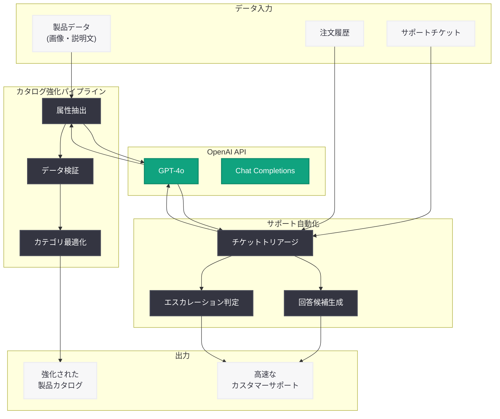

# Wayfair が OpenAI を活用してカタログ精度とサポート速度を向上

## メタデータ

| 項目 | 内容 |
|------|------|
| 発表日 | 2026-03-11 |
| ソース | OpenAI News/Blog |
| カテゴリ | B2B Story |
| 公式リンク | [openai.com/index/wayfair](https://openai.com/index/wayfair) |

## 概要

大手 EC (eコマース) 企業の Wayfair が、OpenAI のモデルを活用して eコマースサポートの改善と製品カタログの精度向上を実現した事例が公開された。チケットトリアージの自動化や数百万件の製品属性の大規模な強化により、カスタマーサポートの速度とカタログデータの品質が大幅に向上している。

Wayfair は家具・インテリア製品を取り扱う大手 EC プラットフォームであり、膨大な製品カタログの管理とカスタマーサポートの効率化という課題に対して、AI を戦略的に導入した。本事例は、OpenAI のエンタープライズ向けソリューションが大規模な EC 運営においてどのように実用的な価値を提供するかを示す好例である。

## 主な内容

### カタログ精度の向上

Wayfair のカタログには数百万点の家具・インテリア製品が掲載されており、各製品には素材、サイズ、色、スタイルなど多数の属性が紐づいている。従来、これらの属性情報の入力や検証は手作業に依存する部分が大きく、データの不整合や欠損が発生しやすい状況にあった。

OpenAI のモデルを導入することで、以下の改善が実現された。

- **製品属性の自動抽出と補完:** 製品画像や説明文から AI が属性情報を自動的に抽出し、欠損データを補完
- **データ品質の検証:** 既存の属性データの整合性を AI が自動チェックし、矛盾や誤りを検出
- **大規模な一括処理:** 数百万件の製品データに対して一貫した品質基準で属性情報を強化
- **カテゴリ分類の最適化:** 製品のカテゴリ分類を AI が自動的に提案・修正し、検索精度を向上

### サポート速度の改善

Wayfair のカスタマーサポートチームは、日々大量の問い合わせに対応している。OpenAI のモデルを活用したチケットトリアージの自動化により、サポート業務の効率が大幅に改善された。

主な改善ポイントは以下の通り。

- **自動分類と優先度付け:** 問い合わせ内容を AI が分析し、適切なカテゴリと優先度を自動的に割り当て
- **回答候補の生成:** よくある質問に対して AI が回答案を生成し、サポート担当者の対応時間を短縮
- **エスカレーション判定:** 複雑な問題や緊急度の高い案件を自動的に識別し、適切な担当者にエスカレーション

### チケットトリアージの自動化

チケットトリアージは、カスタマーサポートにおいて最も工数のかかるプロセスの一つである。Wayfair は OpenAI の自然言語処理能力を活用し、このプロセスを大幅に自動化した。

- **意図理解:** 顧客のメッセージから問い合わせの意図を正確に把握
- **コンテキスト分析:** 注文履歴や過去の問い合わせ履歴を参照し、状況に応じた適切な対応方針を判断
- **ルーティング最適化:** 問題の種類と専門性に基づいて、最適なサポートチームへ自動的にルーティング

## 技術的な詳細

### システム構成

Wayfair の AI 活用システムは、主に以下の 2 つの領域で構成されている。

- **カタログ強化パイプライン:** 製品データを OpenAI API に送信し、属性の抽出・補完・検証を自動化
- **サポート自動化システム:** カスタマーサポートのチケットを OpenAI API で分析し、分類・優先度付け・回答生成を実行

### API 活用パターン

```python
from openai import OpenAI

client = OpenAI()

# 製品属性の抽出・強化の例
response = client.chat.completions.create(
    model="gpt-4o",
    messages=[
        {
            "role": "system",
            "content": (
                "You are a product data specialist for a furniture "
                "e-commerce platform. Extract and validate product "
                "attributes from the provided description. Return "
                "structured JSON with material, dimensions, color, "
                "style, and category."
            )
        },
        {
            "role": "user",
            "content": "Product: Modern Oak Dining Table, 72 inches..."
        }
    ],
    temperature=0.1,  # 高い一貫性を確保
    response_format={"type": "json_object"}
)
```

### サポートチケット分類の例

```python
from openai import OpenAI

client = OpenAI()

# チケットトリアージの自動化例
response = client.chat.completions.create(
    model="gpt-4o",
    messages=[
        {
            "role": "system",
            "content": (
                "You are a customer support triage agent. Analyze the "
                "customer message and classify it by category, priority "
                "(high/medium/low), and suggested team for routing."
            )
        },
        {
            "role": "user",
            "content": "I received a damaged table leg and need a replacement..."
        }
    ],
    temperature=0.1,
    response_format={"type": "json_object"}
)
```

## アーキテクチャ



## 開発者への影響

Wayfair の事例は、大規模 EC プラットフォームにおける OpenAI モデルの実用的な活用パターンを示している。開発者が注目すべきポイントは以下の通り。

- **大規模データ処理への適用:** 数百万件の製品データに対して AI を一括適用するパイプライン設計が、EC 分野における AI 活用の有効なアプローチであることが示された
- **構造化出力の重要性:** `response_format` を活用した JSON 形式の出力により、既存のデータベースやシステムとの統合が容易になる
- **低い temperature 設定:** 製品データの処理やチケット分類など、一貫性と正確性が求められるタスクでは低い temperature 値が有効である
- **マルチユースケース戦略:** 同一の AI 基盤をカタログ管理とカスタマーサポートの両方に活用することで、投資対効果を最大化できる
- **段階的な自動化:** 完全自動化ではなく、AI による提案と人間による確認を組み合わせたアプローチが、品質と効率のバランスを実現する

## 関連リンク

- [Wayfair 公式記事](https://openai.com/index/wayfair)
- [OpenAI API ドキュメント](https://platform.openai.com/docs)
- [OpenAI Chat Completions API](https://platform.openai.com/docs/guides/text-generation)
- [OpenAI News](https://openai.com/news)

## まとめ

Wayfair は OpenAI のモデルを活用し、EC プラットフォームにおける 2 つの重要な課題 -- 製品カタログの精度とカスタマーサポートの速度 -- を同時に改善した。数百万件の製品属性を AI で大規模に強化するカタログパイプラインと、チケットトリアージを自動化するサポートシステムの構築により、運営効率と顧客体験の両方を向上させている。この事例は、大規模 EC 企業が OpenAI のエンタープライズ向けソリューションをどのように実用的に活用できるかを示す代表的な B2B ストーリーであり、同様の課題を抱える EC 事業者や開発者にとって参考になるだろう。
