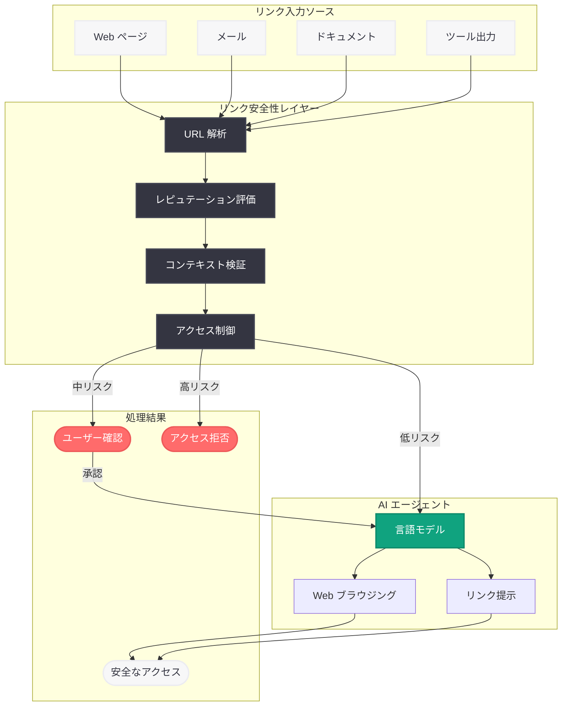

# AI エージェントのリンク安全性

## メタデータ

| 項目 | 内容 |
|------|------|
| 発表日 | 2026-03-12 (推定) |
| ソース | OpenAI Security Blog |
| カテゴリ | セキュリティ |
| 公式リンク | [openai.com](https://openai.com/index/ai-agent-link-safety/) |

> **注記:** 本レポートは OpenAI のセキュリティカテゴリサイトマップ (lastmod: 2026-03-13T17:24:27) から発見された記事に基づいて作成されている。レポート生成時点では記事の全文コンテンツにアクセスできなかったため、サイトマップ情報、記事タイトル、および関連する公開情報をもとに内容を構成している。

## 概要

OpenAI は 2026 年 3 月 12 日頃、AI エージェントがリンクを安全に処理するための設計手法に関するセキュリティ記事「AI Agent Link Safety」を公開した。本記事は、2026 年 3 月 11 日に公開された「Designing AI agents to resist prompt injection」の姉妹記事として位置づけられ、AI エージェントがフィッシング URL、悪意のあるリンクインジェクション、安全でないナビゲーションなどの脅威からユーザーを保護する方法を扱っていると考えられる。

AI エージェントが Web ブラウジング、メール処理、ドキュメント参照などのタスクを自律的に実行する場面が増加する中、リンクの安全性確保は不可欠な課題である。エージェントが悪意のあるリンクをクリックしたり、ユーザーに不正な URL を提示したりするリスクに対する体系的な防御が求められている。

## 主な内容

### リンクに関する脅威の分類

AI エージェントがリンクを扱う際に直面する主要な脅威として、以下のカテゴリが想定される。

- **フィッシング URL の検出:** エージェントが Web ページやメール内で遭遇するリンクの中から、フィッシングサイトへの誘導を目的とした URL を識別し、ユーザーへの提示やアクセスをブロックする仕組み
- **悪意のあるリンクインジェクション:** プロンプトインジェクションの一形態として、外部コンテンツ内に埋め込まれた悪意のある URL をエージェントに処理させようとする攻撃への対策
- **リダイレクトチェーンの検証:** 正規の URL に見せかけて複数回のリダイレクトを経由し、最終的に悪意のあるサイトに到達させる手法への防御
- **データ流出リンクの防止:** エージェントが保持する機密情報を URL パラメータに埋め込んで外部に送信させる攻撃の阻止

### リンク安全性の設計原則

AI エージェントにおけるリンク処理の安全性を確保するための設計原則として、以下のアプローチが考えられる。

- **URL の事前検証:** エージェントがリンクにアクセスする前に、URL のドメイン、パス、パラメータを検証し、既知の悪意あるパターンとの照合を実施
- **ユーザー確認の導入:** 高リスクと判定されたリンクへのアクセスや、リンクをユーザーに提示する際に、明示的な確認フローを挟むことでリスクを軽減
- **コンテキストベースの判断:** リンクが埋め込まれていたコンテキスト (メール、Web ページ、ツール出力など) の信頼性を評価し、信頼度に応じた処理を適用
- **透明性の確保:** エージェントがアクセスするリンクや提示するリンクの情報をユーザーに開示し、暗黙的なナビゲーションを防止

### プロンプトインジェクション対策との連携

本記事は、2026 年 3 月 11 日公開の「Designing AI agents to resist prompt injection」で示された多層防御モデルを、リンク処理の文脈に拡張したものと位置づけられる。プロンプトインジェクションによるリンク操作は、エージェントセキュリティにおける重要な攻撃ベクトルであり、両記事の知見を統合的に適用することが効果的な防御につながる。

## 技術的な詳細

### リンク安全性の多層防御モデル

エージェントにおけるリンク処理のセキュリティは、以下の防御レイヤーで構成されると想定される。

1. **URL 解析レイヤー:** リンクの構造 (スキーム、ドメイン、パス、クエリパラメータ) を解析し、異常なパターンを検出
2. **レピュテーション評価レイヤー:** URL のドメインを既知の脅威データベースやセーフブラウジング API と照合し、リスクスコアを算出
3. **コンテキスト検証レイヤー:** リンクが出現したコンテキストとリンク先の整合性を検証し、不自然な遷移を検出
4. **アクセス制御レイヤー:** リスク評価の結果に基づき、自動アクセス、ユーザー確認付きアクセス、アクセス拒否の判定を実行

### データ流出防止メカニズム

エージェントがリンクを生成または利用する際に、機密データがリンクに含まれることを防ぐ仕組みとして、以下が考えられる。

- URL パラメータに機密情報 (API キー、トークン、個人情報) が含まれていないかの検査
- エージェントが生成するリンクの宛先ドメインの制限 (許可リスト方式)
- リダイレクト先の追跡と最終到達先の安全性確認

## アーキテクチャ

## 開発者への影響

### エージェント開発におけるリンク処理の安全設計

AI エージェントを構築する開発者は、リンク処理における安全性を設計段階から組み込む必要がある。

- **URL ホワイトリストの導入:** エージェントがアクセス可能なドメインを事前に定義し、未知のドメインへのアクセスには制限を設けることが推奨される
- **リンク検証の実装:** エージェントが外部コンテンツからリンクを抽出する際、URL の正当性を検証するロジックを実装すべきである
- **ユーザー確認フローの設計:** 高リスクなリンクへのアクセスや、ユーザーへのリンク提示においては、確認ステップを組み込むことが求められる

### プロンプトインジェクション対策との統合

- 2026 年 3 月 11 日公開の「Designing AI agents to resist prompt injection」で示された入力検証の手法を、リンク処理にも適用する
- 外部コンテンツに埋め込まれた悪意のあるリンクを、プロンプトインジェクションの一形態として検出・防御する仕組みを導入する
- エージェントが生成するリンクについても、出力フィルタリングの対象として安全性を担保する

### Responses API 利用者への推奨事項

- Web ブラウジングツールを使用するエージェントでは、アクセス先 URL のバリデーションを必ず実装する
- Computer Use 機能を活用する場合、エージェントがクリックする URL の安全性検証を事前に行う
- エージェントの応答に含まれるリンクが、信頼できるソースからのものであることを確認する仕組みを導入する

## 関連リンク

- [AI Agent Link Safety (原文)](https://openai.com/index/ai-agent-link-safety/)
- [Designing AI agents to resist prompt injection](https://openai.com/index/designing-agents-to-resist-prompt-injection)
- [OpenAI Responses API ドキュメント](https://platform.openai.com/docs/api-reference/responses)
- [OpenAI Agent SDK](https://github.com/openai/openai-agents-python)
- [OpenAI セキュリティガイド](https://platform.openai.com/docs/guides/safety-best-practices)

## まとめ

OpenAI が公開した「AI Agent Link Safety」は、AI エージェントがリンクを安全に処理するための設計指針を提供するセキュリティ記事である。2026 年 3 月 11 日公開の「Designing AI agents to resist prompt injection」と合わせて、OpenAI のエージェント安全性イニシアチブの重要な柱を構成している。フィッシング URL の検出、悪意のあるリンクインジェクションの防御、データ流出リンクの阻止、リダイレクトチェーンの検証といった多角的な脅威に対して、URL 解析、レピュテーション評価、コンテキスト検証、アクセス制御の多層防御モデルで対処するアプローチが示されていると考えられる。AI エージェントの自律的な Web 操作が拡大する中、リンク安全性の確保はエージェント開発者にとって不可欠な設計要件である。

> **免責事項:** 本レポートはサイトマップ情報および関連する公開情報に基づいて構成されたものであり、記事の全文を確認した上での分析ではない。記事の実際の内容とは異なる可能性がある点にご留意いただきたい。
