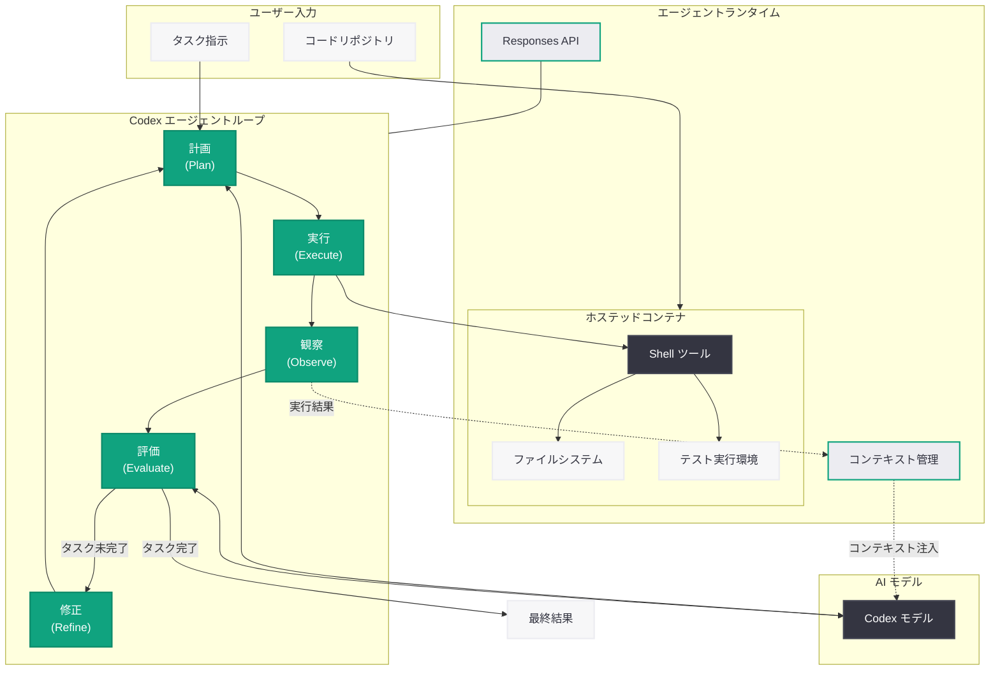

# Codex エージェントループの内部構造を解説: "Unrolling the Codex Agent Loop"

## メタデータ

| 項目 | 内容 |
|------|------|
| 発表日 | 2026-03-12 (サイトマップ lastmod に基づく推定) |
| ソース | OpenAI Engineering Blog |
| カテゴリ | エンジニアリング |
| 公式リンク | [openai.com](https://openai.com/index/unrolling-the-codex-agent-loop/) |

> **注:** 本レポートは OpenAI のエンジニアリングサイトマップ (lastmod: 2026-03-12T14:41:37) から記事の存在を確認して作成しています。記事本文へのアクセスは Cloudflare の保護により制限されたため、タイトル、URL、関連記事の文脈、および Codex の公開情報に基づいて内容を構成しています。正確な詳細については公式記事を参照してください。

## 概要

OpenAI のエンジニアリングチームは、コーディングエージェント Codex の中核メカニズムである「エージェントループ」の内部構造を技術的に解説する記事を公開した。タイトルの "Unrolling" (展開する) は、通常ブラックボックスとして扱われるエージェントの反復実行プロセスを分解し、各ステップの設計意図と実装上の工夫を明らかにするものと推察される。

本記事は、2026 年 3 月 11 日に公開された「From model to agent: Equipping the Responses API with a computer environment」で解説されたエージェントランタイム基盤の上に構築される、Codex 固有のエージェントループの詳細に踏み込んだ技術解説であると考えられる。Responses API、Shell ツール、ホステッドコンテナといったインフラ層の上で、Codex がどのようにタスクを計画・実行・検証・修正するかを体系的に説明する内容が想定される。

## 主な内容

### エージェントループとは

エージェントループとは、AI エージェントがタスクを遂行するために繰り返し実行する中核的なサイクルである。Codex の場合、ユーザーからの指示を受け取った後、以下のようなステップを反復的に実行してタスクを完了する。

1. **計画 (Plan):** タスクを分析し、次に実行すべきアクションを決定
2. **実行 (Execute):** Shell ツールを通じてコマンドの実行、ファイルの読み書きなどのアクションを実行
3. **観察 (Observe):** 実行結果 (標準出力、エラー出力、ファイル変更) を確認
4. **評価 (Evaluate):** 結果がタスクの目標に合致しているかを判定
5. **修正 (Refine):** 必要に応じてアプローチを修正し、次のイテレーションへ

このループを「展開」(unroll) することで、各ステップにおけるモデルの意思決定プロセス、コンテキスト管理の仕組み、エラーからの回復戦略などが明らかになる。

### Responses API との連携

Codex のエージェントループは、Responses API のマルチステップ実行機能を基盤としている。Responses API は、モデルの推論とツール呼び出しの往復を API レベルで管理し、以下の機能を提供する。

- **ステートフルな実行管理:** 各イテレーションの状態を保持し、コンテキストの連続性を確保
- **ツール呼び出しの自動ディスパッチ:** モデルがツール使用を要求した場合、API が適切なツール (Shell ツールなど) にリクエストを転送
- **結果のフィードバック:** ツール実行結果をモデルのコンテキストに自動的に追加

### コンテキスト管理の工夫

長時間にわたるエージェントループでは、コンテキストウィンドウの管理が重要な課題となる。多数のファイル読み取り結果、コマンド出力、中間推論がコンテキストに蓄積されるため、効率的な管理戦略が不可欠である。

- **コンテキストの圧縮:** 過去のツール出力を要約し、重要な情報のみを保持
- **選択的な情報保持:** タスクの現在のフェーズに関連する情報を優先的に保持
- **段階的なコンテキスト構築:** 必要に応じてファイルを再読み込みし、最新の状態を反映

### エラーハンドリングとリトライ戦略

エージェントループの信頼性を確保するために、多層的なエラーハンドリング機構が実装されていると考えられる。

- **コマンド失敗への対応:** シェルコマンドが非ゼロの終了コードを返した場合、エラー出力を分析して代替アプローチを試行
- **テスト失敗からの回復:** テスト実行が失敗した場合、エラーメッセージに基づいてコードを修正し再実行
- **無限ループの防止:** 同じエラーが繰り返される場合に検出し、異なるアプローチへ切り替え
- **タイムアウト管理:** 長時間実行されるコマンドに対する適切なタイムアウトとリカバリ

### パフォーマンス最適化

エージェントループの効率性を高めるために、以下のような最適化が施されていると推察される。

- **並列ツール呼び出し:** 独立した複数のアクション (例: 複数ファイルの同時読み取り) を並列に実行
- **推測的実行:** 高い確率で必要になるアクションを事前に実行し、待機時間を削減
- **キャッシュ活用:** 同一ファイルやコマンド結果のキャッシュによる重複実行の回避

## 技術的な詳細

### エージェントループの基本的な実行フロー

以下は、Codex のエージェントループの概念的な実行フローを示す疑似コードである。

```python
from openai import OpenAI

client = OpenAI()

# Codex エージェントループの概念的な構造
# (実際の API 呼び出しは Responses API を使用)
response = client.responses.create(
    model="codex",
    input="プロジェクトのテストを修正してください。失敗しているテストを特定し、コードを修正して全テストが通るようにしてください。",
    tools=[
        {
            "type": "shell",
            "shell": {
                "image": "python:3.12-slim"
            }
        }
    ]
)

# エージェントループの各ステップがレスポンスに記録される
for item in response.output:
    if item.type == "reasoning":
        # 計画・評価フェーズ: モデルの推論プロセス
        print(f"[Plan] {item.summary}")
    elif item.type == "shell_call":
        # 実行フェーズ: シェルコマンドの実行
        print(f"[Execute] $ {item.command}")
        print(f"[Observe] {item.output[:200]}")
    elif item.type == "message":
        # 最終結果の報告
        print(f"[Result] {item.content[0].text}")
```

### ループのイテレーション例

典型的な Codex のタスク実行では、以下のようなイテレーションが行われる。

```
Iteration 1 (計画):
  - リポジトリ構造の把握: ls, find コマンドでプロジェクト構造を確認
  - テストの実行: pytest を実行して失敗テストを特定

Iteration 2 (分析):
  - 失敗テストのエラーメッセージを分析
  - 関連するソースファイルを読み取り

Iteration 3 (修正):
  - ソースコードの修正を実施
  - テストを再実行して結果を確認

Iteration 4 (検証):
  - 全テストスイートを実行して回帰がないことを確認
  - 変更内容のサマリーを生成
```

> **注:** 上記のコード例と実行フローは、Codex および Responses API の公開情報と関連記事に基づく想定であり、記事の実際の内容とは異なる可能性があります。正確な技術詳細は公式記事を参照してください。

## アーキテクチャ

以下の図は、Codex エージェントループの内部構造を示している。



## 開発者への影響

### エージェント設計パターンの理解

Codex のエージェントループの内部構造が公開されることで、開発者は自身のエージェントアプリケーション設計に以下の知見を活用できる。

- **ループ設計のベストプラクティス:** 計画・実行・観察・評価・修正の各フェーズの分離と責務の明確化
- **コンテキスト管理戦略:** 長時間実行タスクにおけるコンテキストウィンドウの効率的な活用方法
- **エラーハンドリングパターン:** エージェントの信頼性を高めるための多層的なエラー回復戦略

### Responses API を活用したエージェント開発

- **API ネイティブなループ管理:** Responses API のマルチステップ実行機能を活用することで、開発者が独自にループ管理を実装する必要が軽減
- **Shell ツール統合:** Codex が実証した Shell ツールの活用パターンを、自身のエージェントアプリケーションに応用可能
- **ホステッドコンテナの活用:** セキュアな実行環境でのエージェントループ実行により、本番環境での信頼性を確保

### 関連する技術動向

本記事は、以下の OpenAI の技術発表と密接に関連している。

- **Responses API のエージェントランタイム** (2026-03-11): エージェントループの実行基盤
- **Codex for Open Source** (2026-03-07): エージェントループの実際の適用事例
- **Codex Security** (2026-03-06): セキュリティスキャンにおけるエージェントループの活用

## 関連リンク

- [Unrolling the Codex Agent Loop](https://openai.com/index/unrolling-the-codex-agent-loop/)
- [From model to agent: Equipping the Responses API with a computer environment](https://openai.com/index/equip-responses-api-computer-environment)
- [Codex for Open Source](https://openai.com/index/codex-for-open-source/)
- [Codex Security: now in research preview](https://openai.com/index/codex-security-now-in-research-preview)
- [OpenAI Codex](https://openai.com/codex)
- [OpenAI API リファレンス](https://platform.openai.com/docs/api-reference)
- [Responses API ガイド](https://platform.openai.com/docs/guides/responses)

## まとめ

OpenAI が公開した「Unrolling the Codex Agent Loop」は、コーディングエージェント Codex の中核メカニズムであるエージェントループの内部構造を技術的に解説するエンジニアリング記事である。エージェントループは、計画・実行・観察・評価・修正の 5 つのフェーズを反復的に実行することでタスクを遂行する。この仕組みは Responses API、Shell ツール、ホステッドコンテナで構成されるエージェントランタイム上に構築されており、コンテキスト管理、エラーハンドリング、パフォーマンス最適化など、信頼性の高いエージェント実行を実現するための多くの工夫が施されている。本記事は、2026 年 3 月に集中的に公開された Codex 関連の技術記事群の一つであり、エージェント開発に取り組む開発者にとって、設計パターンの理解と実装の参考となる重要な技術資料である。
