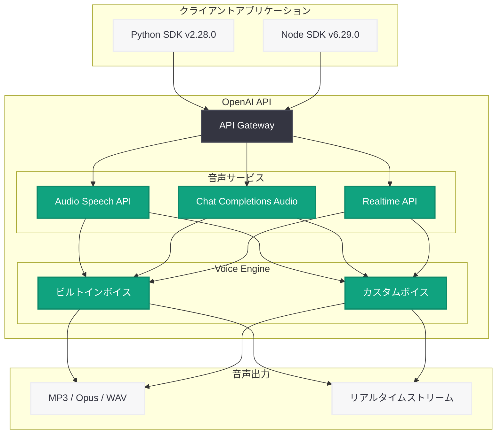

# Custom Voices API サポートの追加

## メタデータ

| 項目 | 内容 |
|------|------|
| 発表日 | 2026-03-13 |
| ソース | OpenAI API Changelog (SDK releases) |
| カテゴリ | API 更新 |
| 公式リンク | [OpenAI API Changelog](https://platform.openai.com/docs/changelog) |

## 概要

OpenAI は 2026 年 3 月 13 日、公式 SDK のアップデートを通じて Custom Voices API のサポートを追加した。Python SDK v2.28.0 および Node SDK v6.29.0 において、Audio Speech API、Chat Completions Audio、Realtime API の 3 つのエンドポイントでカスタムボイスが利用可能になった。

この更新により、従来のビルトインボイス (alloy、ash、ballad、coral、echo、sage、shimmer、verse、marin、cedar) に加え、カスタムボイス ID を `{ "id": "voice_1234" }` の形式で指定することで、独自の音声を利用した音声生成が可能になる。企業やブランドが独自の音声アイデンティティを構築するための基盤となる重要なアップデートである。

## 主な内容

### カスタムボイスの指定方法

従来、`voice` パラメータには文字列リテラル (例: `"alloy"`) のみが指定可能であったが、今回の更新で新たに `VoiceID` オブジェクトが追加された。カスタムボイスを使用する場合は、`id` フィールドを持つオブジェクトを渡す形式となる。

```python
# ビルトインボイスの指定 (従来通り)
voice = "alloy"

# カスタムボイスの指定 (新規)
voice = {"id": "voice_1234"}
```

この `Voice` 型は TypeAlias として以下のように定義されている。

```python
Voice: TypeAlias = Union[
    str,
    Literal["alloy", "ash", "ballad", "coral", "echo", "sage", "shimmer", "verse", "marin", "cedar"],
    VoiceID
]
```

### 対応する API エンドポイント

カスタムボイスは以下の 3 つの API で利用可能である。

1. **Audio Speech API:** テキストから音声を生成する TTS エンドポイント
2. **Chat Completions Audio:** チャット補完の音声出力機能
3. **Realtime API:** リアルタイム音声対話機能

### SDK の更新内容

**Python SDK v2.28.0** で変更されたファイル:

| ファイル | 変更内容 |
|---------|---------|
| `resources/audio/speech.py` | `voice` パラメータの型を `Voice` 型に変更 |
| `types/audio/speech_create_params.py` | `VoiceID` クラスと `Voice` TypeAlias を追加 |
| `types/chat/chat_completion_audio_param.py` | Chat Completions 用の `VoiceID` と `Voice` を追加 |
| `types/realtime/realtime_audio_config_output.py` | Realtime API 出力設定にカスタムボイス対応を追加 |
| `types/realtime/realtime_response_create_audio_output.py` | Realtime レスポンス作成にカスタムボイス対応を追加 |

**Node SDK v6.29.0** でも同様の変更が適用されている。

## 技術的な詳細

### VoiceID 型の定義

カスタムボイスを参照するための新しい型 `VoiceID` が導入された。

```python
class VoiceID(TypedDict, total=False):
    """Custom voice reference."""

    id: Required[str]
    """The custom voice ID, e.g. `voice_1234`."""
```

### コードサンプル

#### Audio Speech API でのカスタムボイス使用

```python
from openai import OpenAI

client = OpenAI()

# ビルトインボイスを使用
response = client.audio.speech.create(
    model="gpt-4o-mini-tts",
    input="Hello, this is a test of text to speech.",
    voice="marin"
)

# カスタムボイスを使用
response = client.audio.speech.create(
    model="gpt-4o-mini-tts",
    input="Hello, this is a test with a custom voice.",
    voice={"id": "voice_1234"},
    instructions="Speak in a warm, professional tone."
)

response.stream_to_file("output.mp3")
```

#### Chat Completions Audio でのカスタムボイス使用

```python
from openai import OpenAI

client = OpenAI()

response = client.chat.completions.create(
    model="gpt-4o-audio-preview",
    modalities=["text", "audio"],
    audio={
        "voice": {"id": "voice_1234"},
        "format": "mp3"
    },
    messages=[
        {
            "role": "user",
            "content": "Tell me about the weather today."
        }
    ]
)

print(response.choices[0].message.content)
```

#### Node.js SDK でのカスタムボイス使用

```javascript
import OpenAI from "openai";

const client = new OpenAI();

// Audio Speech API でカスタムボイスを使用
const response = await client.audio.speech.create({
    model: "gpt-4o-mini-tts",
    input: "Hello, this is a test with a custom voice.",
    voice: { id: "voice_1234" },
    instructions: "Speak in a warm, professional tone."
});

const buffer = Buffer.from(await response.arrayBuffer());
await fs.promises.writeFile("output.mp3", buffer);
```

## アーキテクチャ



## 開発者への影響

### ブランド固有の音声体験の構築

カスタムボイスの導入により、企業は自社ブランドに合った独自の音声を API 経由で利用できるようになる。カスタマーサポート、ナレーション、音声アシスタントなどの用途で、一貫したブランドボイスを提供することが可能になる。

### 既存コードへの影響

- **後方互換性あり:** 既存のビルトインボイス名を文字列で指定するコードはそのまま動作する
- **型定義の変更:** TypeScript や Python の型チェックを使用している場合、`voice` パラメータの型が拡張されたことに注意が必要
- **SDK アップグレード推奨:** カスタムボイスを利用するには Python SDK v2.28.0 以上、Node SDK v6.29.0 以上へのアップグレードが必要

### Realtime API での注意事項

Realtime API でカスタムボイスを使用する場合、セッション中にモデルが一度音声で応答した後はボイスの変更ができない点に留意が必要である。推奨ボイスとして marin と cedar が引き続き最高品質として挙げられている。

## 関連リンク

- [OpenAI API Changelog](https://platform.openai.com/docs/changelog)
- [Python SDK v2.28.0 リリースノート](https://github.com/openai/openai-python/releases/tag/v2.28.0)
- [Node SDK v6.29.0 リリースノート](https://github.com/openai/openai-node/releases/tag/v6.29.0)
- [Text to Speech ガイド](https://platform.openai.com/docs/guides/text-to-speech)
- [OpenAI API リファレンス](https://platform.openai.com/docs/api-reference)

## まとめ

今回の SDK アップデートにより、OpenAI の音声関連 API 全体でカスタムボイスがサポートされた。`VoiceID` オブジェクト (`{ "id": "voice_1234" }`) を `voice` パラメータに指定するだけで、Audio Speech API、Chat Completions Audio、Realtime API の 3 つのエンドポイントでカスタムボイスを利用できる。既存のビルトインボイスとの後方互換性を維持しつつ、企業やブランドが独自の音声アイデンティティを構築するための柔軟性が大幅に向上した。Python SDK v2.28.0 または Node SDK v6.29.0 へアップグレードすることで、この新機能を活用できる。
