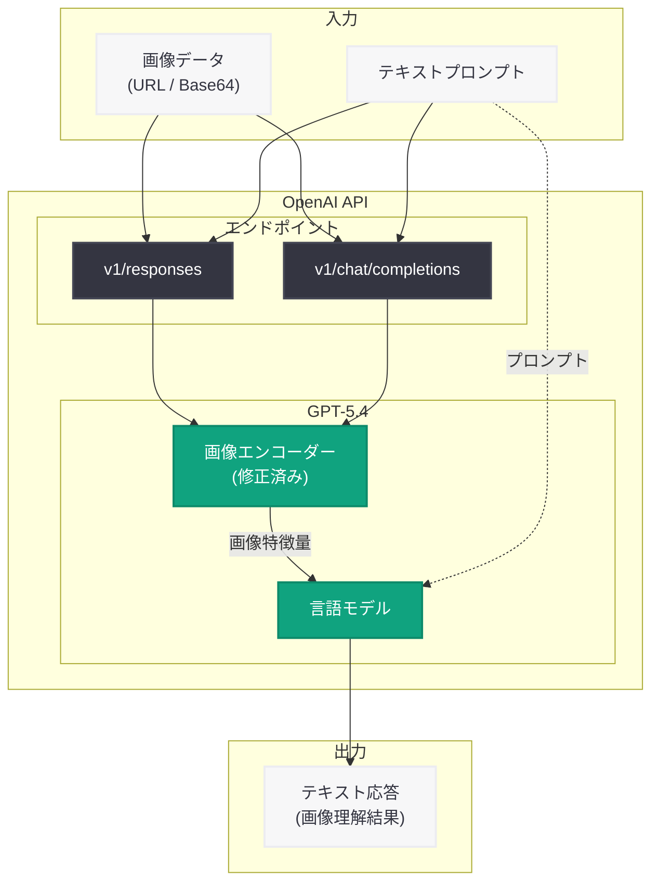

# GPT-5.4 画像エンコーダーのバグ修正: input_image 入力の品質向上

## メタデータ

| 項目 | 内容 |
|------|------|
| 発表日 | 2026-03-13 |
| ソース | OpenAI API Changelog |
| カテゴリ | API 更新 (Bug Fix) |
| 公式リンク | [OpenAI API Changelog](https://developers.openai.com/api/docs/changelog/) |

## 概要

OpenAI は 2026 年 3 月 13 日、GPT-5.4 の画像エンコーダーに存在していたバグを修正したことを API Changelog で発表した。この修正は `input_image` 入力の処理に関するもので、一部の画像理解ユースケースにおいて品質向上が期待される。

本修正はサーバーサイドで適用されており、開発者側での API の変更やクライアントコードの修正は不要である。GPT-5.4 は 2026 年 3 月 5 日にリリースされた最新のフロンティアモデルであり、リリースから約 1 週間でのバグ修正となる。

## 主な内容

### 修正対象

GPT-5.4 の画像エンコーダーにおいて、`input_image` 入力の処理に軽微なバグが存在していた。このバグは `v1/responses` および `v1/chat/completions` の両エンドポイントに影響していた。

- **対象モデル:** gpt-5.4
- **対象エンドポイント:** `v1/responses`、`v1/chat/completions`
- **修正タイプ:** サーバーサイド修正 (クライアント変更不要)

### 修正による改善

画像エンコーダーの修正により、以下のようなマルチモーダル (Vision) ユースケースで品質の向上が見込まれる。

- 画像内のテキスト認識と抽出
- 文書画像の解析と構造化
- チャートやグラフの読み取り
- 写真やスクリーンショットの内容理解

## 技術的な詳細

### 影響範囲

この修正は GPT-5.4 の画像エンコーダー内部のバグに対するものであり、API のリクエスト / レスポンス形式に変更はない。既存のコードはそのまま動作し、修正の恩恵を自動的に受けることができる。

### コードサンプル

#### Responses API での画像入力

```python
from openai import OpenAI

client = OpenAI()

# Responses API を使用した画像理解
response = client.responses.create(
    model="gpt-5.4",
    input=[
        {
            "role": "user",
            "content": [
                {"type": "input_text", "text": "この画像の内容を説明してください。"},
                {
                    "type": "input_image",
                    "image_url": "data:image/png;base64,...",
                    "detail": "auto",
                },
            ],
        }
    ],
)

print(response.output_text)
```

#### Chat Completions API での画像入力

```python
from openai import OpenAI

client = OpenAI()

# Chat Completions API を使用した画像理解
response = client.chat.completions.create(
    model="gpt-5.4",
    messages=[
        {
            "role": "user",
            "content": [
                {"type": "text", "text": "この画像に含まれるテキストを抽出してください。"},
                {
                    "type": "image_url",
                    "image_url": {
                        "url": "data:image/png;base64,...",
                        "detail": "auto",
                    },
                },
            ],
        }
    ],
)

print(response.choices[0].message.content)
```

## アーキテクチャ



## 開発者への影響

### アクション不要のサーバーサイド修正

本修正はサーバーサイドで自動的に適用されるため、開発者側でのコード変更や API バージョンの更新は一切不要である。既存のアプリケーションは、修正後の画像エンコーダーの恩恵を自動的に受ける。

### 品質改善の確認推奨

- **画像理解の品質テスト:** GPT-5.4 の Vision 機能を利用しているアプリケーションでは、修正後の出力品質を確認することを推奨する
- **エッジケースの再検証:** 以前に画像認識で問題が発生していたケースがあれば、修正後に再テストする価値がある
- **パフォーマンスベンチマーク:** 画像理解タスクのベンチマークを取得している場合、修正後のスコアを再測定することで改善度合いを定量化できる

### 影響を受けるユースケース

- マルチモーダルチャットボット
- 文書デジタル化パイプライン
- 画像を含むコンテンツモデレーション
- スクリーンショットからの情報抽出
- Computer Use 機能における画面認識

## 関連リンク

- [OpenAI API Changelog](https://developers.openai.com/api/docs/changelog/)
- [GPT-5.4 公式発表ページ](https://openai.com/index/introducing-gpt-5-4)
- [GPT-5.4 Vision Cookbook (GitHub)](https://github.com/openai/openai-cookbook/blob/main/examples/multimodal/document_and_multimodal_understanding_tips.ipynb)
- [OpenAI API ドキュメント](https://platform.openai.com/docs)
- [OpenAI API リファレンス](https://platform.openai.com/docs/api-reference)

## まとめ

OpenAI は GPT-5.4 の画像エンコーダーにおける `input_image` 入力処理のバグを修正した。この修正は `v1/responses` および `v1/chat/completions` の両エンドポイントに適用され、一部の画像理解ユースケースで品質向上が期待される。サーバーサイドでの修正であるため、開発者側でのアクションは不要である。GPT-5.4 の Vision 機能を活用しているアプリケーションでは、修正後の出力品質を確認し、必要に応じてベンチマークの再測定を行うことが推奨される。
