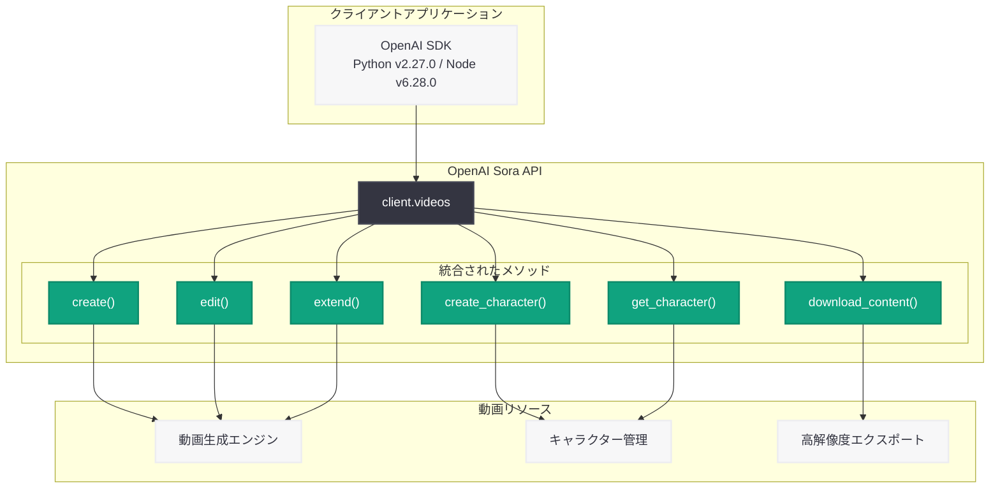
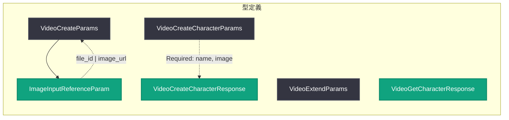

# Sora API の改善: Character API、動画拡張・編集、高解像度エクスポート

## メタデータ

| 項目 | 内容 |
|------|------|
| 発表日 | 2026-03-13 |
| ソース | OpenAI API Changelog (SDK releases) |
| カテゴリ | API 更新 |
| 公式リンク | [OpenAI API Changelog](https://platform.openai.com/docs/changelog) |

## 概要

OpenAI は 2026 年 3 月 13 日、Sora API に対する大幅な改善を含む SDK アップデートをリリースした。Python SDK v2.27.0 および Node SDK v6.28.0 において、動画生成プラットフォーム Sora の API に 3 つの主要な改善が導入されている。Character API の新設、動画の拡張・編集機能の強化、そして高解像度エクスポートのサポートである。

今回のアップデートでは、従来 `client.videos.character` というサブリソースとして提供されていた Character API が `client.videos.create_character()` および `client.videos.get_character()` というメソッドに統合され、API の構造がよりシンプルになった。また、`ImageInputReferenceParam` 型の新設により、画像参照の指定方法が統一された。

## 主な内容

### Character API の統合と改善

従来、Character (キャラクター) の管理は `client.videos.character` サブリソースを通じて行われていたが、今回のアップデートで `client.videos` リソースに直接統合された。これにより、動画生成に使用するキャラクターの作成と取得がよりシンプルな API 呼び出しで実現できるようになった。

- **`create_character()` メソッド:** キャラクターの作成が `client.videos.create_character()` で直接呼び出し可能に
- **`get_character()` メソッド:** キャラクター情報の取得が `client.videos.get_character()` で直接呼び出し可能に
- **型名の変更:** `CharacterCreateParams` が `VideoCreateCharacterParams` に、`CharacterCreateResponse` が `VideoCreateCharacterResponse` にリネーム
- **サブリソースの廃止:** `videos/character.py` および `videos/__init__.py` が削除され、フラットな構造に移行

### 動画拡張・編集機能の強化

動画の拡張 (extension) 機能において、入力の柔軟性が向上した。`VideoExtendParams` の `video` フィールドの説明が「Reference to the completed video to extend.」に更新され、意図がより明確になった。また、`Video` 型エイリアスの Union 順序が変更され、`FileTypes` が優先されるようになった。

- **`video` パラメータの改善:** 拡張対象の動画参照の説明が明確化
- **Union 型の順序変更:** `FileTypes` が `VideoVideoReferenceInputParam` より優先される順序に変更
- **編集 API の継続サポート:** `client.videos.edit()` による動画編集機能の維持

### 高解像度エクスポートのサポート

動画のエクスポート機能において、より高い解像度での出力がサポートされるようになった。これにより、Sora で生成した動画をプロダクション品質で利用する際の選択肢が広がった。

### ImageInputReferenceParam 型の新設

動画生成時の画像参照を統一的に扱うための新しい型 `ImageInputReferenceParam` が追加された。この型は `file_id` または `image_url` (完全修飾 URL またはbase64 エンコード Data URL) を指定でき、従来の `InputReferenceImageRefParam2` を置き換える。

## 技術的な詳細

### SDK の変更概要

**Python SDK v2.27.0 の主な変更:**

| ファイル | 変更内容 |
|---------|---------|
| `src/openai/resources/videos.py` | サブリソースからフラットな構造にリネーム・統合 |
| `src/openai/types/video_create_character_params.py` | `CharacterCreateParams` から `VideoCreateCharacterParams` にリネーム |
| `src/openai/types/video_create_character_response.py` | `CharacterCreateResponse` から `VideoCreateCharacterResponse` にリネーム |
| `src/openai/types/video_get_character_response.py` | `CharacterGetResponse` から `VideoGetCharacterResponse` にリネーム |
| `src/openai/types/image_input_reference_param.py` | 新規追加 - 画像参照パラメータの共通型 |
| `src/openai/types/video_create_params.py` | `ImageInputReferenceParam` の利用に変更 |
| `src/openai/types/video_extend_params.py` | ドキュメント改善、Union 型の順序変更 |

**Node SDK v6.28.0 の追加変更:**

- `ResponseInputFile` および `ResponseInputFileContent` 型から `detail` フィールドを削除する修正を含む

### コードサンプル

#### Character API - キャラクターの作成

```python
from openai import OpenAI

client = OpenAI()

# キャラクターの作成 (画像ファイルをアップロード)
with open("character_reference.png", "rb") as image_file:
    character = client.videos.create_character(
        name="Main Character",
        image=image_file,
    )

print(f"Character ID: {character.id}")
print(f"Character Name: {character.name}")
```

#### Character API - キャラクター情報の取得

```python
from openai import OpenAI

client = OpenAI()

# 作成済みキャラクターの取得
character = client.videos.get_character("char_abc123")

print(f"Character ID: {character.id}")
print(f"Character Name: {character.name}")
```

#### 動画生成 - キャラクターと画像参照の使用

```python
from openai import OpenAI

client = OpenAI()

# 画像参照を使用した動画生成
video = client.videos.create(
    model="sora",
    prompt="A character walking through a futuristic city at sunset",
    input_reference={
        "image_url": "https://example.com/reference_image.png"
    },
    size="1080p",
    seconds=10,
)

# ポーリングで完了を待機
completed_video = client.videos.poll(video.id)
print(f"Video Status: {completed_video.status}")
```

#### 動画の拡張 (Extension)

```python
from openai import OpenAI

client = OpenAI()

# 既存の動画を拡張
extended_video = client.videos.extend(
    prompt="Continue the scene with the character entering a building",
    video={
        "id": "video_abc123",
    },
    seconds=5,
)

# 完了までポーリング
completed = client.videos.poll(extended_video.id)
print(f"Extended Video ID: {completed.id}")
```

#### 動画の編集 (Edit)

```python
from openai import OpenAI

client = OpenAI()

# 動画の編集
edited_video = client.videos.edit(
    prompt="Change the background to a rainy atmosphere",
    video="video_abc123",
)

print(f"Edited Video ID: {edited_video.id}")
```

#### 高解像度エクスポート

```python
from openai import OpenAI

client = OpenAI()

# 高解像度でコンテンツをダウンロード
content = client.videos.download_content(
    "video_abc123",
    resolution="1080p",
)

with open("output_video.mp4", "wb") as f:
    f.write(content.content)
```

#### Node SDK でのキャラクター作成

```typescript
import OpenAI from "openai";
import * as fs from "fs";

const client = new OpenAI();

async function createCharacter() {
  const character = await client.videos.createCharacter({
    name: "Main Character",
    image: fs.createReadStream("character_reference.png"),
  });

  console.log(`Character ID: ${character.id}`);
  console.log(`Character Name: ${character.name}`);
}

createCharacter();
```

> **注:** 上記のコード例は SDK のソースコードおよびリリースノートに基づく想定例である。実際のパラメータや動作の詳細は公式ドキュメントを参照すること。

## アーキテクチャ

### API 構造の変更



### 型の依存関係



## 開発者への影響

### 破壊的変更への対応

今回のアップデートには破壊的な変更が含まれているため、既存の Sora API 利用者は以下の対応が必要である。

- **`client.videos.character.create()` の廃止:** `client.videos.create_character()` に移行が必要
- **`client.videos.character.get()` の廃止:** `client.videos.get_character()` に移行が必要
- **型名のインポートパス変更:** `openai.types.videos` から `openai.types` への変更が必要

### API 構造のシンプル化

Character API がサブリソースからメインリソースのメソッドに統合されたことで、API の呼び出し構造がフラットになり、コードの見通しが向上する。

- ネストされたリソースアクセスが不要に
- 型のインポートパスが統一され、管理が容易に
- `ImageInputReferenceParam` の共通化により、画像参照の指定方法が一貫性を持つ

### 動画ワークフローの強化

動画拡張・編集機能の改善と高解像度エクスポートのサポートにより、Sora を使った動画制作ワークフローがより実用的になった。

- 動画の段階的な拡張が可能に
- 高解像度出力によりプロダクション用途への対応が拡大
- 画像参照を活用した動画生成の柔軟性が向上

### Node SDK の型修正

Node SDK v6.28.0 では、`ResponseInputFile` および `ResponseInputFileContent` 型から `detail` フィールドが削除された。Responses API でこれらの型を使用している場合は、`detail` フィールドへの参照を削除する必要がある。

## 関連リンク

- [OpenAI API Changelog](https://platform.openai.com/docs/changelog)
- [Python SDK v2.27.0 リリースノート](https://github.com/openai/openai-python/releases/tag/v2.27.0)
- [Node SDK v6.28.0 リリースノート](https://github.com/openai/openai-node/releases/tag/v6.28.0)
- [Python SDK Sora API コミット](https://github.com/openai/openai-python/commit/58b70d304a4b2cf70eae4db4b448d439fc8b8ba3)
- [Node SDK Sora API コミット](https://github.com/openai/openai-node/commit/262dac25aec6c9caa561f57a0b9e2a086f47a26a)
- [OpenAI API リファレンス](https://platform.openai.com/docs/api-reference)

## まとめ

Sora API の今回の改善は、API 構造のシンプル化と機能拡張の両面で重要なアップデートである。Character API のサブリソースからメインリソースへの統合により、開発者はよりシンプルなコードで動画生成キャラクターを管理できるようになった。`ImageInputReferenceParam` 型の新設は画像参照の統一的な取り扱いを実現し、動画拡張パラメータの改善と高解像度エクスポートのサポートにより、Sora の動画制作ワークフローの実用性が大幅に向上した。既存の Sora API 利用者はサブリソースの廃止に伴うコード修正が必要だが、移行後はよりクリーンで保守性の高いコードベースを実現できる。
