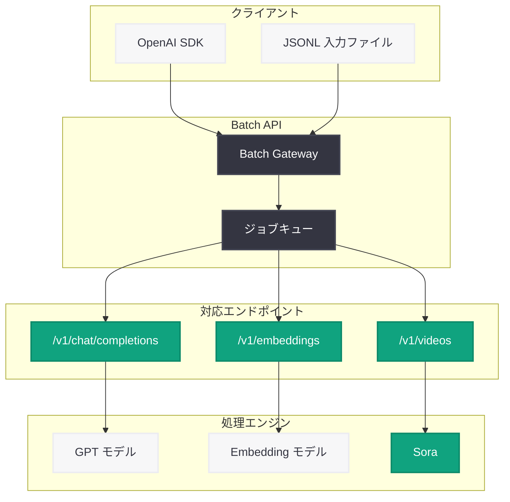

# OpenAI API 更新: フィルター演算子の拡張、Batch API 動画対応、ツール遅延読み込み

## メタデータ

| 項目 | 内容 |
|------|------|
| 発表日 | 2026-03-16 |
| ソース | OpenAI API Changelog (via OpenAI Node SDK v6.30.0 / v6.31.0) |
| カテゴリ | API 更新 |
| 公式リンク | [OpenAI Node SDK](https://github.com/openai/openai-node) |

## 概要

OpenAI は 2026 年 3 月 16 日、Node SDK v6.30.0 および v6.31.0 のリリースを通じて、3 つの重要な API 更新を発表した。ComparisonFilter に `in` / `nin` 演算子が追加されベクトルストア検索のフィルタリングが強化されたほか、Batch API が `/v1/videos` エンドポイントに対応し Sora 動画生成のバッチ処理が可能になった。さらに、NamespaceTool に `defer_loading` フィールドが追加され、エージェントのツール遅延読み込みによる起動パフォーマンスの改善が実現された。

これらの更新は、検索精度の向上、動画生成ワークフローの効率化、エージェント開発の最適化という 3 つの側面で開発者体験を向上させるものである。

## 主な内容

### ComparisonFilter の in/nin 演算子追加 (v6.31.0)

ComparisonFilter 型に新しいフィルター演算子 `in` (含まれる) と `nin` (含まれない) が追加された。これにより、ベクトルストア検索やファイル検索において、フィールドの値が指定した集合に含まれるか否かで絞り込むことが可能になる。

従来は `eq` (等しい) や `ne` (等しくない) などの単一値比較のみがサポートされていたが、`in` / `nin` の導入により、複数の値を一度に指定した柔軟なフィルタリングが実現された。これは、カテゴリ別のドキュメント検索やタグベースのフィルタリングなど、実用的なユースケースで特に有効である。

### Batch API の /v1/videos エンドポイント対応 (v6.30.0)

Batch API が `/v1/videos` エンドポイントをサポートし、Sora による動画生成リクエストのバッチ処理が可能になった。これにより、開発者は複数の動画生成ジョブをまとめて送信し、一括処理することでコストを削減できる。

Batch API は従来から `/v1/chat/completions` や `/v1/embeddings` などのエンドポイントをサポートしていたが、動画生成エンドポイントの追加により、マルチメディアコンテンツの大規模生成ワークフローがさらに効率化される。

### NamespaceTool の defer_loading フィールド (v6.30.0)

NamespaceTool に新しい `defer_loading` フィールドが追加された。このフィールドを `True` に設定すると、ツールが初期化時ではなく初回使用時にオンデマンドで読み込まれるようになる。

多数のツールを登録したエージェントにおいて、すべてのツールを起動時に読み込むとパフォーマンスに影響が出る場合がある。`defer_loading` を活用することで、実際に使用されるツールのみが必要なタイミングで読み込まれ、エージェントの起動時間が短縮される。

## 技術的な詳細

### in/nin フィルター演算子の仕様

新しい演算子は ComparisonFilter の `comparator` フィールドで指定する。`value` フィールドには配列を渡し、フィールドの値がその配列に含まれるか (in) または含まれないか (nin) を判定する。

| 演算子 | 説明 | value の型 |
|--------|------|-----------|
| `in` | 値が指定した集合に含まれる | 配列 |
| `nin` | 値が指定した集合に含まれない | 配列 |

### コードサンプル

#### in/nin フィルターを使用したベクトルストア検索

```python
from openai import OpenAI
client = OpenAI()

# Using 'in' filter for vector store search
results = client.vector_stores.search(
    vector_store_id="vs_abc123",
    query="security best practices",
    filters={
        "type": "comparison",
        "key": "category",
        "comparator": "in",
        "value": ["security", "compliance", "best-practices"]
    }
)
```

#### Batch API による動画生成のバッチ処理

```python
# Batch API with /v1/videos endpoint
batch = client.batches.create(
    input_file_id="file-abc123",
    endpoint="/v1/videos",
    completion_window="24h"
)
```

#### NamespaceTool の遅延読み込み

```python
# Using defer_loading for on-demand tool loading
tools = [
    {
        "type": "namespace",
        "name": "heavy_tool",
        "defer_loading": True,
        "description": "A tool that loads on first use"
    }
]
```

## アーキテクチャ

以下の図は、Batch API が `/v1/videos` エンドポイントをサポートしたことにより、既存のエンドポイントと並列で動画生成のバッチ処理が可能になった構成を示している。



## 開発者への影響

### 検索機能の強化

- **より柔軟なフィルタリング:** `in` / `nin` 演算子により、複数カテゴリにまたがるドキュメント検索が 1 回のクエリで実行可能になる
- **RAG パイプラインの最適化:** ベクトルストア検索のフィルタリング精度が向上し、Retrieval-Augmented Generation のパフォーマンスが改善される

### 動画生成ワークフローの効率化

- **コスト削減:** Batch API を利用した動画生成は、個別リクエストと比較してコストが削減される
- **大規模処理:** マーケティングコンテンツや教育資料など、大量の動画を一括生成するユースケースに対応
- **非同期処理:** 24 時間の完了ウィンドウ内でバックグラウンド処理が行われるため、リアルタイム性が不要なワークフローに最適

### エージェント開発の最適化

- **起動時間の短縮:** `defer_loading` により、多数のツールを持つエージェントの初期化が高速化される
- **リソース効率の向上:** 使用されないツールの読み込みを回避することで、メモリ使用量が削減される

### SDK アップグレード

- Node SDK v6.31.0 以上で `in` / `nin` フィルターが利用可能
- Node SDK v6.30.0 以上で Batch API の `/v1/videos` 対応と `defer_loading` が利用可能
- Python SDK でも同様の更新が順次反映される見込み

## 関連リンク

- [OpenAI Node SDK リリースノート](https://github.com/openai/openai-node/releases)
- [OpenAI API Changelog](https://platform.openai.com/docs/changelog)
- [Batch API ガイド](https://platform.openai.com/docs/guides/batch)
- [Vector Store 検索 API リファレンス](https://platform.openai.com/docs/api-reference/vector-stores)
- [OpenAI API リファレンス](https://platform.openai.com/docs/api-reference)

## まとめ

2026 年 3 月 16 日の OpenAI Node SDK v6.30.0 / v6.31.0 リリースにより、3 つの重要な API 更新が提供された。ComparisonFilter への `in` / `nin` 演算子追加はベクトルストア検索の柔軟性を大幅に向上させ、Batch API の `/v1/videos` エンドポイント対応は Sora 動画生成の大規模バッチ処理を可能にした。また、NamespaceTool の `defer_loading` フィールドはエージェントの起動パフォーマンスを改善する。これらの更新は、検索、動画生成、エージェント開発のそれぞれの領域で開発者の生産性とアプリケーションの効率性を向上させるものである。
