# Codex Security が従来の SAST レポートを含まない理由

## メタデータ

| 項目 | 内容 |
|------|------|
| 発表日 | 2026-03-16 |
| ソース | OpenAI Blog |
| カテゴリ | 新機能 / セキュリティ |
| 公式リンク | [openai.com](https://openai.com/index/why-codex-security-doesnt-include-a-sast-report) |

## 概要

OpenAI は 2026 年 3 月 16 日、Codex Security が従来の SAST (Static Application Security Testing) レポートを含まない理由を解説するブログ記事を公開した。Codex Security は、パターンマッチングに依存する従来の SAST ツールとは根本的に異なるアプローチを採用しており、AI による意味理解とコンテキスト認識に基づくセキュリティ分析を提供する。

この記事は、2026 年 3 月 6 日に発表された [Codex Security リサーチプレビュー](./2026-03-06-codex-security-research-preview.md) の設計思想を詳しく説明するものであり、なぜ従来型の脆弱性一覧レポートではなく、コンテキストを考慮したアクショナブルなセキュリティインサイトを提供する方針を選択したかを明らかにしている。

## 主な内容

### 従来の SAST の課題

従来の SAST ツールは、コードベースに対してルールベースのパターンマッチングを実行し、脆弱性の可能性がある箇所を一覧として出力する。このアプローチには以下の根本的な課題がある。

- **高い誤検知率:** パターンマッチングはコードの意図や実行コンテキストを理解できないため、大量の false positive が発生する
- **コンテキストの欠如:** 個々のコード行を独立して評価するため、プロジェクト全体のアーキテクチャやデータフローを考慮した判断ができない
- **ノイズの多いレポート:** 数百から数千件の検出結果が生成され、開発者が真に対処すべき脆弱性を特定するのに多大な時間を要する
- **ルールの陳腐化:** 新しい攻撃パターンや言語機能に対して、ルールの更新が追いつかない場合がある

### Codex Security の AI ネイティブなアプローチ

Codex Security は、ルールベースのスキャンではなく、LLM の能力を活用した AI ネイティブなセキュリティ分析を行う。具体的には以下の特徴を持つ。

- **コードの意味理解:** 構文パターンではなく、コードが何を意図しているかを意味的に理解する
- **コンテキストに基づく評価:** 脆弱性の可能性をプロジェクト全体の文脈の中で評価し、実際に悪用可能かどうかを判断する
- **修正提案の高品質化:** コードベース全体を考慮した上で、プロジェクトのスタイルや規約に準拠した具体的な修正提案を生成する
- **誤検知の大幅な削減:** AI によるコンテキスト理解により、従来の SAST と比較して false positive 率を大幅に低減する

### SAST レポートを含まない設計判断

Codex Security が従来型の SAST レポートを出力しない理由は、単に技術的な制約ではなく、意図的な設計判断である。

1. **レポート疲れの回避:** 大量の検出結果を一覧表示するのではなく、真に重要な問題にフォーカスする
2. **アクショナブルなインサイト:** 脆弱性の指摘にとどまらず、なぜそれが問題であるか、どのように修正すべきかまでを包括的に提示する
3. **開発ワークフローへの統合:** 別途レポートを確認するのではなく、開発プロセスの中でシームレスにセキュリティフィードバックを受け取れるようにする

## 技術的な詳細

### 従来の SAST と Codex Security の比較

| 観点 | 従来の SAST | Codex Security |
|------|-------------|----------------|
| 分析手法 | パターンマッチング / ルールベース | AI 推論 / 意味解析 |
| コンテキスト理解 | 限定的 (ファイル単位) | プロジェクト全体 |
| 誤検知率 | 高い (30-70% 程度) | 大幅に低減 |
| 出力形式 | 脆弱性一覧レポート | コンテキスト付きインサイト |
| 修正提案 | 汎用的なガイダンス | プロジェクト固有の具体的修正 |
| 新規パターン対応 | ルール追加が必要 | AI が自律的に判断 |

### 分析フローの違い

従来の SAST ツールは、定義済みルールセットに基づいてソースコードをスキャンし、マッチした箇所を全て報告する。一方、Codex Security は以下のフローでセキュリティ分析を実行する。

1. **コードベースの理解:** プロジェクト構造、依存関係、設定を包括的に分析
2. **意味的な脆弱性検出:** AI がコードの意図を理解した上で、セキュリティ上の問題を特定
3. **コンテキストベースの検証:** 検出された問題が実際の実行環境で悪用可能かを評価
4. **統合的なフィードバック:** 開発ワークフロー内で直接、修正提案とともに結果を提示

## アーキテクチャ

```mermaid
flowchart TD
    subgraph Traditional["従来の SAST パイプライン"]
        Code1["ソースコード"] --> RuleEngine["ルールエンジン"]
        RuleEngine --> PatternMatch["パターンマッチング"]
        PatternMatch --> VulnList["脆弱性一覧レポート"]
        VulnList --> Triage["手動トリアージ"]
        Triage --> Fix1["手動修正"]
    end

    subgraph Codex["Codex Security パイプライン"]
        Code2["ソースコード"] --> AIAnalysis["AI コンテキスト分析"]
        AIAnalysis --> SemanticEval["意味的セキュリティ評価"]
        SemanticEval --> Validation["自動検証"]
        Validation --> ActionableInsight["アクショナブルインサイト"]
        ActionableInsight --> AutoPatch["修正提案 / 自動パッチ"]
    end

    classDef openai fill:#10A37F,stroke:#0D8A6A,stroke-width:2px,color:white
    classDef dark fill:#343541,stroke:#444654,stroke-width:2px,color:white
    classDef light fill:#F7F7F8,stroke:#ECECF1,stroke-width:2px,color:#343541
    classDef gray fill:#ECECF1,stroke:#D1D1D6,stroke-width:2px,color:#343541

    class AIAnalysis,SemanticEval,Validation openai
    class ActionableInsight,AutoPatch dark
    class Code1,Code2 light
    class RuleEngine,PatternMatch,VulnList,Triage,Fix1 gray
```

## 開発者への影響

### セキュリティワークフローの変革

Codex Security のアプローチにより、開発者のセキュリティ対応ワークフローが根本的に変わる可能性がある。

- **トリアージ作業の削減:** 数百件の SAST レポートを手動で確認する必要がなくなり、真に対処すべき問題に集中できる
- **修正までの時間短縮:** 脆弱性の検出から修正提案の提示まで一貫して行われるため、対応のリードタイムが短縮される
- **開発フローとの統合:** 別ツールでレポートを確認する手間がなく、開発プロセスの中でセキュリティフィードバックを受け取れる

### 既存ツールとの関係

Codex Security は従来の SAST ツールを完全に置き換えるものではなく、補完的に利用することも可能である。コンプライアンス要件で SAST レポートの提出が求められる場合など、従来ツールの併用が必要なケースもある。

### 注意点

- AI ベースの分析であるため、結果の妥当性は人間のレビューで確認すべきである
- 現時点ではリサーチプレビュー段階であり、検出範囲や精度は今後改善される可能性がある
- 規制やコンプライアンスの要件によっては、従来の SAST レポートが依然として必要な場合がある

## 関連リンク

- [Why Codex Security Doesn't Include a SAST Report](https://openai.com/index/why-codex-security-doesnt-include-a-sast-report)
- [Codex Security リサーチプレビュー](./2026-03-06-codex-security-research-preview.md)
- [OpenAI Codex](https://openai.com/codex)
- [OWASP Top 10](https://owasp.org/www-project-top-ten/)

## まとめ

OpenAI は、Codex Security が従来の SAST レポートを含まない理由を、技術的な制約ではなく意図的な設計判断として説明した。パターンマッチングに依存する従来の SAST は高い誤検知率やコンテキストの欠如という根本的な課題を抱えており、Codex Security は AI ネイティブなアプローチでこれらの課題を解決する。コードの意味理解、プロジェクト全体のコンテキスト認識、そしてアクショナブルなインサイトの提供により、開発者のセキュリティ対応を効率化し、開発ワークフローにセキュリティをシームレスに統合することを目指している。
