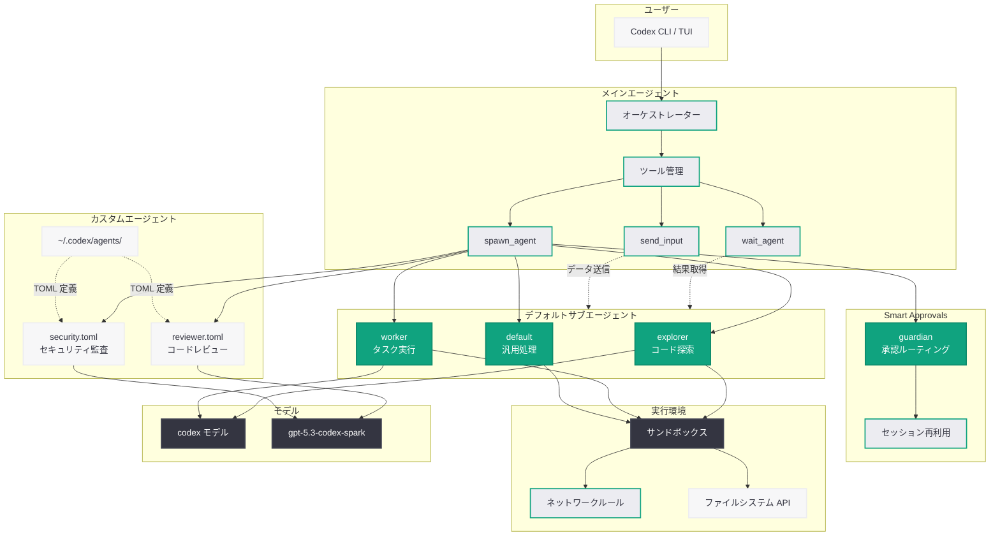

# Codex v0.115.0: サブエージェント GA とカスタムエージェント定義の導入

## メタデータ

| 項目 | 内容 |
|------|------|
| 発表日 | 2026-03-16 |
| ソース | OpenAI Blog |
| カテゴリ | 新機能 |
| 公式リンク | [openai.com](https://openai.com/index/subagents) |

## 概要

OpenAI は Codex v0.115.0 をリリースし、サブエージェント機能の一般提供 (GA) を開始した。これまでフィーチャーフラグで管理されていたサブエージェントが正式に安定版となり、explorer、worker、default の 3 つのデフォルトサブエージェントが標準搭載された。ツール名も `spawn_agent`、`wait_agent`、`send_input` として統一され、一貫性のある API 体験が提供される。

さらに、ユーザーが `~/.codex/agents/` ディレクトリに TOML 形式でカスタムエージェントを定義できる機能が追加された。gpt-5.3-codex-spark を含む特定モデルへのバインドが可能となり、ワークフローに応じた専用エージェントの構築が実現する。加えて、Smart Approvals による承認フローの効率化、リアルタイム WebSocket セッション、v2 ファイルシステム API など、多数の機能強化が含まれている。

## 主な内容

### サブエージェントの一般提供 (GA)

Codex のサブエージェント機能がフィーチャーフラグから正式に安定版へ移行した。メインエージェントは `spawn_agent` ツールを使用してサブエージェントを生成し、`wait_agent` で完了を待機、`send_input` で実行中のサブエージェントにデータを送信できる。デフォルトで提供されるサブエージェントは以下の 3 種類である。

- **explorer:** コードベースの探索と情報収集を担当
- **worker:** 実際のコード変更やタスク実行を担当
- **default:** 汎用的なタスク処理を担当

ツール名が `wait_agent` に統一されたことで、`spawn_agent` および `send_input` との命名規則が一貫し、開発者にとって直感的な API 設計となっている。

### カスタムエージェント定義

ユーザーは `~/.codex/agents/` ディレクトリに TOML ファイルを配置することで、独自のエージェントを定義できるようになった。カスタムエージェントは特定のモデル (gpt-5.3-codex-spark など) にバインド可能で、プロジェクトやワークフローに最適化されたエージェント構成を実現する。

### Smart Approvals

Guardian サブエージェントがレビューリクエストのルーティングを担当し、フォローアップ承認における反復的なセットアップ作業を削減する。Guardian セッションは承認間で再利用されるため、コンテキストを維持したまま効率的な承認プロセスが可能となる。

### リアルタイム WebSocket セッション

専用のトランスクリプションモード、`codex` ツールを通じた v2 ハンドオフサポート、統一された `[realtime]` セッション設定により、リアルタイム通信機能が強化された。

### v2 App-Server ファイルシステム API

ファイルの読み書き、コピー、ディレクトリ操作、パス監視のための RPC が公開され、新しい Python SDK も提供されている。これにより、アプリケーションサーバーとの連携がより柔軟になった。

### アプリケーション統合の改善

Responses API のツール検索フローが採用され、不足しているツールの提案機能や、モデルが検索ベースのルックアップをサポートしない場合のフォールバック機能が追加された。

### js_repl の改善

`codex.cwd` と `codex.homeDir` が公開され、セル間で参照が永続化されるようになった。これにより JavaScript REPL 環境での作業がより効率的になる。

### フル解像度画像検査

モデルが `view_image` ツールおよび `codex.emitImage(..., detail: "original")` を通じてオリジナル解像度の画像を取得できるようになり、画像分析の精度が向上した。

### バグ修正

- サブエージェントがサンドボックスおよびネットワークルールを確実に継承するよう修正
- サブエージェント作成後の TUI 終了時のスタール問題を解消
- MCP フローの堅牢性を向上

## 技術的な詳細

### カスタムエージェントの TOML 定義

以下は `~/.codex/agents/` に配置するカスタムエージェント定義の例である。

```toml
# ~/.codex/agents/reviewer.toml
# コードレビュー専用のカスタムエージェント定義

name = "reviewer"
description = "コードレビューと品質チェックを担当するエージェント"
model = "gpt-5.3-codex-spark"

[instructions]
system = """
あなたはコードレビューの専門家です。
以下の観点でコードを分析してください:
- セキュリティ上の問題
- パフォーマンスの改善点
- コーディング規約への準拠
"""

[sandbox]
network = false
writable_paths = ["/tmp"]

[tools]
allowed = ["read_file", "grep", "view_image"]
```

### サブエージェントの生成と待機

サブエージェントの操作は `spawn_agent`、`wait_agent`、`send_input` の 3 つのツールで構成される。

```python
# サブエージェントの概念的な動作フロー
# (Codex 内部で使用されるツール呼び出しの擬似コード)

# 1. サブエージェントの生成
spawn_agent(
    agent="explorer",
    task="src/ ディレクトリ内のすべての API エンドポイントを列挙してください"
)

# 2. 別のサブエージェントを並列に生成
spawn_agent(
    agent="worker",
    task="テストスイートを実行し、失敗しているテストを特定してください"
)

# 3. サブエージェントの完了を待機
explorer_result = wait_agent(agent="explorer")
worker_result = wait_agent(agent="worker")

# 4. 実行中のサブエージェントにデータを送信
send_input(
    agent="worker",
    input="explorer が発見したエンドポイント一覧: " + explorer_result
)
```

### Guardian によるSmart Approvals フロー

```python
# Guardian サブエージェントによる承認フローの概念
spawn_agent(
    agent="guardian",
    task="以下の変更に対するレビューリクエストをルーティングしてください"
)

# Guardian セッションは承認間で再利用される
# フォローアップ承認では新規セットアップが不要
send_input(
    agent="guardian",
    input={"action": "approve", "changes": diff_content}
)
```

### v2 ファイルシステム API (Python SDK)

```python
from codex.app_server import FileSystemClient

fs = FileSystemClient()

# ファイル読み取り
content = fs.read_file("/workspace/src/main.py")

# ファイル書き込み
fs.write_file("/workspace/src/utils.py", new_content)

# ディレクトリ操作
fs.copy("/workspace/src/", "/workspace/backup/")

# パス監視
watcher = fs.watch("/workspace/src/")
for event in watcher:
    print(f"変更検出: {event.path} ({event.type})")
```

## アーキテクチャ

以下の図は、Codex サブエージェントアーキテクチャの全体構造を示している。



## 開発者への影響

### サブエージェントによる並列タスク処理

- サブエージェントの GA により、複雑なタスクを複数のエージェントに分割して並列実行できるようになった。コード探索と変更作業を同時に進行させることで、タスク完了時間の短縮が期待される
- ツール名の統一 (`spawn_agent` / `wait_agent` / `send_input`) により、サブエージェント操作の学習コストが低減された

### カスタムエージェントによるワークフロー最適化

- TOML 形式でのエージェント定義により、プロジェクト固有のニーズに合わせた専用エージェントを簡単に作成可能
- gpt-5.3-codex-spark などの特定モデルへのバインドにより、タスクに最適なモデルを選択できる
- チーム内でエージェント定義ファイルを共有することで、標準化されたワークフローの構築が可能

### セキュリティとガバナンスの強化

- サブエージェントがサンドボックスおよびネットワークルールを確実に継承するようになり、セキュリティポリシーの一貫性が向上
- Guardian サブエージェントによる Smart Approvals は、コード変更の承認プロセスを効率化しつつ、適切なレビュー体制を維持する

### ファイルシステム API の活用

- v2 App-Server ファイルシステム API と Python SDK により、外部アプリケーションから Codex の実行環境に対するファイル操作が容易になった
- パス監視機能を活用したリアクティブなワークフローの構築が可能

## 関連リンク

- [OpenAI Subagents](https://openai.com/index/subagents)
- [Codex v0.115.0 リリースノート](https://github.com/openai/codex/releases/tag/rust-v0.115.0)
- [Unrolling the Codex Agent Loop](https://openai.com/index/unrolling-the-codex-agent-loop/)
- [Codex for Open Source](https://openai.com/index/codex-for-open-source/)
- [OpenAI Codex](https://openai.com/codex)
- [OpenAI API リファレンス](https://platform.openai.com/docs/api-reference)

## まとめ

Codex v0.115.0 は、サブエージェント機能の一般提供とカスタムエージェント定義を中心とした大規模なアップデートである。`spawn_agent` / `wait_agent` / `send_input` の統一されたツール体系により、メインエージェントが explorer、worker、guardian などのサブエージェントを生成・管理して複雑なタスクを効率的に処理できるようになった。TOML 形式のカスタムエージェント定義は、gpt-5.3-codex-spark を含む特定モデルへのバインドを可能にし、プロジェクト固有のワークフローに最適化されたエージェント構成を実現する。Smart Approvals、リアルタイム WebSocket セッション、v2 ファイルシステム API、フル解像度画像検査など、開発者体験を大幅に向上させる多数の機能強化が含まれており、Codex のエージェントプラットフォームとしての成熟度を示すリリースとなっている。
