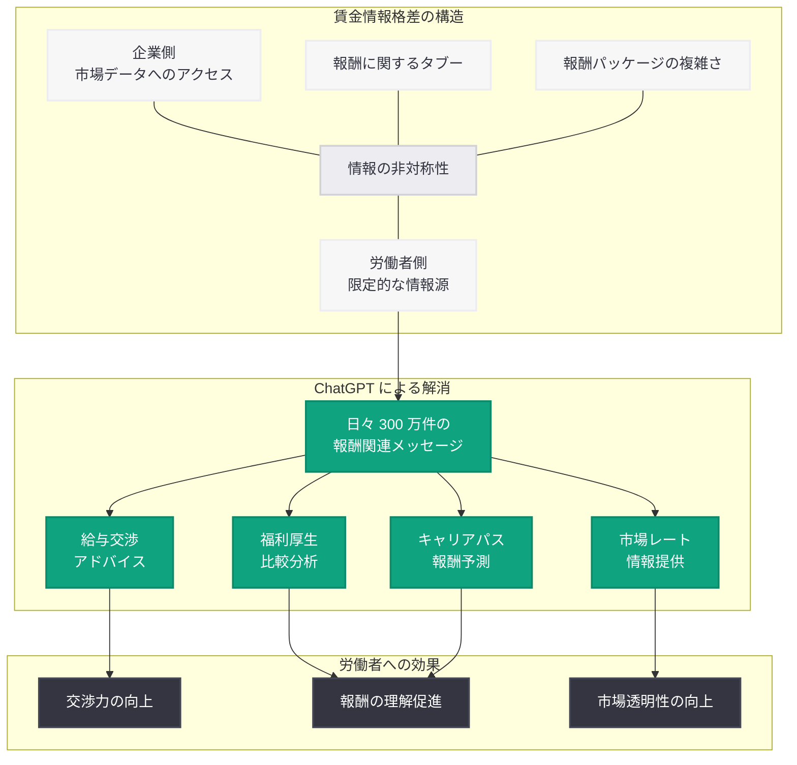

# ChatGPT が労働者の報酬情報格差を解消する

## メタデータ

| 項目 | 内容 |
|------|------|
| 発表日 | 2026-03-17 |
| ソース | OpenAI Blog |
| カテゴリ | グローバルアフェアーズ / リサーチ |
| 公式リンク | [openai.com](https://openai.com/index/equipping-workers-with-insights-about-compensation) |

## 概要

OpenAI は 2026 年 3 月 17 日、アメリカ人が日々約 300 万件の報酬や収入に関するメッセージを ChatGPT に送信しているという調査結果を公開した。この研究は、労働市場における賃金情報の非対称性 (wage information gap) を ChatGPT がどのように解消しつつあるかを明らかにしている。

従来、労働者は自分の報酬が適正かどうかを判断するための情報へのアクセスが限られていた。ChatGPT が報酬に関する質問への回答ツールとして広く活用されることで、労働者がより情報に基づいた意思決定を行えるようになり、労働市場の透明性向上に貢献している。

## 主な内容

### 調査結果: 日々 300 万件の報酬関連メッセージ

今回の調査により、アメリカの ChatGPT ユーザーが毎日約 300 万件の報酬・収入に関するメッセージを送信していることが判明した。この数字は、労働者が報酬情報を積極的に求めている現状と、ChatGPT がその情報源として重要な役割を担っていることを示している。

主な質問カテゴリは以下のとおりである。

- **給与交渉:** 昇給交渉の戦略、適切な給与の提示額、交渉時の表現方法
- **市場レート:** 特定の職種・地域・経験年数に基づく給与相場の確認
- **福利厚生の比較:** 複数のオファーにおける給与・ボーナス・株式報酬・退職金制度の比較
- **キャリアパスと報酬:** 転職・昇進に伴う報酬の変動予測
- **税金・手取り:** 報酬パッケージの税引後の実質価値

### 賃金情報格差の問題

賃金情報格差とは、雇用者と労働者の間に存在する報酬に関する情報の非対称性を指す。この格差はいくつかの構造的要因から生じている。

1. **情報の非対称性:** 企業は市場全体の報酬データにアクセスできるが、個々の労働者はそのようなデータを容易に入手できない
2. **報酬に関するタブー:** 多くの職場文化では同僚間での給与の話し合いが避けられる傾向がある
3. **専門知識の不足:** 報酬パッケージの構成要素 (基本給、ボーナス、RSU、福利厚生) を総合的に評価するには専門的な知識が必要である
4. **地域・業界差:** 同じ職種でも地域や業界によって報酬水準が大きく異なり、正確な比較が困難である

### ChatGPT による情報格差の解消

ChatGPT は以下の方法で賃金情報格差の解消に貢献している。

- **24 時間アクセス可能な報酬アドバイザー:** 専門家への相談が困難な状況でも、いつでも報酬に関する質問ができる
- **個別化された回答:** ユーザーの具体的な状況 (職種、経験年数、地域) に応じたカスタマイズされた情報を提供
- **複雑な報酬パッケージの解説:** ストックオプション、RSU、退職金制度など、理解が難しい報酬要素をわかりやすく説明
- **交渉スキルの向上:** 給与交渉のシミュレーションや戦略的なアドバイスを提供

### 労働者への影響

ChatGPT を報酬情報ツールとして活用することで、労働者には以下のような恩恵がもたらされている。

- **給与交渉力の向上:** 市場データに基づいた根拠のある交渉が可能になる
- **福利厚生の理解促進:** 複雑な福利厚生パッケージの価値を正しく評価できるようになる
- **キャリア判断の質の向上:** 転職や昇進の際に報酬面から情報に基づいた判断ができる
- **格差の可視化:** 性別、人種、地域による報酬格差についての認識が高まる

### プライバシーとデータに関する考慮事項

報酬に関する質問は極めて個人的な情報を含むため、プライバシーへの配慮が重要である。

- **個人情報の取り扱い:** ChatGPT とのやり取りにおいて、ユーザーが共有する報酬情報のプライバシー保護が求められる
- **データの匿名性:** 集計データとしての利用と個人を特定可能な情報の保護のバランス
- **正確性への責任:** AI が提供する報酬情報の正確性と、それに基づいて意思決定を行うユーザーへの適切な注意喚起

## アーキテクチャ

## 社会的影響と政策的示唆

### 労働市場の透明性への貢献

ChatGPT が報酬情報のアクセスを民主化することで、労働市場全体の透明性が向上する可能性がある。

- **賃金格差の縮小:** 情報格差が縮小することで、不当に低い報酬を受け入れるケースが減少する可能性がある
- **市場の効率化:** 労働者がより正確な報酬情報を持つことで、労働市場の価格発見機能が改善される
- **政策議論への貢献:** 大規模な報酬関連データの傾向は、賃金政策や労働法制の議論にも示唆を与えうる

### 今後の課題

- AI が提供する報酬情報の正確性と信頼性の継続的な向上
- 報酬データのバイアス (地域、業界、職種の偏り) への対処
- プライバシー保護と有用性のバランスの最適化
- 情報アクセスの公平性 (ChatGPT を利用できない層への配慮)

## 関連リンク

- [Equipping Workers with Insights about Compensation](https://openai.com/index/equipping-workers-with-insights-about-compensation)
- [OpenAI News](https://openai.com/news)

## まとめ

OpenAI の調査により、アメリカ人が日々約 300 万件の報酬関連メッセージを ChatGPT に送信していることが明らかになった。この数字は、労働市場における賃金情報格差が深刻であり、労働者が適正な報酬を知るためのツールを強く求めていることを示している。ChatGPT は、給与交渉のアドバイス、市場レートの提供、福利厚生の比較分析といった形で労働者を支援し、報酬に関する情報の非対称性を解消する役割を果たしている。プライバシーへの配慮や情報の正確性といった課題はあるものの、AI を活用した報酬情報の民主化は労働市場の透明性向上に大きく貢献する可能性を持っている。
