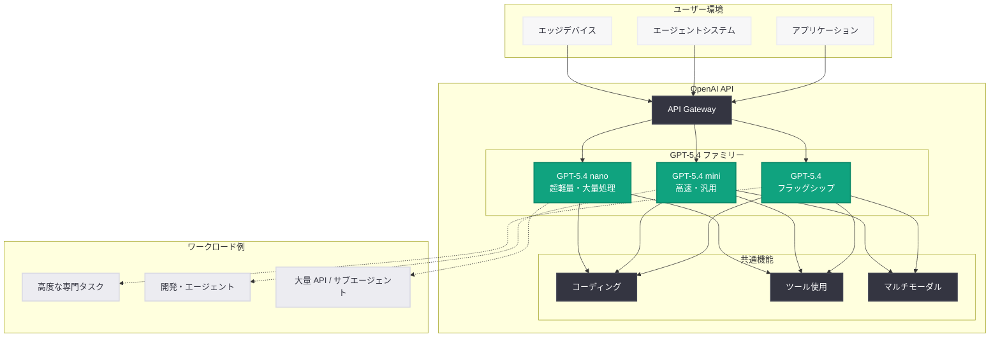

# GPT-5.4 mini / nano の発表: 高速・低コストの小型フロンティアモデル

## メタデータ

| 項目 | 内容 |
|------|------|
| 発表日 | 2026-03-17 |
| ソース | OpenAI News/Blog |
| カテゴリ | Company |
| 公式リンク | [openai.com](https://openai.com/index/introducing-gpt-5-4-mini-and-nano) |

## 概要

OpenAI は 2026 年 3 月 17 日、フラッグシップモデル GPT-5.4 の小型バリアントとなる「GPT-5.4 mini」と「GPT-5.4 nano」を発表した。これらは GPT-5.4 から蒸留 (distillation) された軽量モデルであり、コーディング、ツール使用、マルチモーダル推論において高い性能を維持しつつ、大幅に低いレイテンシとコストを実現している。

GPT-5.4 mini はコーディングやツール使用、マルチモーダル推論に最適化された小型モデルであり、GPT-5.4 nano はさらに小型化され、大量 API 呼び出しやサブエージェントワークロードに特化している。いずれも 2026 年 3 月 5 日に発表された GPT-5.4 のコア技術を継承しながら、コスト効率と応答速度を重視した設計となっている。

## 主な内容

### GPT-5.4 mini: コーディング・ツール使用に最適化された小型モデル

GPT-5.4 mini は、GPT-5.4 のコーディング能力、ツール使用能力、マルチモーダル推論能力を継承しつつ、より小型で高速なモデルとして設計されている。

- **コーディング性能:** GPT-5.4 に近いコーディング精度を維持しながら、応答速度を大幅に向上
- **ツール使用:** Function Calling やツール検索において高い精度を実現し、エージェントワークフローに適した設計
- **マルチモーダル推論:** テキスト、画像、コードを横断した推論能力を備え、多様なタスクに対応
- **コスト効率:** GPT-5.4 と比較して大幅に低いトークン単価を実現

### GPT-5.4 nano: 大量処理・サブエージェント向け超軽量モデル

GPT-5.4 nano は、GPT-5.4 ファミリーの中で最も小型かつ高速なモデルであり、大量 API 呼び出しやサブエージェントアーキテクチャでの利用を想定している。

- **超低レイテンシ:** 応答までの時間を最小化し、リアルタイム処理に対応
- **大量処理に最適:** 高スループットの API ワークロードに対してコスト効率が最も高い
- **サブエージェント向け:** マルチエージェントシステムにおける軽量なサブタスク実行に特化
- **エッジデプロイメント:** リソースが限られた環境での推論にも対応可能

### GPT-5.4 ファミリーの性能比較

| 特性 | GPT-5.4 | GPT-5.4 mini | GPT-5.4 nano |
|------|---------|--------------|--------------|
| コーディング | 最高精度 | 高精度 | 標準精度 |
| ツール使用 | 最高精度 | 高精度 | 標準精度 |
| マルチモーダル | 完全対応 | 完全対応 | 基本対応 |
| コンテキスト長 | 1M トークン | 対応 | 対応 |
| レイテンシ | 標準 | 低レイテンシ | 超低レイテンシ |
| コスト | 高 | 中 | 低 |
| 推奨用途 | 高度な専門タスク | 汎用開発・エージェント | 大量処理・サブエージェント |

## 技術的な詳細

### API モデル名

GPT-5.4 mini と GPT-5.4 nano は、OpenAI API の Chat Completions エンドポイントから以下のモデル名で利用可能である。

- **GPT-5.4 mini:** `gpt-5.4-mini`
- **GPT-5.4 nano:** `gpt-5.4-nano`

### コードサンプル: GPT-5.4 mini の基本的な利用

```python
from openai import OpenAI

client = OpenAI()

# GPT-5.4 mini によるコード生成
response = client.chat.completions.create(
    model="gpt-5.4-mini",
    messages=[
        {
            "role": "system",
            "content": "You are an expert Python developer."
        },
        {
            "role": "user",
            "content": "Write a function that implements binary search on a sorted list."
        }
    ],
    max_tokens=2048
)

print(response.choices[0].message.content)
```

### コードサンプル: GPT-5.4 nano をサブエージェントとして利用

```python
from openai import OpenAI

client = OpenAI()


def run_sub_agent(task: str) -> str:
    """GPT-5.4 nano をサブエージェントとして軽量タスクを実行する"""
    response = client.chat.completions.create(
        model="gpt-5.4-nano",
        messages=[
            {
                "role": "system",
                "content": "You are a fast, efficient sub-agent. Complete the task concisely."
            },
            {
                "role": "user",
                "content": task
            }
        ],
        max_tokens=512
    )
    return response.choices[0].message.content


# マルチエージェントアーキテクチャでの活用例
sub_tasks = [
    "Summarize the key points of this error log: ConnectionTimeout after 30s",
    "Classify this user intent: 'I want to cancel my subscription'",
    "Extract the date from: 'The meeting is scheduled for March 20, 2026'",
]

for task in sub_tasks:
    result = run_sub_agent(task)
    print(f"Task: {task[:50]}...")
    print(f"Result: {result}\n")
```

### コードサンプル: GPT-5.4 mini での Function Calling

```python
import json
from openai import OpenAI

client = OpenAI()

tools = [
    {
        "type": "function",
        "function": {
            "name": "get_weather",
            "description": "Get the current weather for a location",
            "parameters": {
                "type": "object",
                "properties": {
                    "location": {
                        "type": "string",
                        "description": "The city and country"
                    }
                },
                "required": ["location"]
            }
        }
    }
]

response = client.chat.completions.create(
    model="gpt-5.4-mini",
    messages=[
        {"role": "user", "content": "What's the weather like in Tokyo?"}
    ],
    tools=tools,
    tool_choice="auto"
)

tool_call = response.choices[0].message.tool_calls[0]
print(f"Function: {tool_call.function.name}")
print(f"Arguments: {json.loads(tool_call.function.arguments)}")
```

> **注:** 上記のコード例は一般的な利用パターンの想定であり、実際の料金やパラメータの詳細は公式ドキュメントを参照してください。

## アーキテクチャ



## 開発者への影響

### コスト最適化の新たな選択肢

GPT-5.4 mini と nano の登場により、開発者はタスクの複雑さに応じてモデルを使い分けることが可能になった。

- **コスト削減:** 高度な推論が不要なタスクでは mini や nano を選択することで、API コストを大幅に削減可能
- **モデルルーティング:** タスクの難易度に応じて GPT-5.4、mini、nano を動的に振り分けるアーキテクチャの構築が推奨される
- **バッチ処理の効率化:** 大量のデータ処理やバッチジョブにおいて nano を活用することでスループットを最大化

### マルチエージェントアーキテクチャの実現

GPT-5.4 nano は、マルチエージェントシステムにおけるサブエージェントとしての活用に最適化されている。

- **オーケストレーター + サブエージェント:** GPT-5.4 をオーケストレーターとし、nano をサブエージェントとするハイブリッドアーキテクチャが効果的
- **並列処理:** 複数の nano インスタンスを並列実行し、タスクの分散処理を実現
- **コスト効率の高いエージェント:** サブエージェントの呼び出しコストを最小化することで、大規模なエージェントシステムの運用が現実的に

### 移行時の考慮事項

- GPT-5.4 から mini / nano への移行では、タスクごとの性能検証が推奨される
- 高度な推論を要するタスクでは GPT-5.4 のままとし、定型的なタスクに mini / nano を適用する段階的な移行が効果的
- レイテンシ要件が厳しいリアルタイムアプリケーションでは nano の採用を優先的に検討すべき

## 関連リンク

- [GPT-5.4 mini / nano 公式発表ページ](https://openai.com/index/introducing-gpt-5-4-mini-and-nano)
- [GPT-5.4 公式発表ページ](https://openai.com/index/introducing-gpt-5-4)
- [OpenAI API ドキュメント](https://platform.openai.com/docs)
- [OpenAI モデル一覧](https://platform.openai.com/docs/models)
- [OpenAI Pricing](https://openai.com/pricing)

## まとめ

GPT-5.4 mini と GPT-5.4 nano は、フラッグシップモデル GPT-5.4 の技術を継承した小型バリアントであり、コスト効率と応答速度を重視するワークロードに最適化されている。GPT-5.4 mini はコーディング、ツール使用、マルチモーダル推論において高い性能を維持しつつ低コストで利用可能であり、GPT-5.4 nano はさらに軽量化され、大量 API 呼び出しやサブエージェントアーキテクチャに特化している。開発者はタスクの要件に応じて GPT-5.4 ファミリーの 3 つのモデルを使い分けることで、性能とコストの最適なバランスを実現できる。特にマルチエージェントシステムの構築において、GPT-5.4 をオーケストレーターとし nano をサブエージェントとする構成は、コスト効率と実用性の両面で大きな可能性を持つ。
