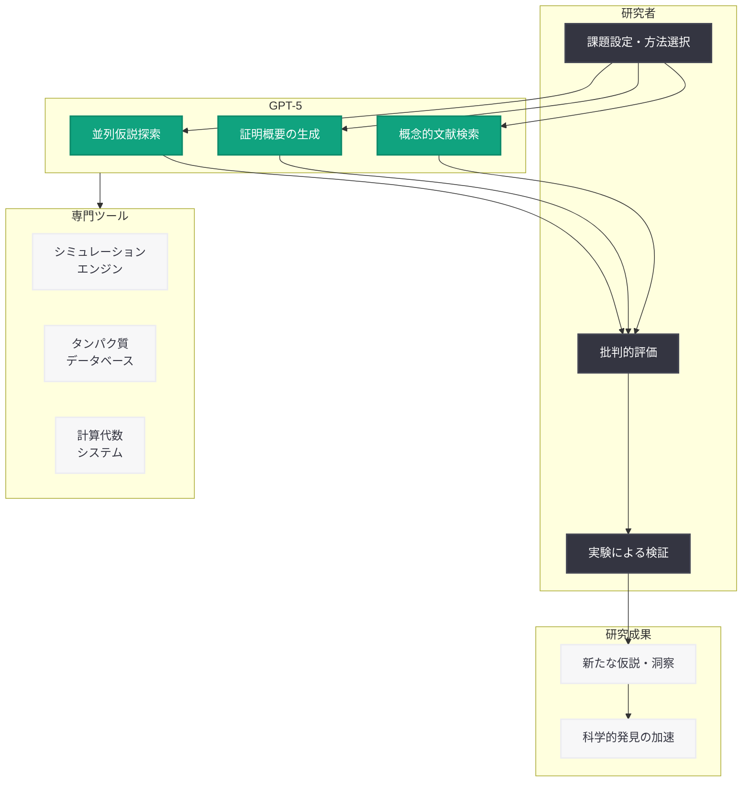

# GPT-5 による科学研究の加速 -- 数学・物理学・生物学にわたる初期実験の成果

## メタデータ

| 項目 | 内容 |
|------|------|
| 発表日 | 2026-03-18 |
| ソース | OpenAI Research |
| カテゴリ | 研究成果 |
| 公式リンク | [openai.com](https://openai.com/index/accelerating-science-gpt-5/) |

## 概要

OpenAI は 2026 年 3 月 18 日、GPT-5 が科学研究をどのように加速するかを示す初の研究ケーススタディ集を発表した。数学、物理学、生物学、コンピュータサイエンス、天文学、材料科学にわたる複数の分野で、大学・国立研究所との共同研究を通じて GPT-5 が研究プロセスに具体的な貢献を果たした事例が報告されている。

本発表は、AI が科学研究における「幅広さ・速度・並列探索」を提供し、研究者の仮説検証や発見のペースを根本的に変革し得ることを実証する画期的な取り組みである。従来数ヶ月を要した分析を数分で完了させ、数十年来の未解決問題を突破するなど、具体的かつ検証済みの成果が示されている。

## 主な内容

### 共同研究機関

本研究は以下の大学・研究機関との協働により実施された。

- Vanderbilt University
- UC Berkeley
- Columbia University
- University of Oxford
- University of Cambridge
- Lawrence Livermore National Laboratory
- The Jackson Laboratory

### 免疫学: 免疫細胞変化メカニズムの特定

Derya Unutmaz 博士のチームは、免疫細胞の変化メカニズムの特定に取り組んでいた。従来、この分析には数ヶ月を要していたが、GPT-5 はそのプロセスを数分に短縮した。さらに GPT-5 は検証のための実験手法を提案し、その提案は実際の実験によって正しいことが証明された。これは、AI が仮説生成だけでなく実験設計においても有用であることを示す重要な事例である。

### 数学: Paul Erdos の未解決問題への突破口

数学者 Mehtaab Sawhney と Mark Sellke は、Paul Erdos が提起した数十年来の未解決問題に取り組んでいたが、証明の最終ステップで行き詰まっていた。GPT-5 は「奇数がパターンを壊す」という新たなアイデアを提案し、この最終ステップの突破に貢献した。数学における AI の貢献として、単なる計算支援を超えて概念的な洞察を提供した点が注目に値する。

### 最適化: 決定手法の信頼性検証

Sebastien Bubeck と Christian Coester は、ロボティクスやルーティングで使用される決定手法の信頼性を検証する研究に取り組んでいた。GPT-5 は、既存手法の失敗例 (反例) を発見するとともに、古典的最適化アルゴリズムの改善案を提示した。理論と実践の両面で具体的な貢献を果たした事例である。

### OpenAI for Science のミッション

OpenAI は「OpenAI for Science」というミッションのもと、研究者がより多くのアイデアを探求し、仮説をより速く検証し、新たなインサイトを発見することの加速を目指している。そのアプローチは、専門ツール (シミュレーションエンジン、タンパク質データベース、計算代数システム) と基盤モデルのスケーリングを組み合わせることに基づいている。

## 技術的な詳細

### 人間-AI チームの役割分担

本研究で採用された協働モデルでは、科学者と GPT-5 の間で明確な役割分担が確立されている。

- **科学者の役割:** 研究課題の設定、方法論の選択、結果の批判的評価、実験による検証
- **GPT-5 の役割:** 探索の幅広さの提供、計算速度の向上、並列的な仮説探索の実行

### GPT-5 の効果的な活用スキル

研究者が GPT-5 を科学研究で効果的に活用するためには、以下のスキルが重要であることが示された。

- **質問の立て方:** 適切な抽象度と具体性のバランスを持った問いの設定
- **反論のタイミング:** GPT-5 の出力に対して適切なタイミングで批判的な検討を加えること
- **問題分解:** 大きな研究課題を GPT-5 が扱いやすい単位に分割すること
- **独立検証:** GPT-5 の提案を必ず独立した手段で検証すること

### 概念的文献検索

GPT-5 の特筆すべき能力として、言語の壁を越えてアイデア間の深い関係を特定する「概念的文献検索」がある。従来のキーワードベースの文献検索では発見が困難であった、異なる分野や言語にまたがる関連研究やつながりを GPT-5 が発見できることが示された。

### 数学・理論計算機科学における成果

数学や理論計算機科学の分野では、GPT-5 が数分で証明の概要 (proof sketch) を生成する能力を発揮した。従来、証明の骨格を構築する作業には数日から数週間を要することが一般的であり、この能力は研究の初期段階におけるワークフローを根本的に変革する可能性がある。

## アーキテクチャ

## 研究者への影響

### 科学研究のワークフロー変革

本発表は、科学研究コミュニティに対して以下の重要な示唆を提供する。

- **研究サイクルの短縮:** 仮説生成から検証までのサイクルが大幅に短縮される可能性がある。免疫学の事例では数ヶ月が数分に短縮された
- **学際的な発見の促進:** GPT-5 の概念的文献検索により、異なる分野間のつながりが発見しやすくなり、学際的研究が加速する
- **未解決問題への新たなアプローチ:** 数学の事例が示すように、人間が行き詰まった問題に対して GPT-5 が新しい視点を提供し、突破口を開く可能性がある
- **実験設計の支援:** GPT-5 は分析だけでなく、検証のための実験手法の提案にも貢献できることが実証された

### 今後の展望

- AI を科学研究のパートナーとして活用するための方法論とベストプラクティスの確立が進むと予想される
- 専門ツールとの統合がさらに深化し、分野固有の AI 研究支援プラットフォームが発展する可能性がある
- 研究者に求められるスキルセットとして、AI との効果的な協働能力が重要性を増す

## 関連リンク

- [OpenAI 公式発表](https://openai.com/index/accelerating-science-gpt-5/)
- [OpenAI Research](https://openai.com/research)
- [OpenAI News](https://openai.com/news)

## まとめ

本発表は、GPT-5 が数学、物理学、生物学、コンピュータサイエンスなど広範な科学分野において研究を加速する具体的な事例を初めて体系的に示したものである。免疫学における数ヶ月の分析の数分への短縮、Paul Erdos の未解決問題への突破口の提供、最適化手法の反例発見など、いずれも検証済みの具体的な成果が報告されている。特に重要なのは、AI が単なる計算ツールではなく、概念的な洞察や新たな視点を提供する「研究パートナー」として機能し得ることが実証された点である。OpenAI for Science のミッションのもと、専門ツールと基盤モデルの組み合わせによる科学研究の加速は、今後の研究のあり方に大きな変革をもたらすと考えられる。
