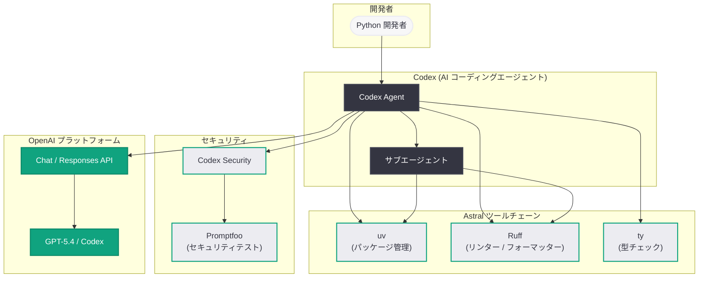

# OpenAI が Astral を買収: Python 開発者ツールの次世代化で Codex の成長を加速

## メタデータ

| 項目 | 内容 |
|------|------|
| 発表日 | 2026-03-19 |
| ソース | OpenAI News/Blog |
| カテゴリ | Company |
| 公式リンク | [openai.com](https://openai.com/index/openai-to-acquire-astral) |

## 概要

OpenAI は 2026 年 3 月 19 日、Python 開発者ツールを手がけるオープンソース企業 Astral の買収を発表した。Astral は、超高速 Python パッケージマネージャー「uv」と Python リンター/フォーマッター「Ruff」の開発元として知られており、いずれも Rust で実装された高性能ツールとして Python コミュニティで急速に普及している。

本買収は、OpenAI の AI コーディングエージェント「Codex」の成長を加速し、次世代の Python 開発者ツールを実現するという戦略的な位置づけである。Astral の高速な Python ツールチェーンが Codex に統合されることで、AI を活用したコード生成からパッケージ管理、コード品質チェックまでをシームレスにカバーする開発体験が実現される見込みである。

## 主な内容

### Astral の概要と主要プロダクト

Astral は、Charlie Marsh 氏が創業した Python 開発者ツール企業であり、以下の主要プロダクトを提供している。

1. **uv:** Rust で実装された超高速 Python パッケージマネージャー兼プロジェクト管理ツール。pip、pip-tools、pipx、poetry、pyenv、twine、virtualenv などの既存ツールを単一のバイナリで置き換える。従来の pip と比較して 10 - 100 倍の速度を実現しており、GitHub で急速にスター数を伸ばしている
2. **Ruff:** Rust で実装された超高速 Python リンター兼フォーマッター。Flake8、Black、isort、pyupgrade など複数の既存ツールの機能を統合し、従来のリンターと比較して 10 - 100 倍の速度で動作する。700 以上のリントルールを内蔵しており、Python コミュニティで広く採用されている
3. **ty:** Python の型推論および型チェックツール。Python コードの静的解析をさらに強化する新しいプロダクトとして開発が進められている

### Codex との統合による相乗効果

OpenAI の Codex は、クラウド上でソフトウェアエンジニアリングタスクを自律的に実行する AI エージェントである。Astral のツールが統合されることで、以下の相乗効果が期待される。

- **高速な環境構築:** uv による超高速なパッケージインストールとプロジェクトセットアップにより、Codex がコーディングタスクを開始するまでの準備時間が大幅に短縮される
- **コード品質の自動保証:** Ruff による即座のリンティングとフォーマッティングにより、Codex が生成するコードの品質が一貫して高い水準に保たれる
- **型安全性の向上:** ty による型チェック機能が統合されることで、Codex が生成する Python コードの型安全性が強化される
- **依存関係の最適管理:** uv のロックファイル管理と依存関係解決機能により、Codex が管理するプロジェクトの依存関係がより堅牢になる

### OpenAI の開発者ツール戦略における位置づけ

本買収は、OpenAI が近年進めている開発者ツールエコシステムの拡大戦略の一環である。

- **2026 年 3 月 6 日:** Codex Security (リサーチプレビュー) を発表し、コードセキュリティ分析機能を追加
- **2026 年 3 月 7 日:** Codex for Open Source プログラムを発表し、オープンソースプロジェクトへの AI 支援を拡大
- **2026 年 3 月 9 日:** Promptfoo を買収し、AI セキュリティテスト機能を統合
- **2026 年 3 月 12 日:** Codex のエージェントループの内部動作を公開し、透明性を向上
- **2026 年 3 月 16 日:** Codex サブエージェントとカスタムエージェント機能を発表
- **2026 年 3 月 19 日:** Astral を買収し、Python ツールチェーンを統合 (本件)

この一連の動きにより、OpenAI は AI コーディングエージェントを中核とした包括的な開発者プラットフォームの構築を進めていることが明確になっている。

## 技術的な詳細

### Astral ツールの技術的特徴

Astral のツールはいずれも Rust で実装されており、パフォーマンスと信頼性を両立している。

- **uv の主要機能:**
  - Python バージョン管理 (`uv python install 3.12`)
  - プロジェクト初期化と管理 (`uv init`, `uv add`, `uv lock`)
  - 超高速パッケージインストール (グローバルキャッシュとリンクによる最適化)
  - pip 互換インターフェース (`uv pip install`)
  - スクリプト実行 (`uv run`)
  - ツール管理 (`uv tool install`, `uvx`)

- **Ruff の主要機能:**
  - 700 以上の lint ルール (Flake8、isort、pyupgrade などのルールを統合)
  - コードフォーマッティング (Black 互換)
  - 自動修正機能 (`ruff check --fix`)
  - エディタ統合 (LSP サポート)

### コードサンプル

以下は、Codex が Astral のツールを活用して Python プロジェクトをセットアップし、コード品質を保証するワークフローのイメージである。

```python
from openai import OpenAI

client = OpenAI()

# Codex にプロジェクトセットアップを依頼するイメージ
response = client.responses.create(
    model="codex",
    input=[
        {
            "role": "user",
            "content": (
                "新しい Python プロジェクトを作成してください。"
                "FastAPI を使った REST API サーバーで、"
                "uv でパッケージ管理を行い、"
                "Ruff でコード品質を保証してください。"
            ),
        }
    ],
)
print(response.output_text)
```

以下は、Astral ツールを活用した CI/CD パイプラインの設定例である。

```yaml
# .github/workflows/python-ci.yml
# uv + Ruff による高速 Python CI パイプライン
name: Python CI with Astral Tools

on:
  pull_request:
    paths:
      - "**.py"
      - "pyproject.toml"

jobs:
  lint-and-test:
    runs-on: ubuntu-latest
    steps:
      - uses: actions/checkout@v4

      - name: Install uv
        uses: astral-sh/setup-uv@v5

      - name: Set up Python
        run: uv python install 3.12

      - name: Install dependencies
        run: uv sync

      - name: Lint with Ruff
        run: uv run ruff check .

      - name: Format check with Ruff
        run: uv run ruff format --check .

      - name: Type check with ty
        run: uv run ty check .

      - name: Run tests
        run: uv run pytest
```

> **注:** 上記のコード例は API の利用イメージを示すものであり、買収後の統合製品における実際の API やパラメータは公式ドキュメントを参照してください。

## アーキテクチャ



## 開発者への影響

### Python 開発体験の統合と高速化

Astral の買収により、Codex を利用する Python 開発者は以下の恩恵を受けることが期待される。

- **プロジェクト構築の高速化:** uv の超高速パッケージ管理により、Codex が新規プロジェクトのセットアップや依存関係のインストールを瞬時に完了できるようになる
- **コード品質の自動保証:** Ruff がコード生成パイプラインに統合されることで、Codex が出力するコードが自動的にリンティングおよびフォーマッティングされる
- **Python ツールチェーンの統一:** uv、Ruff、ty が Codex に統合されることで、pip、poetry、Flake8、Black、mypy など複数のツールを個別に設定する手間が削減される

### オープンソースコミュニティへの影響

Astral の uv と Ruff は、いずれも Python コミュニティで急速に普及しているオープンソースプロジェクトである。

- **オープンソースの継続性:** 買収後も uv と Ruff がオープンソースとして維持されるかどうかは、Python コミュニティにとって重要な関心事項である
- **開発リソースの拡大:** OpenAI のリソースにより、uv、Ruff、ty の開発が加速する可能性がある
- **Codex for Open Source との連携:** 2026 年 3 月 7 日に発表された Codex for Open Source プログラムとの相乗効果により、Python オープンソースプロジェクトへの AI 支援が強化される可能性がある

### 競合環境への影響

- **GitHub Copilot / Microsoft との競争:** Astral ツールの統合により、Codex は Python 開発における差別化要因を獲得する。Microsoft / GitHub Copilot に対して、Python ツールチェーン全体を統合した開発体験で優位性を持つことになる
- **Python パッケージ管理エコシステム:** uv が OpenAI の傘下に入ることで、pip、poetry、conda などの既存パッケージマネージャーとの関係性に変化が生じる可能性がある

### 懸念事項

- **ベンダーロックイン:** Astral のツールが OpenAI プラットフォームに深く統合されることで、特定のプラットフォームへの依存が生じる懸念がある
- **オープンソースガバナンス:** 独立したオープンソース企業から大手 AI 企業の傘下に移行することで、コミュニティ主導の開発方針に変化が生じる可能性がある
- **Python エコシステムの中立性:** Python 開発の基盤ツールが特定の AI 企業に所有されることへの懸念が、コミュニティの一部から示される可能性がある

## 関連リンク

- [OpenAI 買収発表](https://openai.com/index/openai-to-acquire-astral)
- [Astral 公式サイト](https://astral.sh)
- [uv GitHub リポジトリ](https://github.com/astral-sh/uv)
- [Ruff GitHub リポジトリ](https://github.com/astral-sh/ruff)
- [Codex for Open Source](https://openai.com/index/codex-for-open-source/)
- [Codex サブエージェントとカスタムエージェント](https://openai.com/index/codex-subagents-custom-agents)
- [OpenAI API リファレンス](https://platform.openai.com/docs/api-reference)

## まとめ

OpenAI による Astral の買収は、AI コーディングエージェント Codex を中核とした Python 開発者ツールエコシステムの構築を加速する戦略的な動きである。Astral の uv (超高速パッケージマネージャー)、Ruff (超高速リンター/フォーマッター)、ty (型チェックツール) はいずれも Rust で実装された高性能ツールであり、Codex に統合されることで AI を活用したコード生成からプロジェクト管理、コード品質保証までをシームレスにカバーする開発体験が実現される。Promptfoo 買収 (セキュリティ) に続く本買収により、OpenAI は開発者プラットフォームとしての包括性をさらに強化している。一方で、Python コミュニティの基盤ツールが特定の AI 企業の傘下に入ることへの懸念もあり、オープンソースの継続性とエコシステムの中立性の確保が今後の鍵となる。
