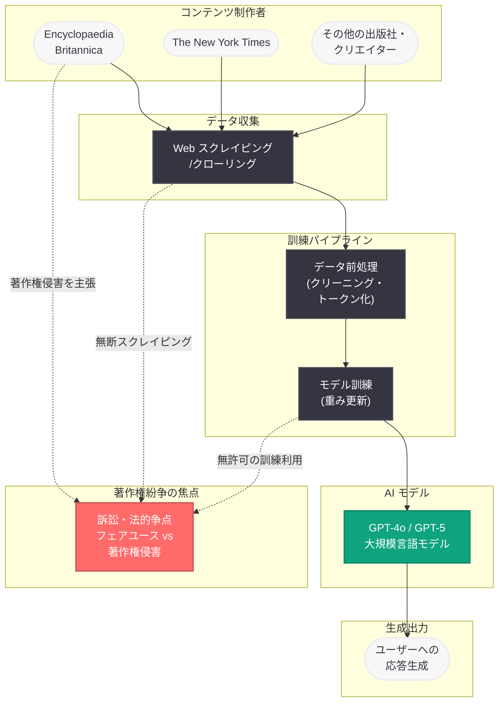

# Encyclopaedia Britannica が OpenAI を提訴: 約 10 万件の記事スクレイピングをめぐる著作権訴訟

## メタデータ

| 項目 | 内容 |
|------|------|
| 発表日 | 2026-03-20 |
| ソース | External News (Boing Boing, Reuters) |
| カテゴリ | Legal / Copyright |
| 公式リンク | N/A (外部報道) |

## 概要

2026 年 3 月 20 日、1768 年創刊の歴史ある百科事典ブランドである Encyclopaedia Britannica が、OpenAI に対して著作権侵害訴訟を提起したことが報じられた。Britannica は、OpenAI が AI モデルの訓練データとして同社の著作権で保護された約 10 万件の百科事典記事を無断でスクレイピングしたと主張している。

この訴訟は、AI 企業による訓練データの利用をめぐる法的論争の新たな事例として注目されている。The New York Times、Authors Guild、Getty Images など、コンテンツ制作者や出版社による一連の著作権訴訟に加わるものであり、AI 業界全体の訓練データ慣行に対する法的監視が強まる中での提訴となった。訴訟の結果は、AI 企業が訓練データをどのように利用できるかについて重要な先例を形成する可能性がある。

## 主な内容

### 訴訟の概要と Britannica の主張

Encyclopaedia Britannica は、OpenAI が同社の著作権で保護されたコンテンツを大規模にスクレイピングし、AI モデルの訓練データとして無断使用したと主張している。訴訟の主要なポイントは以下のとおりである。

- **スクレイピングの規模:** OpenAI が約 10 万件の Britannica 記事をスクレイピングしたとされる。これは Britannica が保有する膨大な知識コンテンツの相当部分に及ぶ
- **無断使用の主張:** Britannica は、OpenAI がコンテンツの使用について事前の許可やライセンス契約を取得していなかったと主張している
- **著作権侵害の根拠:** 専門家や編集者によって慎重に執筆・編集された百科事典の記事は、著作権法により明確に保護される創作物であり、その無断使用は著作権侵害に該当するとの立場をとっている

### Britannica の歴史的背景と知的財産としての価値

Encyclopaedia Britannica は、1768 年にスコットランドのエディンバラで創刊された世界で最も歴史ある英語百科事典の一つである。

- **250 年以上の歴史:** 初版の刊行から 250 年以上にわたり、学術的な正確性と信頼性を維持してきた
- **専門家による執筆:** ノーベル賞受賞者を含む各分野の専門家が記事を執筆・監修しており、その学術的価値は極めて高い
- **デジタル時代への適応:** 2012 年に印刷版の発行を終了し、デジタルプラットフォームへ完全移行した経緯がある。デジタルコンテンツとしての著作権保護が本訴訟の核心となっている

### OpenAI に対する著作権訴訟の時系列

Britannica の訴訟は、OpenAI が直面する一連の著作権訴訟の最新事例である。以下に主要な訴訟の時系列を示す。

| 時期 | 原告 | 概要 |
|------|------|------|
| 2023 年 6 月 | Authors Guild ほか著名作家 | 書籍の無断使用による著作権侵害を主張 |
| 2023 年 9 月 | Authors Guild (追加提訴) | John Grisham、George R.R. Martin ら著名作家が原告に加わる |
| 2023 年 12 月 | The New York Times | 数百万件の記事の無断使用を主張。最も注目度の高い訴訟の一つ |
| 2024 年 1 月 | Getty Images | 数百万枚の写真の無断使用を主張 |
| 2024 年以降 | 各種出版社・クリエイター | 音楽、ニュース、学術論文など多分野にわたる訴訟が相次ぐ |
| 2026 年 3 月 | Encyclopaedia Britannica | 約 10 万件の百科事典記事のスクレイピングを主張 (本件) |

### OpenAI のフェアユース主張と法的論点

OpenAI はこれまでの著作権訴訟において、AI モデルの訓練における著作物の使用は米国著作権法における「フェアユース」(公正利用) に該当すると主張してきた。フェアユースの判断は、以下の 4 要素に基づいて総合的に評価される。

1. **利用の目的と性質:** 商業目的か非営利目的か、また変容的利用かどうか。OpenAI は AI の訓練が「変容的利用」であると主張しているが、営利企業による商業利用であるためこの要素は争点となる
2. **著作物の性質:** 事実に基づく著作物か創造的な著作物か。Britannica の記事は事実情報を含むが、専門家による独自の表現と構成が施されており、著作権保護の対象となる創作物である
3. **利用された部分の量と重要性:** 著作物全体に対する利用部分の割合。約 10 万件の記事がスクレイピングされたとすれば、Britannica のコンテンツの大部分が対象となった可能性がある
4. **著作物の潜在的市場への影響:** 利用が著作物の市場価値に与える影響。AI チャットボットが Britannica と同等の情報を提供することで、サブスクリプション収入が減少する可能性がある

- **変容的利用の主張:** OpenAI は、AI の訓練は原著作物をそのまま複製するものではなく、新たな目的 (AI モデルの構築) のための「変容的利用」であると主張している
- **反論:** コンテンツ制作者側は、AI モデルが訓練データに含まれる原文に近い内容を出力する場合があることを指摘し、これは単なる変容的利用を超えた複製であると反論している
- **市場への影響:** Britannica のようなプレミアムコンテンツプロバイダーにとって、AI が同等の情報を無料で提供することは、サブスクリプションベースのビジネスモデルに直接的な競合をもたらすとの主張もある
- **和解と契約の動向:** 一方で、OpenAI は AP 通信や Axel Springer、Le Monde など一部のメディア企業とはライセンス契約を締結しており、コンテンツ利用に対する対価を支払うモデルも並行して構築している。Britannica との間でこうした合意が成立しなかった背景も訴訟の要因の一つと考えられる

## 技術的な詳細

### AI 訓練データパイプラインと著作権問題の所在

AI モデルの訓練プロセスにおいて、著作権問題が発生するポイントを以下に整理する。

1. **データ収集段階 (Web スクレイピング):** クローラーが Web 上の公開コンテンツを大規模に収集する。この段階で著作権で保護されたコンテンツが無断で取得される可能性がある。Britannica の訴訟は主にこの段階を問題視している
2. **データ前処理段階:** 収集されたデータがクリーニング、フィルタリング、トークン化される。著作権コンテンツの識別と除外が技術的に可能かどうかが議論の対象となる
3. **モデル訓練段階:** 前処理されたデータが AI モデルの重み更新に使用される。訓練後のモデルが原著作物の「複製」を内包しているかどうかが法的な争点となる
4. **推論・出力段階:** 訓練済みモデルがユーザーのクエリに応答して出力を生成する。出力が訓練データに含まれる著作物に類似する場合、著作権侵害の可能性が問われる

### 技術的対策の現状

AI 業界では、著作権問題に対処するための技術的なアプローチも模索されている。

- **robots.txt の尊重:** Web クローラーが robots.txt の指示に従い、スクレイピングを制限する仕組み。ただし、法的な強制力は限定的である
- **オプトアウト機構:** コンテンツ提供者が AI 訓練からのデータ除外を申請できる仕組み。OpenAI は Media Manager などのツールを提供している
- **出力フィルタリング:** AI モデルの出力が訓練データの原文と過度に類似しないようにフィルタリングする技術
- **ライセンス契約:** AP 通信、Axel Springer など、一部のメディアとはコンテンツ利用のライセンス契約を締結している事例もある

## アーキテクチャ

## 開発者への影響

### AI 訓練データの法的リスクへの認識

Britannica の訴訟は、AI 開発に関わるすべてのステークホルダーに対して、訓練データの法的リスクを改めて認識させるものである。

- **訓練データの出所管理:** 開発者は使用する訓練データの出所とライセンス状況を明確に管理する必要性が高まっている
- **コンプライアンス体制の構築:** AI モデルの訓練プロセスにおいて、著作権コンプライアンスを確保するための体制が求められる
- **データライセンスコストの増加:** 訴訟の結果次第では、高品質な訓練データの取得にライセンス料が必要となり、AI 開発コストが増加する可能性がある

### API 利用者への間接的影響

- **モデルの出力品質への影響:** 著作権問題により特定のデータソースが訓練データから除外された場合、モデルの知識カバレッジや出力品質に影響が生じる可能性がある
- **利用規約の厳格化:** 著作権訴訟の動向に応じて、API の利用規約やコンテンツポリシーがより厳格化される可能性がある
- **コンテンツフィルタリングの強化:** 著作権で保護されたコンテンツに類似する出力を抑制するためのフィルタリングが強化される可能性がある

### AI 業界全体への示唆

- **業界標準の形成:** 訴訟の集積により、AI 訓練データの利用に関する業界標準やベストプラクティスが形成されつつある。データの出所を記録する「データ来歴」(data provenance) の管理が業界のベストプラクティスとして定着しつつある
- **立法への影響:** 米国では著作権局が AI と著作権に関するガイダンスの策定を進めており、EU では AI 法 (AI Act) においてデータガバナンスの要件が規定されている。日本でも文化審議会が AI と著作権の関係について検討を重ねており、各国の法整備にこれらの訴訟が直接的な影響を与えている
- **ライセンスモデルの確立:** コンテンツ制作者と AI 企業の間で、持続可能なライセンスモデルの確立が急務となっている。個別交渉による二者間契約だけでなく、音楽業界の集中管理団体のような包括的なライセンス機構の必要性も議論されている
- **オープンデータへの移行:** 著作権リスクを回避するため、パブリックドメインやオープンライセンスのデータセットを活用する動きも加速している。ただし、Britannica のような高品質な専門知識コンテンツをオープンデータで代替することは困難であるという課題も残る

## 関連リンク

- [Boing Boing: Britannica sues OpenAI for scraping nearly 100,000 articles](https://boingboing.net)
- [Reuters: AI Copyright Lawsuits](https://www.reuters.com)
- [OpenAI 利用規約](https://openai.com/policies/terms-of-use)
- [米国著作権局 - AI と著作権](https://www.copyright.gov)
- [OpenAI News](https://openai.com/news)

## まとめ

Encyclopaedia Britannica による OpenAI への著作権侵害訴訟は、AI 業界が直面する訓練データの法的課題を象徴する重要な事例である。1768 年創刊の歴史ある百科事典の約 10 万件の記事が無断でスクレイピングされたとする本訴訟は、The New York Times や Authors Guild などによる一連の訴訟に加わり、AI 企業の訓練データ慣行に対する法的圧力をさらに強めている。

特に Britannica のケースは、学術的に高い信頼性を持つ専門知識コンテンツの著作権保護という観点で、これまでのニュースメディアや文芸作品に関する訴訟とは異なる法的論点を含んでいる。OpenAI がフェアユースを主張する一方で、コンテンツ制作者側は著作権保護の必要性を訴えており、この法的論争の帰結は AI 業界全体の訓練データ利用のあり方を方向づける可能性がある。開発者にとっては、訓練データの出所管理、著作権コンプライアンス、ライセンスコストの増加といった課題に対する備えが求められる局面である。今後の裁判の進展と判決内容が、AI と知的財産の関係における重要な先例となることは間違いない。
