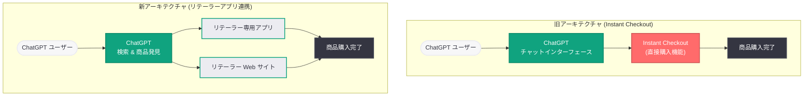

# ChatGPT コマース戦略の転換: Instant Checkout 終了とリテーラーアプリへの移行

## メタデータ

| 項目 | 内容 |
|------|------|
| 発表日 | 2026-03-20 |
| ソース | OpenAI News (CNBC、PYMNTS 報道) |
| カテゴリ | Product / Business |
| 公式リンク | [openai.com](https://openai.com/news) |

## 概要

OpenAI は ChatGPT 内で商品を直接購入できる「Instant Checkout」機能を終了し、リテーラー専用アプリを通じた販売促進へと戦略を転換した。OpenAI の広報担当者は「Instant Checkout はアプリに移行し、購入がよりシームレスに行えるようになる」と述べており、今後は検索と商品発見 (Search & Discovery) の強化を優先する方針である。

この転換は、ChatGPT のコマース機能に関する一連の戦略的再調整の一環である。2026 年 3 月 11 日には ChatGPT を通じた直接販売計画の縮小が報じられており、今回の発表はその方針をさらに明確にしたものとなる。AI チャットボットをショッピングプラットフォームとして確立するという野心的な試みは、ユーザー行動の現実と向き合い、より実効性の高いアプローチへと軌道修正されることとなった。

## 主な内容

### Instant Checkout 終了の背景

Instant Checkout は、ChatGPT のチャットインターフェース内で商品を閲覧し、そのまま購入まで完了できる機能として導入された。しかし、運用を通じていくつかの重大な課題が明らかになった。

1. **リアルタイム商品情報の不整合:** Instant Checkout ではリアルタイムの商品情報が常に正確に表示されるわけではなく、価格や在庫状況にずれが生じるケースがあった。AI が生成する商品情報と実際の販売情報との間にギャップがあることは、EC 体験において致命的な問題である
2. **ユーザー認識のミスマッチ:** ChatGPT のユーザーは、同サービスを主にリサーチやチャットのためのツールとして認識しており、ショッピングプラットフォームとしての利用意識が低かった。購買行動への心理的ハードルが想定以上に高かったことが判明した
3. **リテーラーアプリの認知不足:** ChatGPT 内に組み込まれたリテーラーアプリの存在がユーザーに十分に認知されておらず、アプリを経由した購買フローが活用されていなかった
4. **外部リンクへの選好:** ユーザーは ChatGPT 内で購入を完結させるよりも、商品リンクをたどって小売業者の Web サイトに直接アクセスすることを好む傾向が確認された

### 新戦略: 検索と商品発見への注力

Instant Checkout の終了に伴い、OpenAI は ChatGPT のコマース機能を以下の 2 つの領域に集中させる方針を打ち出した。

**検索 (Search):** ChatGPT の自然言語処理能力を活かし、ユーザーの購買意図を正確に理解した商品検索体験を提供する。従来のキーワードベースの EC 検索とは異なり、「予算 3 万円以内で、在宅勤務に適した人間工学に基づいたオフィスチェア」といった複雑な条件指定にも対応できる対話型検索を強化する。

**商品発見 (Product Discovery):** ユーザーとの対話を通じて潜在的なニーズを引き出し、最適な商品を提案するディスカバリー機能を拡充する。ChatGPT は購買の「入り口」としての役割に徹し、実際の購入はリテーラーの専用アプリやウェブサイトで行う導線を確立する。

OpenAI の広報担当者は「Instant Checkout はアプリに移行し、購入がよりシームレスに行えるようになる」と説明しており、購買機能自体を完全に廃止するのではなく、リテーラーアプリというより適切なチャネルへ移管する形をとっている。

### 競合環境: Google のショッピングエージェント更新

注目すべきは、Google が 2026 年 3 月 19 日に自社のショッピングエージェントプラットフォームを更新したことである。Google の更新には以下の機能が含まれている。

- **リアルタイム商品データ:** 価格や在庫状況をリアルタイムで反映し、正確な商品情報を提供する
- **マルチアイテムカート:** 複数の商品をカートに追加し、一括で購入処理を行える機能
- **ロイヤリティメンバーシップ連携:** ユーザーの既存のポイントプログラムやメンバーシップと連携し、特典を活用した購買体験を実現する

Google がチェックアウト機能の強化を進める一方で、OpenAI が直接購入機能を縮小するという対照的な動きは、AI コマースの最適な形態について両社が異なるアプローチを模索していることを示している。

### ChatGPT 広告パイロットの動向

コマース戦略の転換と並行して、OpenAI は ChatGPT での広告テストも進めている。CNBC の報道によると、広告パイロットプログラムは業界関係者の間で期待を集めている一方で、一部のインサイダーからはロールアウトの遅さに対する不満の声も上がっている。

広告パイロットの現状は以下の通りである。

- **業界の期待:** ChatGPT という巨大なユーザーベースへのリーチが可能になることへの期待感が高い
- **不満の声:** 展開スピードが遅く、広告主が十分にテストや最適化を行える環境が整っていないとの指摘がある
- **コマース戦略との関連:** Instant Checkout の終了と広告パイロットの推進は、ChatGPT の収益化戦略が「直接取引」から「トラフィック誘導と広告」へとシフトしていることを示唆している

## 技術的な詳細

### プロダクト/ビジネスの観点からの分析

本件は API の変更ではなく、ChatGPT のプロダクト戦略に関する転換であるため、技術的な API 変更やコードサンプルは伴わない。しかし、ビジネス上の重要な技術的含意がいくつかある。

**リテーラーアプリ統合の技術要件:**

- リテーラーは ChatGPT プラットフォーム上で動作する専用アプリを開発・提供する必要がある
- 商品カタログ、価格、在庫のリアルタイムデータフィードの確立が求められる
- 決済処理はリテーラーアプリ側で完結する設計となり、OpenAI 側での決済インフラ管理が不要になる

**検索・ディスカバリー機能の技術的方向性:**

- ChatGPT の大規模言語モデルを活用した意図理解ベースの商品検索
- 構造化された商品データとの統合による正確な検索結果の生成
- ユーザーの対話履歴に基づくパーソナライズされた商品推薦

**Instant Checkout で発生した技術的問題:**

- AI が生成する商品情報とリテーラーの実際のデータベースとの同期遅延
- リアルタイムの価格変動や在庫状況の反映が不完全
- 決済処理における複数リテーラー間の統一的なインターフェース提供の困難さ

## アーキテクチャ

## 開発者への影響

### リテーラー・EC 事業者への影響

ChatGPT のコマース戦略転換は、リテーラーおよび EC 事業者に以下の影響を与える。

- **リテーラーアプリ開発の必要性:** ChatGPT プラットフォーム上でのリテーラーアプリ開発が、AI コマースにおける主要な販売チャネルとなる。アプリ開発に投資できるリテーラーとそうでないリテーラーの間で、AI 経由の売上に格差が生じる可能性がある
- **商品データの品質向上:** 検索とディスカバリーが中心となることで、商品メタデータの品質と構造化が従来以上に重要になる。AI が商品を正確に理解し推薦するためには、詳細で構造化された商品情報の提供が不可欠である
- **SEO から AIO (AI Optimization) へ:** 従来の検索エンジン最適化に加えて、AI チャットボットに商品を適切に発見・推薦してもらうための最適化 (AIO) が新たなマーケティング領域として浮上する

### 広告主・マーケターへの影響

- **広告パイロットへの期待:** ChatGPT での広告がコマースの主要な収益モデルとなる可能性がある。Instant Checkout の終了により、広告を通じたトラフィック誘導の重要性がさらに増す
- **アフィリエイトモデルの変化:** 直接購入からリテーラーサイトへの誘導へとモデルが変わることで、アフィリエイト収益の構造にも変化が生じる

### AI コマース業界全体への示唆

- **ユーザー行動の現実:** AI チャットボットを通じた直接購入という概念は、現時点ではユーザーの自然な行動パターンに合致していないことが明らかになった。ユーザーは AI を「調査・比較ツール」として利用し、購入は信頼できる既存のプラットフォームで行うことを好む
- **段階的アプローチの重要性:** AI コマースの発展は、一足飛びに直接購入を実現するのではなく、まず検索・発見の領域で信頼を構築し、段階的に購買体験を統合していく必要がある
- **Google との差別化:** Google がフルスタックのショッピング体験を追求する一方で、OpenAI がアグリゲーター型のアプローチを選択したことは、AI コマース市場における戦略の多様化を示している

## 関連リンク

- [CNBC: OpenAI's first crack at online shopping stumbled. It's preparing for the next wave](https://www.cnbc.com/)
- [PYMNTS: OpenAI and Google Refine Early AI Commerce Strategies](https://www.pymnts.com/)
- [CNBC: ChatGPT's ad pilot has the industry excited, but some insiders are frustrated with the slow rollout](https://www.cnbc.com/)
- [PYMNTS: OpenAI Reworks Product Strategy Around New Desktop Super App](https://www.pymnts.com/)
- [OpenAI News](https://openai.com/news)

## まとめ

OpenAI による Instant Checkout の終了とリテーラーアプリへの移行は、ChatGPT のコマース戦略における重要な転換点である。AI チャットボットを通じた直接購入という野心的な試みは、リアルタイム商品情報の不整合、ユーザーの購買行動とのミスマッチ、リテーラーアプリの認知不足といった現実的な課題に直面した。OpenAI は今後、検索と商品発見という ChatGPT の強みを活かせる領域に注力し、実際の購買はリテーラーのアプリや Web サイトに委ねる戦略へと舵を切る。Google がショッピングエージェントのフルスタック強化を進める中、OpenAI のアプローチは AI コマースの最適解がまだ定まっていないことを示している。広告パイロットの展開と併せて、ChatGPT の収益化モデルが「直接取引」から「トラフィック誘導と広告」へとシフトする可能性があり、この戦略転換が AI コマース市場全体にどのような影響を与えるかが注目される。
