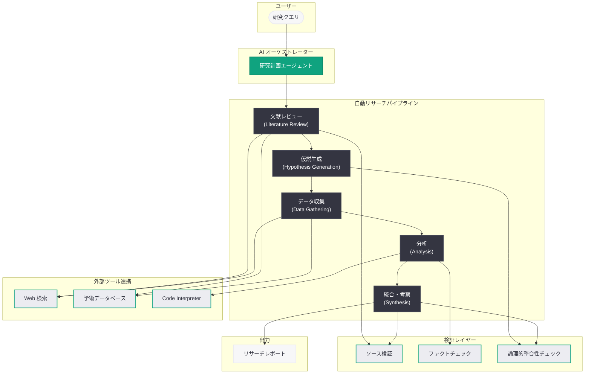

# OpenAI が完全自動 AI リサーチャーの構築に全力投球: 研究の自律化で次世代エージェント時代を切り拓く

## メタデータ

| 項目 | 内容 |
|------|------|
| 発表日 | 2026-03-20 |
| ソース | OpenAI Research (MIT Technology Review、SiliconANGLE による報道) |
| カテゴリ | Research / Product |
| 公式リンク | [openai.com/research](https://openai.com/research) |

## 概要

MIT Technology Review は 2026 年 3 月 20 日、OpenAI が「完全自動化されたリサーチャー」の構築にあらゆるリソースを投入していると報じた。この取り組みは、文献レビューから仮説生成、実験設計、データ分析、論文執筆に至るまで、研究プロセス全体を AI が自律的に遂行するシステムの実現を目指すものである。

SiliconANGLE はこの機能を「AI リサーチインターン」と表現し、OpenAI の製品群に統合される形で提供されると報じている。これは、コーディング領域における Codex に続く、研究領域に特化した自律型 AI エージェントの登場を意味する。既存の ChatGPT Deep Research 機能を基盤としつつ、単なる検索や要約を超えた本格的な研究自動化への進化が図られている。

## 主な内容

### Deep Research から完全自動リサーチャーへの進化

OpenAI はこれまで ChatGPT に搭載された Deep Research 機能を通じて、ユーザーが複雑なリサーチクエリを投げると AI が複数のステップにわたる調査を実行し、包括的なレポートを生成する仕組みを提供してきた。今回報じられた完全自動リサーチャーは、この Deep Research の延長線上にありながら、より根本的な進化を遂げるものである。

従来の Deep Research は、ユーザーの質問に対して既存の情報を検索・統合・要約するという「情報収集型」のアプローチであった。一方、完全自動リサーチャーは以下のような「研究遂行型」のアプローチを採用する。

- **文献レビューの自律実行:** 関連する学術論文、技術レポート、データベースを体系的にスキャンし、研究分野の現状を把握する
- **仮説の自動生成:** 既存研究のギャップや矛盾を特定し、検証可能な仮説を自律的に構築する
- **データ収集と分析:** 公開データセットの取得、統計分析、パターン認識を自動的に実行する
- **知見の統合と報告:** 分析結果を解釈し、構造化されたリサーチレポートとして出力する

### AI リサーチインターンとしての製品統合

SiliconANGLE が報じた「AI リサーチインターン」という位置づけは、この技術がどのような形でユーザーに届けられるかを示している。従来の AI アシスタントが「質問に答える」存在であったのに対し、AI リサーチインターンは「タスクを任せられる」存在として設計されている。

具体的には、以下のような研究ワークフローを一貫して処理する能力が想定される。

1. **研究テーマの設定:** ユーザーが研究課題や関心領域を指定する
2. **先行研究の網羅的調査:** AI が関連文献を自動的に収集・分類・評価する
3. **研究計画の策定:** 調査結果に基づき、仮説と検証方法を提案する
4. **データの収集と前処理:** 必要なデータを自動的に取得し、分析可能な形式に整備する
5. **分析と考察:** 統計手法や機械学習モデルを適用してデータを分析する
6. **レポート生成:** 一連の知見を学術的な体裁でまとめ、リサーチレポートとして出力する

この機能は、2026 年 3 月 19 日に発表されたデスクトップ版「スーパーアプリ」への製品統合の一環としても位置づけられており、ChatGPT、Codex、そして自動リサーチャーが統一されたインターフェースから利用できる形で提供される見込みである。

### OpenAI のエージェント戦略における位置づけ

完全自動リサーチャーは、OpenAI が推進する自律型 AI エージェント戦略の中核的な要素である。

- **Codex (コーディングエージェント):** ソフトウェア開発タスクを自律的に実行する AI エージェント。2026 年 3 月には Astral 買収によるツールチェーン統合、サブエージェント機能の追加など急速に進化している
- **Deep Research (リサーチエージェント):** ChatGPT に統合された多段階リサーチ機能。今回の完全自動リサーチャーの基盤となっている
- **完全自動リサーチャー (本件):** Deep Research を発展させた次世代の研究自動化エージェント

この戦略は、OpenAI が 2026 年 3 月 18 日に発表した「Accelerating science with GPT-5」レポートとも密接に関連している。同レポートでは GPT-5 が科学研究の加速にどのように貢献できるかが詳述されており、完全自動リサーチャーはその具体的な製品実装と見ることができる。

## 技術的な詳細

### 自動化リサーチパイプラインの技術的課題

完全自動リサーチャーの実現には、以下の技術的課題への対応が求められる。

**ハルシネーション (幻覚) の抑制:** 研究の正確性は最も重要な要件である。AI が存在しない論文を引用したり、誤ったデータを生成したりするハルシネーションは、研究の信頼性を根本的に損なう。OpenAI は以下のアプローチでこの課題に取り組んでいると考えられる。

- ソース検証メカニズム: 引用する情報源の実在性と内容の整合性を自動的に検証する仕組み
- 不確実性の定量化: AI の出力に対する信頼度スコアを付与し、確信度の低い記述を明示する
- 人間によるレビューループ: 重要な判断ポイントでは人間の確認を求めるフォールバック機構

**科学的推論の品質保証:** 単なるテキスト生成を超えて、論理的一貫性のある科学的推論を行うことが求められる。

- 因果推論の適切な適用: 相関関係と因果関係を区別し、適切な推論を行う
- 統計的手法の正確な実行: p 値の解釈、効果量の計算、検定手法の選択を正しく行う
- 反証可能性の確保: 生成される仮説が科学的に検証可能な形式であることを保証する

**ソース検証と引用の正確性:** 研究においては情報源の追跡可能性が不可欠である。

- 引用チェーン全体の検証: 一次資料まで遡って情報の正確性を確認する
- メタデータの自動抽出: 論文の著者、出版年、ジャーナル名などを正確に取得する
- アクセス可能性の確保: 引用された資料にユーザーがアクセスできることを保証する

### コードサンプル

以下は、完全自動リサーチャーの API 利用イメージである。実際の API 仕様は公式ドキュメントの公開を待つ必要があるが、既存の Responses API の拡張として提供される可能性がある。

```python
from openai import OpenAI

client = OpenAI()

# 自動リサーチャーによる研究タスクの実行イメージ
response = client.responses.create(
    model="gpt-5",
    input=[
        {
            "role": "user",
            "content": (
                "大規模言語モデルのハルシネーション低減手法について "
                "包括的なリサーチレポートを作成してください。"
                "2024 年以降の主要な論文を対象とし、"
                "手法の分類、効果の比較、今後の研究課題を含めてください。"
            ),
        }
    ],
    tools=[
        {"type": "web_search"},
        {"type": "deep_research"},
        {"type": "code_interpreter"},
    ],
    # リサーチの深度と範囲を制御するパラメータ (想定)
    metadata={
        "research_depth": "comprehensive",
        "source_types": ["academic_papers", "technical_reports"],
        "date_range": "2024-2026",
        "output_format": "structured_report",
    },
)

print(response.output_text)
```

> **注:** 上記のコード例は API の利用イメージを示すものであり、完全自動リサーチャーの実際の API やパラメータは公式ドキュメントの公開後に確認してください。

## アーキテクチャ



## 開発者への影響

### 研究ワークフローの変革

完全自動リサーチャーの登場により、研究者や開発者のワークフローは大きく変わる可能性がある。

- **文献調査の効率化:** 数日から数週間かかっていた文献レビューが、数時間で完了する可能性がある。AI が関連論文を網羅的に収集し、重要なポイントを構造化して提示する
- **仮説生成の支援:** 既存研究のギャップを自動的に特定し、新たな研究仮説を提案する。研究者は AI が生成した仮説を評価・選択することに集中できる
- **データ分析の自動化:** Code Interpreter との連携により、データの前処理から統計分析、可視化までを一貫して自動実行する

### API を活用したカスタム研究エージェントの構築

開発者は、OpenAI の API を活用して自社の研究ドメインに特化したカスタム研究エージェントを構築できるようになる可能性がある。

- **ドメイン特化型リサーチャー:** 医療、法律、金融など特定分野の知識ベースと統合した専門的な研究エージェントの構築
- **社内データとの連携:** 企業内の非公開データベースやナレッジベースと接続し、プロプライエタリな研究を自動化する
- **マルチエージェント研究チーム:** Codex (コーディング) と自動リサーチャー (研究) を組み合わせた、複合的な AI エージェントチームの構築

### 競合環境と市場への影響

OpenAI の完全自動リサーチャーは、競合他社の動向と合わせて AI 研究自動化の市場を形成しつつある。

- **Anthropic:** Claude を活用した研究支援機能を強化しており、長文のコンテキスト処理能力を活かしたリサーチ機能を展開している
- **Google DeepMind:** Gemini をベースとした科学研究支援ツールの開発を進めており、Google Scholar との深い統合が強みである
- **その他のプレイヤー:** Elicit、Semantic Scholar、Consensus などの AI リサーチツールも独自の進化を遂げており、市場全体が急速に成長している

### 安全性と信頼性への配慮

2026 年 3 月 19 日に OpenAI が公開した「How we monitor internal coding agents for misalignment」レポートは、自律型エージェントの安全性モニタリングに関する知見を共有するものであった。完全自動リサーチャーにおいても同様の安全性フレームワークが適用されると考えられ、以下の点が重要となる。

- **研究倫理の遵守:** AI が生成する研究が倫理的基準を満たしていることの検証
- **バイアスの検出と軽減:** 学習データに起因するバイアスが研究結果に影響を与えないための対策
- **透明性の確保:** AI が行った推論プロセスの追跡可能性と説明可能性の保証

## 関連リンク

- [MIT Technology Review: "OpenAI is throwing everything into building a fully automated researcher"](https://www.technologyreview.com/)
- [SiliconANGLE: "OpenAI to launch ChatGPT superapp, 'AI research intern'"](https://siliconangle.com/)
- [OpenAI Research](https://openai.com/research)
- [OpenAI Blog: "Accelerating science with GPT-5" (2026-03-18)](https://openai.com/index/accelerating-science-gpt-5)
- [OpenAI Blog: "How we monitor internal coding agents for misalignment" (2026-03-19)](https://openai.com/index/monitoring-internal-coding-agents-misalignment)
- [OpenAI デスクトップスーパーアプリ (2026-03-19)](https://openai.com/index/desktop-superapp)
- [OpenAI API リファレンス](https://platform.openai.com/docs/api-reference)

## まとめ

OpenAI が全力を挙げて構築を進める完全自動リサーチャーは、AI エージェントの進化における新たなマイルストーンである。文献レビューから仮説生成、データ分析、レポート作成に至る研究プロセス全体を AI が自律的に遂行するこのシステムは、既存の Deep Research 機能を大幅に発展させたものであり、コーディング領域の Codex と並ぶ研究領域の自律型エージェントとして位置づけられる。デスクトップ版スーパーアプリへの統合や「Accelerating science with GPT-5」レポートとの関連性からも、OpenAI が AI による科学研究の加速を重要な戦略的柱として捉えていることが明確である。一方で、ハルシネーションの抑制、ソース検証の正確性、科学的推論の品質保証といった技術的課題への対応が、この技術の信頼性と実用性を左右する鍵となる。Anthropic や Google DeepMind など競合他社も同様の領域に注力しており、AI 研究自動化市場全体の急速な発展が見込まれる。
