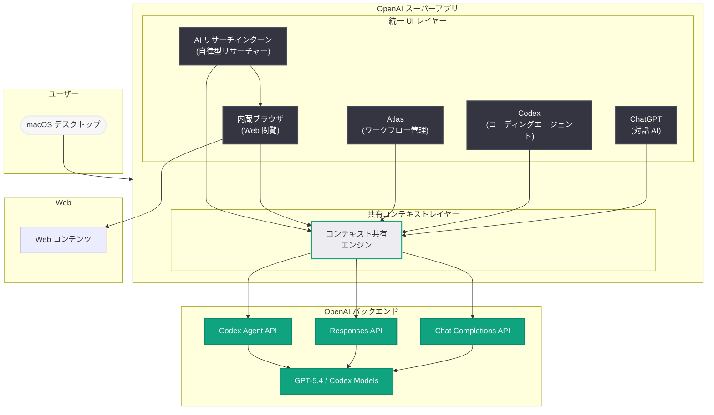

# OpenAI がデスクトップ「スーパーアプリ」を発表: ChatGPT、Codex、Atlas を統合した新たな製品戦略

## メタデータ

| 項目 | 内容 |
|------|------|
| 発表日 | 2026-03-20 |
| ソース | OpenAI News (WSJ 独占報道、Reuters、CNBC、The Verge 他) |
| カテゴリ | Product |
| 公式リンク | [openai.com](https://openai.com/news) |

## 概要

OpenAI は、ChatGPT、AI コーディングエージェント Codex、そして Atlas を単一のデスクトップアプリケーションに統合した「スーパーアプリ」の開発計画を明らかにした。Wall Street Journal が 2026 年 3 月 19 日に独占報道し、Reuters が同日に確認したこの計画は、OpenAI の製品戦略における大きな転換点を示している。

このスーパーアプリには Web ブラウザが内蔵されるほか、「AI リサーチインターン」と呼ばれる完全自律型の研究者機能も搭載される予定である。MIT Technology Review は、OpenAI が「完全自動化されたリサーチャーの構築にすべてを注ぎ込んでいる」と報じており、AI アシスタントの枠を超えた統合プラットフォームへの進化が本格化している。macOS 向けに先行リリースされる計画であり、デスクトップ環境との深い統合を目指している。

## 主な内容

### スーパーアプリの構成要素

OpenAI のスーパーアプリは、現在個別に提供されている複数の製品を統合した包括的なデスクトップアプリケーションである。以下の主要コンポーネントで構成される。

1. **ChatGPT:** OpenAI の主力対話型 AI アシスタント。テキスト生成、質問応答、文章作成、翻訳など幅広いタスクに対応する中核機能として位置づけられる
2. **Codex:** クラウド上でソフトウェアエンジニアリングタスクを自律的に実行する AI コーディングエージェント。2026 年に入りサブエージェント機能やセキュリティ分析機能が次々と追加され、急速に進化している
3. **Atlas:** OpenAI の AI ツール群の一つとして統合されるコンポーネント。スーパーアプリ内でのワークフロー管理やタスク調整の役割を担うとみられる
4. **内蔵 Web ブラウザ:** アプリ内から直接 Web を閲覧・検索できる機能。外部ブラウザに切り替えることなくリサーチや情報収集を完結できる
5. **AI リサーチインターン:** 完全自律型の研究者機能。ディープリサーチを自動的に実施し、ユーザーに代わって包括的な調査レポートを生成する

### 製品戦略の転換

今回のスーパーアプリ構想は、OpenAI の製品提供方法における根本的な戦略転換を意味している。

これまで OpenAI は、ChatGPT (対話型 AI)、Codex (コーディングエージェント)、Sora (動画生成)、DALL-E (画像生成) など、機能ごとに個別のアプリケーションやインターフェースを提供してきた。しかし、この分散型アプローチはユーザーにとって煩雑であり、ツール間の切り替えがワークフローの効率を低下させるという課題があった。

スーパーアプリへの統合により、以下のメリットが期待される。

- **シームレスなワークフロー:** 対話、コーディング、リサーチ、Web 閲覧を単一アプリ内で完結できる
- **コンテキストの共有:** 各コンポーネント間でコンテキストが共有され、タスク間の連携がスムーズになる
- **統一されたユーザー体験:** 機能ごとに異なるインターフェースを学ぶ必要がなくなり、学習コストが削減される
- **デスクトップ統合の深化:** macOS のネイティブ機能と統合することで、OS レベルでの操作支援が可能になる

### AI リサーチインターン: 完全自動化されたリサーチャー

MIT Technology Review の報道によると、OpenAI は「完全自動化されたリサーチャー」の構築に全力を注いでいる。スーパーアプリに搭載される「AI リサーチインターン」機能は、この取り組みの具体的な成果物となる。

AI リサーチインターンの主な特徴は以下の通りである。

- **自律的な調査実行:** ユーザーが調査テーマを指定するだけで、AI が自動的にリサーチ計画を立案し、情報収集、分析、レポート作成までを一貫して実行する
- **ディープリサーチ機能:** 表面的な検索結果にとどまらず、複数のソースを横断的に分析し、深層的な洞察を提供する
- **内蔵ブラウザとの連携:** スーパーアプリの内蔵ブラウザを活用し、リアルタイムの Web 情報にアクセスしながら調査を進める
- **継続的な学習と改善:** 調査結果に対するユーザーのフィードバックを基に、リサーチの精度と関連性を継続的に向上させる

この機能は、研究者、アナリスト、ジャーナリスト、ビジネスプロフェッショナルなど、情報収集と分析を日常的に行うユーザーに特に大きな価値を提供するものと期待される。

### macOS 先行リリースと今後の展開

スーパーアプリは macOS 向けに先行リリースされる計画である。OpenAI は既に macOS 向けの ChatGPT デスクトップアプリを提供しており、macOS のネイティブ機能 (Spotlight 連携、メニューバー統合、ショートカットキーなど) との統合実績がある。

macOS を先行プラットフォームとする理由としては、以下が考えられる。

- **既存の macOS アプリ基盤:** ChatGPT macOS アプリが既に広く普及しており、アップデートとして展開しやすい
- **開発者ユーザーの集中:** macOS は開発者の利用率が高く、Codex 機能との親和性が高い
- **デスクトップ統合の容易さ:** macOS の API やフレームワークを活用した深いシステム統合が可能である

## 技術的な詳細

### スーパーアプリのアーキテクチャ構想

スーパーアプリの技術的なアーキテクチャは、統合されたフロントエンドレイヤーと、バックエンドの各種 AI サービスの連携によって構成されると考えられる。

- **統一フロントエンド:** macOS ネイティブアプリケーションとして、各コンポーネント (ChatGPT、Codex、Atlas、ブラウザ、リサーチインターン) を統合した UI を提供する。タブやパネルによるマルチタスク対応が想定される
- **共有コンテキストレイヤー:** ユーザーの会話履歴、コーディングプロジェクト、リサーチ結果などのコンテキストを各コンポーネント間で共有するミドルウェア層
- **内蔵ブラウザエンジン:** Web 閲覧機能を提供するレンダリングエンジン。AI リサーチインターンがリアルタイム情報にアクセスするための基盤としても機能する
- **バックエンド API 連携:** OpenAI の Chat Completions API、Responses API、Codex エージェント API などとの通信を統合的に管理するレイヤー

### 内蔵ブラウザの技術的意味

スーパーアプリに Web ブラウザを内蔵するという決定は、技術的に重要な意味を持つ。

- **リアルタイム情報アクセス:** AI がブラウザを通じて最新の Web 情報に直接アクセスできるため、知識のカットオフによる制約が大幅に緩和される
- **ユーザー行動の統合:** Web 閲覧と AI 対話が同一アプリ内で行われることで、ユーザーの意図やコンテキストをより正確に把握できる
- **自動化ワークフロー:** AI リサーチインターンがブラウザを制御して自動的に情報収集を行うことが可能になり、人手を介さないリサーチプロセスが実現する

### Codex 統合の技術的詳細

Codex のスーパーアプリ統合により、コーディングワークフローが大幅に改善される見込みである。

- **チャットとコードの連携:** ChatGPT での対話内容をそのまま Codex のコーディングタスクに引き継ぐことが可能になる
- **ブラウザとの連携:** ドキュメントや API リファレンスをブラウザで参照しながら、Codex がコード生成を行うシームレスな体験
- **リサーチとコードの統合:** AI リサーチインターンが技術調査を行い、その結果を基に Codex がコード実装を行うエンドツーエンドのワークフロー

> **注:** 上記の技術的詳細は報道内容に基づく分析であり、OpenAI が公式に発表した仕様ではない。実際の製品仕様は公式発表を参照されたい。

## アーキテクチャ

## 開発者への影響

### 統合開発体験の実現

スーパーアプリの登場により、開発者は以下のような統合された開発体験を得ることが期待される。

- **ワンストップ開発環境:** ChatGPT での設計相談、Codex でのコード実装、ブラウザでのドキュメント参照を単一アプリ内で完結できる
- **コンテキスト保持:** プロジェクトのコンテキストが各機能間で共有されるため、ツール間の切り替えによる情報の断絶が解消される
- **リサーチ駆動開発:** AI リサーチインターンが技術選定や設計パターンの調査を自動化し、開発者はコーディングに集中できる

### AI プラットフォーム競争への影響

- **Google との競争:** Google が Gemini を中核としたエコシステムを構築する中、OpenAI はスーパーアプリによりデスクトップ領域での優位性を確立しようとしている
- **Microsoft / GitHub Copilot との関係:** OpenAI と Microsoft はパートナーシップ関係にあるが、Codex を含むスーパーアプリは GitHub Copilot と競合する側面もある
- **Anthropic、xAI との差別化:** 統合プラットフォーム戦略により、個別の AI モデル性能だけでなく、ユーザー体験全体での差別化を図る

### 製品統合がもたらす変化

- **個別アプリの今後:** ChatGPT デスクトップアプリ、Web 版 ChatGPT、Codex の個別インターフェースがスーパーアプリに統合された後、既存アプリがどのように扱われるかは現時点では不明である
- **API への影響:** スーパーアプリはフロントエンド製品の統合であり、バックエンドの API 自体に大きな変更が生じる可能性は低い。ただし、コンテキスト共有のための新しい API が追加される可能性はある
- **サードパーティ連携:** スーパーアプリがプラグインやエクステンションの仕組みを提供するかどうかは、エコシステムの発展にとって重要なポイントとなる

### 懸念事項

- **プラットフォームロックイン:** 複数の機能が単一アプリに統合されることで、OpenAI エコシステムへの依存度が高まる懸念がある
- **macOS 優先によるプラットフォーム格差:** macOS 先行リリースにより、Windows や Linux ユーザーは統合体験を享受できない期間が生じる
- **リソース消費:** 複数のコンポーネントを統合した大規模アプリケーションは、システムリソースの消費が懸念される
- **プライバシーとデータ:** 内蔵ブラウザを通じた Web 閲覧データと AI 対話データの取り扱いについて、プライバシーポリシーの明確化が求められる

## 関連リンク

- [WSJ: OpenAI Plans Launch of Desktop 'Superapp' to Refocus, Simplify User Experience](https://www.wsj.com)
- [Reuters: OpenAI plans desktop 'superapp' to streamline user experience](https://www.reuters.com)
- [CNBC: OpenAI to create desktop super app, combining ChatGPT app, browser and Codex app](https://www.cnbc.com)
- [MIT Technology Review: OpenAI is throwing everything into building a fully automated researcher](https://www.technologyreview.com)
- [CNET: OpenAI Plans to Combine Its AI Tools in a Desktop 'Superapp'](https://www.cnet.com)
- [The Verge: OpenAI is planning a desktop 'superapp'](https://www.theverge.com)
- [9to5Mac: OpenAI is building a desktop 'superapp' for macOS](https://9to5mac.com)
- [SiliconANGLE: OpenAI to launch ChatGPT superapp, 'AI research intern'](https://siliconangle.com)
- [OpenAI News](https://openai.com/news)

## まとめ

OpenAI のデスクトップスーパーアプリ構想は、ChatGPT、Codex、Atlas、内蔵ブラウザ、AI リサーチインターンを統合した包括的なプラットフォームへの戦略転換を示している。これまでの分散型製品提供から統合型アプリケーションへの移行により、ユーザー体験の大幅な簡素化とワークフローの効率化が期待される。特に「AI リサーチインターン」は、MIT Technology Review が報じるように OpenAI が「完全自動化されたリサーチャー」の実現に全力を注いでいることの具体的な成果であり、AI アシスタントの次の進化段階を示唆している。macOS 先行でのリリースが計画されており、デスクトップ環境との深い統合による差別化を図る方針である。Google、Microsoft、Anthropic などとの競争が激化する中、OpenAI はモデル性能だけでなくユーザー体験全体での競争力強化を目指している。
