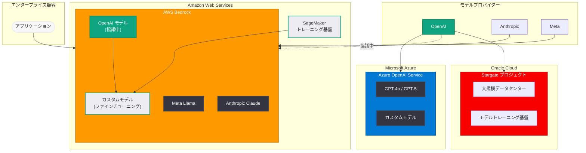

# Amazon、OpenAI とカスタムモデル提供に向けた協議を開始

## メタデータ

| 項目 | 内容 |
|------|------|
| 発表日 | 2026-03-21 |
| ソース | OpenAI News (MSN、複数メディア報道) |
| カテゴリ | パートナーシップ / クラウド |
| 公式リンク | [MSN 報道](https://www.msn.com/en-us/money/companies/amazon-enters-discussions-with-openai-for-possible-customized-models/) |

## 概要

Amazon が OpenAI とカスタム AI モデルの提供に向けた協議を開始したことが報じられた。Amazon は AWS Bedrock プラットフォームを通じて複数の AI モデルを提供しているが、これまで Anthropic との提携を軸に AI 戦略を展開してきた。OpenAI モデルの追加は、Amazon の AI ポートフォリオを大幅に拡大する動きとなる。

この協議は、AI クラウド市場の勢力図に大きな変化をもたらす可能性がある。OpenAI の主要クラウドパートナーである Microsoft との関係性、Oracle との Stargate プロジェクト、そして Amazon が 40 億ドル以上を投資してきた Anthropic との関係を含め、主要クラウドプロバイダー間の AI パートナーシップの再編が進行していることを示唆している。

## 主な内容

### Amazon と OpenAI の協議の背景

Amazon は AWS を通じてエンタープライズ向け AI サービスを展開しており、Bedrock プラットフォームでは Anthropic Claude、Meta Llama をはじめとする複数のモデルを提供している。しかし、OpenAI のモデルは Microsoft Azure 経由でのみ利用可能であり、AWS ユーザーにとっては選択肢の制約となっていた。

今回の協議では、以下の点が注目される。

- **カスタムモデルの提供:** 汎用モデルの単純な再販ではなく、Amazon のエンタープライズ顧客が自社データで OpenAI モデルをファインチューニングできるカスタムモデルの提供が検討されている
- **Anthropic 依存からの分散:** Amazon は Anthropic に 40 億ドル以上を投資してきたが、AI 戦略を単一プロバイダーに依存するリスクを軽減する狙いがある
- **エンタープライズ需要への対応:** 企業顧客はモデルの選択肢とマルチクラウド対応を求めており、OpenAI モデルの追加はこの需要に応えるものとなる

### AI クラウドパートナーシップの再編

本件は、AI 業界全体のパートナーシップ構造が流動化していることを示す重要な事例である。

**Microsoft の立場:** Microsoft は OpenAI に 130 億ドル以上を投資し、Azure OpenAI Service を通じて OpenAI モデルの独占的なクラウド提供を行ってきた。Amazon との協議が報じられたことに対し、Times of India は「Microsoft が OpenAI と Amazon に対して不満を抱いている可能性がある」と報じている。OpenAI のパートナーシップ拡大が Microsoft との関係にどのような影響を与えるかが注目される。

**Oracle と Stargate プロジェクト:** OpenAI は Oracle とも大規模データセンター契約 (Stargate プロジェクト) を締結しており、クラウドインフラのパートナーを積極的に多角化している。

**OpenAI の戦略:** OpenAI はクラウドおよびインフラパートナーシップの多様化を進めている。Microsoft 一社への依存を軽減し、より広範なエンタープライズ市場にリーチする戦略が明確になりつつある。

### エンタープライズ AI 市場への影響

エンタープライズ顧客にとって、モデルの選択肢が拡大することは大きなメリットとなる。

- **マルチモデル戦略:** 用途に応じて最適なモデルを選択できる環境が整備される
- **ベンダーロックインの回避:** 特定のクラウドプロバイダーやモデルプロバイダーへの依存リスクが軽減される
- **カスタマイズの柔軟性:** 自社データを用いたファインチューニングにより、業界固有の要件に対応したモデルを構築できる

## 技術的な詳細

### カスタムモデル統合の技術的側面

Amazon と OpenAI のカスタムモデル提供が実現した場合、以下の技術的な統合が必要となる。

**AWS Bedrock へのモデル統合:**

- AWS Bedrock の統一 API インターフェースを通じた OpenAI モデルへのアクセス
- 既存の Bedrock SDK との互換性確保
- IAM (Identity and Access Management) によるアクセス制御の統合
- VPC エンドポイントを通じたプライベートネットワーク内でのモデル呼び出し

**カスタムモデルのファインチューニング:**

- エンタープライズ顧客の独自データセットを用いたモデルのファインチューニング
- AWS のデータガバナンスフレームワークとの統合
- SageMaker との連携によるトレーニングパイプラインの構築
- モデルバージョン管理とデプロイメントの自動化

**想定される API 利用イメージ:**

現在の Azure OpenAI Service と同様の形式で、AWS Bedrock を通じた呼び出しが実現する可能性がある。

```python
import boto3
import json

# AWS Bedrock を通じた OpenAI モデル呼び出し (想定イメージ)
bedrock = boto3.client("bedrock-runtime", region_name="us-east-1")

response = bedrock.invoke_model(
    modelId="openai.gpt-4o-custom",  # カスタムファインチューニング済みモデル
    contentType="application/json",
    body=json.dumps({
        "messages": [
            {"role": "user", "content": "自社データに基づいて分析してください"}
        ],
        "max_tokens": 1024,
        "temperature": 0.7
    })
)

result = json.loads(response["body"].read())
print(result["choices"][0]["message"]["content"])
```

**注意:** 上記コードは協議段階の情報に基づく想定イメージであり、実際の API 仕様は正式発表時に確認が必要である。

## アーキテクチャ



## 開発者への影響

### AWS 開発者への影響

AWS をプライマリクラウドとして利用している開発者にとって、本件は以下の影響をもたらす可能性がある。

- **モデル選択肢の拡大:** Bedrock を通じて OpenAI モデルにアクセスできるようになれば、Azure との併用が不要となり、インフラの簡素化が実現する。単一のクラウド環境内で Anthropic Claude と OpenAI GPT シリーズを用途に応じて使い分けることが可能になる
- **既存ワークフローとの統合:** AWS の既存サービス (Lambda、Step Functions、EventBridge 等) との統合が容易になり、OpenAI モデルを既存の AWS アーキテクチャにシームレスに組み込める
- **コスト管理の一元化:** AWS の課金体系に統合されることで、AI モデルの利用コストを既存の AWS 請求と一元管理できるようになる

### マルチクラウド戦略への影響

- **ベンダーロックイン緩和:** OpenAI モデルが複数のクラウドプラットフォームで利用可能になることで、特定のクラウドへの依存度が低下する
- **災害復旧と冗長性:** 同一モデルを複数クラウドで利用できることで、障害時のフォールバック戦略が立てやすくなる
- **移行の柔軟性:** Azure から AWS への移行、またはその逆のシナリオにおいて、AI ワークロードの移行障壁が低くなる

### AI アプリケーション開発への影響

- **カスタムモデルの民主化:** AWS のエンタープライズ顧客基盤を通じて、OpenAI のカスタムモデルへのアクセスが広がり、業界特化型 AI アプリケーションの開発が加速する可能性がある
- **API 互換性の課題:** Azure OpenAI Service と AWS Bedrock では API の設計思想が異なるため、抽象化レイヤーの実装やコードの書き換えが必要になる場合がある
- **データプライバシー:** AWS のリージョン内でモデルを実行できることで、データレジデンシー要件の厳しい業界 (金融、医療、政府機関等) での採用が進む可能性がある

## 関連リンク

- [MSN: Amazon enters discussions with OpenAI for possible customized models](https://www.msn.com/en-us/money/companies/amazon-enters-discussions-with-openai-for-possible-customized-models/)
- [AWS Bedrock 公式ドキュメント](https://docs.aws.amazon.com/bedrock/)
- [OpenAI API リファレンス](https://platform.openai.com/docs/api-reference)
- [OpenAI News](https://openai.com/news)

## まとめ

Amazon と OpenAI のカスタムモデル提供に向けた協議は、AI クラウド市場のパートナーシップ構造が大きく変化しつつあることを象徴する出来事である。Amazon はこれまで Anthropic を中心に AI 戦略を構築してきたが、OpenAI モデルの追加により、AWS Bedrock は業界で最も包括的なモデルプラットフォームとなる可能性がある。一方で、Microsoft との独占的な関係を軸に成長してきた OpenAI にとっても、パートナーシップの多角化は事業基盤の強化につながる。エンタープライズ顧客がマルチモデル・マルチクラウドのアプローチを求める中、この協議が正式な提携に発展するかどうかは、AI クラウド市場全体の今後の方向性を左右する重要な指標となる。AWS 開発者にとっては、Azure との併用なしに OpenAI モデルを活用できる環境が整う可能性があり、開発体験とコスト効率の両面で大きな恩恵が期待される。
