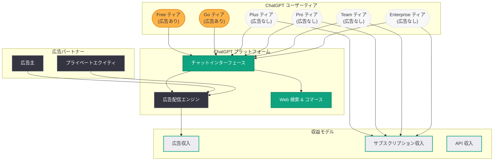

# OpenAI、ChatGPT 無料・低価格ユーザー向けに米国で広告展開を拡大

## メタデータ

| 項目 | 内容 |
|------|------|
| 発表日 | 2026-03-21 |
| ソース | OpenAI News (Reuters、The Information、Tech in Asia、PYMNTS 報道) |
| カテゴリ | ビジネス / 収益化 |
| 公式リンク | [Reuters 報道](https://www.reuters.com/technology/openai-expand-ads-chatgpt-all-free-low-cost-users-information-reports-2026-03-21/) |

## 概要

OpenAI は、ChatGPT の無料ティアおよび低価格の Go ティアを利用する米国の全ユーザーに対して、広告表示を拡大することを決定した。これまでパイロットプログラムとして限定的に実施されていた広告表示が、本格的な展開フェーズへと移行する。The Information が最初に報じ、Reuters が確認した。

この動きは、OpenAI が IPO を控える中で収益基盤の多角化を推進する戦略の一環である。年間売上高が 50 億ドルを超えるとされる同社だが、AI モデルの運用コストは依然として極めて高く、広告収入によって無料ティアの運用コストを補填し、損失を縮小する狙いがある。Google の広告インフラとの直接競合という新たな局面にも踏み込むことになる。

## 主な内容

### 広告展開の対象と範囲

今回の拡大により、以下のユーザーが広告表示の対象となる。

- **ChatGPT Free ティア:** 無料で ChatGPT を利用するすべての米国ユーザー
- **ChatGPT Go ティア:** 低価格プランの米国ユーザー

これまではパイロットテストとして一部ユーザーに限定されていた広告表示が、対象ティアの全ユーザーへと拡大される。Plus、Pro、Team、Enterprise の有料上位ティアは広告表示の対象外と見られる。

### 収益化戦略の背景

OpenAI の収益化戦略は、以下の要因によって加速している。

1. **IPO への準備:** OpenAI は株式公開に向けた準備を進めており、収益基盤の多角化は投資家に対する重要なアピールポイントとなる
2. **運用コストの高騰:** AI モデルのトレーニングおよび推論に要するコストは極めて高く、年間 50 億ドル超の売上をもっても損失が続いている状況である
3. **無料ティアの持続可能性:** 広告収入を得ることで、無料ティアの運用を経済的に持続可能な形に転換する
4. **プライベートエクイティとの連携:** 2026 年 3 月 16 日には MediaPost が、OpenAI がプライベートエクイティ企業に広告パートナーシップを働きかけていると報じている

### 競合環境: Google との直接対決

ChatGPT への広告導入は、OpenAI を Google の広告事業と直接的に競合する立場に置く。

- **Google の優位性:** Google は数十年にわたる広告インフラ、広告主ネットワーク、ターゲティング技術を保有している
- **OpenAI の差別化要因:** ChatGPT の対話型インターフェースは、従来の検索広告とは異なるコンテキスト広告の形態を可能にする
- **コマース戦略との連携:** OpenAI は Google と並行してコマース戦略の精緻化を進めており、広告とコマースの統合的なアプローチを模索している

## 技術的な詳細

### 広告統合の技術的側面

ChatGPT への広告統合には、従来の Web 広告とは異なる技術的課題が存在する。

**対話型インターフェースにおける広告配信:**

- ChatGPT の会話フロー内に自然な形で広告を挿入する必要がある
- ユーザーの質問内容やコンテキストに基づいたターゲティングが求められる
- 広告がユーザー体験を著しく損なわないよう、表示頻度と配置の最適化が不可欠である

**プライバシーとデータの取り扱い:**

- ユーザーの会話データを広告ターゲティングにどの程度活用するかは、プライバシーの観点から重要な論点となる
- 米国のプライバシー規制 (CCPA 等) への準拠が必要である
- 広告主に対するレポーティングにおいて、ユーザーの個人情報をどこまで匿名化するかの設計が求められる

**広告フォーマットの設計:**

- テキストベースの会話内広告
- 検索結果やレコメンデーション内のスポンサードコンテンツ
- ChatGPT の Web 検索機能と連動した広告表示

### ティア別の機能差異

広告展開に伴い、ChatGPT の各ティアの位置づけがより明確になる。

| ティア | 広告表示 | 対象ユーザー | 主な特徴 |
|--------|----------|-------------|----------|
| Free | あり | 一般ユーザー | 基本機能 + 広告 |
| Go | あり | 低価格課金ユーザー | 拡張機能 + 広告 |
| Plus | なし | 個人課金ユーザー | 広告なし + 高度な機能 |
| Pro | なし | パワーユーザー | 広告なし + 最上位機能 |
| Team | なし | チーム利用 | 広告なし + コラボレーション |
| Enterprise | なし | 企業利用 | 広告なし + セキュリティ・管理機能 |

## アーキテクチャ

## 開発者への影響

### API 開発者・サービス提供者への影響

- **API 利用への直接的影響はなし:** 今回の広告展開は ChatGPT のコンシューマー向けインターフェースに限定されており、OpenAI API を利用する開発者のサービスに広告が挿入されることはない
- **将来的な広告 API の可能性:** OpenAI が広告事業を拡大するにつれ、開発者向けの広告 API やアドネットワークの提供が将来的に検討される可能性がある
- **コスト構造への間接的影響:** 広告収入による財務基盤の安定化は、API 価格の安定化やさらなる値下げにつながる可能性がある

### ChatGPT プラグイン・アプリ開発者への影響

- **広告との共存設計:** ChatGPT プラットフォーム上でアプリやプラグインを提供する開発者は、広告表示との共存を前提とした UI 設計が求められる可能性がある
- **コマース機能との統合:** 広告とコマース機能が連携する場合、商品カタログやアフィリエイトリンクの統合方法に変更が生じる可能性がある

### 広告業界・マーケターへの影響

- **新たな広告チャネルの登場:** ChatGPT は月間数億人のアクティブユーザーを抱えており、広告主にとって魅力的な新規チャネルとなる
- **対話型広告の設計:** 従来のディスプレイ広告や検索広告とは異なる、対話型コンテキストに最適化された広告クリエイティブの開発が必要となる
- **効果測定の課題:** 対話型インターフェースにおける広告効果の測定指標やアトリビューションモデルの確立が求められる

## 関連リンク

- [Reuters: OpenAI to expand ads on ChatGPT to all free, low-cost users](https://www.reuters.com/technology/openai-expand-ads-chatgpt-all-free-low-cost-users-information-reports-2026-03-21/)
- [OpenAI News](https://openai.com/news)
- [PYMNTS: OpenAI and Google Refine Early AI Commerce Strategies](https://www.pymnts.com/)
- [MediaPost: OpenAI Courts Private Equity Firms for Ad Partnerships](https://www.mediapost.com/)

## まとめ

OpenAI が ChatGPT の無料ティアおよび Go ティアの米国全ユーザーに対して広告表示を拡大する決定は、同社の収益化戦略における大きな転換点である。これまでのパイロットテストから本格展開へと移行することで、サブスクリプションと API 利用料に依存してきた収益構造に広告という第三の柱が加わる。IPO を控える OpenAI にとって、年間 50 億ドル超の売上に対して依然として高い運用コストを抱える中、広告収入は無料ティアの持続可能性を確保する重要な手段となる。一方で、Google の強固な広告インフラとの直接競合や、ユーザー体験と広告のバランス、プライバシーへの配慮など、解決すべき課題も多い。有料ティア (Plus、Pro、Team、Enterprise) が広告なしの体験を維持することで、ユーザーにアップグレードへの明確なインセンティブを提供する階層構造が形成されつつある。AI プラットフォームにおける広告モデルの確立は、業界全体の収益化のあり方に大きな影響を与える可能性がある。
