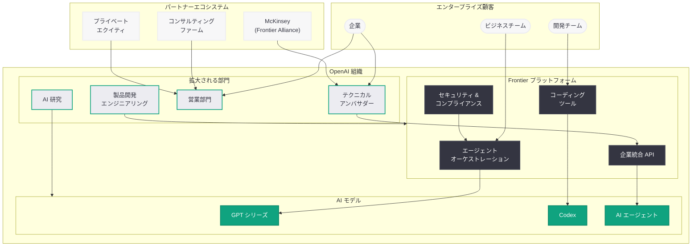

# OpenAI、2026 年末までに従業員数を 8,000 人に倍増計画: エンタープライズ戦略強化と Frontier プラットフォーム拡大

## メタデータ

| 項目 | 内容 |
|------|------|
| 発表日 | 2026-03-21 |
| ソース | OpenAI News (Financial Times、Reuters、Engadget、The Information、Bloomberg) |
| カテゴリ | ビジネス / 企業戦略 |
| 公式リンク | [Financial Times](https://www.ft.com/content/openai-workforce-8000)、[Reuters](https://www.reuters.com/technology/openai-nearly-double-workforce-8000-by-2026-ft-reports-2026-03-21/) |

## 概要

OpenAI が 2026 年末までに従業員数を現在の約 4,500 人から 8,000 人へとほぼ倍増させる計画であることが、Financial Times の報道により明らかになった。計画に精通する 2 名の関係者の情報に基づくこの報道は、OpenAI がエンタープライズ市場での競争力強化に本腰を入れていることを示している。

新規採用の大部分は製品開発、エンジニアリング、研究、および営業部門に充てられる予定である。特に注目すべきは、企業が OpenAI のツールを統合するための「テクニカルアンバサダーシップ」専門職の創設と、エージェントベースの AI プラットフォーム「Frontier」の拡大である。Anthropic や Google DeepMind、Meta AI との競争が激化する中、OpenAI は組織の大規模拡大を通じて IPO (評価額 3,000 億ドル超) への準備を加速させている。

## 主な内容

### 大規模採用計画の詳細

OpenAI の大規模採用計画は、同社の戦略的優先事項を明確に反映している。

- **製品開発・エンジニアリング:** 新規採用の中核を占める分野であり、Frontier プラットフォームをはじめとするエンタープライズ製品の開発を加速させる
- **研究部門:** AI モデルの性能向上と次世代モデルの研究開発を継続的に推進するための人材を確保する
- **営業部門:** エンタープライズ顧客の獲得を強化し、コンサルティングファームやプライベートエクイティファームとのパートナーシップを拡大する
- **テクニカルアンバサダーシップ:** 企業が OpenAI のツールを自社のワークフローに統合するための技術支援を専門とする新たな職種を創設する

### Frontier プラットフォームとエンタープライズ戦略

OpenAI のエンタープライズ戦略の中核に位置するのが「Frontier」プラットフォームである。これはエージェントベースの AI プラットフォームであり、企業のワークフローに深く組み込まれるよう設計されている。

Frontier プラットフォームの主な特徴は以下の通りである。

- **エージェントベースアーキテクチャ:** AI エージェントが企業のワークフロー内で自律的にタスクを実行する設計思想
- **ワークフロー統合:** 企業の既存のシステムやプロセスにシームレスに統合可能なプラットフォーム設計
- **コーディング領域での差別化:** エンタープライズ向けコーディング支援を重点分野として位置づけ、開発者向けツールの強化を推進

### Frontier Alliance とパートナーシップ戦略

OpenAI は Frontier プラットフォームの普及を加速させるため、戦略的パートナーシップを積極的に構築している。

- **Frontier Alliance:** McKinsey をはじめとするコンサルティングファームとのアライアンスを立ち上げ、企業への AI 導入支援を組織的に展開する
- **プライベートエクイティとの連携:** プライベートエクイティファームとのパートナーシップが進行中であり、投資先企業への AI 導入を通じた市場拡大を狙う
- **テクニカルアンバサダー:** 専門人材が企業に伴走し、OpenAI ツールの技術的な統合を支援することで、導入障壁を低減する

### 競合環境と市場ポジショニング

OpenAI の大規模採用計画の背景には、エンタープライズ市場における競争の激化がある。

- **Anthropic の台頭:** OpenAI が ChatGPT の機能拡充、画像生成、動画モデルに注力している間に、Anthropic がエンタープライズ領域で着実にシェアを拡大してきた
- **Google DeepMind:** Gemini を中核としたエンタープライズ AI ソリューションの展開を加速させている
- **Meta AI:** オープンソース戦略を通じてエンタープライズ市場への影響力を拡大している

OpenAI はこれまでコンシューマー向け製品に重点を置いてきたが、今回の採用計画はエンタープライズ市場でのプレゼンス強化への明確なシフトを示している。

### IPO への準備

今回の組織拡大は、OpenAI の IPO 準備と密接に関連している。評価額 3,000 億ドル超とされる同社にとって、エンタープライズ収益基盤の確立は公開市場での評価を支える重要な要素である。営業部門の強化やコンサルティングファームとのアライアンスは、安定的かつ予測可能な収益源の構築を目指すものと考えられる。

## 技術的な詳細

### Frontier プラットフォームの技術的構想

Frontier プラットフォームは、エージェントベースの AI システムを企業のワークフローに組み込むための統合基盤として設計されている。報道から推測される技術的な構成要素は以下の通りである。

- **エージェントオーケストレーション:** 複数の AI エージェントが協調してタスクを遂行するためのオーケストレーション層
- **企業システム統合 API:** 既存の業務システム (CRM、ERP、CI/CD パイプラインなど) との統合を可能にする API レイヤー
- **セキュリティとコンプライアンス:** エンタープライズ要件を満たすデータ保護、アクセス制御、監査ログ機能
- **カスタマイズ可能なエージェント:** 企業固有の業務プロセスに合わせてカスタマイズ可能な AI エージェントテンプレート

### エンタープライズ向け API の活用

Frontier プラットフォームを通じた企業統合では、OpenAI の既存 API を活用したワークフロー構築が中心となる。

```python
from openai import OpenAI

client = OpenAI()

# エンタープライズワークフローに統合された AI エージェントの例
response = client.responses.create(
    model="gpt-4o",
    instructions="""あなたは企業のワークフローに統合された AI アシスタントです。
    社内データとコンテキストに基づいて、業務タスクを支援してください。""",
    input="四半期レポートのデータを分析し、主要なトレンドを要約してください。",
    tools=[
        {
            "type": "function",
            "name": "query_enterprise_data",
            "description": "社内データベースからデータを取得する",
            "parameters": {
                "type": "object",
                "properties": {
                    "query": {"type": "string"},
                    "database": {"type": "string"}
                }
            }
        }
    ]
)
print(response.output_text)
```

> **注:** 上記のコードサンプルは Frontier プラットフォームでの想定される活用例を示すものであり、実際の API 仕様は公式ドキュメントを参照されたい。

## アーキテクチャ



## 開発者への影響

### エンタープライズ統合ツールの充実

OpenAI のエンタープライズ戦略強化に伴い、開発者向けの統合ツールやドキュメントが大幅に拡充されることが期待される。

- **Frontier プラットフォーム SDK:** 企業のワークフローに AI エージェントを組み込むための専用 SDK やフレームワークが提供される可能性がある
- **テクニカルアンバサダーによる支援:** 導入企業の開発者が専門家から直接技術支援を受けられる体制が整備される
- **エンタープライズ向けドキュメント:** 企業統合に特化したガイド、ベストプラクティス、リファレンスアーキテクチャの充実が見込まれる

### コーディング領域での競争激化

OpenAI がエンタープライズ向けコーディング支援を重点分野として位置づけていることは、開発者に直接的な影響をもたらす。

- **ツールの品質向上:** Anthropic との競争がコーディング支援ツールの品質向上を促進し、開発者はより高性能なツールを利用できるようになる
- **選択肢の拡大:** OpenAI、Anthropic、Google が各々エンタープライズ向けコーディングツールを強化することで、開発者の選択肢が広がる
- **価格競争の可能性:** 競合の激化がエンタープライズ向け AI サービスの価格引き下げにつながる可能性がある

### API とサービスの進化

大規模な製品開発・エンジニアリング人材の採用は、API やサービスの進化を加速させる。

- **新しい API エンドポイント:** エンタープライズ統合に特化した新しい API の追加が予想される
- **エージェント機能の強化:** Frontier プラットフォームの基盤となるエージェント関連 API の機能拡充
- **セキュリティ機能の向上:** エンタープライズ要件に対応するための認証、暗号化、監査機能の強化

### 懸念事項

- **エンタープライズ偏重のリスク:** 組織のリソースがエンタープライズ向けに集中することで、個人開発者や小規模チーム向けのサービス改善が後回しになる可能性がある
- **プラットフォームロックイン:** Frontier プラットフォームへの依存度が高まることで、他の AI サービスへの移行が困難になるリスクがある
- **急速な組織拡大に伴う課題:** 従業員数の倍増は、組織文化の維持や品質管理において課題をもたらす可能性がある

## 関連リンク

- [Financial Times: OpenAI to nearly double workforce to 8,000](https://www.ft.com/content/openai-workforce-8000)
- [Reuters: OpenAI to nearly double workforce to 8,000 by end of 2026](https://www.reuters.com/technology/openai-nearly-double-workforce-8000-by-2026-ft-reports-2026-03-21/)
- [OpenAI News](https://openai.com/news)
- [OpenAI 公式ドキュメント](https://platform.openai.com/docs)
- [OpenAI API リファレンス](https://platform.openai.com/docs/api-reference)

## まとめ

OpenAI が 2026 年末までに従業員数を約 4,500 人から 8,000 人へ倍増させる計画は、同社がエンタープライズ市場での競争力強化に本格的に乗り出したことを示す重要な戦略的決定である。新規採用は製品開発、エンジニアリング、研究、営業に集中し、エージェントベースの Frontier プラットフォームを中核とするエンタープライズ戦略を支える体制を構築する。McKinsey との Frontier Alliance やプライベートエクイティとのパートナーシップは、AI 導入支援のエコシステムを組織的に展開する狙いを明確に示している。Anthropic がエンタープライズ領域でシェアを拡大する中、OpenAI はテクニカルアンバサダーの創設やコーディング支援の強化によって巻き返しを図る構えである。IPO (評価額 3,000 億ドル超) への準備が進む中、この大規模な組織拡大は、OpenAI がコンシューマー向け AI の先駆者からエンタープライズ AI プラットフォーム企業への変貌を加速させていることを如実に物語っている。
