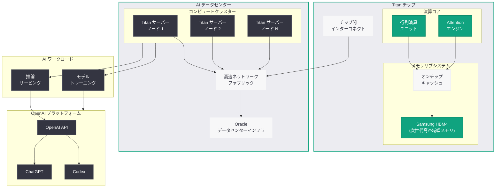

# Samsung、OpenAI 初の AI チップ「Titan」向けに HBM4 を供給へ

## メタデータ

| 項目 | 内容 |
|------|------|
| 発表日 | 2026-03-21 (初報 2026-03-19) |
| ソース | OpenAI News (Reuters、韓国メディア、MSN) |
| カテゴリ | ハードウェア / AI インフラ |
| 公式リンク | [Reuters 報道](https://www.reuters.com/technology/samsung-elec-supply-hbm4-chips-openai-south-korean-paper-says-2026-03-19/) |

## 概要

Samsung Electronics が、OpenAI 初のカスタム AI チップ「Titan」(コードネーム) 向けに HBM4 (High Bandwidth Memory 4) チップを供給することが明らかになった。韓国紙が最初に報じ、Reuters が確認したこの動きは、OpenAI が Nvidia への依存度を低減し、独自のシリコン設計に本格参入することを示す重要な転換点である。

HBM4 は現行の HBM3E の後継となる次世代高帯域幅メモリであり、大幅に向上した帯域幅と容量を提供する。Samsung がこの契約を獲得したことは、SK Hynix が Nvidia 向け HBM 供給で優位に立つ中での戦略的勝利と位置づけられている。

## 主な内容

### OpenAI カスタムチップ「Titan」の概要

OpenAI は、AI モデルのトレーニングと推論に使用する独自カスタムチップの開発を進めている。コードネーム「Titan」と呼ばれるこのチップは、OpenAI にとって初のカスタムシリコンであり、以下の戦略的意義を持つ。

- **Nvidia 依存からの脱却:** 現在 OpenAI は AI 計算の大部分を Nvidia GPU (H100、B200 など) に依存しているが、カスタムチップにより供給リスクの分散と長期的なコスト削減を図る
- **計算コストの最適化:** 汎用 GPU ではなく、OpenAI のワークロードに特化した設計により、電力効率と演算性能の最適化が期待される
- **AI インフラの垂直統合:** チップからモデル、API プラットフォームまでを自社で制御することで、イノベーションの速度と柔軟性を向上させる

### 業界のカスタムチップトレンド

OpenAI の Titan チップは、主要 AI 企業がカスタムシリコンに投資する業界トレンドの延長線上にある。

1. **Google TPU (Tensor Processing Unit):** AI トレーニングと推論に特化したカスタムチップ。第 6 世代の Trillium まで進化し、Google Cloud で広く利用されている
2. **Amazon Trainium:** AWS が開発した AI トレーニング専用チップ。Trainium2 は 2024 年に提供開始され、コスト効率の高い AI トレーニングを実現している
3. **Microsoft Maia:** Azure 向けに設計された AI アクセラレータ。2023 年に発表され、Azure データセンターでの展開が進行中である

これらの事例は、カスタムシリコンが AI インフラのコスト構造を根本的に変える可能性を示している。

### Samsung と SK Hynix の HBM 競争

HBM 市場では SK Hynix が長らく主導的な地位を占め、Nvidia 向けの主要サプライヤーとして市場シェアを拡大してきた。Samsung はこの分野で SK Hynix に後れを取っていたが、OpenAI との HBM4 供給契約は Samsung にとって重要な巻き返しの機会となる。

- **SK Hynix の優位性:** Nvidia の H100、B200 向け HBM3 / HBM3E の主要サプライヤーとして圧倒的なシェアを保持
- **Samsung の戦略的転換:** OpenAI という新たな大口顧客を獲得することで、HBM 市場での競争力を回復
- **Oracle のデータセンターインフラ:** OpenAI の AI データセンターインフラには Oracle も関与しているが、Oracle の資金面での懸念も報じられている

## 技術的な詳細

### HBM4 の技術仕様

HBM4 は JEDEC (半導体技術協会) が策定する次世代高帯域幅メモリ規格であり、HBM3E からの大幅な性能向上を実現する。

| 仕様 | HBM3E | HBM4 (予想) |
|------|-------|------------|
| 帯域幅 (ピン当たり) | 9.6 Gbps | 12+ Gbps |
| スタック帯域幅 | 約 1.15 TB/s | 約 1.5 TB/s 以上 |
| スタック容量 | 最大 36 GB | 最大 48 GB 以上 |
| インターフェース幅 | 1024-bit | 2048-bit |
| 積層数 | 8-12 層 | 12-16 層 |
| 製造プロセス | 先端 DRAM | 次世代 DRAM |

> **注:** HBM4 の仕様は開発段階であり、最終仕様は JEDEC の標準化プロセスおよび各メーカーの実装により異なる可能性がある。

### カスタム AI チップの設計要素

OpenAI の Titan チップは、以下のような設計要素を含むと推測される。

- **大規模行列演算ユニット:** Transformer アーキテクチャの Attention 計算に最適化された演算コア
- **HBM4 インターフェース:** Samsung HBM4 との高帯域幅接続により、メモリボトルネックを解消
- **高速チップ間通信:** 大規模クラスター構成でのスケーラビリティを確保するための相互接続技術
- **電力効率の最適化:** OpenAI のワークロード特性に合わせた電力管理機能

### AI インフラスタック全体像

Titan チップと HBM4 の組み合わせは、OpenAI の AI インフラスタック全体の中で以下のように位置づけられる。

- **チップレベル:** Titan チップ + Samsung HBM4 がコンピュートの基盤を形成
- **サーバーレベル:** 複数の Titan チップを搭載したサーバーノードがクラスターを構成
- **データセンターレベル:** Oracle 等のインフラパートナーが提供するデータセンターで稼働
- **プラットフォームレベル:** トレーニングされたモデルが API を通じて開発者に提供される

## アーキテクチャ

## 開発者への影響

### 計算コスト削減の可能性

OpenAI がカスタムチップによりインフラコストを削減できれば、その恩恵は API 利用者にも波及する可能性がある。

- **API 価格の低下:** 計算コストの削減が API 価格に反映されれば、開発者の運用コストが低下する
- **スケーラビリティの向上:** より効率的なインフラにより、大規模なリクエスト処理が可能になり、レート制限の緩和も期待される
- **新機能の実現:** カスタムチップの特性を活かした新しいモデル機能やサービスが提供される可能性がある

### 推論性能とレイテンシの改善

Titan チップが OpenAI のモデルに最適化されている場合、推論パフォーマンスの向上が期待される。

- **レスポンス時間の短縮:** AI チャット、コード生成、画像生成などの応答速度が改善される可能性がある
- **バッチ処理の効率化:** Batch API を利用した大量リクエストの処理がより高速かつ効率的になる
- **リアルタイムアプリケーション:** 低レイテンシ化により、リアルタイム音声処理やストリーミング応答の品質が向上する

### AI インフラ戦略への示唆

OpenAI のカスタムチップ戦略は、AI 業界全体のインフラ構造に影響を与える。

- **Nvidia エコシステムへの影響:** OpenAI が自社チップに移行する範囲に応じて、CUDA エコシステムとの互換性や移行パスに関する議論が活発化する
- **マルチプラットフォーム対応:** 開発者が複数の AI プラットフォームを利用する場合、各プラットフォームのインフラ特性を理解することがより重要になる
- **オープンソースモデルとの関係:** カスタムチップ上で最適化されたモデルは、オープンソースモデルとの性能差をさらに広げる可能性がある

### 長期的な考慮事項

- **供給リスクの分散:** OpenAI が複数のチップソース (Nvidia GPU + Titan チップ) を持つことで、サービスの安定性が向上する
- **エコシステムの変化:** カスタムチップ導入に伴い、OpenAI のプラットフォーム上で利用可能なモデルやサービスのラインアップが変化する可能性がある

## 関連リンク

- [Reuters: Samsung Electronics to supply HBM4 chips to OpenAI](https://www.reuters.com/technology/samsung-elec-supply-hbm4-chips-openai-south-korean-paper-says-2026-03-19/)
- [OpenAI News](https://openai.com/news)
- [OpenAI 公式ドキュメント](https://platform.openai.com/docs)
- [OpenAI API リファレンス](https://platform.openai.com/docs/api-reference)

## まとめ

Samsung Electronics が OpenAI 初のカスタム AI チップ「Titan」向けに HBM4 を供給するという報道は、AI インフラの構造的な変化を示す重要なニュースである。OpenAI は Google、Amazon、Microsoft に続き、カスタムシリコン設計に本格参入することで、Nvidia GPU への依存度を低減し、計算コストの最適化を図る。Samsung にとっては SK Hynix が優位に立つ HBM 市場での重要な契約獲得であり、HBM4 世代での巻き返しを狙う戦略的な一手となる。開発者にとっては、カスタムチップの導入により API 価格の低下、推論性能の向上、新機能の実現といった恩恵が期待される。ただし、Titan チップの量産時期や具体的な性能仕様については未公表であり、実際の影響が顕在化するまでには時間を要する見込みである。
