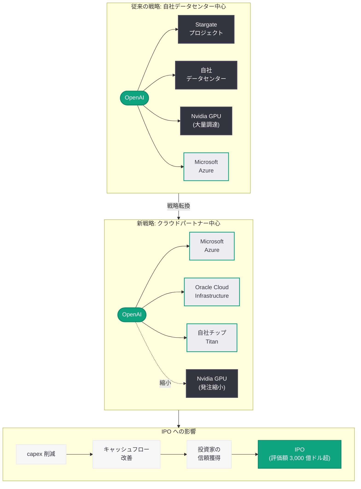

# OpenAI、IPO を前にデータセンター投資を縮小し Nvidia 契約を見直し: クラウドパートナー依存へ戦略転換

## メタデータ

| 項目 | 内容 |
|------|------|
| 発表日 | 2026-03-22 |
| ソース | CNBC、The Tech Buzz、MSN (BNP Paribas 分析) |
| カテゴリ | ビジネス / インフラ |
| 公式リンク | [CNBC](https://www.cnbc.com/2026/03/22/openai-data-center-pivot-wall-street-spending-concerns-ipo.html)、[The Tech Buzz](https://thetechbuzz.com/openai-scales-back-nvidia-deal-ipo/)、[MSN](https://www.msn.com/openai-capex-microsoft-oracle-bnp-paribas) |

## 概要

OpenAI が IPO を前にデータセンターへの設備投資 (capex) 計画を大幅に縮小し、Nvidia との GPU 調達契約を見直していることが複数のメディアの報道で明らかになった。この動きは、ウォール街が AI 企業の巨額インフラ投資に懸念を示す中、OpenAI が財務規律を重視する姿勢へとシフトしていることを示している。

今回の戦略転換により、OpenAI は自社データセンターの大規模建設から、Microsoft や Oracle などのクラウドパートナーへの依存度を高める方向へと舵を切る。BNP Paribas のアナリストはこの動きを Microsoft と Oracle にとってポジティブと評価しており、AI インフラ市場における勢力図の変化が注目されている。SoftBank との Stargate プロジェクトを含む野心的なデータセンター計画からの後退は、AI 産業全体におけるインフラ投資と収益性のバランスに関する議論を加速させるものである。

## 主な内容

### データセンター投資縮小の背景

OpenAI はこれまで、自社データセンターの建設を含む大規模なインフラ投資計画を推進してきた。SoftBank との合弁プロジェクト「Stargate」は、その象徴的な取り組みであった。しかし、IPO に向けた準備が本格化する中、ウォール街の投資家から巨額の設備投資に対する懸念が高まっていた。

- **ウォール街の懸念:** AI 企業の巨額 capex に対する投資家の慎重姿勢が強まっており、IPO の成功には財務規律の証明が不可欠である
- **収益性とのバランス:** 数百億ドル規模のデータセンター建設は、短期的な収益性を大幅に圧迫する要因となっていた
- **IPO 準備:** 評価額 3,000 億ドル超とされる OpenAI にとって、投資家が納得する財務ストーリーの構築が急務であった

### Nvidia 契約の見直し

今回の戦略転換において最も注目されるのが、Nvidia との GPU 調達契約の縮小である。

- **GPU 発注の削減:** 自社データセンター建設計画の縮小に伴い、Nvidia への大量 GPU 発注が見直される
- **Nvidia への影響:** OpenAI は Nvidia にとって最大級の顧客の一つであり、発注削減は Nvidia の売上見通しに影響を与える可能性がある
- **自社チップ開発:** OpenAI は独自 AI チップ「Titan」の開発を進めており、長期的には Nvidia 依存からの脱却を目指している

### クラウドパートナーへのシフト

OpenAI のデータセンター戦略は、自社構築からクラウドパートナー活用へと大きく転換する。

- **Microsoft Azure:** OpenAI の最大の戦略的パートナーであり、既に大規模なクラウドインフラを提供している。今回の戦略転換により、Azure への依存度がさらに高まる見込みである
- **Oracle Cloud:** BNP Paribas の分析によれば、OpenAI の capex 計画見直しは Oracle にとってもポジティブであり、Oracle Cloud Infrastructure (OCI) の活用拡大が予想される
- **コスト効率:** クラウドパートナーの既存インフラを活用することで、初期投資を大幅に削減しつつ、スケーラビリティを確保できる

### BNP Paribas の分析: Microsoft と Oracle に追い風

BNP Paribas のアナリストは、OpenAI の設備投資計画の見直しが Microsoft と Oracle にとってポジティブであると分析している。

- **Microsoft:** OpenAI がクラウドインフラへの依存度を高めることで、Azure の利用量が増加し、Microsoft のクラウド収益を押し上げる
- **Oracle:** OCI の利用拡大は、Oracle のクラウド事業の成長を加速させる要因となる
- **Win-Win 構造:** OpenAI は capex を削減しつつ必要なインフラを確保でき、クラウドプロバイダーは大口顧客を獲得できる

### IPO に向けた財務戦略

今回のデータセンター戦略の転換は、OpenAI の IPO 戦略と密接に結びついている。

- **フリーキャッシュフローの改善:** 巨額の capex を削減することで、キャッシュフロー見通しが改善される
- **投資家へのメッセージ:** 無制限のインフラ投資ではなく、コスト効率を重視した成長戦略を示すことで、投資家の信頼を獲得する狙いがある
- **評価額への影響:** 財務規律の向上は、IPO 時の評価額にポジティブな影響を与える可能性がある

## 技術的な詳細

### インフラ戦略の変遷

OpenAI のインフラ戦略は、以下のように変遷してきた。

1. **初期 (2020-2023 年):** Microsoft Azure を主要なクラウドプロバイダーとして活用
2. **拡大期 (2024-2025 年):** Stargate プロジェクトや自社データセンター構想を発表し、自社インフラの構築を目指す
3. **転換期 (2026 年):** IPO 準備に伴い、自社データセンター計画を縮小し、クラウドパートナーへの回帰を決定

### 自社チップ「Titan」の位置づけ

OpenAI が開発を進めている独自 AI チップ「Titan」は、今回のインフラ戦略転換においても重要な役割を果たす。

- **長期的な Nvidia 依存の軽減:** Titan チップの実用化により、GPU 調達コストを削減できる可能性がある
- **クラウドパートナーとの協業:** Titan チップはクラウドパートナーのデータセンター内で運用される可能性があり、自社データセンター不要の戦略とも整合する
- **Samsung HBM4 との連携:** Titan チップには Samsung 製 HBM4 メモリが採用されるとの報道もあり、サプライチェーンの多角化を図っている

## アーキテクチャ

## 開発者への影響

### クラウドインフラの安定性向上

OpenAI がクラウドパートナーへの依存度を高めることで、開発者が利用する API インフラの安定性と可用性が向上する可能性がある。

- **マルチクラウド対応:** Azure と Oracle の両方を活用することで、障害時の冗長性が確保される
- **地理的分散:** クラウドパートナーのグローバルなデータセンター網を活用し、レイテンシの改善が期待できる
- **スケーラビリティ:** クラウドパートナーの弾力的なリソース配分により、需要急増時のサービス品質が維持されやすくなる

### コスト構造の変化

インフラ戦略の転換は、長期的に API 利用料金にも影響を与える可能性がある。

- **クラウド利用料の転嫁:** クラウドパートナーへの支払いが増加することで、API 料金の引き下げ余地が限定される可能性がある
- **Titan チップの効果:** 自社チップの実用化が進めば、推論コストの削減を通じて API 料金の引き下げにつながる可能性がある
- **競争環境:** Anthropic や Google との価格競争が継続する中、大幅な値上げは考えにくい

### 懸念事項

- **Microsoft 依存のリスク:** Azure への依存度がさらに高まることで、Microsoft との関係性が OpenAI のサービス提供に与える影響が増大する
- **インフラの制約:** 自社データセンターを持たないことで、最先端の GPU クラスタ構成や冷却技術の独自最適化が困難になる可能性がある
- **地政学的リスク:** クラウドパートナーのデータセンター所在地に依存することで、各国の規制やデータ主権の問題に対する柔軟性が低下する可能性がある

## 関連リンク

- [CNBC: OpenAI's data center pivot underscores Wall Street spending concerns ahead of IPO](https://www.cnbc.com/2026/03/22/openai-data-center-pivot-wall-street-spending-concerns-ipo.html)
- [The Tech Buzz: OpenAI Scales Back Nvidia Deal Ahead of IPO, Signaling Cost Control](https://thetechbuzz.com/openai-scales-back-nvidia-deal-ipo/)
- [MSN: OpenAI's updated capex plans prove positive for Microsoft, Oracle: BNP Paribas](https://www.msn.com/openai-capex-microsoft-oracle-bnp-paribas)
- [OpenAI News](https://openai.com/news)
- [OpenAI 公式ドキュメント](https://platform.openai.com/docs)

## まとめ

OpenAI が IPO を前にデータセンター投資を大幅に縮小し、Nvidia との GPU 調達契約を見直す決定は、AI 産業におけるインフラ投資戦略の転換点を示している。ウォール街が巨額の capex に懸念を示す中、OpenAI は自社データセンターの大規模建設から Microsoft Azure や Oracle Cloud などのクラウドパートナーへの依存度を高める方向に舵を切った。BNP Paribas の分析が示す通り、この戦略転換は Microsoft と Oracle にとって追い風となる一方、Nvidia にとっては大口顧客の発注縮小という逆風をもたらす。OpenAI が並行して開発を進める独自チップ「Titan」は、長期的な Nvidia 依存からの脱却を見据えたものである。評価額 3,000 億ドル超とされる IPO の成功に向けて、OpenAI は「無制限のインフラ投資による技術的優位性の追求」から「コスト効率と財務規律を重視した持続可能な成長」への転換を明確に打ち出しており、この判断が AI 産業全体のインフラ投資戦略に与える影響は極めて大きい。
