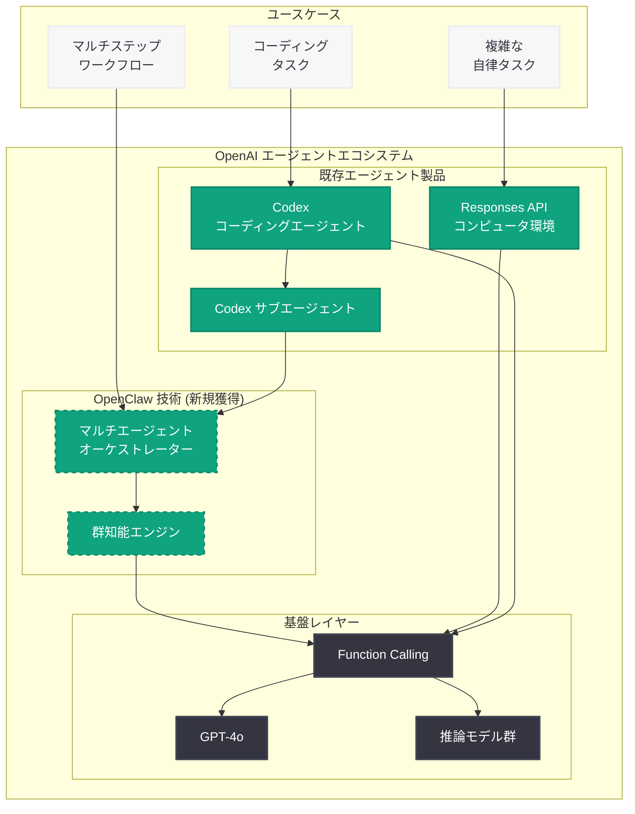

# OpenAI、AI エージェント開発者 Steinberger を採用 — OpenClaw の技術を獲得

## メタデータ

| 項目 | 内容 |
|------|------|
| 発表日 | 2026-03-22 |
| ソース | MSN、複数メディア |
| カテゴリ | 人事 / AI エージェント |
| 公式リンク | MSN 報道 (2026-03-22) |

## 概要

OpenAI は、AI エージェントプラットフォーム OpenClaw の主要開発者である Steinberger を採用した。OpenClaw はマルチエージェントオーケストレーションと群知能 (Swarm Intelligence) アプローチで知られており、今回の採用は OpenAI が AI エージェント技術への投資をさらに深化させていることを示している。

この動きは、OpenAI が従業員数を 8,000 人規模に倍増させる大規模な採用計画の一環として行われた。Codex コーディングエージェントや Responses API のコンピュータ環境など、既存のエージェント製品群を急速に拡充している OpenAI にとって、OpenClaw のマルチエージェント技術の獲得は戦略的に重要な意味を持つ。

## 主な内容

### Steinberger と OpenClaw の技術的背景

Steinberger は OpenClaw プラットフォームの中核開発者であり、同プラットフォームはマルチエージェントオーケストレーションの分野で注目を集めてきた。MarkTechPost が 2026 年 3 月 20 日に報じた記事では「ClawTeam's Multi-Agent Swarm Orchestration with OpenAI Function Calling」として、OpenClaw の群知能技術と OpenAI の Function Calling を組み合わせたマルチエージェント協調手法が紹介されている。

OpenClaw の主要な技術的特徴は以下の通り。

- **マルチエージェントオーケストレーション:** 複数の AI エージェントを協調的に動作させ、複雑なタスクを分担処理するアーキテクチャ
- **群知能 (Swarm Intelligence) アプローチ:** 個々のエージェントが自律的に行動しつつ、全体として最適な結果を導く分散型制御手法
- **OpenAI Function Calling との統合:** OpenAI の API 基盤上でマルチエージェントシステムを構築する実績

### OpenAI のエージェント戦略における位置づけ

OpenAI は AI エージェント技術を次世代の主力分野と位置づけており、既に複数のエージェント製品を展開している。Steinberger の採用により、マルチエージェント協調という新たな技術レイヤーが加わることで、エージェントエコシステム全体の能力が強化される。

現在の OpenAI のエージェント製品群は以下の構成となっている。

- **Codex:** ソフトウェア開発に特化したコーディングエージェント。コード生成、レビュー、障害分析を自動化
- **Responses API コンピュータ環境:** エージェントがコンピュータ操作を実行できるサンドボックス環境
- **Codex サブエージェント:** カスタムエージェントを構築・連携させるための拡張機能

### AI エージェント競争の激化

AI エージェントは、自律的に複雑なタスクを遂行できるシステムとして、AI 業界における次の主要な競争領域となっている。主要各社の動向は以下の通り。

- **Anthropic:** Claude のコンピュータ操作機能を提供し、エージェントがデスクトップ環境を直接操作可能
- **Google:** Project Mariner を通じてブラウザベースの AI エージェント技術を開発
- **Microsoft:** Copilot エージェントを各種プロダクトに統合し、業務自動化を推進

OpenAI は OpenClaw の人材獲得により、特にマルチエージェント協調の領域で競合他社に対する技術的優位性を確保する狙いがある。

## 技術的な詳細

### マルチエージェントオーケストレーションの概念

OpenClaw が実現するマルチエージェントオーケストレーションは、単一のエージェントでは対処が困難な複雑なタスクを、複数の専門エージェントが協調して処理する仕組みである。OpenAI の Function Calling を基盤として、各エージェントが特定の機能を担当し、オーケストレーターが全体の調整を行う。

```python
from openai import OpenAI

client = OpenAI()

# マルチエージェントオーケストレーションの概念的な実装例
# OpenClaw の群知能アプローチを OpenAI Function Calling で実現

# オーケストレーターエージェント: タスクの分解と各エージェントへの割り当て
orchestrator_response = client.chat.completions.create(
    model="gpt-4o",
    messages=[
        {
            "role": "system",
            "content": (
                "You are a swarm orchestrator agent. Decompose complex tasks "
                "into subtasks and coordinate multiple specialized agents."
            )
        },
        {
            "role": "user",
            "content": "Analyze this codebase, identify security issues, and generate fixes."
        }
    ],
    tools=[
        {
            "type": "function",
            "function": {
                "name": "delegate_to_agent",
                "description": "Delegate a subtask to a specialized agent",
                "parameters": {
                    "type": "object",
                    "properties": {
                        "agent_type": {
                            "type": "string",
                            "enum": ["code_analyzer", "security_scanner", "fix_generator"]
                        },
                        "task": {"type": "string"},
                        "context": {"type": "string"}
                    },
                    "required": ["agent_type", "task"]
                }
            }
        }
    ],
    temperature=0.3,
)
```

## アーキテクチャ



## 開発者への影響

Steinberger の採用と OpenClaw 技術の獲得は、OpenAI のエージェントプラットフォームを利用する開発者に以下の影響をもたらす可能性がある。

- **マルチエージェント API の拡充:** 将来的に、複数のエージェントを協調させるための公式 API やフレームワークが提供される可能性がある。現在の単一エージェント中心のアーキテクチャから、マルチエージェントオーケストレーションへの進化が期待される
- **Codex の機能拡張:** Codex サブエージェント機能に群知能アプローチが統合されることで、より複雑な開発タスクの自動化が可能になる見込み
- **自律エージェントの高度化:** 群知能技術により、エージェントがより長いタスクチェーンを自律的に実行し、中間判断を行える能力が向上する可能性がある
- **エージェント間通信の標準化:** OpenClaw のオーケストレーション技術が OpenAI プラットフォームに統合されることで、エージェント間のメッセージング仕様が標準化される可能性がある
- **競争環境の変化:** OpenAI のエージェント技術強化に伴い、Anthropic、Google、Microsoft との競争が激化し、各社のエージェント機能が急速に進化することが予想される

## 関連リンク

- [MarkTechPost: ClawTeam's Multi-Agent Swarm Orchestration with OpenAI Function Calling](https://www.marktechpost.com/) (2026-03-20)
- [OpenAI Codex](https://openai.com/codex)
- [OpenAI Responses API ドキュメント](https://platform.openai.com/docs/api-reference/responses)
- [OpenAI Function Calling ガイド](https://platform.openai.com/docs/guides/function-calling)
- [OpenAI News](https://openai.com/news)

## まとめ

OpenAI による OpenClaw 開発者 Steinberger の採用は、AI エージェント技術の競争が新たな段階に入ったことを象徴している。OpenClaw のマルチエージェントオーケストレーションと群知能技術は、OpenAI の既存エージェント製品群 (Codex、Responses API、サブエージェント) を補完し、より高度な自律型タスク実行能力を実現する基盤となる。従業員数 8,000 人への拡大を進める OpenAI にとって、この人材獲得は Anthropic、Google、Microsoft との AI エージェント競争において技術的優位性を確保するための戦略的な一手である。開発者は、今後 OpenAI プラットフォームにおけるマルチエージェント機能の拡充に注目すべきだろう。
