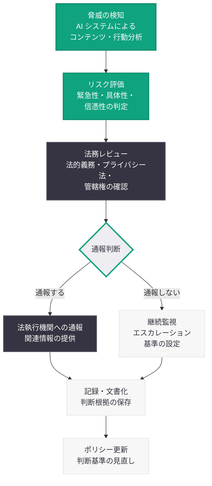

# OpenAI、カナダ銃撃事件前の警察への通報を巡り社内で議論 -- AI 安全性の新たな課題

## メタデータ

| 項目 | 内容 |
|------|------|
| 発表日 | 2026-03-22 |
| ソース | MSN、複数メディア |
| カテゴリ | AI 安全性 / 倫理 |
| 公式リンク | [MSN](https://www.msn.com) |

## 概要

OpenAI がカナダで発生した銃撃事件の前に、自社の AI システムを通じて懸念される行動やコンテンツを検知していたにもかかわらず、警察への通報を巡り社内で議論が行われていたことが報じられた。この事案は、AI 企業がユーザーの潜在的な脅威を検知した際に法執行機関へ報告する義務があるのかという根本的な問題を提起している。

ユーザーのプライバシーと表現の自由を守る立場と、公共の安全を優先する立場の間で、OpenAI の安全チームと法務チームが対立する形で議論が展開された。この事件は、AI 企業がユーザーとの機密性の高いやり取りにアクセスできる「ゲートキーパー」としての役割を急速に拡大させている現実を浮き彫りにしている。

## 主な内容

### 事件の経緯と OpenAI 社内の対応

報道によると、OpenAI は自社の AI システムを通じて、カナダでの銃撃事件に関連する可能性のある懸念すべきコンテンツまたは行動を検知していた。この検知を受けて、OpenAI 内部では以下の議論が行われた。

1. **検知段階:** AI システムが潜在的に危険なコンテンツまたは行動パターンを特定
2. **社内議論:** 安全チームと法務チームが関与し、警察への通報の是非を検討
3. **判断の難しさ:** ユーザーのプライバシー保護と公共安全の確保という相反する価値観の間で、明確な結論を出すことが困難であった

この事案は、AI 企業が従来のテクノロジー企業とは異なる次元で、ユーザーの意図や行動を深く理解し得る立場にあることを示している。

### 法的・倫理的な論点

この事件が提起する法的・倫理的な論点は多岐にわたる。

- **通報義務の有無:** 現行法の下で AI 企業にユーザーの潜在的脅威を法執行機関に報告する法的義務があるかは明確ではない。医療専門家や教育者には特定の状況下での通報義務 (mandatory reporting) が課されているが、AI 企業に同様の義務を適用する法的枠組みは未整備である
- **プライバシーと安全のバランス:** ユーザーが AI システムに対して共有する情報は、検索履歴やソーシャルメディアの投稿よりも個人的かつ詳細な場合がある。過度な監視はユーザーの信頼を損ない、AI サービスの利用を萎縮させるリスクがある
- **責任と賠償:** AI 企業が脅威を検知しながら通報しなかった場合、事件後に法的責任を問われる可能性がある。一方で、過剰な通報は誤報による市民への不利益を生む
- **表現の自由:** フィクションの執筆やシナリオの検討など、正当な目的で暴力的なコンテンツを扱うユーザーとの区別が困難である

### ソーシャルメディア企業との比較

AI 企業が直面するこの課題は、ソーシャルメディア企業が長年取り組んできた問題と類似している。しかし、AI 企業特有の複雑さも存在する。

| 観点 | ソーシャルメディア企業 | AI 企業 |
|------|----------------------|---------|
| コンテンツの性質 | 公開・半公開の投稿 | 1 対 1 の非公開対話 |
| 検知の精度 | キーワード・画像認識ベース | 文脈理解に基づく高度な分析が可能 |
| ユーザーの期待 | 一定の監視を認識 | より高いプライバシーを期待 |
| 法的枠組み | Section 230 等の既存法で一定の整理 | 法的枠組みが未整備 |
| 通報実績 | NCMEC 等への報告義務あり (児童搾取) | 明確な報告義務の規定なし |

Meta や X (旧 Twitter) などのソーシャルメディア企業は、テロリズムや児童搾取に関するコンテンツについて法執行機関への報告体制を確立している。しかし AI 企業の場合、対話の文脈やニュアンスを考慮する必要があり、単純なキーワードマッチングでは適切な判断ができないという固有の課題がある。

## 意思決定フレームワーク

AI 企業が潜在的な脅威を検知した際の意思決定プロセスを以下に示す。

## OpenAI の安全性への取り組みとの関連

この事件は、OpenAI が近年強化してきた安全性への取り組みの文脈で理解する必要がある。

- **2026 年 3 月 12 日:** AI エージェントのリンク安全性に関する研究を公開。AI システムが外部リソースと相互作用する際の安全性確保に焦点を当てた
- **2026 年 3 月 11 日:** プロンプトインジェクションに耐性を持つエージェント設計に関する研究を公開。AI システムの悪用防止に向けた技術的対策を提示した
- **2026 年 3 月 9 日:** ChatGPT Adult Mode の延期。コンテンツポリシーと安全性のバランスに関する慎重な姿勢を示した
- **2026 年 3 月 8 日:** Kalinowski 氏が Pentagon との取引を受けて辞任。AI の利用範囲と倫理に関する社内の意見対立が表面化した

これらの出来事は、OpenAI が技術的な安全性対策を進める一方で、組織としての倫理的判断において困難な課題に直面していることを示している。

## AI 安全性ポリシーへの影響

この事件は、AI 業界全体の安全性ポリシーの策定に以下のような影響を与える可能性がある。

- **業界標準の必要性:** AI 企業が脅威を検知した際の対応に関する業界共通のガイドラインが求められる。個社の判断に委ねるだけでは、対応の一貫性が確保できない
- **法整備の加速:** 立法機関が AI 企業の通報義務を法制化する動きが加速する可能性がある。EU の AI Act や米国の州法レベルでの規制議論に影響を与え得る
- **透明性レポートの拡充:** ソーシャルメディア企業が発行する透明性レポートと同様に、AI 企業にも脅威検知と対応に関する定期的な報告が求められる可能性がある
- **安全チームの体制強化:** AI 企業は、技術的な安全対策だけでなく、法執行機関との連携体制や迅速な意思決定プロセスの構築が必要となる
- **ユーザー向けポリシーの明確化:** 利用規約やプライバシーポリシーにおいて、どのような状況でユーザー情報が法執行機関に共有され得るかを明確に記載する必要がある

## 関連リンク

- [OpenAI Safety](https://openai.com/safety)
- [OpenAI News](https://openai.com/news)
- [OpenAI Usage Policies](https://openai.com/policies/usage-policies)

## まとめ

OpenAI がカナダの銃撃事件前に警察への通報を巡り社内で議論していたことは、AI 企業が直面する新たな倫理的課題を鮮明に示している。AI システムがユーザーとの深い対話を通じて潜在的な脅威を検知できる立場にある以上、プライバシー保護と公共安全のバランスをどのように取るかは避けて通れない問題である。ソーシャルメディア企業が長年かけて構築してきた通報体制と法的枠組みを参考にしつつも、AI 企業特有の課題 -- 対話の文脈理解、プライバシーへの高い期待、法的枠組みの未整備 -- に対応した新たなアプローチが求められる。この事件を契機に、業界標準の策定と法整備が加速することが期待される。
