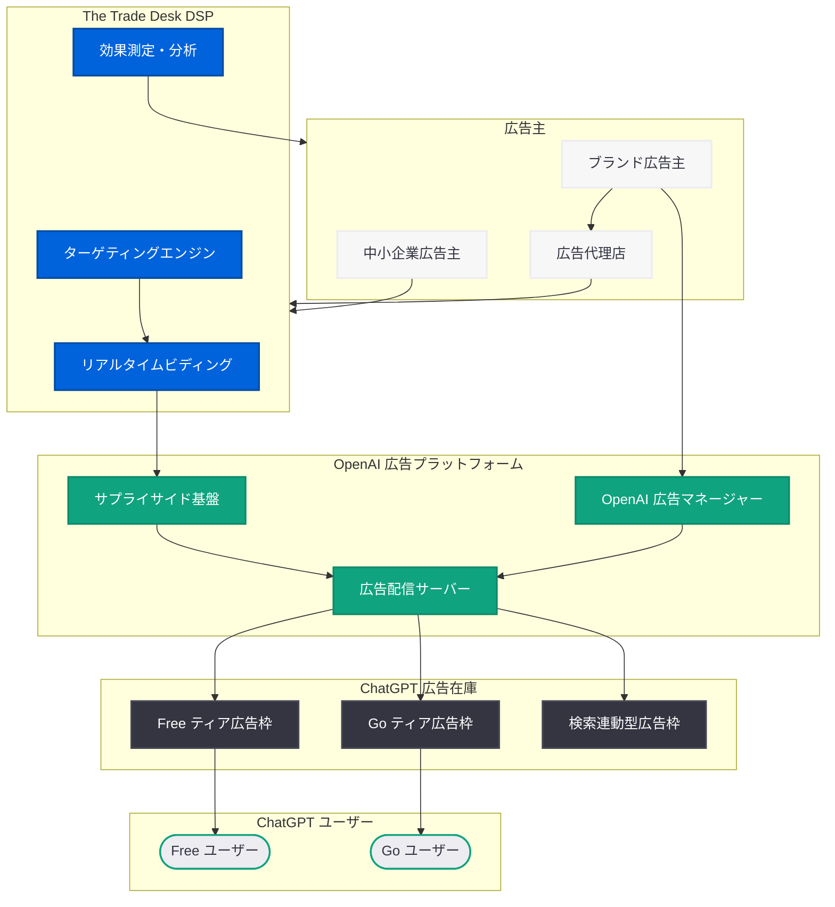

# OpenAI、The Trade Desk との広告販売提携を検討 -- 年間売上 250 億ドル到達

## メタデータ

| 項目 | 内容 |
|------|------|
| 発表日 | 2026-03-22 |
| ソース | The Information (via MSN)、PPC Land、MSN |
| カテゴリ | ビジネス / 広告・収益化 |
| 公式リンク | [The Information via MSN](https://www.msn.com/) |

## 概要

OpenAI が、プログラマティック広告プラットフォーム最大手の The Trade Desk との広告販売提携を検討していることが明らかになった。The Information が 2026 年 3 月 22 日に報じたもので、両社の協議はまだ初期段階にあるとされる。The Trade Desk の株価はこのニュースを受けて大幅に上昇した。

OpenAI の年間売上高 (ランレート) は 250 億ドルに到達しており、2025 年の予測値約 120 億ドルから倍増以上の成長を遂げている。サブスクリプション収入と API 利用料に加え、プログラマティック広告インフラの整備によって収益基盤の多角化を本格化させる動きである。なお、この提携検討は 2026 年 3 月 21 日に報じられた ChatGPT 無料ユーザー向け広告展開の拡大とは別の取り組みであり、広告配信基盤そのものの構築に関わるものである。

## 主な内容

### The Trade Desk との提携検討の詳細

The Information の報道によれば、OpenAI は The Trade Desk と広告販売に関する初期段階の協議を行っている。主なポイントは以下の通りである。

- **The Trade Desk の位置づけ:** The Trade Desk は世界最大の独立系デマンドサイドプラットフォーム (DSP) であり、プログラマティック広告の買い付けにおいて業界をリードする存在である
- **提携の狙い:** OpenAI は The Trade Desk の広大な広告主ネットワークとターゲティング技術へのアクセスを獲得し、自社の広告在庫を効率的にマネタイズすることを目指している
- **協議の段階:** 現時点では初期段階の検討であり、正式な契約には至っていない
- **株価への影響:** The Trade Desk の株価は、OpenAI との提携報道を受けて大幅に上昇した

### 売上 250 億ドル到達と成長軌道

OpenAI の年間売上高ランレートが 250 億ドルに到達したことは、同社の急速な成長を示している。

| 時期 | 年間売上高 (推定) | 成長の背景 |
|------|------------------|-----------|
| 2024 年末 | 約 50 億ドル | ChatGPT Plus の急成長 |
| 2025 年予測 | 約 120 億ドル | API 事業の拡大、エンタープライズ契約 |
| 2026 年 3 月 | 250 億ドル (ランレート) | サブスクリプション + API + 広告収入 |

この成長率は、AI 業界における OpenAI の圧倒的な商業的成功を示すものである。しかし、AI モデルのトレーニングおよび推論に要する莫大なコストを考慮すると、さらなる収益源の確保が不可欠であり、プログラマティック広告への参入はその解決策の一つとなる。

### プログラマティック広告参入の戦略的意義

OpenAI の広告戦略は、以下の二つの柱で構成されつつある。

1. **直接広告販売:** エンタープライズ顧客への直接的な広告販売。ChatGPT の対話型インターフェース内での広告表示を中心とする
2. **プログラマティック広告基盤:** The Trade Desk との提携による、大規模な自動化された広告取引基盤の構築

PPC Land の報道によれば、OpenAI は「広告マネージャー」の開発も進めており、The Trade Desk との協議と並行して自社の広告運用ツールの整備を行っている。

### Google 広告インフラとの比較

OpenAI のプログラマティック広告参入は、Google の広告エコシステムとの比較で理解する必要がある。

| 項目 | Google | OpenAI (計画中) |
|------|--------|----------------|
| 広告インフラの成熟度 | 20 年以上の実績 | 初期段階 |
| DSP 連携 | 自社 DV360 + 第三者 DSP | The Trade Desk との提携検討 |
| 広告在庫 | 検索、YouTube、ディスプレイ等 | ChatGPT 対話型インターフェース |
| ターゲティング | 検索履歴、閲覧データ等 | 対話コンテキスト |
| 広告主ネットワーク | 数百万社 | 構築中 |
| 年間広告売上 | 約 3,000 億ドル | 未公開 |

Google との差は依然として大きいが、OpenAI は対話型 AI という新たな広告メディアを持つ点で差別化が可能である。The Trade Desk との提携が実現すれば、Google の DV360 に依存しない独立した広告取引経路を広告主に提供できることになる。

## 技術的な詳細

### プログラマティック広告の仕組み

The Trade Desk との提携が実現した場合、広告配信は以下のフローで行われると想定される。

**リアルタイムビディング (RTB) の流れ:**

1. ChatGPT ユーザーが会話を開始する
2. OpenAI の広告サーバーが広告リクエストを生成する
3. The Trade Desk の DSP を通じて広告主が入札する
4. 最高入札額の広告がユーザーに表示される
5. インプレッション・クリックデータが広告主にレポートされる

**OpenAI 広告マネージャー:**

PPC Land の報道によれば、OpenAI は独自の広告マネージャーを開発中である。これは以下の機能を備えると推測される。

- 広告キャンペーンの作成・管理
- ターゲティング設定 (コンテキスト、ユーザーセグメント)
- 予算管理と入札戦略の最適化
- パフォーマンスレポーティング

### エンタープライズ直接販売との棲み分け

プログラマティック広告と直接販売は補完的な関係にある。

- **直接販売:** 大規模な広告主がプレミアム配置を確保する。ブランドセーフティが高く、カスタマイズされた広告体験を提供
- **プログラマティック:** 中小規模の広告主を含む幅広い広告主が自動化された入札を通じて広告在庫にアクセスする。スケーラビリティが高い

## アーキテクチャ

## 開発者への影響

### 広告エコシステムへの影響

- **広告テック開発者:** The Trade Desk のエコシステムで開発を行う広告テック企業にとって、OpenAI の広告在庫は新たな配信先として大きな機会となる
- **プログラマティック広告の拡大:** 対話型 AI という新しい広告メディアの登場により、広告フォーマットやクリエイティブの設計に新たなイノベーションが求められる
- **API 開発者への直接的影響は限定的:** 現時点では、OpenAI API を利用する開発者のサービスに広告が挿入される計画は報じられていない

### デジタル広告市場への影響

- **広告主の選択肢の拡大:** Google の DV360 に加え、The Trade Desk 経由で ChatGPT の広告在庫にアクセスできるようになることで、広告主のメディアプランニングに新たな選択肢が加わる
- **対話型広告の標準化:** OpenAI が The Trade Desk と連携することで、対話型 AI における広告のフォーマットや測定基準の標準化が進む可能性がある
- **競合プラットフォームへの波及:** Google、Meta、Amazon 等の広告プラットフォームも、AI 対話型広告への対応を加速させる可能性がある

### 収益構造への示唆

- **API 価格の安定化:** 広告収入の増加は、OpenAI の財務基盤を強化し、API 価格の安定化や値下げにつながる可能性がある
- **無料ティアの持続可能性:** プログラマティック広告による効率的なマネタイズは、ChatGPT 無料ティアの長期的な持続可能性を高める

## 関連リンク

- [The Information via MSN: OpenAI explored ad sales with The Trade Desk](https://www.msn.com/)
- [PPC Land: Publicis vs Trade Desk, OpenAI's ads manager](https://ppcland.com/)
- [MSN: Trade Desk lands OpenAI as customer](https://www.msn.com/)
- [関連レポート: ChatGPT 無料・低価格ユーザー向け米国広告展開拡大 (2026-03-21)](./2026-03-21-chatgpt-ads-expansion-us.md)

## まとめ

OpenAI が The Trade Desk との広告販売提携を検討していることは、同社の広告戦略が直接販売からプログラマティック広告基盤の構築へと本格的に拡大していることを示している。年間売上高ランレートが 250 億ドルに到達した OpenAI だが、AI モデルの運用コストは依然として巨額であり、広告収入の最大化は事業の持続可能性に直結する。The Trade Desk は世界最大の独立系 DSP であり、この提携が実現すれば、OpenAI は Google の広告エコシステムに依存せずに大規模な広告主ネットワークへのアクセスを獲得できる。2025 年の約 120 億ドルから 2026 年の 250 億ドルへという急速な売上成長は、サブスクリプションと API 収入に支えられているが、プログラマティック広告の本格稼働により、第三の収益の柱が確立されれば、OpenAI のビジネスモデルは一層強固なものとなる。デジタル広告市場全体にとっても、対話型 AI という新たな広告メディアの登場は、広告フォーマット、ターゲティング手法、効果測定のあり方に大きな変革をもたらす可能性がある。
