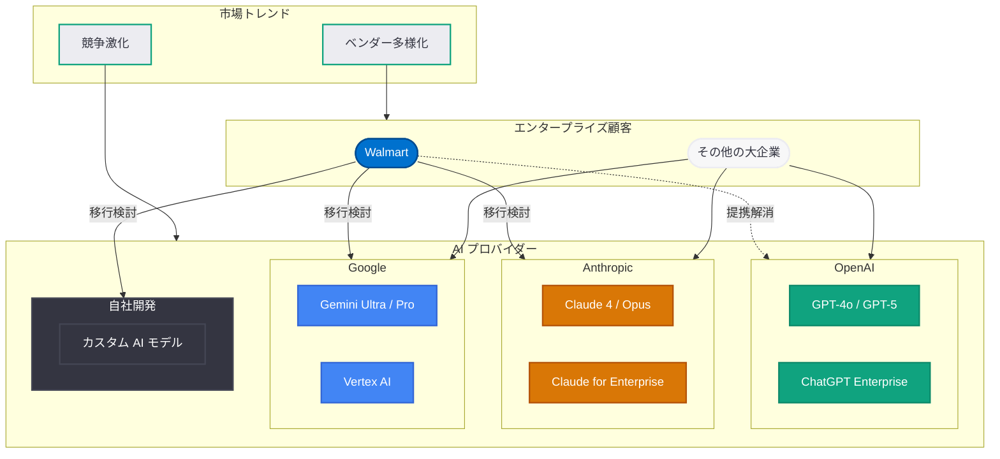

# Walmart、OpenAI との提携を解消 -- エンタープライズ AI の勢力図が変化

## メタデータ

| 項目 | 内容 |
|------|------|
| 発表日 | 2026-03-22 |
| ソース | TheStreet、PYMNTS、複数メディア報道 |
| カテゴリ | ビジネス / エンタープライズ |
| 公式リンク | [TheStreet 報道](https://www.thestreet.com/) |

## 概要

世界最大級の小売企業である Walmart が OpenAI との提携を解消したことが報じられた。TheStreet はこの動きを「playbook-changing move (戦略を根本から変える動き)」と表現しており、エンタープライズ AI 市場における OpenAI の地位に大きな影響を及ぼす可能性がある。

この提携解消は、エンタープライズ AI 市場で OpenAI が競争圧力に直面している状況を象徴する出来事である。Anthropic (Claude) が OpenAI の 3 倍の速度で新規法人顧客を獲得しているとの Financial Times の報道や、Google Cloud の AI サービス強化の動きと合わせて、エンタープライズ AI のベンダー選定における大きな構造変化が進行していることを示している。

## 主な内容

### Walmart の OpenAI 離脱の背景

Walmart は世界最大の売上高を誇る小売企業であり、そのテクノロジー投資の規模と影響力はエンタープライズ市場全体に波及する。今回の OpenAI との提携解消は、以下の要因が背景にあると考えられる。

- **代替プロバイダーの台頭:** Anthropic の Claude、Google の Gemini をはじめとする競合 AI モデルの性能が急速に向上しており、OpenAI の優位性が相対的に低下している
- **マルチベンダー戦略の採用:** エンタープライズ顧客が単一の AI プロバイダーへの依存リスクを回避する傾向が強まっている
- **コストパフォーマンスの再評価:** 大規模な AI 導入においては、モデルの性能だけでなく、コスト効率やサポート体制が重要な判断基準となる

Walmart は今後、Anthropic、Google、または自社開発の AI ソリューションへの移行を進める可能性がある。具体的な移行先については公式発表がなされていないが、エンタープライズ市場での代替選択肢が増加していることは明らかである。

### エンタープライズ AI 市場の競争激化

Walmart の離脱は単発の事象ではなく、エンタープライズ AI 市場全体の構造変化を反映している。

**Anthropic の急成長:** Financial Times が報じた Ramp のクレジットカードデータによれば、Anthropic は OpenAI の 3 倍の速度で新規法人顧客を獲得している。Claude の性能向上と、エンタープライズ向けの安全性・信頼性への取り組みが評価されている。

**OpenAI の対応策:** OpenAI はこの競争環境に対応するため、従業員数を 8,000 人規模に倍増させる急速な採用を進めている。PYMNTS は「OpenAI Beefs Up Staff to Take on Claude」と報じており、Anthropic のエンタープライズ市場での躍進が OpenAI の経営戦略に直接的な影響を与えていることがうかがえる。

**Google の攻勢:** Google Cloud は Vertex AI プラットフォームを通じて Gemini モデルを提供しており、既存の Google Cloud 顧客基盤を活用したエンタープライズ AI サービスの拡大を進めている。

### エンタープライズ顧客のベンダー多様化

Walmart の事例は、エンタープライズ顧客が AI ベンダーとの関係を再構築する広範なトレンドの一部である。

- **リスク分散:** 単一プロバイダーへの依存は、価格変更、サービス停止、モデル性能の変動といったリスクを伴う
- **ベストオブブリード戦略:** 用途に応じて最適な AI モデルを選択するアプローチが主流になりつつある
- **交渉力の確保:** 複数のベンダーとの関係を維持することで、価格交渉における優位性を確保できる

## アーキテクチャ

## 開発者への影響

### OpenAI を利用するエンタープライズ開発者への影響

Walmart のような大規模顧客の離脱は、OpenAI のエンタープライズ向けサービスの方向性に影響を及ぼす可能性がある。

- **サービス強化の契機:** OpenAI が競争力を維持するために、エンタープライズ向け機能の強化、価格の見直し、サポート体制の拡充を進める可能性が高い
- **API の安定性と互換性:** エンタープライズ顧客の引き留めのため、API の後方互換性やサービスレベル合意 (SLA) の強化が期待される
- **マルチモデル対応の必要性:** 開発者はベンダーロックインを避けるため、複数の AI プロバイダーに対応できる抽象化レイヤーの設計を検討すべきである

### AI ベンダー選定への示唆

- **ベンチマークの重要性:** 特定のユースケースに対して複数のモデルを評価し、コスト・性能・信頼性の総合的な比較を行うことが重要となる
- **移行コストの考慮:** AI プロバイダーの変更にはプロンプトの最適化、API の書き換え、テストの再実施など相応のコストが伴うため、初期段階からの設計上の考慮が必要である
- **契約条件の精査:** エンタープライズ契約においては、データの取り扱い、モデルの可用性、価格体系の変更条件などを詳細に確認することが推奨される

## 関連リンク

- [TheStreet: Walmart fires OpenAI in playbook-changing move](https://www.thestreet.com/)
- [PYMNTS: OpenAI Beefs Up Staff to Take on Claude](https://www.pymnts.com/)
- [OpenAI API リファレンス](https://platform.openai.com/docs/api-reference)
- [OpenAI News](https://openai.com/news)

## まとめ

Walmart が OpenAI との提携を解消したことは、エンタープライズ AI 市場における競争環境の急速な変化を象徴する出来事である。Anthropic が OpenAI の 3 倍の速度で法人顧客を獲得し、Google がクラウド AI サービスを強化する中、大規模エンタープライズ顧客が AI ベンダーとの関係を見直す動きが加速している。OpenAI は従業員の倍増など積極的な対応策を講じているが、エンタープライズ市場での信頼回復と競争力維持は喫緊の課題となっている。開発者にとっては、特定のベンダーに依存しない設計方針の採用と、マルチモデル戦略に対応できるアーキテクチャの構築がこれまで以上に重要となる。
